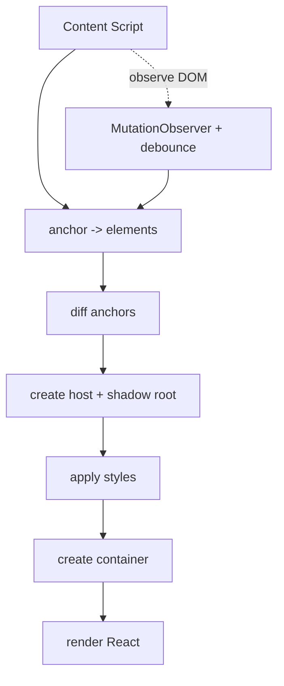
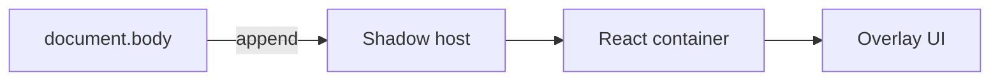
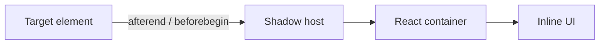
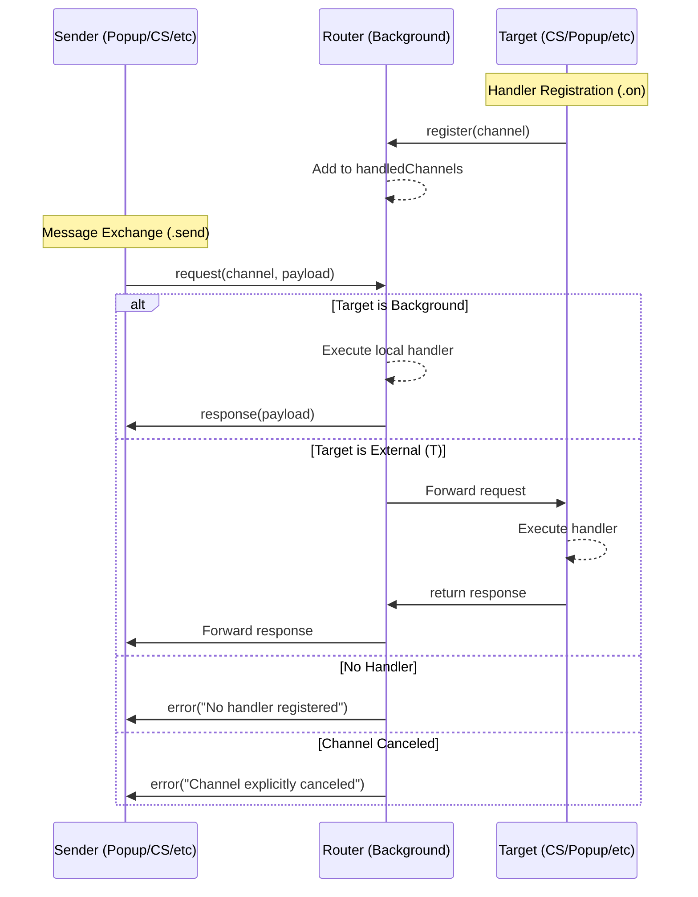

<h1 align="center"> Lazy chrome Extension template</h1>
<p align="center">
  <a href="https://github.com/wuchuheng/lazy-extension-template/stargazers">
    
  </a>
  <a href="https://github.com/wuchuheng/lazy-extension-template/issues">
    
  </a>
  <a href="https://github.com/wuchuheng/lazy-extension-template/blob/master/LICENSE">
    
  </a>
  <a href="https://github.com/wuchuheng/lazy-extension-template/pulls">
    
  </a>
  <a href="https://github.com/wuchuheng/lazy-extension-template/commits/master">
    
  </a>
</p>

lazy Extension gives you automatic hot-reload while you build the content script, popup page, and options page, and lets you write the UI in React, TypeScript, and Tailwind CSS.

## Contents

- [Quick start](#quick-start)
- [Live dev workflow](#live-dev-workflow)
- [Add a new content script](#add-a-new-content-script)
- [Anchor lifecycle and examples](#anchor-lifecycle-and-examples)
- [Centralized Messaging System](#centralized-messaging-system)
- [Build UIs with React and Tailwind](#build-uis-with-react-and-tailwind)
- [Project layout](#project-layout)
- [Commands](#commands)

## Quick start

1. Install dependencies:

```bash
npm install
```

2. Start the dev server with hot reload:

```bash
npm run dev
```

Vite/CRXJS prints a folder path (for example `.output/chrome-mv3`). Open `chrome://extensions`, turn on **Developer mode**, click **Load unpacked**, and pick that folder. Edits to popup, options, and content scripts refresh automatically.

3. Build for release:

```bash
npm run build
```

4. Optional checks:

```bash
npm run lint         # ESLint + Prettier + type-check
```

## Live dev workflow

- One Vite/CRXJS dev server with hot reload for popup, options, and content scripts.
- React + TypeScript + Tailwind ready to build any extension UI.
- Shadow DOM mounting keeps content script styles isolated from the host page.
- CLI generator scaffolds new content scripts and updates the manifest for you.
- Production build targets Manifest V3 for Chrome.

## Add a new content script

1. Generate a script (fails safely if the folder already exists):

```bash
npm run gen:content-script <name>
# example: npm run gen:content-script my-page
```

2. The command creates `src/contents/my-page/index.tsx` and `style.css`, ensures `HelloInCSUI` exists, and registers the entry in `src/manifest.ts`.
3. Start `npm run dev`, reload the unpacked extension, and replace the generated hello widget with your UI.

## Anchor lifecycle and examples

Content scripts rely on anchors (DOM nodes) to decide where to mount. The helper handles shadow host creation, style injection, and React mounting for both overlay and inline cases.

### Anchor lifecycle (Mermaid)



### Overlay vs Inline (Mermaid)

Overlay:



Inline:



### Anchor examples

Overlay (body):

```tsx
import HelloInCSUI from "@/components/HelloInCSUI";
import styles from "./style.css?inline";
import { mountAnchoredUI } from "../utils/anchor-mounter";

void mountAnchoredUI({
  anchor: async () => [document.body],
  mountType: { type: "overlay" },
  component: () => <HelloInCSUI name="hello-world" />,
  style: styles,
  hostId: "extension-content-root",
});
```

Inline (next to specific elements):

```tsx
void mountAnchoredUI({
  anchor: async () => document.querySelectorAll(".product-card"),
  mountType: { type: "inline", position: "afterend" },
  component: () => <HelloInCSUI name="inline-demo" />,
  style: styles,
  hostId: "extension-inline-root",
});
```

Inline (first child inside target):

```tsx
void mountAnchoredUI({
  anchor: async () => document.querySelectorAll("#pricing"),
  mountType: { type: "inline", position: "afterbegin" },
  component: () => <HelloInCSUI name="inline-inside" />,
  style: styles,
});
```

- The helper debounces DOM mutations (500ms default) and only mounts new anchors to avoid loops when injecting inline.

## Centralized Messaging System

lazy Extension includes a type-safe, centralized messaging system that simplifies communication between different parts of the extension (content scripts, popup, options, background, etc.).

### Messaging Mechanism (Mermaid)

The background script acts as a central router, ensuring that communication between different contexts (e.g., Content Script to Popup) is handled reliably and type-safely.



### How to use it

1. **Initialize the router** in your background script (`src/background/index.ts`):

```typescript
import { initRouter } from "@/messaging/core";

// Must be called once in the background context
initRouter({ debug: true });
```

2. **Define a channel** in `src/messaging/channels.ts`:

```typescript
import { defineChannel } from "./core";

// Define <RequestType, ResponseType>
// Recommendation: use 'sourceToTarget' naming convention
export const myDataChannel = defineChannel<{ id: string }, { status: string }>(
  "myDataChannel",
);
```

3. **Register a handler** in the receiving context (e.g., Popup or Background):

```typescript
import { myDataChannel } from "@/messaging/channels";

// Returns a cancel function to unregister
const cancel = myDataChannel.on(async (req) => {
  console.log("Received request:", req.id);
  return { status: "success" };
});
```

4. **Send a message** from any context:

```typescript
import { myDataChannel } from "@/messaging/channels";

try {
  const response = await myDataChannel.send({ id: "123" });
  console.log("Response status:", response.status);
} catch (err) {
  // Descriptive errors for: no handler, channel canceled, or handler error
  console.error(err);
}
```

### Key Features

- **Strong Type Safety**: Full TypeScript support for request and response payloads, eliminating `any`.
- **Centralized Routing**: All cross-context communication routes through the background service.
- **Environment Aware**: Automatically detects if it's running in the background or an external context.
- **Fail-Fast & Descriptive**: Immediate feedback if a handler is missing or if a channel has been canceled.
- **Minimal Cognitive Load**: Simple `.send()` and `.on()` pattern shared across all extension contexts.

## Build UIs with React and Tailwind

- Content scripts inline Tailwind by importing `style.css?inline`, keeping styles inside the Shadow DOM host.
- Use `mountAnchoredUI` to mount your component as an overlay on `document.body` or inline next to a specific element (see examples above).
- Keep a stable `anchor` selector/callback so rerenders only happen when anchors change.
- Share components across popup, options, and content scripts; they all use the same React/TypeScript/Tailwind toolchain.

## Project layout

- `src/manifest.ts` — typed Manifest V3 definition.
- `src/popup`, `src/options` — React/Tailwind UIs for popup and options.
- `src/contents/index.tsx` — example content script that mounts into the page.
- `src/utils/anchor-mounter.tsx` — helper that finds anchors, creates a Shadow DOM host, injects styles, and mounts React via `createRoot`.
- `src/components/HelloInCSUI.tsx` — starter content script component reused by the generator.

## Commands

- `npm run dev` — start Vite/CRXJS dev server with hot reload.
- `npm run build` — production build for Chrome (Manifest V3).
- `npm run lint` — ESLint + Prettier + type-check.
- `npm run fmt` / `npm run format:check` — format or check formatting.
