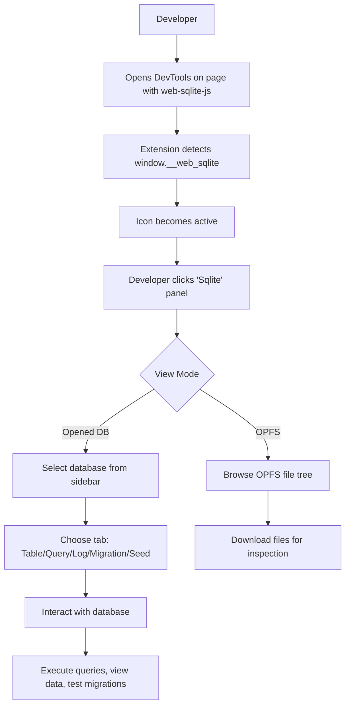

<!--
TEMPLATE MAP (reference-only)
.claude/templates/docs/01-discovery/01-brief.md

OUTPUT MAP (write to)
agent-docs/01-discovery/01-brief.md

NOTES
- Keep headings unchanged.
- Add Mermaid diagram whenever it improves clarity.
-->

# 01 Brief — Problem Framing

## 1) One-sentence description
A Chrome DevTools extension that provides comprehensive SQLite database inspection, query execution, and safe migration/seed testing for web-sqlite-js directly within the browser DevTools panel.

## 2) Why now (problem)
- **Current pain**: Developers using web-sqlite-js lack visibility into in-browser SQLite databases, making debugging difficult. Testing migration and seed SQL is risky without a safe playground environment.
- **Root cause**: No dedicated developer tools exist for web-sqlite-js; developers must rely on console.log or build custom debugging solutions.
- **Who is hurting**: Frontend developers, full-stack developers, and QA engineers working on offline-first PWAs and browser-based applications using web-sqlite-js.

## 3) Target users
- **Primary user**: Frontend developers building offline-first PWAs and browser applications using web-sqlite-js
- **Secondary user**: Full-stack developers, QA/testing engineers validating browser-based SQLite implementations
- **User environment**: Chrome/Edge browser with DevTools open, debugging any web application that uses web-sqlite-js

## 4) Goals (what success looks like)
- **G1**: Enable real-time inspection and debugging of SQLite databases through `window.__web_sqlite` API
- **G2**: Provide safe testing environment for migration and seed SQL before production deployment
- **G3**: Visualize OPFS (Origin Private File System) file structure with download capabilities
- **G4**: Display comprehensive database information including version, metadata, and statistics
- **G5**: Seamless integration with Chrome DevTools as a native panel

## 5) Non-goals (explicitly not doing)
- **NG1**: Modifying the web-sqlite-js library itself (this is a DevTools extension only)
- **NG2**: Supporting non-Chrome browsers (Chrome/Edge only initially due to Manifest V3 OPFS requirements)
- **NG3**: Direct database file editing without SQL (all modifications through SQL queries)
- **NG4**: Server-side database management (browser-only, OPFS-based databases)

## 6) Success criteria (testable)
- **SC1**: Extension icon activates only when `window.__web_sqlite` is detected on the active page (verified: icon state changes)
- **SC2**: Users can browse table contents, execute queries, and view logs for any opened database (verified: functional DB inspection)
- **SC3**: Migration and seed playgrounds allow safe testing with automatic rollback (verified: version changes persist only in dev)
- **SC4**: OPFS file tree displays with lazy loading and download functionality (verified: file listing works)

## 7) Assumptions & open questions
- **A1**: The target page uses web-sqlite-js v2.1.0+ with `window.__web_sqlite` global namespace available
- **A2**: Chrome/Edge browser with OPFS and SharedArrayBuffer support
- **A3**: User has DevTools open to access the extension panel
- **Q1**: Should the extension support multiple simultaneous database connections? (A: Yes, per `window.__web_sqlite.databases` structure)
- **Q2**: How should the extension handle databases that open/close after DevTools is open? (A: Listen to `onDatabaseChange` events)

## 8) User journey (Mermaid)

