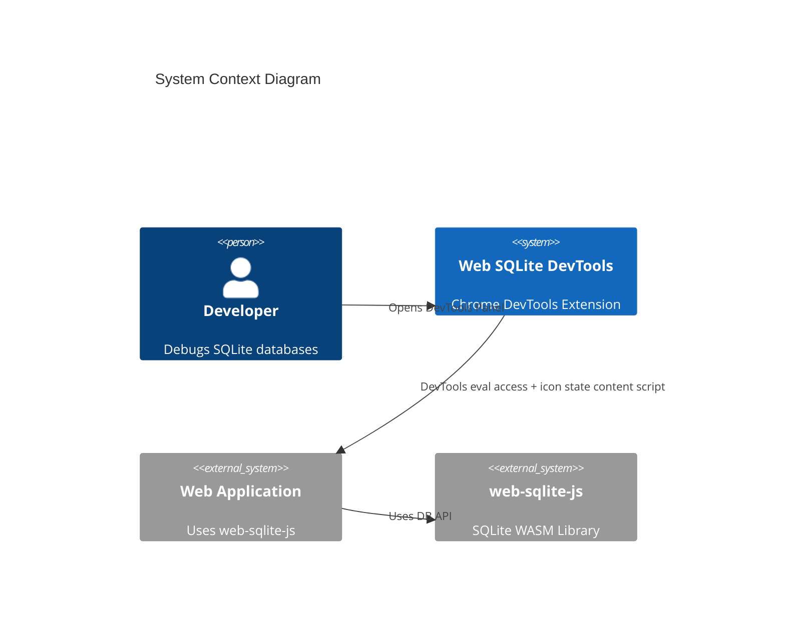
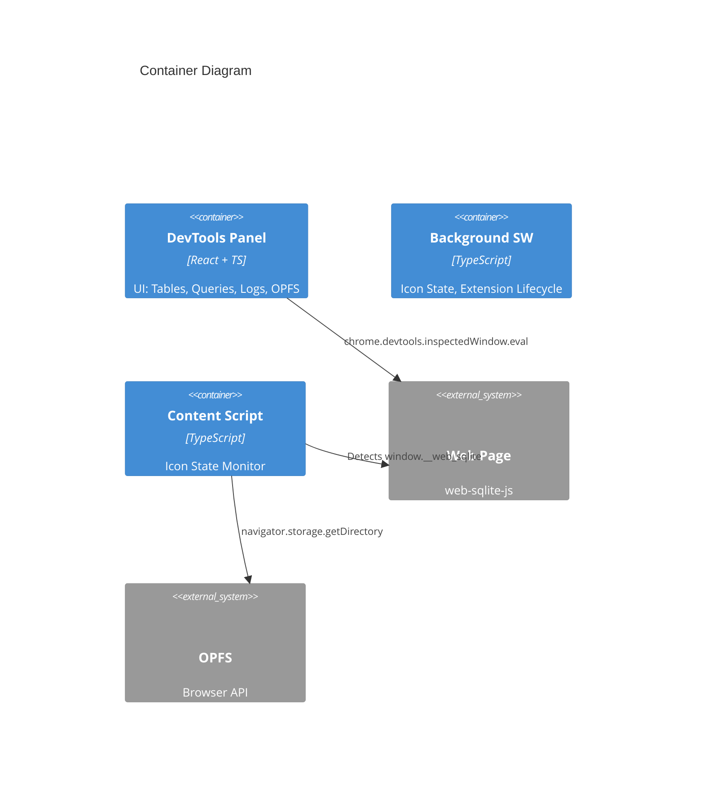

<!--
TEMPLATE MAP (reference-only)
.claude/templates/docs/03-architecture/01-hld.md

OUTPUT MAP (write to)
agent-docs/03-architecture/01-hld.md

NOTES
- Keep headings unchanged.
- Focus on STATIC STRUCTURE but include RATIONALE and STRATEGY.
-->

# 01 High-Level Design (HLD) — Structure

## 1) Architecture Style & Principles

- **Pattern**: **DevTools Inspected Window Access**
  - DevTools Panel → `chrome.devtools.inspectedWindow.eval` → Page Context (`window.__web_sqlite`)
  - Content script retained only for icon state updates
- **Key Principles**:
  - **Context Isolation**: DevTools accesses the page via inspected window eval
  - **Minimal Messaging**: Runtime messaging only for icon state updates
  - **Hash-Based Routing**: Single-page application navigation via URL hash (react-router-dom)
  - **Real-Time Updates**: Polling/requests via eval (streaming TBD)
  - **Stateless Panel**: DevTools panel can be closed/reopened without losing page context

## 2) System Boundary (C4 Context)

- **Users**: Frontend developers, full-stack developers, QA engineers using Chrome DevTools
- **External Systems**: web-sqlite-js library (via `window.__web_sqlite` global namespace)



## 3) Containers & Tech Stack (C4 Container)

- **DevTools Panel**: React 18 + TypeScript + Tailwind CSS + react-router-dom
  - **Reason**: Leverages existing template, provides declarative UI and routing
- **Content Script**: TypeScript + Chrome Extension APIs
  - **Reason**: Monitors `window.__web_sqlite` for icon state updates
- **Background Service Worker**: TypeScript + Chrome Extension APIs
  - **Reason**: Manages extension lifecycle, icon state, and offscreen logging
- **Routing**: react-router-dom (HashRouter)
  - **Reason**: Hash-based routing required for DevTools panel URLs
- **SQL Editor**: CodeMirror 6
  - **Reason**: Full-featured code editor with SQL syntax highlighting
- **Icons**: react-icons
  - **Reason**: Comprehensive icon library, tree-shakeable



## 4) Data Architecture Strategy

- **Ownership**: DevTools panel accesses `window.__web_sqlite` via eval; content script only tracks icon state
- **Caching**:
  - Table list: Cached in DevTools panel until database changes
  - Query results: Not cached (always fresh from database)
  - Log entries: Ring buffer (500 entries) in content script, streamed to panel
- **Consistency**: Strong consistency for queries (synchronous request/response); eventual for logs (streaming)
- **State Management**:
  - React useState for local component state
  - React Router location state for route-based state
  - No global state management library (avoid bundle size)

## 5) Cross-cutting Concerns (Implementation View)

### 5.1 Message Protocol

- **DevTools Data Access**: Uses `chrome.devtools.inspectedWindow.eval` directly
- **Runtime Messaging**: Only icon state updates and offscreen log storage
- **Error Handling**: Standard `{ success: boolean, data?: T, error?: string }` response format for eval

### 5.2 Reconnection Strategy

- **Heartbeat**: DevTools panel evaluates `window.__web_sqlite` every 5 seconds
- **Timeout**: DevTools panel shows error after 15 seconds without successful eval
- **Auto-Reconnect**: Panel attempts to reconnect on route change or user action
- **Page Refresh**: Panel detects refresh via failed eval and retries

### 5.3 Observability

- **Logs**: Internal extension logs to console.debug (DevTools only)
- **Error Tracking**: Error boundaries in React, log to console.error
- **Performance**: Measure panel open time, query execution time

### 5.4 Security

- **Permissions**: Minimal Chrome permissions (sidePanel, storage, offscreen)
- **Content Security Policy**: Strict CSP for extension pages
- **Eval Usage**: Only `chrome.devtools.inspectedWindow.eval` within DevTools

## 6) Code Structure Strategy (High-Level File Tree)

**Repo Structure**: Monorepo (single Chrome extension)

```text
/ (root)
  /src
    /devtools           # DevTools Panel (React)
      /components       # React components
        /Sidebar        # Sidebar navigation
        /TableTab       # Table browser
        /QueryTab       # SQL editor
        /LogTab         # Log viewer
        /MigrationTab   # Migration playground
        /SeedTab        # Seed playground
        /AboutTab       # Database info
        /OPFSBrowser    # OPFS file tree
      /hooks            # Custom React hooks
      /utils            # Utilities
      inspectedWindow.ts # DevTools eval helpers
      DevTools.tsx      # Main DevTools component
      index.tsx         # Entry point
    /contentScript      # Content Script (Icon State)
      App.tsx           # Icon state updater
      index.tsx         # Entry point
    /background         # Background Service Worker
      /iconState        # Icon activation logic
      index.ts          # Entry point
    /messaging          # Offscreen log channels
      channels.ts       # Offscreen log channels
      core.ts           # Channel core
    /shared             # Shared constants
      messages.ts       # Runtime message IDs
    /components         # Shared React components
      /CodeMirrorEditor # Reusable SQL editor
      /DataTable        # Reusable table display
    /types              # TypeScript type definitions
    /utils              # Shared utilities
  /public
    /icons              # Extension icons (active/inactive states)
  agent-docs            # Architecture documentation
```

**Module Pattern**: Layered architecture (Presentation → Eval Helpers → External API)

```text
/src/devtools
  /components          # Presentation Layer (React components)
  /hooks               # Custom hooks (useConnection, useInspectedWindowRequest)
  /utils               # Route/database helpers
  inspectedWindow.ts   # Eval helpers (window.__web_sqlite access)
/src/contentScript
  App.tsx              # Icon state monitor
/src/background
  /iconState           # Icon State Management
/src/shared
  messages.ts          # Runtime message IDs
```

## 7) Component Hierarchy (DevTools Panel)

```text
DevTools (Root)
├── HashRouter
│   ├── Sidebar (Navigation)
│   │   ├── SidebarHeader (App branding)
│   │   ├── DatabaseList (Opened DB menu)
│   │   ├── OPFSLink (OPFS browser link)
│   │   └── CollapseToggle (Sidebar collapse)
│   └── MainContent
│       ├── EmptyState (No route selected)
│       ├── DatabaseView (/openedDB/:dbname)
│       │   ├── TabNavigation (6 tabs)
│       │   └── TabContent
│       │       ├── TableTab
│       │       │   ├── TableList (Left column)
│       │       │   ├── MultiTableHeader (Tab bar)
│       │       │   ├── TableContent (Data + DDL)
│       │       │   └── PaginationBar
│       │       ├── QueryTab
│       │       │   ├── CodeMirrorEditor
│       │       │   ├── QueryResults
│       │       │   └── ExportButton
│       │       ├── LogTab
│       │       │   ├── LogFilter
│       │       │   └── LogList (500 entry ring buffer)
│       │       ├── MigrationTab
│       │       │   ├── HelperNotice
│       │       │   ├── CodeMirrorEditor
│       │       │   └── TestControls (Release/Rollback)
│       │       ├── SeedTab
│       │       │   ├── HelperNotice
│       │       │   ├── CodeMirrorEditor
│       │       │   └── TestControls (Release/Rollback)
│       │       └── AboutTab
│       │           └── DatabaseMetadata
│       └── OPFSView (/opfs)
│           └── FileTree
│               ├── FileNode (Lazy-loaded)
│               └── DownloadButton
```
