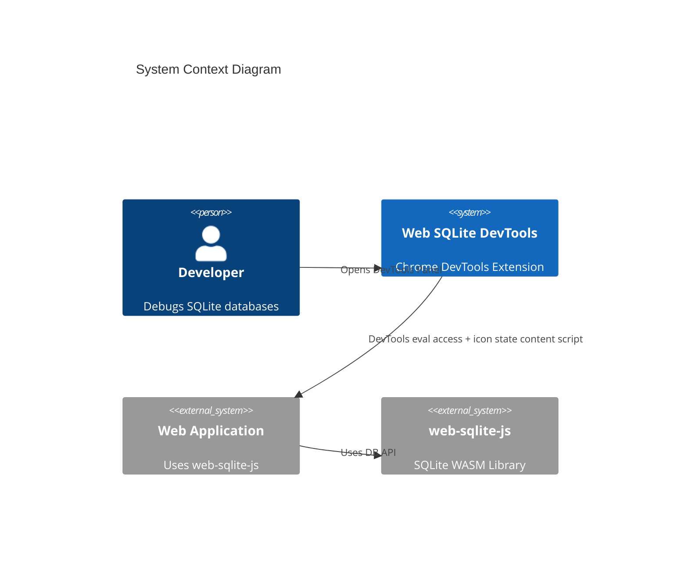

<!--
TEMPLATE MAP (reference-only)
.claude/templates/docs/03-architecture/01-hld.md

OUTPUT MAP (write to)
agent-docs/03-architecture/01-hld.md

NOTES
- Keep headings unchanged.
- Focus on STATIC STRUCTURE but include RATIONALE and STRATEGY.
-->

# 01 High-Level Design (HLD) — Structure

## 1) Architecture Style & Principles

- **Pattern**: **DevTools Inspected Window Access with Service Layer**
  - DevTools Panel → Service Layer (Business Logic) → Bridge Layer (Chrome API) → Page Context (`window.__web_sqlite`)
  - Content script retained only for icon state updates
- **Key Principles**:
  - **Separation of Concerns**: Three-layer architecture (Presentation → Service → Bridge)
  - **Context Isolation**: DevTools accesses the page via inspected window eval (chrome.scripting.executeScript)
  - **Minimal Messaging**: Runtime messaging only for icon state updates
  - **Hash-Based Routing**: Single-page application navigation via URL hash (react-router-dom)
  - **Real-Time Updates**: Polling/requests via eval (streaming TBD)
  - **Stateless Panel**: DevTools panel can be closed/reopened without losing page context

## 2) System Boundary (C4 Context)

- **Users**: Frontend developers, full-stack developers, QA engineers using Chrome DevTools
- **External Systems**: web-sqlite-js library (via `window.__web_sqlite` global namespace)



## 3) Containers & Tech Stack (C4 Container)

- **DevTools Panel**: React 18 + TypeScript + Tailwind CSS + react-router-dom
  - **Reason**: Leverages existing template, provides declarative UI and routing
- **Content Script**: TypeScript + Chrome Extension APIs
  - **Reason**: Monitors `window.__web_sqlite` for icon state updates
- **Background Service Worker**: TypeScript + Chrome Extension APIs
  - **Reason**: Manages extension lifecycle, icon state, and offscreen logging
- **Routing**: react-router-dom (HashRouter)
  - **Reason**: Hash-based routing required for DevTools panel URLs
- **SQL Editor**: CodeMirror 6
  - **Reason**: Full-featured code editor with SQL syntax highlighting
- **Icons**: react-icons
  - **Reason**: Comprehensive icon library, tree-shakeable
- **Syntax Highlighting**: react-syntax-highlighter (Prism.js)
  - **Reason**: Lightweight SQL syntax highlighting for DDL display


## 4) Data Architecture Strategy

- **Ownership**: DevTools panel accesses `window.__web_sqlite` via service layer; content script only tracks icon state
- **Caching**:
  - Table list: Cached in DevTools panel until database changes
  - Query results: Not cached (always fresh from database)
  - Log entries: Ring buffer (500 entries) in content script, streamed to panel
- **Consistency**: Strong consistency for queries (synchronous request/response); eventual for logs (streaming)
- **State Management**:
  - React useState for local component state
  - React Router location state for route-based state
  - No global state management library (avoid bundle size)

## 5) Cross-cutting Concerns (Implementation View)

### 5.1 Message Protocol

- **DevTools Data Access**: Uses service layer → bridge layer → `chrome.scripting.executeScript`
- **Runtime Messaging**: Only icon state updates and offscreen log storage
- **Error Handling**: Standard `{ success: boolean, data?: T, error?: string }` response format (ServiceResponse)

### 5.2 Reconnection Strategy

- **Heartbeat**: DevTools panel evaluates `window.__web_sqlite` every 5 seconds
- **Timeout**: DevTools panel shows error after 15 seconds without successful eval
- **Auto-Reconnect**: Panel attempts to reconnect on route change or user action
- **Page Refresh**: Panel detects refresh via failed eval and retries

### 5.3 Observability

- **Logs**: Internal extension logs to console.debug (DevTools only)
- **Error Tracking**: Error boundaries in React, log to console.error
- **Performance**: Measure panel open time, query execution time

### 5.4 Security

- **Permissions**: Minimal Chrome permissions (sidePanel, storage, offscreen, scripting)
- **Content Security Policy**: Strict CSP for extension pages
- **Eval Usage**: Only `chrome.scripting.executeScript` within DevTools (MAIN world)

## 6) Code Structure Strategy (High-Level File Tree)

**Repo Structure**: Monorepo (single Chrome extension)

```text
/ (root)
  /src
    /devtools           # DevTools Panel (React)
      /bridge           # Bridge Layer (Chrome API wrapper)
        inspectedWindow.ts    # chrome.scripting.executeScript wrapper
      /services         # Service Layer (Business Logic)
        databaseService.ts    # All database operations (10 functions)
      /components       # React components
        /Shared         # Shared components (F-006)
          ResizeHandle.tsx    # Reusable resize handle
        /Sidebar        # Sidebar navigation
        /OpenedDBList   # Database list view (F-008 NEW)
          OpenedDBList.tsx    # Main component
          DatabaseCard.tsx    # Individual database card
          EmptyDatabaseList.tsx # Empty state component
          LoadingSkeleton.tsx  # Loading state
          ErrorState.tsx       # Error state
        /DatabaseTabs    # Database tab navigation (F-002)
          DatabaseTabHeader.tsx # Tab header with 6 tabs
          DatabaseTabs.tsx     # Layout wrapper
        /TablesTab      # Table browser (F-005, F-006)
          TableList.tsx         # Table list sidebar
          OpenedTableTabs.tsx   # Opened tabs with close buttons (F-005 NEW)
          TableDetail.tsx       # Table detail with resizable schema (F-006 MODIFIED)
          TableContent.tsx      # Table content area
          TableSchema.tsx       # Schema panel (F-003, F-006)
          PaginationBar.tsx     # Pagination controls
        /QueryTab       # SQL editor
        /LogTab         # Log viewer (TASK-09, F-009)
          LogView.tsx          # Main log view component
          LogList.tsx          # Log list with ring buffer
          LogFilter.tsx        # Log filtering controls
        /MigrationTab   # Migration playground
        /SeedTab        # Seed playground
        /AboutTab       # Database info
        /OPFSBrowser    # OPFS file tree
      /hooks            # Custom React hooks
      /utils            # Utilities
      inspectedWindow.ts # Public API re-exports
      DevTools.tsx      # Main DevTools component
      index.tsx         # Entry point
    /contentScript      # Content Script (Icon State)
      App.tsx           # Icon state updater
      index.tsx         # Entry point
    /background         # Background Service Worker
      /iconState        # Icon activation logic
      index.ts          # Entry point
    /messaging          # Offscreen log channels
      channels.ts       # Offscreen log channels
      core.ts           # Channel core
    /shared             # Shared constants
      messages.ts       # Runtime message IDs
    /components         # Shared React components
      /CodeMirrorEditor # Reusable SQL editor
      /DataTable        # Reusable table display
    /types              # TypeScript type definitions
    /utils              # Shared utilities
  /public
    /icons              # Extension icons (active/inactive states)
  agent-docs            # Architecture documentation
```

**Module Pattern**: Three-layer architecture (Presentation → Service → Bridge)

```text
/src/devtools
  /components          # Presentation Layer (React components)
  /hooks               # Custom hooks (useConnection, useInspectedWindowRequest)
  /services            # Service Layer (Business Logic)
    databaseService.ts # Domain logic for all DB operations
  /bridge              # Bridge Layer (Chrome API)
    inspectedWindow.ts # Low-level executeScript wrapper
  inspectedWindow.ts   # Public API layer (re-exports)
/src/contentScript
  App.tsx              # Icon state monitor
/src/background
  /iconState           # Icon State Management
/src/shared
  messages.ts          # Runtime message IDs
```

**Service Layer Functions** (all in `databaseService.ts`):

1. **Database Discovery**: `getDatabases()` - List all open databases
2. **Table Metadata**: `getTableList(dbname)` - List tables in a database
3. **Schema Inspection**: `getTableSchema(dbname, tableName)` - Get table structure (PRAGMA table_info)
4. **Query Execution**: `queryTableData(dbname, sql, limit, offset)` - Execute SELECT with pagination
5. **SQL Execution**: `execSQL(dbname, sql, params?)` - Execute any SQL with optional params
6. **Log Streaming**: `subscribeLogs(dbname)` / `unsubscribeLogs(subscriptionId)` - Real-time log monitoring
7. **Migration Testing**: `devRelease(dbname, version, migrationSQL?, seedSQL?)` - Test migrations
8. **Version Control**: `devRollback(dbname, toVersion)` - Rollback to previous version
9. **Version Query**: `getDbVersion(dbname)` - Get current database version
10. **OPFS Access**: `getOpfsFiles(path?, dbname?)` / `downloadOpfsFile(path)` - File system operations

## 7) Component Hierarchy (DevTools Panel)

```text
DevTools (Root)
├── HashRouter
│   ├── Sidebar (Navigation)
│   │   ├── SidebarHeader (App branding)
│   │   ├── DatabaseList (Opened DB menu) - Links to /openedDB (F-008 UPDATED)
│   │   ├── OPFSLink (OPFS browser link)
│   │   └── CollapseToggle (Sidebar collapse)
│   └── MainContent
│       ├── EmptyState (No route selected - at root /)
│       ├── OpenedDBList (F-008 NEW - /openedDB route)
│       │   ├── Header
│       │   │   ├── Title: "Opened Databases"
│       │   │   └── Refresh Button (IoMdRefresh icon)
│       │   ├── Database List
│       │   │   └── DatabaseCard (clickable → /openedDB/:dbname/tables)
│       │   │       ├── FaDatabase icon
│       │   │       ├── Database name (primary text, bold)
│       │   │       └── Table count (secondary text, gray)
│       │   └── EmptyDatabaseList (when no databases)
│       │       ├── SiSqlite icon
│       │       ├── Title: "No Opened Databases"
│       │       ├── Message: "Could not detect any opened databases."
│       │       ├── Instructions: "Open a page that uses web-sqlite-js..."
│       │       └── Refresh Button (IoMdRefresh)
│       ├── DatabaseTabs (/openedDB/:dbname) → redirects to /openedDB/:dbname/tables
│       │   ├── DatabaseTabHeader (6 tabs: Tables, Query, Log, Migration, Seed, About) (F-009 UPDATED)
│       │   │   ├── Tables tab (CiViewTable icon)
│       │   │   ├── Query tab (BsFiletypeSql icon)
│       │   │   ├── Log tab (IoTimeOutline icon) (F-009 NEW)
│       │   │   ├── Migration tab (MdOutlineQueryBuilder icon)
│       │   │   ├── Seed tab (FaSeedling icon)
│       │   │   └── About tab (FaInfoCircle icon)
│       │   └── Outlet (Nested Routes)
│       │       ├── TablesTab (/openedDB/:dbname/tables)
│       │       │   ├── TableListSidebar (Resizable: 200-600px, default 300px)
│       │       │   │   ├── ResizeHandle (right edge)
│       │       │   │   └── Table list items (onClick: handleOpenTable)
│       │       │   ├── OpenedTableTabs (F-005: State-managed opened tabs)
│       │       │   │   ├── TabButton (opened tables only)
│       │       │   │   │   ├── Table name (truncate)
│       │       │   │   │   └── Close button (IoMdClose, group-hover)
│       │       │   │   └── Empty state
│       │       │   └── TableContentArea (flex-1, auto-adjusts)
│       │       │       └── TableDetail (/openedDB/:dbname/tables/:tableName)
│       │       │           ├── TableDataPanel (Left: data + pagination) - Full width when schema hidden
│       │       │           └── SchemaPanel (Right: toggleable, resizable, tabbed view)
│       │       │               ├── ResizeHandle (F-006: left edge)
│       │       │               ├── SchemaPanelHeader (Toggle button + Table/DDL tabs)
│       │       │               ├── SchemaTableView (Column info table)
│       │       │               └── SchemaDDLView (SQL with syntax highlight + copy button)
│       │       └── EmptyState (No table selected)
│       ├── QueryTab (/openedDB/:dbname/query)
│       │   ├── CodeMirrorEditor
│       │   ├── QueryResults
│       │   └── ExportButton
│       ├── LogView (/openedDB/:dbname/logs) (F-009 UPDATED - moved from separate route)
│       │   ├── LogFilter
│       │   └── LogList (500 entry ring buffer)
│       ├── MigrationTab (/openedDB/:dbname/migration)
│       │   ├── HelperNotice
│       │   ├── CodeMirrorEditor
│       │   └── TestControls (Release/Rollback)
│       ├── SeedTab (/openedDB/:dbname/seed)
│       │   ├── HelperNotice
│       │   ├── CodeMirrorEditor
│       │   └── TestControls (Release/Rollback)
│       └── AboutTab (/openedDB/:dbname/about)
│           └── DatabaseMetadata
│       └── OPFSView (/opfs)
│           └── FileTree
│               ├── FileNode (Lazy-loaded)
│               └── DownloadButton
```

## 8) Service Layer Architecture (Feature F-001)

**Purpose**: Centralize all database business logic in a single service layer, eliminating direct inspectedWindow access from components.

**Three-Layer Pattern**:

```
┌─────────────────────────────────────────────────────────────┐
│  Presentation Layer (Components)                            │
│  - React UI components                                      │
│  - No Chrome API or business logic                          │
│  - Imports: databaseService                                 │
└─────────────────────────────────────────────────────────────┘
                            ↓
┌─────────────────────────────────────────────────────────────┐
│  Service Layer (Business Logic)                             │
│  - databaseService.ts                                       │
│  - Domain operations: queries, migrations, logs, OPFS       │
│  - Uses ServiceResponse<T> envelope                         │
│  - Imports: inspectedWindowBridge                           │
└─────────────────────────────────────────────────────────────┘
                            ↓
┌─────────────────────────────────────────────────────────────┐
│  Bridge Layer (Chrome API)                                  │
│  - inspectedWindow.ts                                       │
│  - Low-level chrome.scripting.executeScript wrapper         │
│  - No business logic                                        │
└─────────────────────────────────────────────────────────────┘
                            ↓
┌─────────────────────────────────────────────────────────────┐
│  Page Context (window.__web_sqlite)                         │
│  - Main world execution context                             │
└─────────────────────────────────────────────────────────────┘
```

**Service Function Categories**:

1. **Discovery** (2 functions):
   - `getDatabases()` - List all databases
   - `getTableList(dbname)` - List all tables

2. **Schema & Data** (3 functions):
   - `getTableSchema(dbname, tableName)` - PRAGMA table_info
   - `queryTableData(dbname, sql, limit, offset)` - Paginated SELECT
   - `execSQL(dbname, sql, params?)` - Generic SQL executor

3. **Logging** (2 functions):
   - `subscribeLogs(dbname)` - Start log streaming
   - `unsubscribeLogs(subscriptionId)` - Stop log streaming

4. **Migration & Versioning** (3 functions):
   - `devRelease(dbname, version, migrationSQL?, seedSQL?)` - Test release
   - `devRollback(dbname, toVersion)` - Rollback version
   - `getDbVersion(dbname)` - Query current version

5. **OPFS** (2 functions):
   - `getOpfsFiles(path?, dbname?)` - List OPFS files
   - `downloadOpfsFile(path)` - Download file

**Benefits**:

- **Testability**: Service functions can be unit tested without Chrome APIs
- **Reusability**: Single source of truth for database operations
- **Maintainability**: Business logic isolated from Chrome API concerns
- **Type Safety**: Strong typing via ServiceResponse<T> envelope

## 9) Schema Panel Architecture (Feature F-003)

**Purpose**: Enhance the schema panel with toggle visibility and tabbed view for better UX.

**State Management**:

```
┌─────────────────────────────────────────────────────────────┐
│  TableDetail Component (State Owner)                        │
│  ├── schemaPanelVisible: boolean (default: false)          │
│  ├── schemaTab: 'table' | 'ddl' (default: 'table')         │
│  └── Handler Functions:                                     │
│      ├── handleToggleSchema()                               │
│      └── handleSchemaTabChange('table' | 'ddl')            │
└─────────────────────────────────────────────────────────────┘
                            ↓
┌─────────────────────────────────────────────────────────────┐
│  SchemaPanel Component (Controlled Props)                   │
│  ├── visible: boolean (from parent)                         │
│  ├── activeTab: 'table' | 'ddl' (from parent)              │
│  ├── onToggle(): () => void                                 │
│  └── onTabChange(tab): () => void                           │
└─────────────────────────────────────────────────────────────┘
```

**Responsive Layout Behavior**:

```
Visible State (schemaPanelVisible = true):
┌────────────────────────┬──────────────────┐
│ TableDataPanel         │ SchemaPanel      │
│ width: flex-1          │ width: w-80      │
│ (320px)                │                  │
└────────────────────────┴──────────────────┘

Hidden State (schemaPanelVisible = false):
┌───────────────────────────────────────────┐
│ TableDataPanel                             │
│ width: 100% (full width)                  │
└───────────────────────────────────────────┘
```

**Tab Switching Architecture**:

```
SchemaPanel Header:
┌────────────────────────────────────────────┐
│ [Toggle Icon]  [Table Icon] [DDL Text]   │
│                  ↓           ↓            │
│           Active Tab   Inactive Tab       │
│           (emerald-50)  (gray-500)        │
└────────────────────────────────────────────┘
                    ↓
┌────────────────────────────────────────────┐
│ Content Area (Conditional Render)          │
│                                            │
│ if (activeTab === 'table'):               │
│   <SchemaTableView />                      │
│     - Column info table                    │
│     - Type, constraints badges             │
│                                            │
│ if (activeTab === 'ddl'):                 │
│   <SchemaDDLView />                        │
│     - Dark code block (bg-gray-900)        │
│     - Green text (text-green-400)          │
│     - CREATE TABLE statement               │
└────────────────────────────────────────────┘
```

**CSS Transition Strategy**:

- **Panel Width**: `transition-all duration-200 ease-in-out`
- **Visible**: `w-80 opacity-100`
- **Hidden**: `w-0 opacity-0 overflow-hidden`
- **Table Panel**: `transition-all duration-200` (flex-1 ↔ w-full)

**Icon Integration**:

- **Toggle**: `BsReverseLayoutSidebarInsetReverse` (react-icons/bs)
- **Table Tab**: `ImTable2` (react-icons/im)
- **DDL Tab**: Pure text "DDL"

**Theme Colors** (from `src/devtools/index.css`):

- **Primary**: `#059669` (emerald-600)
- **Primary Light**: `#ecfdf5` (emerald-50)
- **Active Tab**: `bg-emerald-50 text-emerald-600 border-emerald-200`
- **Inactive Tab**: `text-gray-500 hover:text-gray-700 border-gray-200`

## 10) DDL Syntax Highlight & Copy Architecture (Feature F-004)

**Purpose**: Enhance DDL view with SQL syntax highlighting and one-click copy functionality.

**Technology Stack**:

- **Syntax Highlighting**: `react-syntax-highlighter` with Prism.js engine
  - Package: `react-syntax-highlighter` (~18.8KB minified)
  - Language: SQL
  - Theme: `prism` (light theme)
  - Bundle impact: < 50KB total increase
- **Icons**: React Icons
  - Copy: `react-icons/md` → `MdOutlineContentCopy`
  - Success: `react-icons/fa` → `FaCheck`
- **Clipboard API**: `navigator.clipboard.writeText()`
  - Browser support: Chrome 66+, Edge 79+, Firefox 63+
  - Graceful degradation: Inline error if unavailable

**Component State Management**:

```
┌─────────────────────────────────────────────────────────────┐
│  SchemaDDLView Component (State Owner)                      │
│  ├── copied: boolean (default: false)                       │
│  ├── error: string | null (default: null)                  │
│  └── Handler Functions:                                     │
│      ├── handleCopy() - Async clipboard write               │
│      └── handleClick() - Reset copied state on next click   │
└─────────────────────────────────────────────────────────────┘
```

**Copy Button State Machine**:

```
┌─────────────┐     Click (not copied)     ┌─────────────┐
│   Initial   │ ──────────────────────────> │  Copying    │
│  (Copy Icon)│                            │  (API Call)  │
└─────────────┘                            └─────────────┘
       │                                          │
       │                                          │ Success
       │                                          ↓
       │                                   ┌─────────────┐
       │                                   │   Copied    │
       │                                   │ (Checkmark) │
       │                                   └─────────────┘
       │                                          │
       │                                  Click again (reset)
       │                                          │
       └──────────────────────────────────────────┘
                    (back to Initial)

Error Path: Copying → Error State (Inline error, copy icon)
```

**DDL View Layout** (Enhanced):

```
┌──────────────────────────────────────────────────────┐
│ SchemaDDLView Component                              │
│ ┌────────────────────────────────────────────────┐  │
│ │ Header Row (flex justify-between)              │  │
│ │ ┌────────────┐  ┌──────────────────────────┐  │  │
│ │ │ Spacer (   │  │ Copy Button (right top)  │  │  │
│ │ │ flex-1)    │  │ [MdOutlineContentCopy]   │  │  │
│ │ └────────────┘  └──────────────────────────┘  │  │
│ ├────────────────────────────────────────────────┤  │
│ │ Error Container (if error exists)               │  │
│ │ "Failed to copy" (text-red-600 text-right)      │  │
│ ├────────────────────────────────────────────────┤  │
│ │ Syntax Highlighter (Prism.js)                   │  │
│ │ CREATE TABLE users (                            │  │
│ │   id INTEGER PRIMARY KEY,   ← keywords (blue)  │  │
│ │   name TEXT NOT NULL       ← types (purple)   │  │
│ │ );                        ← formatted output  │  │
│ └────────────────────────────────────────────────┘  │
└──────────────────────────────────────────────────────┘
```

**State Persistence & Reset Behavior**:

- **Success**: Icon changes to green `FaCheck`, persists indefinitely
- **Reset**: Next click resets to copy icon and triggers copy again
- **Error**: Shows inline error, icon remains as copy icon
- **User Intent**: Checkmark confirms action completed, reset on next interaction allows re-copy

**Clipboard API Error Handling**:

```typescript
try {
  await navigator.clipboard.writeText(ddl);
  setCopied(true);
  setError(null);
} catch (err) {
  setError("Failed to copy");
  setCopied(false);
}
```

**CSS Styling Strategy**:

```css
/* Copy Button */
.p-1.text-gray-600.hover\:text-gray-800.transition-colors

/* Success State */
.text-green-600 (FaCheck icon)

/* Error State */
.text-red-600.text-xs.mb-2.text-right (inline error)

/* Syntax Highlighter */
.customStyle: {
  background: '#f9fafb',    /* gray-50 (light theme) */
  padding: '12px',
  borderRadius: '6px',
  fontSize: '12px',         /* text-xs (12px) */
}
```

**Accessibility Considerations**:

- **ARIA Labels**: Copy button has `title` attribute for screen readers
- **Keyboard Navigation**: Button is focusable (Tab key), activates on Enter/Space
- **Color Contrast**: Green checkmark (`#16a34a`) meets WCAG AA standards
- **Error Visibility**: Inline error positioned near action, not in alert

**Performance Optimizations**:

- **Lazy Import**: Syntax highlighter only loads when DDL tab is active
- **Code Splitting**: `react-syntax-highlighter` can be tree-shaken to SQL language only
- **Debounce**: None needed (click event is user-triggered, not continuous)
- **Bundle Impact**: ~18.8KB for Prism.js variant, < 50KB total increase

**Updated Component Hierarchy** (DDL View):

```
SchemaPanel
├── SchemaPanelHeader
│   ├── Table Tab Button (ImTable2)
│   └── DDL Tab Button (Text "DDL")
└── Content Area
    ├── SchemaTableView (Column info)
    └── SchemaDDLView (Enhanced)
        ├── Header Row
        │   ├── Spacer (flex-1)
        │   └── Copy Button
        │       ├── MdOutlineContentCopy (default)
        │       └── FaCheck (success, green)
        ├── Error Container (conditional)
        │   └── Error Message (text-red-600)
        └── SyntaxHighlighter
            ├── Language: SQL
            ├── Style: prism (light theme)
            └── Custom Style (gray-50 bg, 12px font)
```

## 11) Opened Table Tabs Management Architecture (Feature F-005)

**Purpose**: Replace "all tables" tab bar with state-managed opened tabs, enabling users to control which tables are visible in the header.

**Problem Solved**:

- **Current Issue**: Header bar shows ALL tables from database, duplicating sidebar functionality
- **Solution**: Header bar shows only opened tables (state-managed), with close buttons and auto-switch

**State Management Architecture**:

```
┌─────────────────────────────────────────────────────────────┐
│  TableDetail Component (State Owner)                        │
│  ├── openedTabs: TableTab[] (default: [])                  │
│  ├── activeTab: TableTab | null (default: null)            │
│  └── Handler Functions:                                     │
│      ├── handleAutoOpenFirstTable() - On mount/db change    │
│      ├── handleOpenTable(tableName) - Add to opened tabs   │
│      ├── handleCloseTab(tab) - Remove and auto-switch      │
│      └── handleSelectTab(tab) - Set as active              │
└─────────────────────────────────────────────────────────────┘
                            ↓
┌─────────────────────────────────────────────────────────────┐
│  OpenedTableTabs Component (Controlled Props)               │
│  ├── tabs: TableTab[] (from parent)                        │
│  ├── activeTab: TableTab | null (from parent)             │
│  ├── onSelectTab(tab): () => void                          │
│  └── onCloseTab(tab): () => void                           │
└─────────────────────────────────────────────────────────────┘
```

**Tab State Flow**:

```
┌──────────────────┐
│  Mount Database  │
└────────┬─────────┘
         │
         ▼
┌──────────────────┐
│ Auto-open First  │ → openedTabs = [firstTable]
│      Table       │ → activeTab = firstTable
└────────┬─────────┘
         │
         ▼
┌──────────────────┐
│  User Clicks     │ → If not in openedTabs, append
│  Sidebar Table   │ → Set as activeTab
└────────┬─────────┘
         │
         ▼
┌──────────────────┐
│  User Clicks     │ → Remove from openedTabs
│  Close Button    │ → Auto-switch to next tab
└──────────────────┘
```

**Component Hierarchy** (Updated):

```
TablesTab (/openedDB/:dbname/tables)
├── TableListSidebar (Resizable width: 200-600px, default 300px)
│   └── Table list items (onClick: handleOpenTable)
├── OpenedTableTabs (NEW COMPONENT)
│   ├── TabButton (opened tables only)
│   │   ├── Table name (truncate, max-w-150px)
│   │   ├── Close button (IoMdClose, group-hover opacity)
│   │   └── Click stops propagation
│   └── Empty state ("No tables open...")
└── TableContentArea (flex-1, adjusts automatically)
    └── TableDetail (/openedDB/:dbname/tables/:tableName)
        └── Table data + Schema panel
```

**Auto-Open First Table Logic**:

```typescript
useEffect(() => {
  if (tables.length > 0 && openedTabs.length === 0) {
    const firstTab = { dbname, tableName: tables[0] };
    setOpenedTabs([firstTab]);
    setActiveTab(firstTab);
    navigate(`/openedDB/${rawDbname}/tables/${tables[0]}`);
  }
}, [tables, dbname, openedTabs.length]);
```

**Close Tab Auto-Switch Logic**:

```typescript
const handleCloseTab = (tabToClose: TableTab) => {
  setOpenedTabs((prev) => {
    const filtered = prev.filter((t) => !isSameTab(t, tabToClose));

    if (filtered.length > 0) {
      // Try to select the tab after the closed one
      const closedIndex = prev.findIndex((t) => isSameTab(t, tabToClose));
      const nextTab = filtered[closedIndex] || filtered[filtered.length - 1];
      setActiveTab(nextTab);
      navigate(`/openedDB/${rawDbname}/tables/${nextTab.tableName}`);
    } else {
      setActiveTab(null);
      navigate(`/openedDB/${rawDbname}/tables`);
    }

    return filtered;
  });
};
```

**Close Button Behavior**:

```
┌─────────────────────────────────────────────┐
│ [users] [orders] [categories]               │
│   ↑                                          │
│   └─ group (hover triggers close button)    │
│                                              │
│ Default: Close button hidden (opacity-0)     │
│ Hover: Close button visible (opacity-100)    │
│                                              │
│ Close button:                                │
│ - Icon: IoMdClose (react-icons/io)          │
│ - Size: 14px                                │
│ - Rounded: full (circle background)         │
│ - Hover: bg-blue-700 (active tab)           │
│          bg-gray-300 (inactive tab)         │
└─────────────────────────────────────────────┘
```

**Empty State Handling**:

```tsx
if (openedTabs.length === 0) {
  return (
    <div className="flex items-center justify-center flex-1 px-4 py-2 text-sm text-gray-500">
      No tables open. Select a table from the sidebar.
    </div>
  );
}
```

**Icon Integration**:

- **Close**: `IoMdClose` (react-icons/io) - Close button on each tab

**Theme Colors**:

- **Active Tab**: `bg-blue-600 text-white`
- **Inactive Tab**: `bg-gray-100 text-gray-700 hover:bg-gray-200`
- **Close Button (Active)**: `hover:bg-blue-700`
- **Close Button (Inactive)**: `hover:bg-gray-300`

## 12) Resizable Vertical Dividers Architecture (Feature F-006)

**Purpose**: Add draggable resize handles to all vertical pane dividers, enabling users to customize panel widths.

**Problem Solved**:

- **Current Issue**: Fixed panel widths (sidebar 25%, schema 320px) cannot be adjusted
- **Solution**: Draggable resize handles with min/max constraints and cursor feedback

**Resize Handle Architecture**:

```
┌─────────────────────────────────────────────────────────────┐
│  ResizeHandle Component (Reusable)                           │
│  ├── position: 'left' | 'right'                            │
│  ├── onDrag: (deltaX: number) => void                      │
│  ├── minWidth: number (default: 150)                       │
│  ├── maxWidth: number (default: 800)                       │
│  ├── currentWidth: number                                   │
│  └── State:                                                 │
│      ├── isDragging: boolean                               │
│      ├── dragStartX: number                                │
│      └── Event handlers (mousedown, mousemove, mouseup)    │
└─────────────────────────────────────────────────────────────┘
                            ↓
┌─────────────────────────────────────────────────────────────┐
│  Parent Component (TablesTab, TableDetail)                  │
│  ├── panelWidth state (pixels)                              │
│  ├── handleResize callback                                  │
│  └── Inline style for width                                 │
└─────────────────────────────────────────────────────────────┘
```

**Resizable Panels**:

```
TablesTab Layout:
┌────┬──────────────────────────────────────────────────┐
│    │                                                  │
 │    │                                                  │
 │    │                                                  │
 │ ───┘ ← ResizeHandle (right edge of sidebar)          │
 │    ├──────────────────────────────────────────────────┤
 │    │ TableContentArea (flex-1, auto-adjusts)         │
 └────┴──────────────────────────────────────────────────┘
      │
      └─ Sidebar (width: 200-600px, default: 300px)

TableDetail Layout:
┌──────────────────────────────────────────┬────┐
│ TableDataPanel (flex-1)                  │    │
│                                            │    │
│                                            │ ───┤ ← ResizeHandle (left edge)
├────────────────────────────────────────────┤    │
│ SchemaPanel (width: 250-600px, default 320px) │
└────────────────────────────────────────────┴────┘
```

**State Management** (TablesTab):

```typescript
const [sidebarWidth, setSidebarWidth] = useState(300);

const handleSidebarResize = useCallback((deltaX: number) => {
  setSidebarWidth(prev => {
    const newWidth = prev + deltaX;
    return Math.max(200, Math.min(600, newWidth));
  });
}, []);

// Apply to sidebar
<aside
  className="border-r border-gray-200 bg-white flex flex-col relative"
  style={{ width: `${sidebarWidth}px`, minWidth: `${sidebarWidth}px` }}
>
  {/* Content */}
  <ResizeHandle
    position="right"
    onDrag={handleSidebarResize}
    currentWidth={sidebarWidth}
    minWidth={200}
    maxWidth={600}
  />
</aside>
```

**State Management** (TableDetail):

```typescript
const [schemaPanelWidth, setSchemaPanelWidth] = useState(320);

const handleSchemaResize = useCallback((deltaX: number) => {
  setSchemaPanelWidth(prev => {
    const newWidth = prev - deltaX; // Subtract because dragging left expands
    return Math.max(250, Math.min(600, newWidth));
  });
}, []);

// Apply to schema panel
<div
  className="relative"
  style={{ width: `${schemaPanelWidth}px` }}
>
  <ResizeHandle
    position="left"
    onDrag={handleSchemaResize}
    currentWidth={schemaPanelWidth}
    minWidth={250}
    maxWidth={600}
  />
  <SchemaPanel />
</div>
```

**Resize Handle Event Flow**:

```
┌──────────────────┐
│  Mouse Down      │ → isDragging = true
│  on Handle       │ → dragStartX = e.clientX
└────────┬─────────┘
         │
         ▼
┌──────────────────┐
│  Mouse Move      │ → deltaX = e.clientX - dragStartX
│  (document)      │ → Enforce min/max constraints
└────────┬─────────┘ → Call onDrag(deltaX)
         │
         ▼
┌──────────────────┐
│  Mouse Up        │ → isDragging = false
│  (document)      │ → Cleanup event listeners
└──────────────────┘
```

**Cursor Change Strategy**:

```css
/* Resize handle base */
.resize-handle {
  cursor: col-resize;
}

/* Hover state */
.resize-handle:hover {
  background: #bfdbfe; /* blue-200 */
  width: 8px; /* Expand from 4px */
}
```

**Visual Feedback**:

```
Default State:
┌────────┐
│        │ 4px transparent, cursor: col-resize
└────────┘

Hover State:
┌────────┐
│        │ 8px blue-200, cursor: col-resize
└────────┘

Dragging State:
┌────────┐
│        │ 8px blue-300, cursor: col-resize
└────────┘
```

**Component Hierarchy** (Updated):

```
Shared Components (NEW)
└── ResizeHandle.tsx (Reusable)
    ├── Props: position, onDrag, minWidth, maxWidth, currentWidth
    └── Handles: mousedown, mousemove, mouseup

TablesTab (MODIFIED)
├── sidebarWidth state (300px default)
├── handleSidebarResize callback
├── TableListSidebar (resizable)
│   └── ResizeHandle (position: right)
└── TableContentArea (auto-adjusts)

TableDetail (MODIFIED)
├── schemaPanelWidth state (320px default)
├── handleSchemaResize callback
├── TableDataPanel (auto-adjusts)
└── SchemaPanel (resizable)
    └── ResizeHandle (position: left)
```

**Min/Max Constraints**:

| Panel                    | Min Width | Max Width | Default |
| ------------------------ | --------- | --------- | ------- |
| TablesTab Sidebar        | 200px     | 600px     | 300px   |
| TableDetail Schema Panel | 250px     | 600px     | 320px   |

**Accessibility**:

- **ARIA Role**: `role="separator"`
- **ARIA Orientation**: `aria-orientation="vertical"`
- **ARIA Label**: `aria-label="Resize panel"`
- **Focus**: Handle is focusable (keyboard resize optional, future enhancement)

**Performance Optimizations**:

- **Direct Updates**: No debouncing (drag is user-controlled)
- **Event Cleanup**: Document event listeners removed on unmount
- **React.memo**: TabButton component memoized to prevent re-renders

**CSS Styling Strategy**:

```css
/* Resize handle positioning */
.resize-handle-left {
  position: absolute;
  left: -8px; /* Negative margin for offset */
  top: 0;
  bottom: 0;
  width: 4px;
  cursor: col-resize;
}

.resize-handle-right {
  position: absolute;
  right: -8px;
  top: 0;
  bottom: 0;
  width: 4px;
  cursor: col-resize;
}

/* Hover state */
.resize-handle:hover {
  width: 8px;
  background: #bfdbfe; /* blue-200 */
}

/* Dragging state */
.resize-handle.dragging {
  width: 8px;
  background: #93c5fd; /* blue-300 */
}
```

## 13) Opened Database List Route Architecture (Feature F-008)

**Purpose**: Add a generic `/openedDB` route to display a list of all opened databases, enabling centralized database navigation.

**Problem Solved**:

- **Current Issue**: No generic `/openedDB` route exists; sidebar "Opened DB" link navigates to `/` instead of a database list view
- **Solution**: New `/openedDB` route with OpenedDBList component showing all databases as clickable cards

**Route Structure** (Updated):

```
Before:
/ → EmptyState (welcome screen)
/openedDB/:dbname → DatabaseTabs (specific database)

After:
/ → EmptyState (welcome screen)
/openedDB → OpenedDBList (NEW - list of all opened databases)
/openedDB/:dbname → DatabaseTabs (specific database)
```

**Navigation Flow**:

```
┌──────────────────┐
│  User clicks     │
│  "Opened DB"     │
│  in sidebar      │
└────────┬─────────┘
         │
         ▼
┌──────────────────┐
│  Navigate to     │ → Route: /openedDB
│  /openedDB       │ → Component: OpenedDBList
└────────┬─────────┘
         │
         ▼
┌──────────────────┐
│  Fetch databases │ → databaseService.getDatabases()
│  via service     │ → Show loading skeleton
└────────┬─────────┘
         │
         ▼
┌──────────────────┐     ┌──────────────────┐     ┌──────────────────┐
│  Databases       │     │  No databases    │     │  Error loading   │
│  found           │     │  found           │     │  databases       │
│  (array)         │     │  (empty)         │     │  (error)         │
└────────┬─────────┘     └────────┬─────────┘     └────────┬─────────┘
         │                       │                       │
         ▼                       ▼                       ▼
┌──────────────────┐     ┌──────────────────┐     ┌──────────────────┐
│  Display list    │     │  EmptyDatabase-  │     │  ErrorState with │
│  of DatabaseCard │     │  List component  │     │  retry button    │
│  components      │     │  (SiSqlite icon, │     │                  │
│                  │     │  refresh button)│     │                  │
└────────┬─────────┘     └──────────────────┘     └──────────────────┘
         │
         ▼
┌──────────────────┐
│  User clicks     │
│  database card   │
└────────┬─────────┘
         │
         ▼
┌──────────────────┐
│  Navigate to     │ → /openedDB/:dbname/tables
│  database tables │ → Opens TablesTab
└──────────────────┘
```

**Component Architecture**:

```
┌─────────────────────────────────────────────────────────────┐
│  OpenedDBList Component (State Owner)                       │
│  ├── Data Fetching:                                         │
│  │   ├── useInspectedWindowRequest(() =>                   │
│  │   │   databaseService.getDatabases())                   │
│  │   ├── data: DatabaseSummary[] | null                    │
│  │   ├── isLoading: boolean                                │
│  │   ├── error: string | null                              │
│  │   └── reload: () => void                                │
│  └── Render States:                                         │
│      ├── isLoading → <LoadingSkeleton />                   │
│      ├── error → <ErrorState error={error} retry={reload} />│
│      ├── data.length === 0 → <EmptyDatabaseList refresh={reload} />│
│      └── data.length > 0 → <DatabaseList databases={data} reload={reload} />│
└─────────────────────────────────────────────────────────────┘
                            ↓
┌─────────────────────────────────────────────────────────────┐
│  DatabaseCard Component (Clickable Navigation)              │
│  ├── Props:                                                 │
│  │   ├── database: DatabaseSummary                         │
│  │   └── isActive?: boolean                                │
│  ├── Visual Elements:                                       │
│  │   ├── FaDatabase icon (react-icons/fa)                  │
│  │   ├── Database name (bold, primary text)                │
│  │   └── Table count (gray-500, secondary text)            │
│  └── Interaction:                                           │
│      └── onClick → navigate('/openedDB/:dbname/tables')    │
└─────────────────────────────────────────────────────────────┘
                            ↓
┌─────────────────────────────────────────────────────────────┐
│  EmptyDatabaseList Component (Empty State)                  │
│  ├── Props:                                                 │
│  │   └── refresh: () => void                               │
│  ├── Visual Elements:                                       │
│  │   ├── SiSqlite icon (text-primary-600, text-6xl)        │
│  │   ├── Title: "No Opened Databases"                      │
│  │   ├── Message: "Could not detect any opened databases." │
│  │   ├── Instructions: "Open a page that uses web-sqlite-js..."│
│  │   └── Refresh Button (IoMdRefresh icon)                 │
│  └── Interaction:                                           │
│      └── onClick refresh → reload database list            │
└─────────────────────────────────────────────────────────────┘
```

**Sidebar Link Update**:

```
Before (F-008):
<SidebarLink to="/" label="Opened DB" ... />

After (F-008):
<SidebarLink to="/openedDB" label="Opened DB" ... />
```

**Active State Behavior**:

- Sidebar "Opened DB" link highlights when on `/openedDB` or `/openedDB/:dbname/*`
- Uses React Router's `useLocation()` to detect active state
- Partial matching: `pathname.startsWith('/openedDB')`

**Component Hierarchy** (F-008 Additions):

```
OpenedDBList (NEW COMPONENT - /openedDB)
├── Header
│   ├── Title: "Opened Databases" (h1, text-2xl font-semibold)
│   └── Refresh Button (IoMdRefresh, right-aligned)
│       ├── onClick: reload database list
│       ├── ARIA: "Refresh database list"
│       └── Style: text-gray-600 hover:text-gray-800
├── Database List (flex flex-col gap-3)
│   └── DatabaseCard (repeated for each database)
│       ├── FaDatabase icon (text-gray-600, 20px)
│       ├── Database name (font-medium text-gray-700)
│       ├── Table count (text-xs text-secondary-500)
│       ├── Hover: bg-primary-50 border-primary-300 shadow-sm
│       ├── Active: bg-primary-50 border-primary-600 shadow-sm
│       └── onClick: navigate('/openedDB/:dbname/tables')
├── EmptyDatabaseList (conditional render)
│   ├── SiSqlite icon (text-primary-600, text-6xl)
│   ├── Title: "No Opened Databases" (text-2xl font-semibold text-gray-700)
│   ├── Message: "Could not detect any opened databases." (text-gray-600)
│   ├── Instructions: "Open a page that uses web-sqlite-js..." (text-gray-500 text-sm)
│   └── Refresh Button (IoMdRefresh, bg-primary-600 text-white)
├── LoadingSkeleton (conditional render)
│   └── Skeleton placeholders (3-4 cards)
└── ErrorState (conditional render)
    ├── Error message (text-red-600)
    └── Retry button (IoMdRefresh)
```

**Route Order** (Important):

```tsx
// In DevTools.tsx
<Route path="/openedDB" element={<OpenedDBList />} /> {/* MUST BE FIRST */}
<Route path="/openedDB/:dbname" element={<DatabaseTabs />}>
  {/* ... nested routes ... */}
</Route>
```

**Rationale**: Generic route (`/openedDB`) must precede parameterized route (`/openedDB/:dbname`) to avoid route conflicts. React Router matches routes in order.

**Theme Colors** (from F-007):

- **Primary**: `primary-600` (`#059669` - emerald-600) - Actions, icons
- **Secondary**: `secondary-500` (`#6b7280` - gray-500) - Metadata
- **Borders**: `border-gray-200` (default), `border-primary-300` (hover), `border-primary-600` (active)
- **Backgrounds**: `bg-white` (default), `bg-primary-50` (hover/active state)
- **Text**: `text-gray-700` (headings), `text-gray-600` (body), `text-gray-500` (muted)

**Icon Integration**:

- **Database**: `FaDatabase` (react-icons/fa) - Database card icon
- **Refresh**: `IoMdRefresh` (react-icons/io) - Refresh button
- **Empty State**: `SiSqlite` (react-icons/si) - Empty state icon

**Service Layer Integration**:

Uses existing service layer function (no changes required):

```typescript
// From databaseService.ts
getDatabases(): Promise<ServiceResponse<DatabaseSummary[]>>

// Returns:
interface DatabaseSummary {
  name: string;
  tableCount?: number;
  // Additional metadata optional
}
```

**File Structure** (F-008):

```
src/devtools/components/OpenedDBList/
├── index.tsx                 # Main component export
├── OpenedDBList.tsx          # Main component with data fetching
├── DatabaseCard.tsx          # Individual database card
├── EmptyDatabaseList.tsx     # Empty state component
├── LoadingSkeleton.tsx       # Loading skeleton
└── ErrorState.tsx            # Error state with retry
```

**Accessibility**:

- **Semantic HTML**: `<nav>` for database list, `<button>` for clickable cards
- **ARIA Labels**: Refresh button has `aria-label="Refresh database list"`
- **Keyboard Navigation**: Database cards are buttons (Tab, Enter, Space)
- **Focus Management**: Visual focus indicators on all interactive elements
- **Screen Readers**: Database names and table counts announced

**Performance Optimizations**:

- **Optimistic UI**: Preserve database list during refresh (no flicker)
- **Loading States**: Skeleton instead of spinner (better UX)
- **Error Recovery**: Retry button without page reload
- **Route-Based Code Splitting**: OpenedDBList loads only when needed

**Error Handling**:

```typescript
// ServiceResponse error format
interface ServiceResponse<T> {
  success: boolean;
  data?: T;
  error?: string;
}

// Error state displays error.message with retry button
<ErrorState error={error} retry={reload} />
```

**Edge Cases**:

1. **No databases**: Show EmptyDatabaseList with refresh button
2. **Single database**: Show one card, clickable to tables
3. **Multiple databases**: Show vertical list of cards
4. **Loading error**: Show error state with retry button
5. **Refresh during load**: Show inline loading indicator, preserve existing list
6. **Navigation during load**: Cancel in-flight request on unmount

**Navigation Flow Summary**:

```
Sidebar "Opened DB" → /openedDB → OpenedDBList
                                          ↓
                                          ├─→ Empty state (no databases)
                                          ├─→ Loading skeleton (fetching)
                                          ├─→ Error state (with retry)
                                          └─→ Database list (cards)
                                                ↓
                                                └─→ Click card → /openedDB/:dbname/tables
```

**Benefits**:

- **Centralized Navigation**: Single view for all opened databases
- **Clear Empty State**: Users understand when no databases are available
- **Manual Refresh**: Users can update database list on-demand
- **Consistent UX**: Matches sidebar pattern (list items, hover effects)
- **Accessibility**: Keyboard navigation and screen reader support

## 14) Database Tab Navigation with Log Tab (Feature F-002, F-009)

**Purpose**: Add Log tab to database tab navigation, integrating the existing LogView component into the database context.

**Problem Solved**:

- **Current Issue**: Log view is at separate route `/logs/:dbname`, outside the database tab context
- **Solution**: Add Log tab between Query and Migration tabs, accessible from database navigation

**Tab Structure** (F-009 Updated):

```
Before (F-002):
Database Tabs (5 tabs):
├── Tables → /openedDB/:dbname/tables
├── Query → /openedDB/:dbname/query
├── Migration → /openedDB/:dbname/migration
├── Seed → /openedDB/:dbname/seed
└── About → /openedDB/:dbname/about

Separate Route:
/logs/:dbname → LogView (outside database context)

After (F-009):
Database Tabs (6 tabs):
├── Tables → /openedDB/:dbname/tables
├── Query → /openedDB/:dbname/query
├── Log → /openedDB/:dbname/logs (NEW)
├── Migration → /openedDB/:dbname/migration
├── Seed → /openedDB/:dbname/seed
└── About → /openedDB/:dbname/about

Existing /logs/:dbname route deprecated (redirects to new route)
```

**DATABASE_TABS Configuration**:

```typescript
// DatabaseTabHeader.tsx
import { CiViewTable } from "react-icons/ci";
import { BsFiletypeSql } from "react-icons/bs";
import { IoTimeOutline } from "react-icons/io5";  // F-009 NEW
import { MdOutlineQueryBuilder } from "react-icons/md";
import { FaSeedling } from "react-icons/fa";
import { FaInfoCircle } from "react-icons/fa";

export const DATABASE_TABS: DatabaseTab[] = [
  { path: "tables", label: "Tables", icon: <CiViewTable size={18} /> },
  { path: "query", label: "Query", icon: <BsFiletypeSql size={16} /> },
  { path: "logs", label: "Log", icon: <IoTimeOutline size={18} /> },   // F-009 NEW
  { path: "migration", label: "Migration", icon: <MdOutlineQueryBuilder size={18} /> },
  { path: "seed", label: "Seed", icon: <FaSeedling size={16} /> },
  { path: "about", label: "About", icon: <FaInfoCircle size={16} /> },
];
```

**Route Structure** (F-009 Updated):

```tsx
// DevTools.tsx - DatabaseTabs nested routes
<Route path="/openedDB/:dbname" element={<DatabaseTabs />}>
  <Route index element={<Navigate to="tables" replace />} />

  <Route path="tables" element={<TablesTab />}>
    <Route path=":tableName" element={<TableDetail />} />
  </Route>

  <Route path="query" element={<QueryTab ... />} />
  <Route path="logs" element={<LogView />} />          {/* F-009 NEW */}
  <Route path="migration" element={<MigrationTab />} />
  <Route path="seed" element={<SeedTab />} />
  <Route path="about" element={<AboutTab />} />
</Route>
```

**Tab Order** (F-009):

| Position | Tab       | Icon                  | Route                       | Description         |
| -------- | --------- | --------------------- | --------------------------- | ------------------- |
| 1        | Tables    | CiViewTable           | /openedDB/:dbname/tables    | Browse table data   |
| 2        | Query     | BsFiletypeSql         | /openedDB/:dbname/query     | Execute SQL queries |
| 3        | Log       | IoTimeOutline         | /openedDB/:dbname/logs      | View database logs  |
| 4        | Migration | MdOutlineQueryBuilder | /openedDB/:dbname/migration | Test migrations     |
| 5        | Seed      | FaSeedling            | /openedDB/:dbname/seed      | Test seed data      |
| 6        | About     | FaInfoCircle          | /openedDB/:dbname/about     | Database metadata   |

**LogView Integration** (F-009):

- **Component**: Reuses existing `LogView` component from `@/devtools/components/LogTab/LogView`
- **No Modifications**: LogView component unchanged, works with new route structure
- **Database Context**: Gets dbname from route params via `useParams()` hook
- **Log Subscription**: Uses existing `subscribeLogs()` service function
- **Ring Buffer**: 500 entry log buffer maintained in content script

**Navigation Behavior** (F-009):

```
User clicks "Log" tab:
├─→ Navigate to /openedDB/:dbname/logs
├─→ DatabaseTabHeader highlights "Log" tab (active state)
├─→ LogView component renders
│   ├─→ LogFilter (log level controls)
│   └─→ LogList (scrollable log entries)
└─→ URL updates in browser address bar
```

**Active State Styling** (F-009):

- **Active Tab**: `border-b-2 border-primary-600 text-primary-600`
- **Inactive Tab**: `border-b-2 border-transparent text-gray-600 hover:text-gray-800`
- **Hover State**: `bg-gray-50` (light background)
- **Theme Tokens**: Uses F-007 theme tokens (primary-600: #059669)

**Icon Integration** (F-009):

- **Log Tab**: `IoTimeOutline` (react-icons/io5) - Time/clock icon representing log history
- **Icon Size**: `size={18}` for consistency with other tabs
- **Visual Cue**: Clock icon intuitively represents time-based log entries

**Backward Compatibility** (F-009):

- **Old Route**: `/logs/:dbname` route kept for backward compatibility
- **Optional Redirect**: Can add redirect from old route to new tab route
- **No Breaking Changes**: Existing bookmarks/links to old route still work
- **LogView Component**: No modifications required, works with both routes

**Component Hierarchy** (F-009 Updated):

```
DatabaseTabs (/openedDB/:dbname)
├── DatabaseTabHeader (6 tabs)
│   ├── Tables tab (CiViewTable icon)
│   ├── Query tab (BsFiletypeSql icon)
│   ├── Log tab (IoTimeOutline icon) ← F-009 NEW
│   ├── Migration tab (MdOutlineQueryBuilder icon)
│   ├── Seed tab (FaSeedling icon)
│   └── About tab (FaInfoCircle icon)
└── Outlet (Nested Routes)
    ├── TablesTab (/openedDB/:dbname/tables)
    ├── QueryTab (/openedDB/:dbname/query)
    ├── LogView (/openedDB/:dbname/logs) ← F-009 UPDATED (moved from separate route)
    │   ├── LogFilter
    │   └── LogList (500 entry ring buffer)
    ├── MigrationTab (/openedDB/:dbname/migration)
    ├── SeedTab (/openedDB/:dbname/seed)
    └── AboutTab (/openedDB/:dbname/about)
```

**Route Implementation Details** (F-009):

```typescript
// LogView component (unchanged)
const LogView: React.FC = () => {
  const { dbname } = useParams<{ dbname: string }>();
  const [logs, setLogs] = useState<LogEntry[]>([]);
  const [filter, setFilter] = useState<LogLevel>("all");

  // Component uses dbname from route params
  // No changes required for F-009
};
```

**Accessibility** (F-009):

- **Tab Label**: "Log" - Clear, descriptive label
- **ARIA Role**: `role="tab"` for tab button
- **ARIA Selected**: `aria-selected="true"` when active
- **Keyboard Navigation**: Tab key navigates between tabs, Enter activates
- **Screen Reader**: Announces "Log tab, selected" when active

**Benefits** (F-009):

- **Unified Navigation**: All database-related features accessible from tab bar
- **Consistent UX**: Log view follows same navigation pattern as other tabs
- **Database Context**: Logs viewed within database context (not separate route)
- **No Code Changes**: Reuses existing LogView component
- **Visual Clarity**: Clock icon intuitively represents time-based logs

**Implementation Notes** (F-009):

- **Files Modified**: 2 files
  - `DatabaseTabHeader.tsx`: Add IoTimeOutline icon and logs tab to DATABASE_TABS
  - `DevTools.tsx`: Add logs route inside DatabaseTabs route
- **Complexity**: Low (simple integration of existing component)
- **Estimated Time**: 0.5-1 hour
- **Risk**: Low (uses existing, tested LogView component)

## 15) Database Refresh Coordination (Feature F-010)

**Purpose**: Coordinate database refresh between sidebar and main page via shared React Context, eliminating stale data inconsistencies.

**Problem Solved**:

- **Current Issue**: OpenedDBList (`/openedDB` route) and Sidebar DatabaseList each have their own `reload()` function. When user clicks refresh in main page, sidebar list shows stale data.
- **Solution**: Create `DatabaseRefreshContext` at DevTools level to coordinate refresh across both locations. Add refresh button to sidebar header (left side).

**State Management Architecture**:

```
┌─────────────────────────────────────────────────────────────┐
│  DevToolsContent (Context Provider)                          │
│  ├── refreshVersion: number (increments on refresh)        │
│  └── triggerRefresh: () => void (increments version)       │
└─────────────────────────────────────────────────────────────┘
                            │
         ┌──────────────────┴──────────────────┐
         ▼                                     ▼
┌─────────────────────────┐     ┌─────────────────────────┐
│  Sidebar DatabaseList   │     │  OpenedDBList           │
│  (Context Consumer)     │     │  (Context Consumer)     │
│  ├── Consumes context   │     │  ├── Consumes context   │
│  ├── Uses refreshVersion│     │  ├── Uses refreshVersion│
│  │   in deps array      │     │  │   in deps array      │
│  └── New refresh button │     │  └── Header refresh     │
│      (left side)        │     │      button             │
└─────────────────────────┘     └─────────────────────────┘
```

**Refresh Coordination Flow**:

```
┌──────────────────┐
│  User clicks     │
│  refresh in      │
│  main page OR    │
│  sidebar         │
└────────┬─────────┘
         │
         ▼
┌──────────────────┐
│  triggerRefresh()│ → Increments refreshVersion
└────────┬─────────┘
         │
         ▼
┌──────────────────┐
│  Context updates │ → All consumers re-render
│  (refreshVersion │ → Dependency array triggers
│   value changes) │ → useInspectedWindowRequest
└────────┬─────────┘
         │
         ▼
┌──────────────────┐     ┌──────────────────┐
│  Sidebar refetch │     │  Main page       │
│  databases       │     │  refetches       │
│  (fresh data)     │     │  databases       │
└──────────────────┘     └──────────────────┘
```

**Context API Pattern**:

```typescript
// DatabaseRefreshContext.tsx
interface DatabaseRefreshContextValue {
  triggerRefresh: () => void;
  refreshVersion: number;
}

export const DatabaseRefreshContext = createContext<DatabaseRefreshContextValue | null>(null);

export const DatabaseRefreshProvider: React.FC<{ children: React.ReactNode }> = ({ children }) => {
  const [refreshVersion, setRefreshVersion] = useState(0);

  const triggerRefresh = useCallback(() => {
    setRefreshVersion(prev => prev + 1);
  }, []);

  const value = useMemo(() => ({
    triggerRefresh,
    refreshVersion,
  }), [triggerRefresh, refreshVersion]);

  return (
    <DatabaseRefreshContext.Provider value={value}>
      {children}
    </DatabaseRefreshContext.Provider>
  );
};

export const useDatabaseRefresh = () => {
  const context = useContext(DatabaseRefreshContext);
  if (!context) {
    throw new Error('useDatabaseRefresh must be used within DatabaseRefreshProvider');
  }
  return context;
};
```

**Component Integration**:

```typescript
// Sidebar DatabaseList (MODIFIED)
export const DatabaseList = ({ isCollapsed }: DatabaseListProps) => {
  const { triggerRefresh, refreshVersion } = useDatabaseRefresh();

  const {
    data: databases,
    isLoading,
    error,
    reload: localReload,
  } = useInspectedWindowRequest<DatabaseSummary[]>(
    () => databaseService.getDatabases(),
    [refreshVersion], // ← Refetch when version changes
    [],
  );

  // NEW: Refresh button in header (LEFT side)
  return (
    <div className="flex flex-col">
      <div className="flex items-center px-4 py-2">
        <button
          onClick={triggerRefresh}
          className="mr-2 text-secondary-500 hover:text-primary-600"
          aria-label="Refresh database list"
        >
          <IoMdRefresh size={16} />
        </button>
        <SidebarLink
          to="/openedDB"
          label="Opened DB"
          icon={FaDatabase}
          isActive={isActive}
          isCollapsed={isCollapsed}
          className="flex-1"
        />
      </div>
      {/* ... database list ... */}
    </div>
  );
};

// OpenedDBList (MODIFIED)
export const OpenedDBList = () => {
  const { triggerRefresh, refreshVersion } = useDatabaseRefresh();

  const {
    data: databases,
    isLoading,
    error,
    reload: localReload,
  } = useInspectedWindowRequest<DatabaseSummary[]>(
    () => databaseService.getDatabases(),
    [refreshVersion], // ← Refetch when version changes
    [],
  );

  // Header refresh button uses shared trigger
  return (
    <Header
      refresh={triggerRefresh} // ← Use shared trigger
      count={databases.length}
    />
  );
};

// DevToolsContent (MODIFIED)
const DevToolsContent = () => {
  // ... existing code ...

  return (
    <DatabaseRefreshProvider>
      <div className="devtools-panel flex">
        <Sidebar ... />
        <main className="flex-1 ...">
          {/* Routes */}
        </main>
      </div>
    </DatabaseRefreshProvider>
  );
};
```

**Sidebar Header Layout** (F-010):

```
┌────────────────────────────┐
│ [🔄] Opened DB              │  ← Refresh button on LEFT side
├────────────────────────────┤
│ • database1                 │
│ • database2                 │
│ • database3                 │
└────────────────────────────┘

Layout:
<div className="flex items-center px-4 py-2">
  <button onClick={triggerRefresh} className="mr-2">
    <IoMdRefresh size={16} />
  </button>
  <SidebarLink className="flex-1" ... />
</div>
```

**Bidirectional Refresh Behavior**:

| Action                  | Main Page      | Sidebar        | Result                        |
| ----------------------- | -------------- | -------------- | ----------------------------- |
| Click main page refresh | Refetches data | Refetches data | Both show fresh data          |
| Click sidebar refresh   | Refetches data | Refetches data | Both show fresh data          |
| Rapid clicks on either  | Single refresh | Single refresh | Debounced, no duplicate calls |

**Debounce Strategy**:

```typescript
const triggerRefresh = useCallback(() => {
  setRefreshVersion((prev) => {
    const next = prev + 1;
    // Debounce: increment once, ignore rapid clicks
    return next;
  });
}, []);
```

**Component Hierarchy** (F-010 Updated):

```
DevToolsContent
├── DatabaseRefreshProvider (NEW - wraps entire content)
│   ├── Sidebar
│   │   ├── SidebarHeader
│   │   ├── DatabaseList (MODIFIED)
│   │   │   ├── Refresh button (NEW - left side)
│   │   │   │   └── IoMdRefresh icon (16px)
│   │   │   └── Database items (consumes context)
│   │   ├── OPFSLink
│   │   └── CollapseToggle
│   └── MainContent
│       ├── OpenedDBList (MODIFIED)
│       │   ├── Header (consumes context)
│       │   │   └── Refresh Button (uses shared trigger)
│       │   └── Database List
│       └── DatabaseTabs
```

**Code Structure** (F-010):

```
/src/devtools
  /contexts (NEW FOLDER)
    DatabaseRefreshContext.tsx    # NEW - Context provider + hook
  /components
    /Sidebar
      DatabaseList.tsx             # MODIFIED - Add refresh button, consume context
    /OpenedDBList
      OpenedDBList.tsx             # MODIFIED - Consume context
  DevTools.tsx                     # MODIFIED - Wrap with provider
```

**State Management Strategy** (F-010):

- **Pattern**: React Context API (no external state library)
- **Ownership**: DevToolsContent owns context state
- **Propagation**: Context value flows down to consumers
- **Trigger**: `triggerRefresh()` increments version number
- **Response**: Consumers refetch when version changes (dependency array)

**Service Layer Integration** (F-010):

No changes to service layer required. Uses existing `getDatabases()` function:

```typescript
// From databaseService.ts (unchanged)
getDatabases(): Promise<ServiceResponse<DatabaseSummary[]>>
```

**Refresh Synchronization Guarantees**:

1. **Atomic Update**: Single `refreshVersion` increment triggers all refetches
2. **No Race Conditions**: React's batching ensures consistent state
3. **Eventual Consistency**: Both locations show same data within one render cycle
4. **Error Handling**: Each component handles its own error state independently

**Icon Integration** (F-010):

- **Refresh**: `IoMdRefresh` (react-icons/io) - Refresh button in sidebar header
- **Size**: 16px (slightly smaller than main page 18px)
- **Position**: Left side of menu title (before "Opened DB" text)
- **Styling**: `text-secondary-500 hover:text-primary-600`

**Theme Colors** (from F-007):

- **Secondary**: `secondary-500` (`#6b7280` - gray-500) - Default icon color
- **Primary**: `primary-600` (`#059669` - emerald-600) - Hover icon color

**Accessibility** (F-010):

- **ARIA Label**: Refresh button has `aria-label="Refresh database list"`
- **Keyboard Navigation**: Button is focusable (Tab key), activates on Enter/Space
- **Button Placement**: Left side of header (user request)
- **Visual Feedback**: Hover state color change (gray-500 → emerald-600)

**Performance Optimizations** (F-010):

- **Context Value Memoization**: `useMemo` prevents unnecessary re-renders
- **Callback Memoization**: `useCallback` prevents function recreation
- **Dependency Array**: `refreshVersion` triggers refetch only when changed
- **No Duplicate Calls**: Single version increment = single API call per consumer

**Edge Cases** (F-010):

1. **Sidebar Collapsed**: Refresh button still visible and functional
2. **Sidebar Expanded**: Refresh button visible and functional
3. **Error State**: Both refresh buttons work, trigger shared refetch
4. **Empty State**: Both refresh buttons work, trigger shared refetch
5. **Loading State**: Refresh buttons disabled during load (optional enhancement)
6. **Rapid Clicks**: Debounced via state update (React batches updates)
7. **Context Missing**: Throw error with clear message (development guard)

**Benefits** (F-010):

- **Data Consistency**: Both locations always show same database list
- **Better UX**: Users can refresh from sidebar without navigating
- **Bidirectional**: Refresh works from either location
- **Simple Pattern**: Standard React Context, no external dependencies
- **Scalable**: Pattern can be reused for other shared state (OPFS, logs)

**Implementation Notes** (F-010):

- **Files Modified**: 4 files (1 new, 3 existing)
  - **New**: `src/devtools/contexts/DatabaseRefreshContext.tsx`
  - **Modified**: `src/devtools/DevTools.tsx` (wrap with provider)
  - **Modified**: `src/devtools/components/Sidebar/DatabaseList.tsx` (add button, consume context)
  - **Modified**: `src/devtools/components/OpenedDBList/OpenedDBList.tsx` (consume context)
- **Complexity**: Low (standard React Context pattern)
- **Estimated Time**: 1-2 hours
- **Risk**: Low (well-established pattern, isolated changes)
