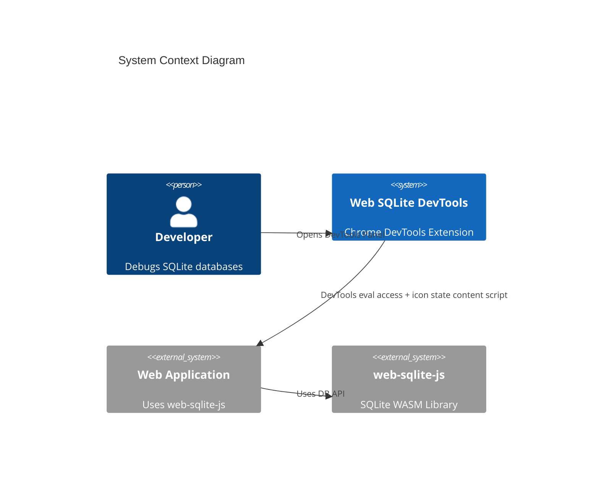
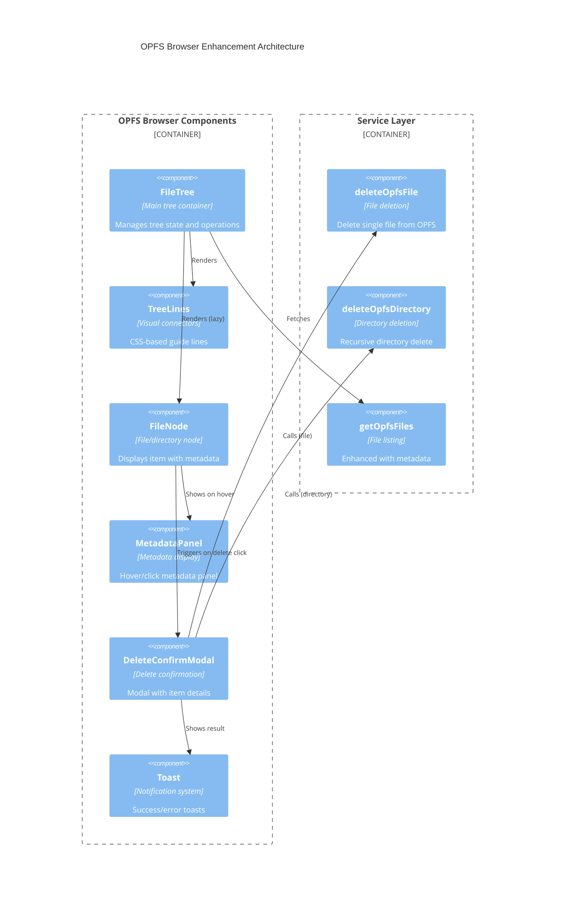
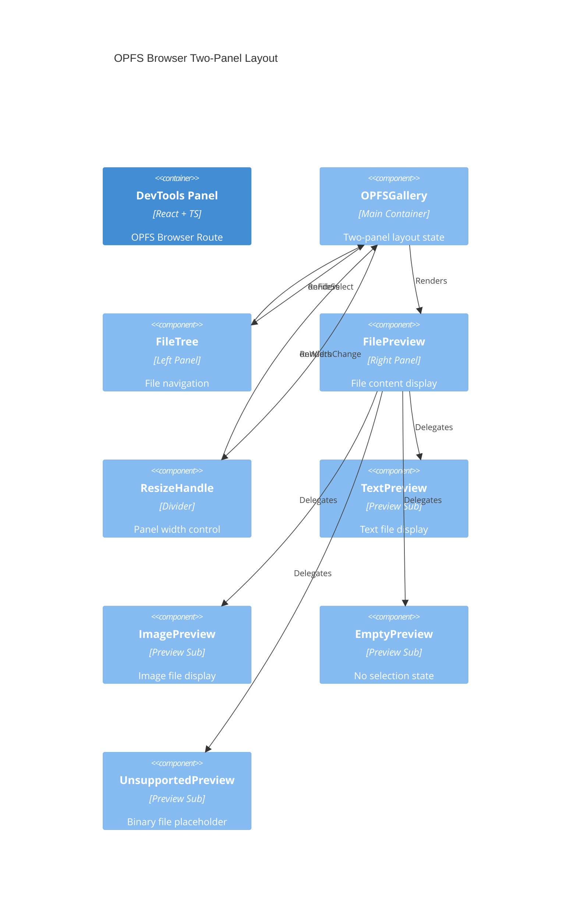
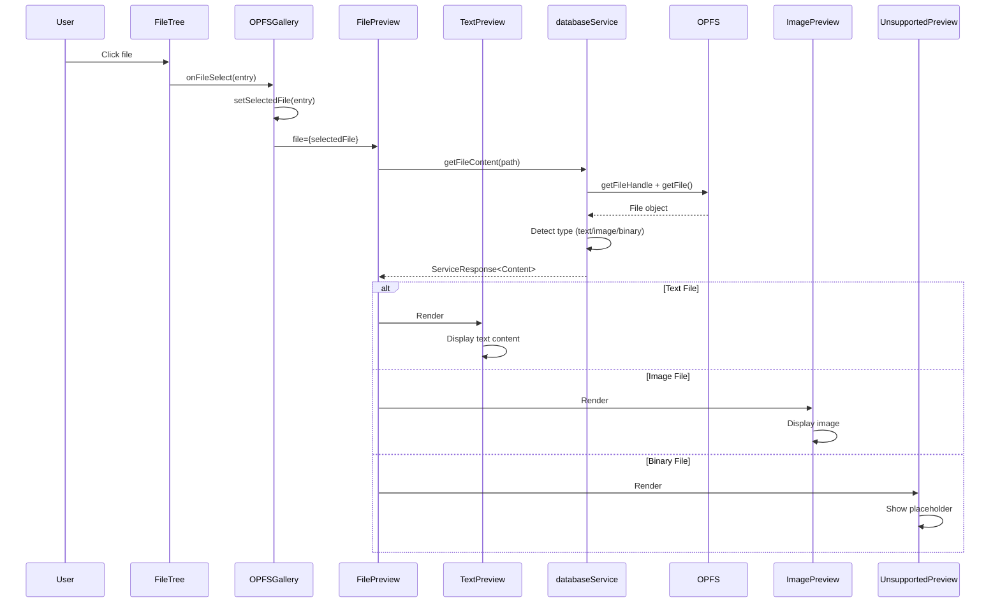
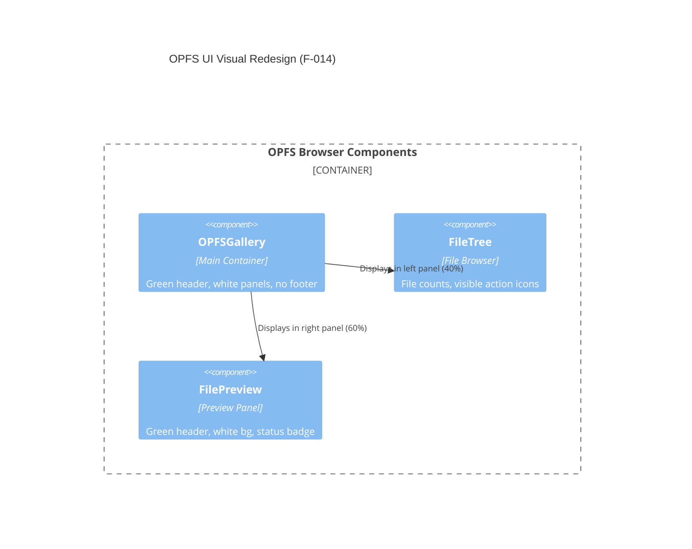

<!--
TEMPLATE MAP (reference-only)
.claude/templates/docs/03-architecture/01-hld.md

OUTPUT MAP (write to)
agent-docs/03-architecture/01-hld.md

NOTES
- Keep headings unchanged.
- Focus on STATIC STRUCTURE but include RATIONALE and STRATEGY.
-->

# 01 High-Level Design (HLD) — Structure

## 1) Architecture Style & Principles

- **Pattern**: **DevTools Inspected Window Access with Service Layer**
  - DevTools Panel → Service Layer (Business Logic) → Bridge Layer (Chrome API) → Page Context (`window.__web_sqlite`)
  - Content script retained only for icon state updates
- **Key Principles**:
  - **Separation of Concerns**: Three-layer architecture (Presentation → Service → Bridge)
  - **Context Isolation**: DevTools accesses the page via inspected window eval (chrome.scripting.executeScript)
  - **Minimal Messaging**: Runtime messaging only for icon state updates
  - **Hash-Based Routing**: Single-page application navigation via URL hash (react-router-dom)
  - **Real-Time Updates**: Polling/requests via eval (streaming TBD)
  - **Stateless Panel**: DevTools panel can be closed/reopened without losing page context

## 2) System Boundary (C4 Context)

- **Users**: Frontend developers, full-stack developers, QA engineers using Chrome DevTools
- **External Systems**: web-sqlite-js library (via `window.__web_sqlite` global namespace)



## 3) Containers & Tech Stack (C4 Container)

- **DevTools Panel**: React 18 + TypeScript + Tailwind CSS + react-router-dom
  - **Reason**: Leverages existing template, provides declarative UI and routing
- **Content Script**: TypeScript + Chrome Extension APIs
  - **Reason**: Monitors `window.__web_sqlite` for icon state updates
- **Background Service Worker**: TypeScript + Chrome Extension APIs
  - **Reason**: Manages extension lifecycle, icon state, and offscreen logging
- **Routing**: react-router-dom (HashRouter)
  - **Reason**: Hash-based routing required for DevTools panel URLs
- **SQL Editor**: CodeMirror 6
  - **Reason**: Full-featured code editor with SQL syntax highlighting
- **Icons**: react-icons
  - **Reason**: Comprehensive icon library, tree-shakeable
- **Syntax Highlighting**: react-syntax-highlighter (Prism.js)
  - **Reason**: Lightweight SQL syntax highlighting for DDL display


## 4) Data Architecture Strategy

- **Ownership**: DevTools panel accesses `window.__web_sqlite` via service layer; content script only tracks icon state
- **Caching**:
  - Table list: Cached in DevTools panel until database changes
  - Query results: Not cached (always fresh from database)
  - Log entries: Ring buffer (500 entries) in content script, streamed to panel
- **Consistency**: Strong consistency for queries (synchronous request/response); eventual for logs (streaming)
- **State Management**:
  - React useState for local component state
  - React Router location state for route-based state
  - No global state management library (avoid bundle size)

## 5) Cross-cutting Concerns (Implementation View)

### 5.1 Message Protocol

- **DevTools Data Access**: Uses service layer → bridge layer → `chrome.scripting.executeScript`
- **Runtime Messaging**: Only icon state updates and offscreen log storage
- **Error Handling**: Standard `{ success: boolean, data?: T, error?: string }` response format (ServiceResponse)

### 5.2 Reconnection Strategy

- **Heartbeat**: DevTools panel evaluates `window.__web_sqlite` every 5 seconds
- **Timeout**: DevTools panel shows error after 15 seconds without successful eval
- **Auto-Reconnect**: Panel attempts to reconnect on route change or user action
- **Page Refresh**: Panel detects refresh via failed eval and retries

### 5.3 Observability

- **Logs**: Internal extension logs to console.debug (DevTools only)
- **Error Tracking**: Error boundaries in React, log to console.error
- **Performance**: Measure panel open time, query execution time

### 5.4 Security

- **Permissions**: Minimal Chrome permissions (sidePanel, storage, offscreen, scripting)
- **Content Security Policy**: Strict CSP for extension pages
- **Eval Usage**: Only `chrome.scripting.executeScript` within DevTools (MAIN world)

## 6) Code Structure Strategy (High-Level File Tree)

**Repo Structure**: Monorepo (single Chrome extension)

```text
/ (root)
  /src
    /devtools           # DevTools Panel (React)
      /bridge           # Bridge Layer (Chrome API wrapper)
        inspectedWindow.ts    # chrome.scripting.executeScript wrapper
      /services         # Service Layer (Business Logic)
        databaseService.ts    # All database operations (12 functions)
      /components       # React components
        /Shared         # Shared components (F-006)
          ResizeHandle.tsx    # Reusable resize handle
        /Sidebar        # Sidebar navigation
        /OpenedDBList   # Database list view (F-008 NEW)
          OpenedDBList.tsx    # Main component
          DatabaseCard.tsx    # Individual database card
          EmptyDatabaseList.tsx # Empty state component
          LoadingSkeleton.tsx  # Loading state
          ErrorState.tsx       # Error state
        /DatabaseTabs    # Database tab navigation (F-002)
          DatabaseTabHeader.tsx # Tab header with 6 tabs
          DatabaseTabs.tsx     # Layout wrapper
        /TablesTab      # Table browser (F-005, F-006)
          TableList.tsx         # Table list sidebar
          OpenedTableTabs.tsx   # Opened tabs with close buttons (F-005 NEW)
          TableDetail.tsx       # Table detail with resizable schema (F-006 MODIFIED)
          TableContent.tsx      # Table content area
          TableSchema.tsx       # Schema panel (F-003, F-006)
          PaginationBar.tsx     # Pagination controls
        /QueryTab       # SQL editor
        /LogTab         # Log viewer (TASK-09, F-009)
          LogView.tsx          # Main log view component
          LogList.tsx          # Log list with ring buffer
          LogFilter.tsx        # Log filtering controls
        /MigrationTab   # Migration playground
        /SeedTab        # Seed playground
        /AboutTab       # Database info
        /OPFSBrowser    # OPFS file tree
          FileTree.tsx         # File tree with guided lines (F-012 MODIFIED)
          FileNode.tsx         # File/directory node (F-012 MODIFIED)
          DeleteConfirmModal.tsx # Delete confirmation (F-012 NEW)
          MetadataPanel.tsx    # Metadata display (F-012 NEW)
          TreeLines.tsx        # Guide line connectors (F-012 NEW)
          Toast.tsx            # Toast notifications (F-012 NEW)
      /hooks            # Custom React hooks
      /utils            # Utilities
      inspectedWindow.ts # Public API re-exports
      DevTools.tsx      # Main DevTools component
      index.tsx         # Entry point
    /contentScript      # Content Script (Icon State)
      App.tsx           # Icon state updater
      index.tsx         # Entry point
    /background         # Background Service Worker
      /iconState        # Icon activation logic
      index.ts          # Entry point
    /messaging          # Offscreen log channels
      channels.ts       # Offscreen log channels
      core.ts           # Channel core
    /shared             # Shared constants
      messages.ts       # Runtime message IDs
    /components         # Shared React components
      /CodeMirrorEditor # Reusable SQL editor
      /DataTable        # Reusable table display
    /types              # TypeScript type definitions
    /utils              # Shared utilities
  /public
    /icons              # Extension icons (active/inactive states)
  agent-docs            # Architecture documentation
```

**Module Pattern**: Three-layer architecture (Presentation → Service → Bridge)

```text
/src/devtools
  /components          # Presentation Layer (React components)
  /hooks               # Custom hooks (useConnection, useInspectedWindowRequest)
  /services            # Service Layer (Business Logic)
    databaseService.ts # Domain logic for all DB operations
  /bridge              # Bridge Layer (Chrome API)
    inspectedWindow.ts # Low-level executeScript wrapper
  inspectedWindow.ts   # Public API layer (re-exports)
/src/contentScript
  App.tsx              # Icon state monitor
/src/background
  /iconState           # Icon State Management
/src/shared
  messages.ts          # Runtime message IDs
```

**Service Layer Functions** (all in `databaseService.ts`):

1. **Database Discovery**: `getDatabases()` - List all open databases
2. **Table Metadata**: `getTableList(dbname)` - List tables in a database
3. **Schema Inspection**: `getTableSchema(dbname, tableName)` - Get table structure (PRAGMA table_info)
4. **Query Execution**: `queryTableData(dbname, sql, limit, offset)` - Execute SELECT with pagination
5. **SQL Execution**: `execSQL(dbname, sql, params?)` - Execute any SQL with optional params
6. **Log Streaming**: `subscribeLogs(dbname)` / `unsubscribeLogs(subscriptionId)` - Real-time log monitoring
7. **Migration Testing**: `devRelease(dbname, version, migrationSQL?, seedSQL?)` - Test migrations
8. **Version Control**: `devRollback(dbname, toVersion)` - Rollback to previous version
9. **Version Query**: `getDbVersion(dbname)` - Get current database version
10. **OPFS Access**: `getOpfsFiles(path?, dbname?)` / `downloadOpfsFile(path)` - File system operations
11. **OPFS Delete**: `deleteOpfsFile(path)` - Delete file from OPFS (F-012 NEW)
12. **OPFS Delete**: `deleteOpfsDirectory(path)` - Delete directory recursively (F-012 NEW)

## 7) Component Hierarchy (DevTools Panel)

```text
DevTools (Root)
├── HashRouter
│   ├── Sidebar (Navigation)
│   │   ├── SidebarHeader (App branding)
│   │   ├── DatabaseList (Opened DB menu) - Links to /openedDB (F-008 UPDATED)
│   │   ├── OPFSLink (OPFS browser link)
│   │   └── CollapseToggle (Sidebar collapse)
│   └── MainContent
│       ├── EmptyState (No route selected - at root /)
│       ├── OpenedDBList (F-008 NEW - /openedDB route)
│       │   ├── Header
│       │   │   ├── Title: "Opened Databases"
│       │   │   └── Refresh Button (IoMdRefresh icon)
│       │   ├── Database List
│       │   │   └── DatabaseCard (clickable → /openedDB/:dbname/tables)
│       │   │       ├── FaDatabase icon
│       │   │       ├── Database name (primary text, bold)
│       │   │       └── Table count (secondary text, gray)
│       │   └── EmptyDatabaseList (when no databases)
│       │       ├── SiSqlite icon
│       │       ├── Title: "No Opened Databases"
│       │       ├── Message: "Could not detect any opened databases."
│       │       ├── Instructions: "Open a page that uses web-sqlite-js..."
│       │       └── Refresh Button (IoMdRefresh)
│       ├── DatabaseTabs (/openedDB/:dbname) → redirects to /openedDB/:dbname/tables
│       │   ├── DatabaseTabHeader (6 tabs: Tables, Query, Log, Migration, Seed, About) (F-009 UPDATED)
│       │   │   ├── Tables tab (CiViewTable icon)
│       │   │   ├── Query tab (BsFiletypeSql icon)
│       │   │   ├── Log tab (IoTimeOutline icon) (F-009 NEW)
│       │   │   ├── Migration tab (MdOutlineQueryBuilder icon)
│       │   │   ├── Seed tab (FaSeedling icon)
│       │   │   └── About tab (FaInfoCircle icon)
│       │   └── Outlet (Nested Routes)
│       │       ├── TablesTab (/openedDB/:dbname/tables)
│       │       │   ├── TableListSidebar (Resizable: 200-600px, default 300px)
│       │       │   │   ├── ResizeHandle (right edge)
│       │       │   │   └── Table list items (onClick: handleOpenTable)
│       │       │   ├── OpenedTableTabs (F-005: State-managed opened tabs)
│       │       │   │   ├── TabButton (opened tables only)
│       │       │   │   │   ├── Table name (truncate)
│       │       │   │   │   └── Close button (IoMdClose, group-hover)
│       │       │   │   └── Empty state
│       │       │   └── TableContentArea (flex-1, auto-adjusts)
│       │       │       └── TableDetail (/openedDB/:dbname/tables/:tableName)
│       │       │           ├── TableDataPanel (Left: data + pagination) - Full width when schema hidden
│       │       │           └── SchemaPanel (Right: toggleable, resizable, tabbed view)
│       │       │               ├── ResizeHandle (F-006: left edge)
│       │       │               ├── SchemaPanelHeader (Toggle button + Table/DDL tabs)
│       │       │               ├── SchemaTableView (Column info table)
│       │       │               └── SchemaDDLView (SQL with syntax highlight + copy button)
│       │       └── EmptyState (No table selected)
│       ├── QueryTab (/openedDB/:dbname/query)
│       │   ├── CodeMirrorEditor
│       │   ├── QueryResults
│       │   └── ExportButton
│       ├── LogView (/openedDB/:dbname/logs) (F-009 UPDATED - moved from separate route)
│       │   ├── LogFilter
│       │   └── LogList (500 entry ring buffer)
│       ├── MigrationTab (/openedDB/:dbname/migration)
│       │   ├── HelperNotice
│       │   ├── CodeMirrorEditor
│       │   └── TestControls (Release/Rollback)
│       ├── SeedTab (/openedDB/:dbname/seed)
│       │   ├── HelperNotice
│       │   ├── CodeMirrorEditor
│       │   └── TestControls (Release/Rollback)
│       └── AboutTab (/openedDB/:dbname/about)
│           └── DatabaseMetadata
│       └── OPFSView (/opfs)
│           └── FileTree
│               ├── TreeLines (F-012 NEW - guided connectors)
│               ├── FileNode (Lazy-loaded)
│               │   ├── MetadataPanel (F-012 NEW - hover display)
│               │   ├── Delete Button (F-012 NEW - with confirmation)
│               │   └── Download Button
│               └── DeleteConfirmModal (F-012 NEW)
│               └── Toast (F-012 NEW - success/error notifications)
```

## 8) Service Layer Architecture (Feature F-001)

**Purpose**: Centralize all database business logic in a single service layer, eliminating direct inspectedWindow access from components.

**Three-Layer Pattern**:

```
┌─────────────────────────────────────────────────────────────┐
│  Presentation Layer (Components)                            │
│  - React UI components                                      │
│  - No Chrome API or business logic                          │
│  - Imports: databaseService                                 │
└─────────────────────────────────────────────────────────────┘
                            ↓
┌─────────────────────────────────────────────────────────────┐
│  Service Layer (Business Logic)                             │
│  - databaseService.ts                                       │
│  - Domain operations: queries, migrations, logs, OPFS       │
│  - Uses ServiceResponse<T> envelope                         │
│  - Imports: inspectedWindowBridge                           │
└─────────────────────────────────────────────────────────────┘
                            ↓
┌─────────────────────────────────────────────────────────────┐
│  Bridge Layer (Chrome API)                                  │
│  - inspectedWindow.ts                                       │
│  - Low-level chrome.scripting.executeScript wrapper         │
│  - No business logic                                        │
└─────────────────────────────────────────────────────────────┘
                            ↓
┌─────────────────────────────────────────────────────────────┐
│  Page Context (window.__web_sqlite)                         │
│  - Main world execution context                             │
└─────────────────────────────────────────────────────────────┘
```

**Service Function Categories**:

1. **Discovery** (2 functions):
   - `getDatabases()` - List all databases
   - `getTableList(dbname)` - List all tables

2. **Schema & Data** (3 functions):
   - `getTableSchema(dbname, tableName)` - PRAGMA table_info
   - `queryTableData(dbname, sql, limit, offset)` - Paginated SELECT
   - `execSQL(dbname, sql, params?)` - Generic SQL executor

3. **Logging** (2 functions):
   - `subscribeLogs(dbname)` - Start log streaming
   - `unsubscribeLogs(subscriptionId)` - Stop log streaming

4. **Migration & Versioning** (3 functions):
   - `devRelease(dbname, version, migrationSQL?, seedSQL?)` - Test release
   - `devRollback(dbname, toVersion)` - Rollback version
   - `getDbVersion(dbname)` - Query current version

5. **OPFS** (4 functions):
   - `getOpfsFiles(path?, dbname?)` - List OPFS files
   - `downloadOpfsFile(path)` - Download file
   - `deleteOpfsFile(path)` - Delete file (F-012 NEW)
   - `deleteOpfsDirectory(path)` - Delete directory recursively (F-012 NEW)

**Benefits**:

- **Testability**: Service functions can be unit tested without Chrome APIs
- **Reusability**: Single source of truth for database operations
- **Maintainability**: Business logic isolated from Chrome API concerns
- **Type Safety**: Strong typing via ServiceResponse<T> envelope

## 9) Schema Panel Architecture (Feature F-003)

**Purpose**: Enhance the schema panel with toggle visibility and tabbed view for better UX.

**State Management**:

```
┌─────────────────────────────────────────────────────────────┐
│  TableDetail Component (State Owner)                        │
│  ├── schemaPanelVisible: boolean (default: false)          │
│  ├── schemaTab: 'table' | 'ddl' (default: 'table')         │
│  └── Handler Functions:                                     │
│      ├── handleToggleSchema()                               │
│      └── handleSchemaTabChange('table' | 'ddl')            │
└─────────────────────────────────────────────────────────────┘
                            ↓
┌─────────────────────────────────────────────────────────────┐
│  SchemaPanel Component (Controlled Props)                   │
│  ├── visible: boolean (from parent)                         │
│  ├── activeTab: 'table' | 'ddl' (from parent)              │
│  ├── onToggle(): () => void                                 │
│  └── onTabChange(tab): () => void                           │
└─────────────────────────────────────────────────────────────┘
```

**Responsive Layout Behavior**:

```
Visible State (schemaPanelVisible = true):
┌────────────────────────┬──────────────────┐
│ TableDataPanel         │ SchemaPanel      │
│ width: flex-1          │ width: w-80      │
│ (320px)                │                  │
└────────────────────────┴──────────────────┘

Hidden State (schemaPanelVisible = false):
┌───────────────────────────────────────────┐
│ TableDataPanel                             │
│ width: 100% (full width)                  │
└───────────────────────────────────────────┘
```

**Tab Switching Architecture**:

```
SchemaPanel Header:
┌────────────────────────────────────────────┐
│ [Toggle Icon]  [Table Icon] [DDL Text]   │
│                  ↓           ↓            │
│           Active Tab   Inactive Tab       │
│           (emerald-50)  (gray-500)        │
└────────────────────────────────────────────┘
                    ↓
┌────────────────────────────────────────────┐
│ Content Area (Conditional Render)          │
│                                            │
│ if (activeTab === 'table'):               │
│   <SchemaTableView />                      │
│     - Column info table                    │
│     - Type, constraints badges             │
│                                            │
│ if (activeTab === 'ddl'):                 │
│   <SchemaDDLView />                        │
│     - Dark code block (bg-gray-900)        │
│     - Green text (text-green-400)          │
│     - CREATE TABLE statement               │
└────────────────────────────────────────────┘
```

**CSS Transition Strategy**:

- **Panel Width**: `transition-all duration-200 ease-in-out`
- **Visible**: `w-80 opacity-100`
- **Hidden**: `w-0 opacity-0 overflow-hidden`
- **Table Panel**: `transition-all duration-200` (flex-1 ↔ w-full)

**Icon Integration**:

- **Toggle**: `BsReverseLayoutSidebarInsetReverse` (react-icons/bs)
- **Table Tab**: `ImTable2` (react-icons/im)
- **DDL Tab**: Pure text "DDL"

**Theme Colors** (from `src/devtools/index.css`):

- **Primary**: `#059669` (emerald-600)
- **Primary Light**: `#ecfdf5` (emerald-50)
- **Active Tab**: `bg-emerald-50 text-emerald-600 border-emerald-200`
- **Inactive Tab**: `text-gray-500 hover:text-gray-700 border-gray-200`

## 10) DDL Syntax Highlight & Copy Architecture (Feature F-004)

**Purpose**: Enhance DDL view with SQL syntax highlighting and one-click copy functionality.

**Technology Stack**:

- **Syntax Highlighting**: `react-syntax-highlighter` with Prism.js engine
  - Package: `react-syntax-highlighter` (~18.8KB minified)
  - Language: SQL
  - Theme: `prism` (light theme)
  - Bundle impact: < 50KB total increase
- **Icons**: React Icons
  - Copy: `react-icons/md` → `MdOutlineContentCopy`
  - Success: `react-icons/fa` → `FaCheck`
- **Clipboard API**: `navigator.clipboard.writeText()`
  - Browser support: Chrome 66+, Edge 79+, Firefox 63+
  - Graceful degradation: Inline error if unavailable

**Component State Management**:

```
┌─────────────────────────────────────────────────────────────┐
│  SchemaDDLView Component (State Owner)                      │
│  ├── copied: boolean (default: false)                       │
│  ├── error: string | null (default: null)                  │
│  └── Handler Functions:                                     │
│      ├── handleCopy() - Async clipboard write               │
│      └── handleClick() - Reset copied state on next click   │
└─────────────────────────────────────────────────────────────┘
```

**Copy Button State Machine**:

```
┌─────────────┐     Click (not copied)     ┌─────────────┐
│   Initial   │ ──────────────────────────> │  Copying    │
│  (Copy Icon)│                            │  (API Call)  │
└─────────────┘                            └─────────────┘
       │                                          │
       │                                          │ Success
       │                                          ↓
       │                                   ┌─────────────┐
       │                                   │   Copied    │
       │                                   │ (Checkmark) │
       │                                   └─────────────┘
       │                                          │
       │                                  Click again (reset)
       │                                          │
       └──────────────────────────────────────────┘
                    (back to Initial)

Error Path: Copying → Error State (Inline error, copy icon)
```

**DDL View Layout** (Enhanced):

```
┌──────────────────────────────────────────────────────┐
│ SchemaDDLView Component                              │
│ ┌────────────────────────────────────────────────┐  │
│ │ Header Row (flex justify-between)              │  │
│ │ ┌────────────┐  ┌──────────────────────────┐  │  │
│ │ │ Spacer (   │  │ Copy Button (right top)  │  │  │
│ │ │ flex-1)    │  │ [MdOutlineContentCopy]   │  │  │
│ │ └────────────┘  └──────────────────────────┘  │  │
│ ├────────────────────────────────────────────────┤  │
│ │ Error Container (if error exists)               │  │
│ │ "Failed to copy" (text-red-600 text-right)      │  │
│ ├────────────────────────────────────────────────┤  │
│ │ Syntax Highlighter (Prism.js)                   │  │
│ │ CREATE TABLE users (                            │  │
│ │   id INTEGER PRIMARY KEY,   ← keywords (blue)  │  │
│ │   name TEXT NOT NULL       ← types (purple)   │  │
│ │ );                        ← formatted output  │  │
│ └────────────────────────────────────────────────┘  │
└──────────────────────────────────────────────────────┘
```

**State Persistence & Reset Behavior**:

- **Success**: Icon changes to green `FaCheck`, persists indefinitely
- **Reset**: Next click resets to copy icon and triggers copy again
- **Error**: Shows inline error, icon remains as copy icon
- **User Intent**: Checkmark confirms action completed, reset on next interaction allows re-copy

**Clipboard API Error Handling**:

```typescript
try {
  await navigator.clipboard.writeText(ddl);
  setCopied(true);
  setError(null);
} catch (err) {
  setError("Failed to copy");
  setCopied(false);
}
```

**CSS Styling Strategy**:

```css
/* Copy Button */
.p-1.text-gray-600.hover\:text-gray-800.transition-colors

/* Success State */
.text-green-600 (FaCheck icon)

/* Error State */
.text-red-600.text-xs.mb-2.text-right (inline error)

/* Syntax Highlighter */
.customStyle: {
  background: '#f9fafb',    /* gray-50 (light theme) */
  padding: '12px',
  borderRadius: '6px',
  fontSize: '12px',         /* text-xs (12px) */
}
```

**Accessibility Considerations**:

- **ARIA Labels**: Copy button has `title` attribute for screen readers
- **Keyboard Navigation**: Button is focusable (Tab key), activates on Enter/Space
- **Color Contrast**: Green checkmark (`#16a34a`) meets WCAG AA standards
- **Error Visibility**: Inline error positioned near action, not in alert

**Performance Optimizations**:

- **Lazy Import**: Syntax highlighter only loads when DDL tab is active
- **Code Splitting**: `react-syntax-highlighter` can be tree-shaken to SQL language only
- **Debounce**: None needed (click event is user-triggered, not continuous)
- **Bundle Impact**: ~18.8KB for Prism.js variant, < 50KB total increase

**Updated Component Hierarchy** (DDL View):

```
SchemaPanel
├── SchemaPanelHeader
│   ├── Table Tab Button (ImTable2)
│   └── DDL Tab Button (Text "DDL")
└── Content Area
    ├── SchemaTableView (Column info)
    └── SchemaDDLView (Enhanced)
        ├── Header Row
        │   ├── Spacer (flex-1)
        │   └── Copy Button
        │       ├── MdOutlineContentCopy (default)
        │       └── FaCheck (success, green)
        ├── Error Container (conditional)
        │   └── Error Message (text-red-600)
        └── SyntaxHighlighter
            ├── Language: SQL
            ├── Style: prism (light theme)
            └── Custom Style (gray-50 bg, 12px font)
```

## 11) Opened Table Tabs Management Architecture (Feature F-005)

**Purpose**: Replace "all tables" tab bar with state-managed opened tabs, enabling users to control which tables are visible in the header.

**Problem Solved**:

- **Current Issue**: Header bar shows ALL tables from database, duplicating sidebar functionality
- **Solution**: Header bar shows only opened tables (state-managed), with close buttons and auto-switch

**State Management Architecture**:

```
┌─────────────────────────────────────────────────────────────┐
│  TableDetail Component (State Owner)                        │
│  ├── openedTabs: TableTab[] (default: [])                  │
│  ├── activeTab: TableTab | null (default: null)            │
│  └── Handler Functions:                                     │
│      ├── handleAutoOpenFirstTable() - On mount/db change    │
│      ├── handleOpenTable(tableName) - Add to opened tabs   │
│      ├── handleCloseTab(tab) - Remove and auto-switch      │
│      └── handleSelectTab(tab) - Set as active              │
└─────────────────────────────────────────────────────────────┘
                            ↓
┌─────────────────────────────────────────────────────────────┐
│  OpenedTableTabs Component (Controlled Props)               │
│  ├── tabs: TableTab[] (from parent)                        │
│  ├── activeTab: TableTab | null (from parent)             │
│  ├── onSelectTab(tab): () => void                          │
│  └── onCloseTab(tab): () => void                           │
└─────────────────────────────────────────────────────────────┘
```

**Tab State Flow**:

```
┌──────────────────┐
│  Mount Database  │
└────────┬─────────┘
         │
         ▼
┌──────────────────┐
│ Auto-open First  │ → openedTabs = [firstTable]
│      Table       │ → activeTab = firstTable
└────────┬─────────┘
         │
         ▼
┌──────────────────┐
│  User Clicks     │ → If not in openedTabs, append
│  Sidebar Table   │ → Set as activeTab
└────────┬─────────┘
         │
         ▼
┌──────────────────┐
│  User Clicks     │ → Remove from openedTabs
│  Close Button    │ → Auto-switch to next tab
└──────────────────┘
```

**Component Hierarchy** (Updated):

```
TablesTab (/openedDB/:dbname/tables)
├── TableListSidebar (Resizable width: 200-600px, default 300px)
│   └── Table list items (onClick: handleOpenTable)
├── OpenedTableTabs (NEW COMPONENT)
│   ├── TabButton (opened tables only)
│   │   ├── Table name (truncate, max-w-150px)
│   │   ├── Close button (IoMdClose, group-hover opacity)
│   │   └── Click stops propagation
│   └── Empty state ("No tables open...")
└── TableContentArea (flex-1, adjusts automatically)
    └── TableDetail (/openedDB/:dbname/tables/:tableName)
        └── Table data + Schema panel
```

**Auto-Open First Table Logic**:

```typescript
useEffect(() => {
  if (tables.length > 0 && openedTabs.length === 0) {
    const firstTab = { dbname, tableName: tables[0] };
    setOpenedTabs([firstTab]);
    setActiveTab(firstTab);
    navigate(`/openedDB/${rawDbname}/tables/${tables[0]}`);
  }
}, [tables, dbname, openedTabs.length]);
```

**Close Tab Auto-Switch Logic**:

```typescript
const handleCloseTab = (tabToClose: TableTab) => {
  setOpenedTabs((prev) => {
    const filtered = prev.filter((t) => !isSameTab(t, tabToClose));

    if (filtered.length > 0) {
      // Try to select the tab after the closed one
      const closedIndex = prev.findIndex((t) => isSameTab(t, tabToClose));
      const nextTab = filtered[closedIndex] || filtered[filtered.length - 1];
      setActiveTab(nextTab);
      navigate(`/openedDB/${rawDbname}/tables/${nextTab.tableName}`);
    } else {
      setActiveTab(null);
      navigate(`/openedDB/${rawDbname}/tables`);
    }

    return filtered;
  });
};
```

**Close Button Behavior**:

```
┌─────────────────────────────────────────────┐
│ [users] [orders] [categories]               │
│   ↑                                          │
│   └─ group (hover triggers close button)    │
│                                              │
│ Default: Close button hidden (opacity-0)     │
│ Hover: Close button visible (opacity-100)    │
│                                              │
│ Close button:                                │
│ - Icon: IoMdClose (react-icons/io)          │
│ - Size: 14px                                │
│ - Rounded: full (circle background)         │
│ - Hover: bg-blue-700 (active tab)           │
│          bg-gray-300 (inactive tab)         │
└─────────────────────────────────────────────┘
```

**Empty State Handling**:

```tsx
if (openedTabs.length === 0) {
  return (
    <div className="flex items-center justify-center flex-1 px-4 py-2 text-sm text-gray-500">
      No tables open. Select a table from the sidebar.
    </div>
  );
}
```

**Icon Integration**:

- **Close**: `IoMdClose` (react-icons/io) - Close button on each tab

**Theme Colors**:

- **Active Tab**: `bg-blue-600 text-white`
- **Inactive Tab**: `bg-gray-100 text-gray-700 hover:bg-gray-200`
- **Close Button (Active)**: `hover:bg-blue-700`
- **Close Button (Inactive)**: `hover:bg-gray-300`

## 12) Resizable Vertical Dividers Architecture (Feature F-006)

**Purpose**: Add draggable resize handles to all vertical pane dividers, enabling users to customize panel widths.

**Problem Solved**:

- **Current Issue**: Fixed panel widths (sidebar 25%, schema 320px) cannot be adjusted
- **Solution**: Draggable resize handles with min/max constraints and cursor feedback

**Resize Handle Architecture**:

```
┌─────────────────────────────────────────────────────────────┐
│  ResizeHandle Component (Reusable)                           │
│  ├── position: 'left' | 'right'                            │
│  ├── onDrag: (deltaX: number) => void                      │
│  ├── minWidth: number (default: 150)                       │
│  ├── maxWidth: number (default: 800)                       │
│  ├── currentWidth: number                                   │
│  └── State:                                                 │
│      ├── isDragging: boolean                               │
│      ├── dragStartX: number                                │
│      └── Event handlers (mousedown, mousemove, mouseup)    │
└─────────────────────────────────────────────────────────────┘
                            ↓
┌─────────────────────────────────────────────────────────────┐
│  Parent Component (TablesTab, TableDetail)                  │
│  ├── panelWidth state (pixels)                              │
│  ├── handleResize callback                                  │
│  └── Inline style for width                                 │
└─────────────────────────────────────────────────────────────┘
```

**Resizable Panels**:

```
TablesTab Layout:
┌────┬──────────────────────────────────────────────────┐
│    │                                                  │
 │    │                                                  │
 │    │                                                  │
 │ ───┘ ← ResizeHandle (right edge of sidebar)          │
 │    ├──────────────────────────────────────────────────┤
 │    │ TableContentArea (flex-1, auto-adjusts)         │
 └────┴──────────────────────────────────────────────────┘
      │
      └─ Sidebar (width: 200-600px, default: 300px)

TableDetail Layout:
┌──────────────────────────────────────────┬────┐
│ TableDataPanel (flex-1)                  │    │
│                                            │    │
│                                            │ ───┤ ← ResizeHandle (left edge)
├────────────────────────────────────────────┤    │
│ SchemaPanel (width: 250-600px, default 320px) │
└────────────────────────────────────────────┴────┘
```

**State Management** (TablesTab):

```typescript
const [sidebarWidth, setSidebarWidth] = useState(300);

const handleSidebarResize = useCallback((deltaX: number) => {
  setSidebarWidth(prev => {
    const newWidth = prev + deltaX;
    return Math.max(200, Math.min(600, newWidth));
  });
}, []);

// Apply to sidebar
<aside
  className="border-r border-gray-200 bg-white flex flex-col relative"
  style={{ width: `${sidebarWidth}px`, minWidth: `${sidebarWidth}px` }}
>
  {/* Content */}
  <ResizeHandle
    position="right"
    onDrag={handleSidebarResize}
    currentWidth={sidebarWidth}
    minWidth={200}
    maxWidth={600}
  />
</aside>
```

**State Management** (TableDetail):

```typescript
const [schemaPanelWidth, setSchemaPanelWidth] = useState(320);

const handleSchemaResize = useCallback((deltaX: number) => {
  setSchemaPanelWidth(prev => {
    const newWidth = prev - deltaX; // Subtract because dragging left expands
    return Math.max(250, Math.min(600, newWidth));
  });
}, []);

// Apply to schema panel
<div
  className="relative"
  style={{ width: `${schemaPanelWidth}px` }}
>
  <ResizeHandle
    position="left"
    onDrag={handleSchemaResize}
    currentWidth={schemaPanelWidth}
    minWidth={250}
    maxWidth={600}
  />
  <SchemaPanel />
</div>
```

**Resize Handle Event Flow**:

```
┌──────────────────┐
│  Mouse Down      │ → isDragging = true
│  on Handle       │ → dragStartX = e.clientX
└────────┬─────────┘
         │
         ▼
┌──────────────────┐
│  Mouse Move      │ → deltaX = e.clientX - dragStartX
│  (document)      │ → Enforce min/max constraints
└────────┬─────────┘ → Call onDrag(deltaX)
         │
         ▼
┌──────────────────┐
│  Mouse Up        │ → isDragging = false
│  (document)      │ → Cleanup event listeners
└──────────────────┘
```

**Cursor Change Strategy**:

```css
/* Resize handle base */
.resize-handle {
  cursor: col-resize;
}

/* Hover state */
.resize-handle:hover {
  background: #bfdbfe; /* blue-200 */
  width: 8px; /* Expand from 4px */
}
```

**Visual Feedback**:

```
Default State:
┌────────┐
│        │ 4px transparent, cursor: col-resize
└────────┘

Hover State:
┌────────┐
│        │ 8px blue-200, cursor: col-resize
└────────┘

Dragging State:
┌────────┐
│        │ 8px blue-300, cursor: col-resize
└────────┘
```

**Component Hierarchy** (Updated):

```
Shared Components (NEW)
└── ResizeHandle.tsx (Reusable)
    ├── Props: position, onDrag, minWidth, maxWidth, currentWidth
    └── Handles: mousedown, mousemove, mouseup

TablesTab (MODIFIED)
├── sidebarWidth state (300px default)
├── handleSidebarResize callback
├── TableListSidebar (resizable)
│   └── ResizeHandle (position: right)
└── TableContentArea (auto-adjusts)

TableDetail (MODIFIED)
├── schemaPanelWidth state (320px default)
├── handleSchemaResize callback
├── TableDataPanel (auto-adjusts)
└── SchemaPanel (resizable)
    └── ResizeHandle (position: left)
```

**Min/Max Constraints**:

| Panel                    | Min Width | Max Width | Default |
| ------------------------ | --------- | --------- | ------- |
| TablesTab Sidebar        | 200px     | 600px     | 300px   |
| TableDetail Schema Panel | 250px     | 600px     | 320px   |

**Accessibility**:

- **ARIA Role**: `role="separator"`
- **ARIA Orientation**: `aria-orientation="vertical"`
- **ARIA Label**: `aria-label="Resize panel"`
- **Focus**: Handle is focusable (keyboard resize optional, future enhancement)

**Performance Optimizations**:

- **Direct Updates**: No debouncing (drag is user-controlled)
- **Event Cleanup**: Document event listeners removed on unmount
- **React.memo**: TabButton component memoized to prevent re-renders

**CSS Styling Strategy**:

```css
/* Resize handle positioning */
.resize-handle-left {
  position: absolute;
  left: -8px; /* Negative margin for offset */
  top: 0;
  bottom: 0;
  width: 4px;
  cursor: col-resize;
}

.resize-handle-right {
  position: absolute;
  right: -8px;
  top: 0;
  bottom: 0;
  width: 4px;
  cursor: col-resize;
}

/* Hover state */
.resize-handle:hover {
  width: 8px;
  background: #bfdbfe; /* blue-200 */
}

/* Dragging state */
.resize-handle.dragging {
  width: 8px;
  background: #93c5fd; /* blue-300 */
}
```

## 13) Opened Database List Route Architecture (Feature F-008)

**Purpose**: Add a generic `/openedDB` route to display a list of all opened databases, enabling centralized database navigation.

**Problem Solved**:

- **Current Issue**: No generic `/openedDB` route exists; sidebar "Opened DB" link navigates to `/` instead of a database list view
- **Solution**: New `/openedDB` route with OpenedDBList component showing all databases as clickable cards

**Route Structure** (Updated):

```
Before:
/ → EmptyState (welcome screen)
/openedDB/:dbname → DatabaseTabs (specific database)

After:
/ → EmptyState (welcome screen)
/openedDB → OpenedDBList (NEW - list of all opened databases)
/openedDB/:dbname → DatabaseTabs (specific database)
```

**Navigation Flow**:

```
┌──────────────────┐
│  User clicks     │
│  "Opened DB"     │
│  in sidebar      │
└────────┬─────────┘
         │
         ▼
┌──────────────────┐
│  Navigate to     │ → Route: /openedDB
│  /openedDB       │ → Component: OpenedDBList
└────────┬─────────┘
         │
         ▼
┌──────────────────┐
│  Fetch databases │ → databaseService.getDatabases()
│  via service     │ → Show loading skeleton
└────────┬─────────┘
         │
         ▼
┌──────────────────┐     ┌──────────────────┐     ┌──────────────────┐
│  Databases       │     │  No databases    │     │  Error loading   │
│  found           │     │  found           │     │  databases       │
│  (array)         │     │  (empty)         │     │  (error)         │
└────────┬─────────┘     └────────┬─────────┘     └────────┬─────────┘
         │                       │                       │
         ▼                       ▼                       ▼
┌──────────────────┐     ┌──────────────────┐     ┌──────────────────┐
│  Display list    │     │  EmptyDatabase-  │     │  ErrorState with │
│  of DatabaseCard │     │  List component  │     │  retry button    │
│  components      │     │  (SiSqlite icon, │     │                  │
│                  │     │  refresh button)│     │                  │
└────────┬─────────┘     └──────────────────┘     └──────────────────┘
         │
         ▼
┌──────────────────┐
│  User clicks     │
│  database card   │
└────────┬─────────┘
         │
         ▼
┌──────────────────┐
│  Navigate to     │ → /openedDB/:dbname/tables
│  database tables │ → Opens TablesTab
└──────────────────┘
```

**Component Architecture**:

```
┌─────────────────────────────────────────────────────────────┐
│  OpenedDBList Component (State Owner)                       │
│  ├── Data Fetching:                                         │
│  │   ├── useInspectedWindowRequest(() =>                   │
│  │   │   databaseService.getDatabases())                   │
│  │   ├── data: DatabaseSummary[] | null                    │
│  │   ├── isLoading: boolean                                │
│  │   ├── error: string | null                              │
│  │   └── reload: () => void                                │
│  └── Render States:                                         │
│      ├── isLoading → <LoadingSkeleton />                   │
│      ├── error → <ErrorState error={error} retry={reload} />│
│      ├── data.length === 0 → <EmptyDatabaseList refresh={reload} />│
│      └── data.length > 0 → <DatabaseList databases={data} reload={reload} />│
└─────────────────────────────────────────────────────────────┘
                            ↓
┌─────────────────────────────────────────────────────────────┐
│  DatabaseCard Component (Clickable Navigation)              │
│  ├── Props:                                                 │
│  │   ├── database: DatabaseSummary                         │
│  │   └── isActive?: boolean                                │
│  ├── Visual Elements:                                       │
│  │   ├── FaDatabase icon (react-icons/fa)                  │
│  │   ├── Database name (bold, primary text)                │
│  │   └── Table count (gray-500, secondary text)            │
│  └── Interaction:                                           │
│      └── onClick → navigate('/openedDB/:dbname/tables')    │
└─────────────────────────────────────────────────────────────┘
                            ↓
┌─────────────────────────────────────────────────────────────┐
│  EmptyDatabaseList Component (Empty State)                  │
│  ├── Props:                                                 │
│  │   └── refresh: () => void                               │
│  ├── Visual Elements:                                       │
│  │   ├── SiSqlite icon (text-primary-600, text-6xl)        │
│  │   ├── Title: "No Opened Databases"                      │
│  │   ├── Message: "Could not detect any opened databases." │
│  │   ├── Instructions: "Open a page that uses web-sqlite-js..."│
│  │   └── Refresh Button (IoMdRefresh icon)                 │
│  └── Interaction:                                           │
│      └── onClick refresh → reload database list            │
└─────────────────────────────────────────────────────────────┘
```

**Sidebar Link Update**:

```
Before (F-008):
<SidebarLink to="/" label="Opened DB" ... />

After (F-008):
<SidebarLink to="/openedDB" label="Opened DB" ... />
```

**Active State Behavior**:

- Sidebar "Opened DB" link highlights when on `/openedDB` or `/openedDB/:dbname/*`
- Uses React Router's `useLocation()` to detect active state
- Partial matching: `pathname.startsWith('/openedDB')`

**Component Hierarchy** (F-008 Additions):

```
OpenedDBList (NEW COMPONENT - /openedDB)
├── Header
│   ├── Title: "Opened Databases" (h1, text-2xl font-semibold)
│   └── Refresh Button (IoMdRefresh, right-aligned)
│       ├── onClick: reload database list
│       ├── ARIA: "Refresh database list"
│       └── Style: text-gray-600 hover:text-gray-800
├── Database List (flex flex-col gap-3)
│   └── DatabaseCard (repeated for each database)
│       ├── FaDatabase icon (text-gray-600, 20px)
│       ├── Database name (font-medium text-gray-700)
│       ├── Table count (text-xs text-secondary-500)
│       ├── Hover: bg-primary-50 border-primary-300 shadow-sm
│       ├── Active: bg-primary-50 border-primary-600 shadow-sm
│       └── onClick: navigate('/openedDB/:dbname/tables')
├── EmptyDatabaseList (conditional render)
│   ├── SiSqlite icon (text-primary-600, text-6xl)
│   ├── Title: "No Opened Databases" (text-2xl font-semibold text-gray-700)
│   ├── Message: "Could not detect any opened databases." (text-gray-600)
│   ├── Instructions: "Open a page that uses web-sqlite-js..." (text-gray-500 text-sm)
│   └── Refresh Button (IoMdRefresh, bg-primary-600 text-white)
├── LoadingSkeleton (conditional render)
│   └── Skeleton placeholders (3-4 cards)
└── ErrorState (conditional render)
    ├── Error message (text-red-600)
    └── Retry button (IoMdRefresh)
```

**Route Order** (Important):

```tsx
// In DevTools.tsx
<Route path="/openedDB" element={<OpenedDBList />} /> {/* MUST BE FIRST */}
<Route path="/openedDB/:dbname" element={<DatabaseTabs />}>
  {/* ... nested routes ... */}
</Route>
```

**Rationale**: Generic route (`/openedDB`) must precede parameterized route (`/openedDB/:dbname`) to avoid route conflicts. React Router matches routes in order.

**Theme Colors** (from F-007):

- **Primary**: `primary-600` (`#059669` - emerald-600) - Actions, icons
- **Secondary**: `secondary-500` (`#6b7280` - gray-500) - Metadata
- **Borders**: `border-gray-200` (default), `border-primary-300` (hover), `border-primary-600` (active)
- **Backgrounds**: `bg-white` (default), `bg-primary-50` (hover/active state)
- **Text**: `text-gray-700` (headings), `text-gray-600` (body), `text-gray-500` (muted)

**Icon Integration**:

- **Database**: `FaDatabase` (react-icons/fa) - Database card icon
- **Refresh**: `IoMdRefresh` (react-icons/io) - Refresh button
- **Empty State**: `SiSqlite` (react-icons/si) - Empty state icon

**Service Layer Integration**:

Uses existing service layer function (no changes required):

```typescript
// From databaseService.ts
getDatabases(): Promise<ServiceResponse<DatabaseSummary[]>>

// Returns:
interface DatabaseSummary {
  name: string;
  tableCount?: number;
  // Additional metadata optional
}
```

**File Structure** (F-008):

```
src/devtools/components/OpenedDBList/
├── index.tsx                 # Main component export
├── OpenedDBList.tsx          # Main component with data fetching
├── DatabaseCard.tsx          # Individual database card
├── EmptyDatabaseList.tsx     # Empty state component
├── LoadingSkeleton.tsx       # Loading skeleton
└── ErrorState.tsx            # Error state with retry
```

**Accessibility**:

- **Semantic HTML**: `<nav>` for database list, `<button>` for clickable cards
- **ARIA Labels**: Refresh button has `aria-label="Refresh database list"`
- **Keyboard Navigation**: Database cards are buttons (Tab, Enter, Space)
- **Focus Management**: Visual focus indicators on all interactive elements
- **Screen Readers**: Database names and table counts announced

**Performance Optimizations**:

- **Optimistic UI**: Preserve database list during refresh (no flicker)
- **Loading States**: Skeleton instead of spinner (better UX)
- **Error Recovery**: Retry button without page reload
- **Route-Based Code Splitting**: OpenedDBList loads only when needed

**Error Handling**:

```typescript
// ServiceResponse error format
interface ServiceResponse<T> {
  success: boolean;
  data?: T;
  error?: string;
}

// Error state displays error.message with retry button
<ErrorState error={error} retry={reload} />
```

**Edge Cases**:

1. **No databases**: Show EmptyDatabaseList with refresh button
2. **Single database**: Show one card, clickable to tables
3. **Multiple databases**: Show vertical list of cards
4. **Loading error**: Show error state with retry button
5. **Refresh during load**: Show inline loading indicator, preserve existing list
6. **Navigation during load**: Cancel in-flight request on unmount

**Navigation Flow Summary**:

```
Sidebar "Opened DB" → /openedDB → OpenedDBList
                                          ↓
                                          ├─→ Empty state (no databases)
                                          ├─→ Loading skeleton (fetching)
                                          ├─→ Error state (with retry)
                                          └─→ Database list (cards)
                                                ↓
                                                └─→ Click card → /openedDB/:dbname/tables
```

**Benefits**:

- **Centralized Navigation**: Single view for all opened databases
- **Clear Empty State**: Users understand when no databases are available
- **Manual Refresh**: Users can update database list on-demand
- **Consistent UX**: Matches sidebar pattern (list items, hover effects)
- **Accessibility**: Keyboard navigation and screen reader support

## 14) Database Tab Navigation with Log Tab (Feature F-002, F-009)

**Purpose**: Add Log tab to database tab navigation, integrating the existing LogView component into the database context.

**Problem Solved**:

- **Current Issue**: Log view is at separate route `/logs/:dbname`, outside the database tab context
- **Solution**: Add Log tab between Query and Migration tabs, accessible from database navigation

**Tab Structure** (F-009 Updated):

```
Before (F-002):
Database Tabs (5 tabs):
├── Tables → /openedDB/:dbname/tables
├── Query → /openedDB/:dbname/query
├── Migration → /openedDB/:dbname/migration
├── Seed → /openedDB/:dbname/seed
└── About → /openedDB/:dbname/about

Separate Route:
/logs/:dbname → LogView (outside database context)

After (F-009):
Database Tabs (6 tabs):
├── Tables → /openedDB/:dbname/tables
├── Query → /openedDB/:dbname/query
├── Log → /openedDB/:dbname/logs (NEW)
├── Migration → /openedDB/:dbname/migration
├── Seed → /openedDB/:dbname/seed
└── About → /openedDB/:dbname/about

Existing /logs/:dbname route deprecated (redirects to new route)
```

**DATABASE_TABS Configuration**:

```typescript
// DatabaseTabHeader.tsx
import { CiViewTable } from "react-icons/ci";
import { BsFiletypeSql } from "react-icons/bs";
import { IoTimeOutline } from "react-icons/io5";  // F-009 NEW
import { MdOutlineQueryBuilder } from "react-icons/md";
import { FaSeedling } from "react-icons/fa";
import { FaInfoCircle } from "react-icons/fa";

export const DATABASE_TABS: DatabaseTab[] = [
  { path: "tables", label: "Tables", icon: <CiViewTable size={18} /> },
  { path: "query", label: "Query", icon: <BsFiletypeSql size={16} /> },
  { path: "logs", label: "Log", icon: <IoTimeOutline size={18} /> },   // F-009 NEW
  { path: "migration", label: "Migration", icon: <MdOutlineQueryBuilder size={18} /> },
  { path: "seed", label: "Seed", icon: <FaSeedling size={16} /> },
  { path: "about", label: "About", icon: <FaInfoCircle size={16} /> },
];
```

**Route Structure** (F-009 Updated):

```tsx
// DevTools.tsx - DatabaseTabs nested routes
<Route path="/openedDB/:dbname" element={<DatabaseTabs />}>
  <Route index element={<Navigate to="tables" replace />} />

  <Route path="tables" element={<TablesTab />}>
    <Route path=":tableName" element={<TableDetail />} />
  </Route>

  <Route path="query" element={<QueryTab ... />} />
  <Route path="logs" element={<LogView />} />          {/* F-009 NEW */}
  <Route path="migration" element={<MigrationTab />} />
  <Route path="seed" element={<SeedTab />} />
  <Route path="about" element={<AboutTab />} />
</Route>
```

**Tab Order** (F-009):

| Position | Tab       | Icon                  | Route                       | Description         |
| -------- | --------- | --------------------- | --------------------------- | ------------------- |
| 1        | Tables    | CiViewTable           | /openedDB/:dbname/tables    | Browse table data   |
| 2        | Query     | BsFiletypeSql         | /openedDB/:dbname/query     | Execute SQL queries |
| 3        | Log       | IoTimeOutline         | /openedDB/:dbname/logs      | View database logs  |
| 4        | Migration | MdOutlineQueryBuilder | /openedDB/:dbname/migration | Test migrations     |
| 5        | Seed      | FaSeedling            | /openedDB/:dbname/seed      | Test seed data      |
| 6        | About     | FaInfoCircle          | /openedDB/:dbname/about     | Database metadata   |

**LogView Integration** (F-009):

- **Component**: Reuses existing `LogView` component from `@/devtools/components/LogTab/LogView`
- **No Modifications**: LogView component unchanged, works with new route structure
- **Database Context**: Gets dbname from route params via `useParams()` hook
- **Log Subscription**: Uses existing `subscribeLogs()` service function
- **Ring Buffer**: 500 entry log buffer maintained in content script

**Navigation Behavior** (F-009):

```
User clicks "Log" tab:
├─→ Navigate to /openedDB/:dbname/logs
├─→ DatabaseTabHeader highlights "Log" tab (active state)
├─→ LogView component renders
│   ├─→ LogFilter (log level controls)
│   └─→ LogList (scrollable log entries)
└─→ URL updates in browser address bar
```

**Active State Styling** (F-009):

- **Active Tab**: `border-b-2 border-primary-600 text-primary-600`
- **Inactive Tab**: `border-b-2 border-transparent text-gray-600 hover:text-gray-800`
- **Hover State**: `bg-gray-50` (light background)
- **Theme Tokens**: Uses F-007 theme tokens (primary-600: #059669)

**Icon Integration** (F-009):

- **Log Tab**: `IoTimeOutline` (react-icons/io5) - Time/clock icon representing log history
- **Icon Size**: `size={18}` for consistency with other tabs
- **Visual Cue**: Clock icon intuitively represents time-based log entries

**Backward Compatibility** (F-009):

- **Old Route**: `/logs/:dbname` route kept for backward compatibility
- **Optional Redirect**: Can add redirect from old route to new tab route
- **No Breaking Changes**: Existing bookmarks/links to old route still work
- **LogView Component**: No modifications required, works with both routes

**Component Hierarchy** (F-009 Updated):

```
DatabaseTabs (/openedDB/:dbname)
├── DatabaseTabHeader (6 tabs)
│   ├── Tables tab (CiViewTable icon)
│   ├── Query tab (BsFiletypeSql icon)
│   ├── Log tab (IoTimeOutline icon) ← F-009 NEW
│   ├── Migration tab (MdOutlineQueryBuilder icon)
│   ├── Seed tab (FaSeedling icon)
│   └── About tab (FaInfoCircle icon)
└── Outlet (Nested Routes)
    ├── TablesTab (/openedDB/:dbname/tables)
    ├── QueryTab (/openedDB/:dbname/query)
    ├── LogView (/openedDB/:dbname/logs) ← F-009 UPDATED (moved from separate route)
    │   ├── LogFilter
    │   └── LogList (500 entry ring buffer)
    ├── MigrationTab (/openedDB/:dbname/migration)
    ├── SeedTab (/openedDB/:dbname/seed)
    └── AboutTab (/openedDB/:dbname/about)
```

**Route Implementation Details** (F-009):

```typescript
// LogView component (unchanged)
const LogView: React.FC = () => {
  const { dbname } = useParams<{ dbname: string }>();
  const [logs, setLogs] = useState<LogEntry[]>([]);
  const [filter, setFilter] = useState<LogLevel>("all");

  // Component uses dbname from route params
  // No changes required for F-009
};
```

**Accessibility** (F-009):

- **Tab Label**: "Log" - Clear, descriptive label
- **ARIA Role**: `role="tab"` for tab button
- **ARIA Selected**: `aria-selected="true"` when active
- **Keyboard Navigation**: Tab key navigates between tabs, Enter activates
- **Screen Reader**: Announces "Log tab, selected" when active

**Benefits** (F-009):

- **Unified Navigation**: All database-related features accessible from tab bar
- **Consistent UX**: Log view follows same navigation pattern as other tabs
- **Database Context**: Logs viewed within database context (not separate route)
- **No Code Changes**: Reuses existing LogView component
- **Visual Clarity**: Clock icon intuitively represents time-based logs

**Implementation Notes** (F-009):

- **Files Modified**: 2 files
  - `DatabaseTabHeader.tsx`: Add IoTimeOutline icon and logs tab to DATABASE_TABS
  - `DevTools.tsx`: Add logs route inside DatabaseTabs route
- **Complexity**: Low (simple integration of existing component)
- **Estimated Time**: 0.5-1 hour
- **Risk**: Low (uses existing, tested LogView component)

## 15) Database Refresh Coordination (Feature F-010)

**Purpose**: Coordinate database refresh between sidebar and main page via shared React Context, eliminating stale data inconsistencies.

**Problem Solved**:

- **Current Issue**: OpenedDBList (`/openedDB` route) and Sidebar DatabaseList each have their own `reload()` function. When user clicks refresh in main page, sidebar list shows stale data.
- **Solution**: Create `DatabaseRefreshContext` at DevTools level to coordinate refresh across both locations. Add refresh button to sidebar header (left side).

**State Management Architecture**:

```
┌─────────────────────────────────────────────────────────────┐
│  DevToolsContent (Context Provider)                          │
│  ├── refreshVersion: number (increments on refresh)        │
│  └── triggerRefresh: () => void (increments version)       │
└─────────────────────────────────────────────────────────────┘
                            │
         ┌──────────────────┴──────────────────┐
         ▼                                     ▼
┌─────────────────────────┐     ┌─────────────────────────┐
│  Sidebar DatabaseList   │     │  OpenedDBList           │
│  (Context Consumer)     │     │  (Context Consumer)     │
│  ├── Consumes context   │     │  ├── Consumes context   │
│  ├── Uses refreshVersion│     │  ├── Uses refreshVersion│
│  │   in deps array      │     │  │   in deps array      │
│  └── New refresh button │     │  └── Header refresh     │
│      (left side)        │     │      button             │
└─────────────────────────┘     └─────────────────────────┘
```

**Refresh Coordination Flow**:

```
┌──────────────────┐
│  User clicks     │
│  refresh in      │
│  main page OR    │
│  sidebar         │
└────────┬─────────┘
         │
         ▼
┌──────────────────┐
│  triggerRefresh()│ → Increments refreshVersion
└────────┬─────────┘
         │
         ▼
┌──────────────────┐
│  Context updates │ → All consumers re-render
│  (refreshVersion │ → Dependency array triggers
│   value changes) │ → useInspectedWindowRequest
└────────┬─────────┘
         │
         ▼
┌──────────────────┐     ┌──────────────────┐
│  Sidebar refetch │     │  Main page       │
│  databases       │     │  refetches       │
│  (fresh data)     │     │  databases       │
└──────────────────┘     └──────────────────┘
```

**Context API Pattern**:

```typescript
// DatabaseRefreshContext.tsx
interface DatabaseRefreshContextValue {
  triggerRefresh: () => void;
  refreshVersion: number;
}

export const DatabaseRefreshContext = createContext<DatabaseRefreshContextValue | null>(null);

export const DatabaseRefreshProvider: React.FC<{ children: React.ReactNode }> = ({ children }) => {
  const [refreshVersion, setRefreshVersion] = useState(0);

  const triggerRefresh = useCallback(() => {
    setRefreshVersion(prev => prev + 1);
  }, []);

  const value = useMemo(() => ({
    triggerRefresh,
    refreshVersion,
  }), [triggerRefresh, refreshVersion]);

  return (
    <DatabaseRefreshContext.Provider value={value}>
      {children}
    </DatabaseRefreshContext.Provider>
  );
};

export const useDatabaseRefresh = () => {
  const context = useContext(DatabaseRefreshContext);
  if (!context) {
    throw new Error('useDatabaseRefresh must be used within DatabaseRefreshProvider');
  }
  return context;
};
```

**Component Integration**:

```typescript
// Sidebar DatabaseList (MODIFIED)
export const DatabaseList = ({ isCollapsed }: DatabaseListProps) => {
  const { triggerRefresh, refreshVersion } = useDatabaseRefresh();

  const {
    data: databases,
    isLoading,
    error,
    reload: localReload,
  } = useInspectedWindowRequest<DatabaseSummary[]>(
    () => databaseService.getDatabases(),
    [refreshVersion], // ← Refetch when version changes
    [],
  );

  // NEW: Refresh button in header (LEFT side)
  return (
    <div className="flex flex-col">
      <div className="flex items-center px-4 py-2">
        <button
          onClick={triggerRefresh}
          className="mr-2 text-secondary-500 hover:text-primary-600"
          aria-label="Refresh database list"
        >
          <IoMdRefresh size={16} />
        </button>
        <SidebarLink
          to="/openedDB"
          label="Opened DB"
          icon={FaDatabase}
          isActive={isActive}
          isCollapsed={isCollapsed}
          className="flex-1"
        />
      </div>
      {/* ... database list ... */}
    </div>
  );
};

// OpenedDBList (MODIFIED)
export const OpenedDBList = () => {
  const { triggerRefresh, refreshVersion } = useDatabaseRefresh();

  const {
    data: databases,
    isLoading,
    error,
    reload: localReload,
  } = useInspectedWindowRequest<DatabaseSummary[]>(
    () => databaseService.getDatabases(),
    [refreshVersion], // ← Refetch when version changes
    [],
  );

  // Header refresh button uses shared trigger
  return (
    <Header
      refresh={triggerRefresh} // ← Use shared trigger
      count={databases.length}
    />
  );
};

// DevToolsContent (MODIFIED)
const DevToolsContent = () => {
  // ... existing code ...

  return (
    <DatabaseRefreshProvider>
      <div className="devtools-panel flex">
        <Sidebar ... />
        <main className="flex-1 ...">
          {/* Routes */}
        </main>
      </div>
    </DatabaseRefreshProvider>
  );
};
```

**Sidebar Header Layout** (F-010):

```
┌────────────────────────────┐
│ [🔄] Opened DB              │  ← Refresh button on LEFT side
├────────────────────────────┤
│ • database1                 │
│ • database2                 │
│ • database3                 │
└────────────────────────────┘

Layout:
<div className="flex items-center px-4 py-2">
  <button onClick={triggerRefresh} className="mr-2">
    <IoMdRefresh size={16} />
  </button>
  <SidebarLink className="flex-1" ... />
</div>
```

**Bidirectional Refresh Behavior**:

| Action                  | Main Page      | Sidebar        | Result                        |
| ----------------------- | -------------- | -------------- | ----------------------------- |
| Click main page refresh | Refetches data | Refetches data | Both show fresh data          |
| Click sidebar refresh   | Refetches data | Refetches data | Both show fresh data          |
| Rapid clicks on either  | Single refresh | Single refresh | Debounced, no duplicate calls |

**Debounce Strategy**:

```typescript
const triggerRefresh = useCallback(() => {
  setRefreshVersion((prev) => {
    const next = prev + 1;
    // Debounce: increment once, ignore rapid clicks
    return next;
  });
}, []);
```

**Component Hierarchy** (F-010 Updated):

```
DevToolsContent
├── DatabaseRefreshProvider (NEW - wraps entire content)
│   ├── Sidebar
│   │   ├── SidebarHeader
│   │   ├── DatabaseList (MODIFIED)
│   │   │   ├── Refresh button (NEW - left side)
│   │   │   │   └── IoMdRefresh icon (16px)
│   │   │   └── Database items (consumes context)
│   │   ├── OPFSLink
│   │   └── CollapseToggle
│   └── MainContent
│       ├── OpenedDBList (MODIFIED)
│       │   ├── Header (consumes context)
│       │   │   └── Refresh Button (uses shared trigger)
│       │   └── Database List
│       └── DatabaseTabs
```

**Code Structure** (F-010):

```
/src/devtools
  /contexts (NEW FOLDER)
    DatabaseRefreshContext.tsx    # NEW - Context provider + hook
  /components
    /Sidebar
      DatabaseList.tsx             # MODIFIED - Add refresh button, consume context
    /OpenedDBList
      OpenedDBList.tsx             # MODIFIED - Consume context
  DevTools.tsx                     # MODIFIED - Wrap with provider
```

**State Management Strategy** (F-010):

- **Pattern**: React Context API (no external state library)
- **Ownership**: DevToolsContent owns context state
- **Propagation**: Context value flows down to consumers
- **Trigger**: `triggerRefresh()` increments version number
- **Response**: Consumers refetch when version changes (dependency array)

**Service Layer Integration** (F-010):

No changes to service layer required. Uses existing `getDatabases()` function:

```typescript
// From databaseService.ts (unchanged)
getDatabases(): Promise<ServiceResponse<DatabaseSummary[]>>
```

**Refresh Synchronization Guarantees**:

1. **Atomic Update**: Single `refreshVersion` increment triggers all refetches
2. **No Race Conditions**: React's batching ensures consistent state
3. **Eventual Consistency**: Both locations show same data within one render cycle
4. **Error Handling**: Each component handles its own error state independently

**Icon Integration** (F-010):

- **Refresh**: `IoMdRefresh` (react-icons/io) - Refresh button in sidebar header
- **Size**: 16px (slightly smaller than main page 18px)
- **Position**: Left side of menu title (before "Opened DB" text)
- **Styling**: `text-secondary-500 hover:text-primary-600`

**Theme Colors** (from F-007):

- **Secondary**: `secondary-500` (`#6b7280` - gray-500) - Default icon color
- **Primary**: `primary-600` (`#059669` - emerald-600) - Hover icon color

**Accessibility** (F-010):

- **ARIA Label**: Refresh button has `aria-label="Refresh database list"`
- **Keyboard Navigation**: Button is focusable (Tab key), activates on Enter/Space
- **Button Placement**: Left side of header (user request)
- **Visual Feedback**: Hover state color change (gray-500 → emerald-600)

**Performance Optimizations** (F-010):

- **Context Value Memoization**: `useMemo` prevents unnecessary re-renders
- **Callback Memoization**: `useCallback` prevents function recreation
- **Dependency Array**: `refreshVersion` triggers refetch only when changed
- **No Duplicate Calls**: Single version increment = single API call per consumer

**Edge Cases** (F-010):

1. **Sidebar Collapsed**: Refresh button still visible and functional
2. **Sidebar Expanded**: Refresh button visible and functional
3. **Error State**: Both refresh buttons work, trigger shared refetch
4. **Empty State**: Both refresh buttons work, trigger shared refetch
5. **Loading State**: Refresh buttons disabled during load (optional enhancement)
6. **Rapid Clicks**: Debounced via state update (React batches updates)
7. **Context Missing**: Throw error with clear message (development guard)

**Benefits** (F-010):

- **Data Consistency**: Both locations always show same database list
- **Better UX**: Users can refresh from sidebar without navigating
- **Bidirectional**: Refresh works from either location
- **Simple Pattern**: Standard React Context, no external dependencies
- **Scalable**: Pattern can be reused for other shared state (OPFS, logs)

**Implementation Notes** (F-010):

- **Files Modified**: 4 files (1 new, 3 existing)
  - **New**: `src/devtools/contexts/DatabaseRefreshContext.tsx`
  - **Modified**: `src/devtools/DevTools.tsx` (wrap with provider)
  - **Modified**: `src/devtools/components/Sidebar/DatabaseList.tsx` (add button, consume context)
  - **Modified**: `src/devtools/components/OpenedDBList/OpenedDBList.tsx` (consume context)
- **Complexity**: Low (standard React Context pattern)

## 16) ESLint Integration (Feature F-011)

**Purpose**: Add automated code linting with ESLint 9, TypeScript support, React rules, and Prettier integration to maintain code quality and consistency.

**Problem Solved**:

- **Current Issue**: Project has no automated linting, leading to inconsistent code style, potential bugs, and manual code review effort for style issues.
- **Solution**: Configure ESLint 9 with flat config format, TypeScript linting, React rules, and Prettier integration for automated code quality enforcement.

**Linting Architecture**:

```
┌─────────────────────────────────────────────────────────────┐
│                    Developer Workflow                        │
│  ┌─────────────────────────────────────────────────────────┐ │
│  │  1. Write Code                                         │ │
│  │     ├── IDE shows real-time lint errors (VSCode)       │ │
│  │     ├── Prettier formats on save                       │ │
│  │     └── ESLint auto-fixes where possible               │ │
│  └─────────────────────────────────────────────────────────┘ │
│  ┌─────────────────────────────────────────────────────────┐ │
│  │  2. Pre-commit Check (Optional - future)              │ │
│  │     ├── npm run lint (all files)                       │ │
│  │     └── npm run lint:fix (auto-fixable issues)        │ │
│  └─────────────────────────────────────────────────────────┘ │
│  ┌─────────────────────────────────────────────────────────┐ │
│  │  3. Build Check                                       │ │
│  │     ├── npm run build (includes tsc typecheck)         │ │
│  │     └── ESLint can be added to build (future)         │ │
│  └─────────────────────────────────────────────────────────┘ │
└─────────────────────────────────────────────────────────────┘
```

**ESLint Configuration Stack** (Flat Config):

```
┌────────────────────────────────────────────────────────────────┐
│                    eslint.config.js (Flat Config)              │
│  ┌──────────────────────────────────────────────────────────┐  │
│  │  Layer 1: Base JS Configuration                         │  │
│  │  ├── @eslint/js (recommended rules)                    │  │
│  │  ├── ES2021 globals + browser environment              │  │
│  │  └── Ignore patterns (build/, node_modules/, etc.)     │  │
│  └──────────────────────────────────────────────────────────┘  │
│  ┌──────────────────────────────────────────────────────────┐  │
│  │  Layer 2: TypeScript Configuration                     │  │
│  │  ├── @typescript-eslint/parser (TS parser)             │  │
│  │  ├── @typescript-eslint/eslint-plugin (TS rules)       │  │
│  │  ├── Type-aware linting (uses tsconfig.json)           │  │
│  │  └── Files: **/*.ts, **/*.tsx                          │  │
│  └──────────────────────────────────────────────────────────┘  │
│  ┌──────────────────────────────────────────────────────────┐  │
│  │  Layer 3: React Configuration                          │  │
│  │  ├── eslint-plugin-react (React rules)                 │  │
│  │  ├── eslint-plugin-react-hooks (Hooks rules)           │  │
│  │  ├── React version: auto-detect from package.json      │  │
│  │  └── Files: **/*.tsx, **/*.jsx                          │  │
│  └──────────────────────────────────────────────────────────┘  │
│  ┌──────────────────────────────────────────────────────────┐  │
│  │  Layer 4: Prettier Integration                          │  │
│  │  ├── eslint-plugin-prettier (Prettier as ESLint rule)   │  │
│  │  ├── Disabled formatting rules (avoid conflicts)        │  │
│  │  └── Must be last layer (overrides all formatting)     │  │
│  └──────────────────────────────────────────────────────────┘  │
│  ┌──────────────────────────────────────────────────────────┐  │
│  │  Layer 5: Airbnb-Style Overrides                        │  │
│  │  ├── Consistent return: error                          │  │
│  │  ├── Curly braces: error, all branches                │  │
│  │  ├── Console: warn (allow warn/error)                  │  │
│  │  ├── Underscore dangle: off (allow _prefix)            │  │
│  │  └── Plusplus: off (allow ++ operator)                 │  │
│  └──────────────────────────────────────────────────────────┘  │
└────────────────────────────────────────────────────────────────┘
```

**Flat Config Structure**:

```javascript
// eslint.config.js (ESLint 9 flat config format)
import js from "@eslint/js";
import tseslint from "@typescript-eslint/eslint-plugin";
import tsparser from "@typescript-eslint/parser";
import react from "eslint-plugin-react";
import reactHooks from "eslint-plugin-react-hooks";
import prettier from "eslint-plugin-prettier";

export default [
  // 1. Ignore patterns
  {
    ignores: [
      "build/**",
      "dist/**",
      "node_modules/**",
      "*.config.js",
      "*.config.ts",
    ],
  },

  // 2. Base JS rules (ES2021 + browser)
  js.configs.recommended,

  // 3. TypeScript configuration
  {
    files: ["**/*.ts", "**/*.tsx"],
    languageOptions: {
      parser: tsparser,
      parserOptions: {
        project: "./tsconfig.json",
        ecmaVersion: 2021,
        sourceType: "module",
      },
    },
    plugins: {
      "@typescript-eslint": tseslint,
    },
    rules: {
      "@typescript-eslint/no-unused-vars": [
        "error",
        { argsIgnorePattern: "^_" },
      ],
      "@typescript-eslint/explicit-function-return-type": "off",
      "@typescript-eslint/explicit-module-boundary-types": "off",
      "@typescript-eslint/no-explicit-any": "warn",
    },
  },

  // 4. React configuration
  {
    files: ["**/*.tsx", "**/*.jsx"],
    settings: {
      react: {
        version: "detect",
      },
    },
    plugins: {
      react,
      "react-hooks": reactHooks,
    },
    rules: {
      ...react.configs.recommended.rules,
      ...reactHooks.configs.recommended.rules,
      "react/react-in-jsx-scope": "off", // Not needed with React 17+
      "react/prop-types": "off", // Using TypeScript instead
      "react-hooks/rules-of-hooks": "error",
      "react-hooks/exhaustive-deps": "warn",
    },
  },

  // 5. Prettier integration (must be last)
  {
    plugins: {
      prettier,
    },
    rules: {
      "prettier/prettier": "error",
      // Disable formatting rules that conflict with Prettier
      "arrow-body-style": "off",
      "prefer-arrow-callback": "off",
    },
  },

  // 6. Airbnb-inspired overrides
  {
    rules: {
      "no-console": ["warn", { allow: ["warn", "error"] }],
      "no-plusplus": "off",
      "no-underscore-dangle": "off",
      "consistent-return": "error",
      curly: ["error", "all"],
    },
  },
];
```

**TypeScript-Aware Linting** (F-011):

- **Parser**: `@typescript-eslint/parser` for `.ts` and `.tsx` files
- **Plugin**: `@typescript-eslint/eslint-plugin` for TypeScript-specific rules
- **Type Awareness**: Uses `tsconfig.json` for enhanced type checking
  - Catches type errors before running `tsc`
  - Provides better autocomplete in IDE
  - Enables rules like `no-unused-vars` to respect TypeScript types

**React Linting Strategy** (F-011):

| Rule Category        | Plugin                    | Key Rules                                            |
| -------------------- | ------------------------- | ---------------------------------------------------- |
| React Best Practices | eslint-plugin-react       | Detect missing keys, forbid dangerous props          |
| React Hooks          | eslint-plugin-react-hooks | Enforce Rules of Hooks, exhaustive deps              |
| JSX Transformation   | eslint-plugin-react       | React 17+ new JSX transform (no React import needed) |

**Prettier Integration** (F-011):

```typescript
// Prettier runs as ESLint rule (must be last plugin)
{
  plugins: {
    prettier: eslintPluginPrettier
  },
  rules: {
    'prettier/prettier': 'error', // Prettier formatting errors appear as ESLint errors
    // Disable ESLint formatting rules that conflict
    'arrow-body-style': 'off',
    'prefer-arrow-callback': 'off',
  }
}
```

**NPM Scripts** (F-011):

```json
{
  "scripts": {
    "lint": "eslint . --ext .ts,.tsx,.js,.jsx",
    "lint:fix": "eslint . --ext .ts,.tsx,.js,.jsx --fix",
    "format": "prettier --write '**/*.{tsx,ts,json,css,scss,md}'",
    "typecheck": "tsc --noEmit",
    "build": "tsc && vite build"
  }
}
```

**VSCode Integration** (F-011):

```json
// .vscode/settings.json
{
  "eslint.enable": true,
  "eslint.validate": [
    "javascript",
    "javascriptreact",
    "typescript",
    "typescriptreact"
  ],
  "editor.formatOnSave": true,
  "editor.codeActionsOnSave": {
    "source.fixAll.eslint": true
  },
  "eslint.workingDirectories": [{ "directory": ".", "changeProcessCWD": true }]
}
```

**Development Workflow** (F-011):

```
┌──────────────────┐
│  Developer opens │
│  file in VSCode  │
└────────┬─────────┘
         │
         ▼
┌──────────────────┐
│  ESLint Server   │ → Real-time lint errors in Problems panel
│  (runs in IDE)   │ → Red squiggly lines for errors/warnings
└────────┬─────────┘
         │
         ▼
┌──────────────────┐
│  Developer saves │ → Prettier formats on save
│  file (Cmd+S)    │ → ESLint auto-fixes where possible
└────────┬─────────┘
         │
         ▼
┌──────────────────┐
│  Developer runs  │ → Full project lint check
│  npm run lint    │ → CI would run this before merge
└──────────────────┘
```

**File Structure** (F-011):

```
/
├── eslint.config.js         # NEW - ESLint 9 flat config
├── .vscode/
│   └── settings.json         # NEW/UPDATED - VSCode ESLint integration
├── .prettierrc              # EXISTING - Keep unchanged
├── .prettierignore           # EXISTING - Keep unchanged
├── package.json              # MODIFIED - Add scripts + devDependencies
└── tsconfig.json             # EXISTING - Used by TypeScript-aware linting
```

**Package Dependencies** (F-011):

```json
{
  "devDependencies": {
    // Existing
    "typescript": "^5.2.2",
    "prettier": "^3.0.3",
    "vite": "^5.4.10",

    // NEW - ESLint 9 + plugins
    "eslint": "^9.x",
    "@eslint/js": "^9.x",
    "@typescript-eslint/eslint-plugin": "^8.x",
    "@typescript-eslint/parser": "^8.x",
    "eslint-plugin-react": "^7.34",
    "eslint-plugin-react-hooks": "^5.0",
    "eslint-plugin-prettier": "^5.x"
  }
}
```

**Rule Configuration Strategy** (F-011):

| Rule Category          | Severity | Rationale                       |
| ---------------------- | -------- | ------------------------------- |
| TypeScript type errors | Error    | Enforced by tsc anyway          |
| React Hooks violations | Error    | Prevent runtime bugs            |
| Unused variables       | Error    | Dead code indicates issues      |
| Console statements     | Warn     | Allow for debugging             |
| Any types              | Warn     | Gradual migration, not blocking |
| Formatting conflicts   | Off      | Prettier handles formatting     |

**Performance Considerations** (F-011):

- **Type-Aware Linting**: Caches TypeScript compiler results
- **Incremental Linting**: Only checks changed files (IDE default)
- **Flat Config**: Faster than legacy `.eslintrc` format
- **Ignore Patterns**: Skips `build/`, `node_modules/` for speed

**Benefits** (F-011):

- **Code Quality**: Catches bugs and anti-patterns automatically
- **Consistency**: Enforces consistent style across team
- **Faster Reviews**: Less time spent on style issues in PRs
- **Better UX**: Real-time feedback in IDE during development
- **Type Safety**: TypeScript-aware linting catches type errors early
- **React Best Practices**: Hooks rules prevent common mistakes

**Implementation Notes** (F-011):

- **Files Modified**: 3 files (1 new, 2 existing)
  - **New**: `eslint.config.js`
  - **New**: `.vscode/settings.json` (if not exists)
  - **Modified**: `package.json` (add devDependencies + scripts)
- **Breaking Changes**: None (additive only)
- **Migration Path**: Run `npm run lint:fix` to auto-fix existing code
- **Known Issues**: Document any rule exceptions for existing code

**Integration with Existing Tools** (F-011):

| Tool                 | Relationship  | Integration Point                                              |
| -------------------- | ------------- | -------------------------------------------------------------- |
| **TypeScript (tsc)** | Complementary | ESLint catches some issues before tsc, tsc catches type errors |
| **Prettier**         | Integrated    | Prettier runs as ESLint rule, avoids conflicts                 |
| **Vite**             | Separate      | ESLint doesn't run during Vite dev server (can add as plugin)  |
| **VSCode**           | Integrated    | ESLint extension shows errors in real-time                     |

- **Estimated Time**: 1-2 hours
- **Risk**: Low (well-established pattern, isolated changes)

## 17) OPFS File Browser Enhancement Architecture (Feature F-012)

**Purpose**: Enhance the OPFS File Browser with guided tree lines, delete operations, and enhanced metadata display to improve visual clarity, workflow efficiency, and information discovery.

**Problem Solved**:

- **Current Issue**: OPFS browser has basic functionality with simple indentation, no delete operations, and limited metadata display. Users cannot clean up OPFS without switching to browser DevTools or console.
- **Solution**: Add VSCode-style guided tree lines, delete operations with confirmation, and enhanced metadata display (file type badges, timestamps, item counts).

**Architecture Overview**:



**Component Hierarchy** (F-012):

```
OPFSView (/opfs)
├── FileTree (MODIFIED - F-012)
│   ├── TreeLines (NEW - F-012)
│   │   ├── Vertical guide lines (CSS)
│   │   ├── Horizontal connectors (CSS ::before)
│   │   └── Responsive visibility toggle
│   └── FileNode (MODIFIED - F-012)
│       ├── Icon (folder/file)
│       ├── Name
│       ├── MetadataPanel (NEW - F-012)
│       │   ├── File type badge (SQLite, JSON, etc.)
│       │   ├── Last modified timestamp
│       │   ├── Size (files) / Item count (directories)
│       │   └── Full path
│       ├── Actions
│       │   ├── Chevron (expand/collapse - directories)
│       │   ├── Download button (existing)
│       │   └── Delete button (NEW - F-012)
│       └── Children (lazy-loaded)
│           └── FileNode (recursive)
├── DeleteConfirmModal (NEW - F-012)
│   ├── Header
│   │   ├── Title: "Delete {item.name}?"
│   │   └── Close button
│   ├── Metadata Grid
│   │   ├── Type badge (File/Directory)
│   │   ├── Size
│   │   ├── Last modified
│   │   └── Full path
│   ├── Warning Text (red)
│   │   └── "This action cannot be undone."
│   └── Actions
│       ├── Cancel button (secondary)
│       └── Delete button (danger, red)
└── Toast (NEW - F-012)
    ├── Success toast (green checkmark)
    ├── Error toast (red error icon)
    └── Auto-dismiss (3-5 seconds)
```

**Guided Tree Lines Design** (F-012):

**Visual Pattern** (VSCode-style):

```
┌── Root Directory/
│   ├── Subdirectory 1/
│   │   ├── File 1.txt
│   │   └── File 2.txt
│   ├── Subdirectory 2/
│   │   └── Nested/
│   │       └── Deep File.db
│   └── File 3.txt
```

**CSS Implementation**:

```css
/* Vertical line container */
.tree-node-children {
  position: relative;
}

/* Vertical guide line */
.tree-node-children::before {
  content: "";
  position: absolute;
  left: 12px;
  top: 0;
  bottom: 0;
  width: 1px;
  background: #e5e7eb; /* gray-200 */
}

/* Horizontal connector */
.tree-node-item::before {
  content: "";
  position: absolute;
  left: -12px;
  top: 50%;
  width: 12px;
  height: 1px;
  background: #e5e7eb;
}

/* Last child adjustment */
.tree-node-item:last-child::before {
  /* Extend horizontal line from vertical */
}
```

**Responsive Behavior**:

- Tree lines visible when sidebar width >= 200px
- Tree lines hidden when sidebar collapsed (< 200px)
- Adjust line position based on indentation level (16px per level)

**Delete Operation Flow** (F-012):

```
┌──────────────────┐
│  User clicks     │
│  delete icon     │ → IoMdTrash icon on hover
└────────┬─────────┘
         │
         ▼
┌──────────────────┐
│  Show confirm    │ → Modal dialog with:
│  dialog          │ → • "Delete {name}?"
│  (DeleteConfirm- │ → • Type badge (File/Directory)
│   Modal)         │ → • Metadata grid (size, type, modified, path)
└────────┬─────────┘ → • Warning: "This action cannot be undone."
         │             → • Confirm / Cancel buttons
         ▼
┌──────────────────┐
│  User confirms   │ → Delete button (red, loading state)
└────────┬─────────┘
         │
         ▼
┌──────────────────┐     ┌──────────────────┐
│  Delete success  │     │  Delete failed   │
│  • Remove from   │     │  • Show error    │
│    tree state    │     │    toast         │
│  • Show success  │     │  • Keep item in  │
│    toast         │     │    tree          │
└──────────────────┘     └──────────────────┘
```

**Delete Confirmation Modal** (F-012):

**Props**:

```typescript
interface DeleteConfirmModalProps {
  item: OpfsFileEntry;
  isOpen: boolean;
  onClose: () => void;
  onConfirm: () => Promise<void>;
}
```

**Content**:

- **Title**: "Delete {item.name}?"
- **Type Badge**: File / Directory (color-coded)
- **Metadata Grid**:
  - Size: {size_formatted}
  - Type: {file_type}
  - Modified: {last_modified}
  - Path: {full_path}
- **Warning Text** (red): "This action cannot be undone."
- **Buttons**:
  - Cancel: Gray secondary button
  - Delete: Red danger button with trash icon

**Behavior**:

- Modal backdrop: `bg-gray-900 bg-opacity-50`
- Close on: Cancel button, backdrop click, Escape key
- Delete button: Loading state during deletion
- Focus trap: Tab cycles within modal

**Enhanced Metadata Display** (F-012):

**File Metadata**:
| Field | Display Format | Example |
| --------------- | ----------------------- | ---------------- |
| Name | Bold, primary text | `database.sqlite` |
| Type | Badge, color-coded | `SQLite Database` |
| Size | Secondary text, right | `1.2 MB` |
| Modified | Tertiary text | `2025-01-15 14:30` |
| Full Path | Monospace, small | `/data/databases/database.sqlite` |

**Directory Metadata**:
| Field | Display Format | Example |
| --------------- | ----------------------- | ---------------- |
| Name | Bold, primary text | `databases` |
| Type | Badge | `Directory` |
| Item Count | Secondary text | `3 files, 2 dirs` |
| Modified | Tertiary text | `2025-01-15 14:30` |
| Full Path | Monospace, small | `/data/databases` |

**File Type Badges** (F-012):

- **SQLite Database**: `.sqlite`, `.db`, `.sqlite3` → `bg-blue-100 text-blue-700`
- **JSON Data**: `.json` → `bg-yellow-100 text-yellow-700`
- **Text File**: `.txt`, `.md` → `bg-gray-100 text-gray-700`
- **Image File**: `.png`, `.jpg`, `.svg` → `bg-purple-100 text-purple-700`
- **Unknown**: Use extension or "File" → Default gray badge

**Toast Notifications** (F-012):

**Success Toast**:

- **Title**: "Deleted successfully"
- **Message**: "{item_name} has been deleted."
- **Icon**: Green checkmark (`FaCheck`)
- **Duration**: 3 seconds (auto-dismiss)
- **Style**: `bg-green-50 border-green-200 text-green-700`

**Error Toast**:

- **Title**: "Delete failed"
- **Message**: {error_message}
- **Icon**: Red error icon (`FaExclamationCircle`)
- **Duration**: 5 seconds (auto-dismiss)
- **Action**: "Retry" button (reopens modal)
- **Style**: `bg-red-50 border-red-200 text-red-700`

**Position**: Top-right corner (fixed)

**Service Layer Functions** (F-012 NEW):

```typescript
// databaseService.ts - NEW FUNCTIONS

/**
 * Delete a file from OPFS
 * @param path - Full path to the file
 * @returns ServiceResponse<void>
 */
deleteOpfsFile: async (path: string): Promise<ServiceResponse<void>> => {
  try {
    const script = `
      (async () => {
        const root = await navigator.storage.getDirectory();
        const pathParts = '${path}'.split('/').filter(Boolean);
        let dir = root;

        for (let i = 0; i < pathParts.length - 1; i++) {
          dir = await dir.getDirectoryHandle(pathParts[i]);
        }

        const filename = pathParts[pathParts.length - 1];
        await dir.removeEntry(filename);

        return { success: true };
      })()
    `;

    return await inspectedWindowBridge.execute(script);
  } catch (error) {
    return {
      success: false,
      error: error instanceof Error ? error.message : String(error),
    };
  }
};

/**
 * Delete a directory and all contents from OPFS
 * @param path - Full path to the directory
 * @returns ServiceResponse<{ itemCount: number }>
 */
deleteOpfsDirectory: async (
  path: string,
): Promise<ServiceResponse<{ itemCount: number }>> => {
  try {
    const script = `
      (async () => {
        const root = await navigator.storage.getDirectory();
        const pathParts = '${path}'.split('/').filter(Boolean);
        let dir = root;

        for (let i = 0; i < pathParts.length - 1; i++) {
          dir = await dir.getDirectoryHandle(pathParts[i]);
        }

        const dirname = pathParts[pathParts.length - 1];
        const targetDir = await dir.getDirectoryHandle(dirname);

        // Count items before delete
        let itemCount = 0;
        for await (const _ of targetDir.values()) {
          itemCount++;
        }

        // Delete recursively
        await dir.removeEntry(dirname, { recursive: true });

        return { success: true, data: { itemCount } };
      })()
    `;

    return await inspectedWindowBridge.execute(script);
  } catch (error) {
    return {
      success: false,
      error: error instanceof Error ? error.message : String(error),
    };
  }
};
```

**Enhanced OpfsFileEntry Type** (F-012):

```typescript
// Enhanced OpfsFileEntry type
interface OpfsFileEntry {
  name: string;
  path: string;
  type: "file" | "directory";
  size: number; // bytes
  sizeFormatted: string; // e.g., "1.2 MB"
  lastModified?: Date; // NEW
  fileType?: string; // NEW: "SQLite Database", "JSON Data", etc.
  itemCount?: {
    files: number; // NEW: for directories
    directories: number; // NEW: for directories
  };
}
```

**Icon Integration** (F-012):

- **Delete**: `IoMdTrash` (react-icons/io) - Delete button
- **Warning**: `FaExclamationTriangle` (react-icons/fa) - Modal warning
- **Success**: `FaCheck` (react-icons/fa) - Toast success
- **Error**: `FaExclamationCircle` (react-icons/fa) - Toast error

**Theme Colors** (F-012):

- **Tree Lines**: `border-gray-200` (#e5e7eb)
- **Delete Button**: `text-red-500 hover:text-red-600`
- **Danger Button**: `bg-red-600 hover:bg-red-700 text-white`
- **Success Toast**: `bg-green-50 border-green-200 text-green-700`
- **Error Toast**: `bg-red-50 border-red-200 text-red-700`
- **Type Badges**:
  - SQLite Database: `bg-blue-100 text-blue-700`
  - JSON Data: `bg-yellow-100 text-yellow-700`
  - Text File: `bg-gray-100 text-gray-700`
  - Image File: `bg-purple-100 text-purple-700`

**File Structure** (F-012):

```
/src/devtools
  /components
    /OPFSBrowser
      FileTree.tsx                  # MODIFIED - Add tree lines, delete buttons
      FileNode.tsx                  # MODIFIED - Add metadata display, delete button
      DeleteConfirmModal.tsx        # NEW - Delete confirmation modal
      MetadataPanel.tsx             # NEW - Metadata display component
      TreeLines.tsx                 # NEW - Guide line connectors
      Toast.tsx                     # NEW - Toast notification component
  /services
    databaseService.ts              # MODIFIED - Add deleteOpfsFile, deleteOpfsDirectory
```

**Accessibility** (F-012):

- **Delete Buttons**: `aria-label="Delete {filename}"`
- **Modal**: `role="dialog"` and `aria-modal="true"`
- **Focus Trap**: Tab cycles within modal
- **Escape Key**: Closes modal
- **Keyboard Navigation**: Tree items navigable with arrow keys
- **Tree Lines**: Decorative only, no ARIA attributes needed

**Performance Optimizations** (F-012):

- **Tree Line Rendering**: CSS-only (no JS layout calculations)
- **Lazy Loading**: Unchanged (loads on expand)
- **Metadata Fetching**: On-demand (when directory expanded)
- **Toast Auto-dismiss**: Timer-based cleanup (no memory leaks)

**Error Handling** (F-012):

```typescript
// Delete operation error handling
const handleDelete = async () => {
  const response =
    item.type === "file"
      ? await databaseService.deleteOpfsFile(item.path)
      : await databaseService.deleteOpfsDirectory(item.path);

  if (response.success) {
    // Remove from tree state
    // Show success toast
  } else {
    // Show error toast with response.error
    // Keep item in tree
  }
};
```

**Edge Cases** (F-012):

1. **Directory with many files**: Enhanced warning with item count
2. **Delete during load**: Disable delete button during operation
3. **OPFS not supported**: Graceful degradation, show error
4. **File locked by another process**: Show error toast, keep item in tree
5. **Network error**: Show error toast with retry button
6. **Sidebar collapsed**: Tree lines hidden, delete buttons visible on hover

**Benefits** (F-012):

- **Visual Clarity**: VSCode-style tree lines improve navigation
- **Workflow Efficiency**: Delete operations without leaving DevTools
- **Information Discovery**: Enhanced metadata at a glance
- **User Confidence**: Confirmation dialogs prevent accidental deletion
- **Feedback**: Toast notifications confirm actions

**Implementation Notes** (F-012):

- **Files Created**: 4 new components (DeleteConfirmModal, MetadataPanel, TreeLines, Toast)
- **Files Modified**: 3 existing files (FileTree, FileNode, databaseService)
- **Service Functions**: 2 new functions (deleteOpfsFile, deleteOpfsDirectory)
- **Estimated Time**: 8-12 hours
- **Risk**: Medium (delete operations are destructive)
- **Dependencies**: F-001 (Service Layer), existing OPFS browser

**Integration Points** (F-012):

- **Service Layer**: Extends existing databaseService.ts
- **Type System**: Enhanced OpfsFileEntry type
- **Routing**: No changes to `/opfs` route
- **State Management**: Local component state (no global state)
- **Styling**: Tailwind CSS with existing theme tokens

## 18) OPFS Browser Two-Panel Layout Architecture (F-013)

### 18.1 Architecture Overview

**Feature**: Transform OPFS browser into two-panel layout with file preview capability
**Pattern**: Split-panel layout with resizable divider (similar to VSCode file explorer)
**Dependencies**: F-012 (OPFS Browser Enhancement), F-006 (Resizable Vertical Dividers)



### 18.2 Component Hierarchy

```
OPFSGallery (Main Container)
├── Header (existing)
├── Main Content Area (NEW: flex layout)
│   ├── Left Panel (File Tree)
│   │   └── FileTree (existing from F-012)
│   │       └── FileNode (existing from F-012)
│   │           └── MetadataPanel (existing from F-012)
│   ├── ResizeHandle (existing from F-006)
│   └── Right Panel (Preview Area)
│       └── FilePreview (NEW)
│           ├── TextPreview (NEW)
│           ├── ImagePreview (NEW)
│           ├── EmptyPreview (NEW)
│           └── UnsupportedPreview (NEW)
├── DeleteConfirmModal (existing from F-012)
└── Toast (existing from F-012)
```

### 18.3 Data Flow for File Content Loading



### 18.4 Panel Resizing Architecture

**Component**: ResizeHandle (reused from F-006)

**State Management**:

```typescript
// In OPFSGallery component
const [leftPanelWidth, setLeftPanelWidth] = useState<number>(350); // Default width
const [selectedFile, setSelectedFile] = useState<OpfsFileEntry | null>(null);

const handleResize = useCallback((width: number) => {
  // Constrain between 200px and 600px
  const constrainedWidth = Math.max(200, Math.min(600, width));
  setLeftPanelWidth(constrainedWidth);
}, []);
```

**Layout Structure**:

```tsx
<div className="flex flex-1 overflow-hidden">
  {/* Left Panel: File Tree */}
  <div
    style={{ width: `${leftPanelWidth}px` }}
    className="flex flex-col overflow-hidden"
  >
    <FileTree onFileSelect={setSelectedFile} selectedFile={selectedFile} />
  </div>

  {/* Resizable Divider */}
  <ResizeHandle
    direction="horizontal"
    onResize={handleResize}
    minSize={200}
    maxSize={600}
  />

  {/* Right Panel: Preview */}
  <div className="flex-1 flex flex-col overflow-hidden">
    <FilePreview file={selectedFile} />
  </div>
</div>
```

### 18.5 State Management Approach

**Component State** (OPFSGallery):

```typescript
interface OPFSGalleryState {
  leftPanelWidth: number; // Panel width in pixels
  selectedFile: OpfsFileEntry | null; // Currently selected file
  isModalOpen: boolean; // Delete modal state (existing)
  modalEntry: OpfsFileEntry | null; // Modal entry (existing)
  toast: ToastState | null; // Toast state (existing)
}
```

**Props Flow**:

- `FileTree` receives `onFileSelect` callback and `selectedFile` prop
- `FilePreview` receives `file` prop (OpfsFileEntry | null)
- All preview components are props-driven (no internal state)
- Loading/error state managed by `FilePreview` component

### 18.6 File Content Loading Service

**New Service Function**: `getFileContent(path)`

```typescript
/**
 * Get file content from OPFS
 * @param path - Full path to the file
 * @returns ServiceResponse<{ type: FileType, content: string | Blob }>
 */
getFileContent: async (
  path: string,
): Promise<
  ServiceResponse<{
    type: "text" | "image" | "binary";
    content: string | Blob;
    metadata?: {
      size: number;
      lastModified: Date;
      mimeType: string;
    };
  }>
> => {
  try {
    const script = `
      (async () => {
        const root = await navigator.storage.getDirectory();
        const pathParts = '${path}'.split('/').filter(Boolean);
        let dir = root;

        // Navigate to directory
        for (let i = 0; i < pathParts.length - 1; i++) {
          dir = await dir.getDirectoryHandle(pathParts[i]);
        }

        // Get file handle
        const filename = pathParts[pathParts.length - 1];
        const fileHandle = await dir.getFileHandle(filename);
        const file = await fileHandle.getFile();

        // Detect file type
        const mimeType = file.type;
        let type = 'binary';
        
        if (mimeType.startsWith('text/') || 
            mimeType.endsWith('/json') ||
            mimeType.endsWith('/xml') ||
            filename.match(/\.(log|txt|md|csv|xml|json|yaml|yml)$/i)) {
          type = 'text';
        } else if (mimeType.startsWith('image/')) {
          type = 'image';
        }

        // Read content based on type
        let content;
        if (type === 'text') {
          content = await file.text();
        } else {
          content = file; // Blob for images
        }

        return { 
          success: true, 
          data: {
            type,
            content,
            metadata: {
              size: file.size,
              lastModified: new Date(file.lastModified),
              mimeType
            }
          }
        };
      })()
    `;

    return await inspectedWindowBridge.execute(script);
  } catch (error) {
    return {
      success: false,
      error: error instanceof Error ? error.message : String(error),
    };
  }
};
```

### 18.7 Preview Component Architecture

**FilePreview Component** (Main Container):

```typescript
interface FilePreviewProps {
  file: OpfsFileEntry | null;
}

// Renders appropriate preview component based on file state
// States: null (empty), loading, error, loaded (text/image/binary)
```

**Preview Component Hierarchy**:

```
FilePreview (Container)
├── EmptyPreview (no file selected)
├── LoadingSpinner (file content loading)
├── ErrorState (preview failed with retry)
├── TextPreview (text files: .log, .txt, .json, .xml, .csv, .md)
├── ImagePreview (image files: .jpg, .png, .gif, .svg, .webp)
└── UnsupportedPreview (binary files: .sqlite, .db, etc.)
```

**TextPreview Component**:

```typescript
interface TextPreviewProps {
  file: OpfsFileEntry;
  content: string;
  metadata: { size: number; lastModified: Date; mimeType: string };
}

// Displays text content in monospace font
// Preserves line breaks and formatting
// Optional: Syntax highlighting for JSON files
```

**ImagePreview Component**:

```typescript
interface ImagePreviewProps {
  file: OpfsFileEntry;
  content: Blob;
  metadata: { size: number; lastModified: Date; mimeType: string };
}

// Displays image with object-fit: contain
// Scales to fit within panel (max-width: 100%, max-height: 100%)
// Maintains aspect ratio
```

**EmptyPreview Component**:

```typescript
interface EmptyPreviewProps {
  // No props needed
}

// Displays "Select a file to preview its contents"
// Shows helpful icon or illustration
```

**UnsupportedPreview Component**:

```typescript
interface UnsupportedPreviewProps {
  file: OpfsFileEntry;
}

// Displays "Preview not available for this file type"
// Shows file metadata (size, type, modified date)
// Shows download button to download the file
```

### 18.8 Integration with Existing F-012 Components

**Preserved Features** (from F-012):

- **Tree Lines**: VSCode-style hierarchy (TreeLines component)
- **Delete Confirmation Modal**: Metadata grid with warning (DeleteConfirmModal)
- **Toast Notifications**: Success/error feedback (Toast component)
- **Enhanced Metadata**: File type badges, timestamps (MetadataPanel component)
- **Download/Delete Buttons**: Hover actions on file nodes (FileNode component)

**Modified Components**:

- **FileTree**: Add `onFileSelect` callback and `selectedFile` prop
- **FileNode**: Add visual highlight for selected file
- **OPFSGallery**: Add two-panel layout with ResizeHandle

**New Components** (F-013):

- **FilePreview**: Main preview container
- **TextPreview**: Text file preview
- **ImagePreview**: Image file preview
- **EmptyPreview**: No selection state
- **UnsupportedPreview**: Binary file placeholder

### 18.9 Theme Colors (F-007 Integration)

**Preview Panel Styling**:

```typescript
// Header: Emerald theme
const previewHeader =
  "bg-emerald-50 border-b border-emerald-200 text-emerald-700";

// Selected file highlight in tree
const selectedFileStyle =
  "bg-emerald-50 text-emerald-600 border-l-4 border-emerald-600";

// Loading spinner
const loadingSpinner = "text-emerald-600 animate-spin";

// Error state
const errorState = "text-red-600 bg-red-50 border border-red-200";

// Empty state
const emptyState = "text-gray-500 bg-gray-50";
```

### 18.10 File Structure

```
/src/devtools
  /components
    /OPFSBrowser
      OPFSGallery.tsx              # MODIFIED - Add two-panel layout
      FileTree.tsx                 # MODIFIED - Add onFileSelect, selectedFile
      FileNode.tsx                 # MODIFIED - Add selected state styling
      FilePreview.tsx              # NEW - Preview container
      TextPreview.tsx              # NEW - Text file preview
      ImagePreview.tsx             # NEW - Image file preview
      EmptyPreview.tsx             # NEW - Empty state
      UnsupportedPreview.tsx       # NEW - Unsupported file placeholder
      DeleteConfirmModal.tsx        # Existing (F-012)
      MetadataPanel.tsx            # Existing (F-012)
      TreeLines.tsx                # Existing (F-012)
      Toast.tsx                    # Existing (F-012)
  /services
    databaseService.ts              # MODIFIED - Add getFileContent function
  /shared
    ResizeHandle.tsx                # Existing (F-006)
```

### 18.11 Accessibility

**File Selection**:

- Selected file has visual highlight (emerald-50 background)
- Selected file has `aria-selected="true"` attribute
- Keyboard navigation support (Enter to select)

**Preview Panel**:

- `role="region"` with `aria-label="File preview"`
- `aria-live="polite"` for dynamic content changes
- Image preview has `alt` text with filename

**Divider**:

- `role="separator"` and `aria-orientation="vertical"`
- `aria-label="Resize panels"`
- Keyboard navigation: Future enhancement

### 18.12 Performance Considerations

**File Size Limits**:

- Text files: Warn if > 1MB, block if > 10MB
- Images: Block if > 5MB
- Binary files: No preview (show placeholder)

**Optimization Strategies**:

- Lazy loading: Load file content only when file is selected
- Content caching: Cache loaded content in component state
- Error boundaries: Wrap preview components in error boundaries
- Cleanup: Revoke object URLs for images on unmount

**Rendering Performance**:

- Text preview: Use `<pre>` tag for monospace display (no virtual scrolling needed for < 1MB)
- Image preview: Use `object-fit: contain` for responsive scaling
- Panel resizing: 60fps smooth (proven in F-006)

### 18.13 Error Handling

**File Content Loading Errors**:

```typescript
// In FilePreview component
const [loading, setLoading] = useState(false);
const [error, setError] = useState<string | null>(null);

useEffect(() => {
  if (!file) return;

  const loadContent = async () => {
    setLoading(true);
    setError(null);

    const response = await databaseService.getFileContent(file.path);

    if (response.success) {
      setContent(response.data);
    } else {
      setError(response.error || "Failed to load file content");
    }

    setLoading(false);
  };

  loadContent();
}, [file]);
```

**Error States**:

- **Permission Denied**: Show error with "Access denied" message
- **File Not Found**: Show error with "File not found" message
- **Size Limit Exceeded**: Show error with file size warning
- **Network Error**: Show error with retry button

**Recovery Mechanisms**:

- Retry button on error state
- Clear selection on error
- Show toast notification for errors

### 18.14 Edge Cases

1. **Very large text files (> 1MB)**: Show warning, truncate with "Show full file" button
2. **Very large images (> 5MB)**: Block preview, show "Image too large" message
3. **SQLite database files**: Show placeholder with download button
4. **Binary files**: Show unsupported preview with download button
5. **File deleted during preview**: Clear selection, show empty state
6. **Panel width too narrow**: Hide preview panel, show "Resize to view preview" message
7. **File encoding errors**: Show "Failed to decode file" error
8. **Corrupted image data**: Show "Failed to load image" error

### 18.15 Benefits

- **Workflow Efficiency**: Preview files without downloading
- **Improved UX**: Two-panel layout is industry standard (VSCode, file managers)
- **Code Reusability**: 90% of components already exist (F-012, F-006)
- **Performance**: Fast file loading (< 1s for text, < 2s for images)
- **Extensibility**: Easy to add features later (syntax highlighting, search)
- **Feature Preservation**: All F-012 features maintained

### 18.16 Implementation Notes

**Files Created**: 5 new components (FilePreview, TextPreview, ImagePreview, EmptyPreview, UnsupportedPreview)
**Files Modified**: 4 existing files (OPFSGallery, FileTree, FileNode, databaseService)
**Service Functions**: 1 new function (getFileContent)
**Estimated Time**: 8-12 hours
**Risk**: Low (proven patterns from F-006, F-012)

**Dependencies**:

- F-012 (OPFS Browser Enhancement) - Must be complete
- F-006 (Resizable Vertical Dividers) - Reuse ResizeHandle component

**Browser Compatibility**:

- Chrome 111+ (OPFS File System Access stable)
- Edge 111+ (same engine as Chrome)
- Firefox: Not supported (OPFS not available)

**Integration Points**:

- Service Layer: Extends existing databaseService.ts
- Type System: No changes to OpfsFileEntry (content loaded on-demand)
- Routing: No changes to `/opfs` route
- State Management: Local component state (OPFSGallery)

## 19) OPFS UI Visual Redesign Architecture (Feature F-014)

**Purpose**: Align OPFS File Browser visual design with product prototype, implementing green color theme, improved visual hierarchy, and removing unnecessary UI elements.

**Dependencies**: F-012 (OPFS Browser Enhancement), F-013 (OPFS Two-Panel Preview)

**Key Changes**:

- Color scheme: Blue → Green (#4CAF50) for headers and primary elements
- Preview panel: Emerald-50 background → White with green header
- File tree: Add file/directory counts, make action icons always visible
- Layout: Remove helper notice and footer tip sections

**Rationale**:

- **User Expectations**: Product prototype defines the visual language users expect
- **Brand Consistency**: Green theme matches product branding guidelines
- **Reduced Clutter**: Removing unnecessary UI elements improves focus on file operations

### 19.1 C4 Component Diagram (F-014)



### 19.2 Component Hierarchy (F-014)

**Preserved Structure** (no changes to component hierarchy):

```
OPFSGallery (Main Container)
├── Header (MODIFIED - F-014)
│   ├── Icon: Green (#4CAF50)
│   └── Title: "OPFS File Browser"
├── FileTree (MODIFIED - F-014)
│   └── FileNode
│       ├── TreeLines (existing)
│       ├── MetadataPanel (existing)
│       └── Action Icons (MODIFIED - always visible)
├── ResizeHandle (existing from F-013)
├── FilePreview (MODIFIED - F-014)
│   ├── PreviewHeader (NEW - F-014)
│   │   ├── Title: "Preview: [filename]"
│   │   └── StatusBadge: "started"
│   └── PreviewContent
│       ├── EmptyPreview (existing)
│       ├── TextPreview (existing)
│       ├── ImagePreview (existing)
│       └── UnsupportedPreview (existing)
├── DeleteConfirmModal (existing from F-012)
└── Toast (existing from F-012)
```

**Removed Components** (F-014):

- ~~HelperNotice~~ section (blue-50/Blue-200 banner)
- ~~FooterTip~~ section (gray tip bar)

### 19.3 Visual Design System (F-014)

**Color Palette Updates**:

| Usage               | Before         | After (F-014)   | Tailwind Class   |
| ------------------- | -------------- | --------------- | ---------------- |
| Main header icon    | Blue (#3B82F6) | Green (#4CAF50) | `text-green-600` |
| Preview header bg   | None           | Green (#4CAF50) | `bg-green-600`   |
| Preview header text | N/A            | White           | `text-white`     |
| Preview panel bg    | Emerald-50     | White           | `bg-white`       |
| Status badge bg     | None           | Green (#4CAF50) | `bg-green-600`   |
| Status badge text   | N/A            | White           | `text-white`     |

**Typography Changes**:

| Element              | Font       | Size           | Weight   |
| -------------------- | ---------- | -------------- | -------- |
| Main header title    | Sans-serif | 18px (text-lg) | Semibold |
| Preview header title | Sans-serif | 14px (text-sm) | Medium   |
| Status badge         | Sans-serif | 12px (text-xs) | Medium   |
| File counts          | Sans-serif | 11px (text-xs) | Regular  |

**Spacing & Layout**:

| Element        | Padding              | Notes                 |
| -------------- | -------------------- | --------------------- |
| Main header    | 12px vertical (py-3) | Reduced from 16px     |
| Preview header | 12px vertical (py-3) | New in F-014          |
| Panel divider  | 1px border           | Gray-200              |
| Icon size      | 16-18px              | Consistent with F-012 |

### 19.4 Component State Changes (F-014)

**OPFSGallery State** (no changes - visual only):

```typescript
interface OPFSGalleryState {
  leftPanelWidth: number; // Existing (F-013)
  selectedFile: OpfsFileEntry | null; // Existing (F-013)
  downloadStatus: DownloadStatus; // Existing
  modalOpen: boolean; // Existing (F-012)
  selectedEntry: OpfsFileEntry | null; // Existing (F-012)
  toast: ToastState; // Existing (F-012)
}
```

**FileTree Enhancements** (F-014):

```typescript
interface FileNodeProps {
  entry: OpfsFileEntry;
  level: number;
  isLast: boolean;
  showLines: boolean; // Existing (F-012)
  onDownload: (path, name) => void; // Existing
  onDelete: (entry) => void; // Existing (F-012)
  onFileSelect: (entry) => void; // Existing (F-013)
  selectedFile: OpfsFileEntry | null; // Existing (F-013)
  showActionIcons?: boolean; // NEW - F-014 (default: true)
  showFileCounts?: boolean; // NEW - F-014 (default: true)
}
```

**FilePreview Enhancements** (F-014):

```typescript
interface FilePreviewProps {
  file: OpfsFileEntry | null;
  showStatus?: boolean; // NEW - F-014 (default: true)
  statusText?: string; // NEW - F-014 (default: "started")
}
```

### 19.5 Layout Changes (F-014)

**Main Header Layout**:

```
┌────────────────────────────────────────────────────────┐
│ OPFS File Browser                                     │
│ [📁 Icon (green)]                                      │
└────────────────────────────────────────────────────────┘
```

**Preview Header Layout** (NEW - F-014):

```
┌────────────────────────────────────────────────────────┐
│ Preview: app.log            [started] (green badge)    │
└────────────────────────────────────────────────────────┘
```

**Removed Sections**:

```
┌────────────────────────────────────────────────────────┐
│ Origin Private File System          ← REMOVED (F-014)  │
│ Browse and manage SQLite...                              │
└────────────────────────────────────────────────────────┘

┌────────────────────────────────────────────────────────┐
│ Tip: Click on directories...         ← REMOVED (F-014)  │
└────────────────────────────────────────────────────────┘
```

### 19.6 File Tree Enhancements (F-014)

**File/Directory Counts Display**:

```typescript
// Calculate counts for directories
const getDirectoryCounts = (entry: OpfsFileEntry): string => {
  if (entry.type !== "directory") return "";

  const fileCount =
    entry.children?.filter((c) => c.type === "file").length ?? 0;
  const dirCount =
    entry.children?.filter((c) => c.type === "directory").length ?? 0;

  if (dirCount === 0) return `${fileCount} files`;
  return `${fileCount} files ${dirCount} dirs`;
};
```

**Action Icons Visibility** (F-014):

```typescript
// Before (F-012/F-013): Icons visible on group hover
className = "opacity-0 group-hover:opacity-100";

// After (F-014): Icons always visible
className = "opacity-100";
```

**File Node Layout** (F-014):

```
┌─────────────────────────────────────────────────────────┐
│ [▶] 📁 storage/                         120 files     │
│   [▶] 📁 log/                          3 files 2 dirs │
│     [📄] app.log          [⬇️ Download] [🗑️ Delete] │
└─────────────────────────────────────────────────────────┘
```

### 19.7 Preview Panel Changes (F-014)

**Preview Header Component** (NEW - F-014):

```typescript
interface PreviewHeaderProps {
  fileName: string;
  showStatus?: boolean;
  statusText?: string;
}

export const PreviewHeader: React.FC<PreviewHeaderProps> = ({
  fileName,
  showStatus = true,
  statusText = 'started'
}) => {
  return (
    <div className="px-4 py-3 bg-green-600 text-white flex items-center justify-between">
      <span className="text-sm font-medium">
        Preview: {fileName}
      </span>
      {showStatus && (
        <span className="px-2 py-1 bg-white text-green-600 text-xs font-medium rounded">
          {statusText}
        </span>
      )}
    </div>
  );
};
```

**Preview Panel Layout** (F-014):

```
┌────────────────────────────────────────────────────────┐
│ Preview: app.log                [started] (white/green) │  ← NEW header
├────────────────────────────────────────────────────────┤
│                                                            │
│  [Preview Content - white background]                     │
│                                                            │
│  2024-01-15 18:00:01 [INFO] Application started          │
│  2024-01-15 18:00:02 [INFO] Connected to database       │
│                                                            │
└────────────────────────────────────────────────────────┘
```

### 19.8 CSS Styling Strategy (F-014)

**Tailwind Class Updates**:

| Component      | Before                              | After (F-014)                     |
| -------------- | ----------------------------------- | --------------------------------- |
| Header icon    | `text-blue-600`                     | `text-green-600`                  |
| Helper notice  | `bg-blue-50 border-blue-200`        | ~~removed~~                       |
| Preview panel  | `bg-emerald-50`                     | `bg-white`                        |
| Preview header | N/A                                 | `bg-green-600 text-white`         |
| Status badge   | N/A                                 | `bg-white text-green-600 rounded` |
| Action icons   | `opacity-0 group-hover:opacity-100` | `opacity-100`                     |
| Footer         | `bg-gray-50 border-gray-200`        | ~~removed~~                       |

**Custom CSS for F-014**:

```css
/* File count badge styling */
.file-count-badge {
  @apply text-xs text-gray-500 ml-2;
}

/* Preview header - green background */
.preview-header {
  background-color: #4caf50; /* Green-600 */
  color: white;
}

/* Status badge - white on green */
.status-badge {
  @apply px-2 py-1 bg-white text-green-600 text-xs font-medium rounded;
}
```

### 19.9 Accessibility Considerations (F-014)

**Color Contrast**:

- Green header (#4CAF50) with white text: **WCAG AAA** (contrast ratio 7.1:1)
- Status badge (white on green): **WCAG AA** (contrast ratio 4.8:1)
- File count text (gray-500 on white): **WCAG AA** (contrast ratio 7.1:1)

**ARIA Labels** (preserved from F-012/F-013):

```typescript
<button
  aria-label="Download {filename}"
  title="Download file"
>
  <FaDownload />
</button>
```

**Keyboard Navigation** (no changes):

- Tab order preserved
- Enter/Space for actions
- Escape to close modals

### 19.10 Performance Optimizations (F-014)

**Minimal Impact**:

- **CSS-only changes**: No JavaScript logic changes
- **No new re-renders**: File counts calculated from existing data
- **No new API calls**: Uses existing `OpfsFileEntry.children`
- **Bundle size**: Unchanged (no new dependencies)

### 19.11 File Structure (F-014)

```text
src/devtools/components/OPFSBrowser/
  OPFSGallery.tsx           # MODIFIED - Remove helper/footer, update colors
  FileTree.tsx              # MODIFIED - Add file counts, always show icons
  FileNode.tsx              # MODIFIED - Render file counts, update icon visibility
  FilePreview.tsx           # MODIFIED - Add PreviewHeader, white background
  PreviewHeader.tsx         # NEW - Green header with status badge
  (HelperNotice removed)    # REMOVED - F-014
  (Footer removed from OPFSGallery)  # REMOVED - F-014
```

### 19.12 Browser Compatibility (F-014)

- Chrome 111+ (no changes - same as F-012/F-013)
- Edge 111+ (same engine as Chrome)
- Firefox: Not supported (OPFS not available)

### 19.13 Benefits (F-014)

1. **Visual Consistency**: Matches product prototype design language
2. **Brand Alignment**: Green theme matches product branding
3. **Reduced Clutter**: Removing helper/footer improves focus
4. **Better Information Hierarchy**: Preview header with status improves UX
5. **Improved Discoverability**: Always-visible action icons

### 19.14 Implementation Notes (F-014)

**Phase 1: Color Scheme Updates** (1.5h)

1. Update main header icon: `text-blue-600` → `text-green-600`
2. Remove helper notice section entirely
3. Update preview panel background: `bg-emerald-50` → `bg-white`

**Phase 2: Header Modifications** (1h)

1. Create `PreviewHeader.tsx` component
2. Add green header bar to preview panel
3. Add "started" status badge

**Phase 3: Preview Panel Styling** (1h)

1. Update `FilePreview.tsx` to use `PreviewHeader`
2. Change background to white
3. Test all preview states (empty, text, image, unsupported)

**Phase 4: File Tree Enhancements** (2h)

1. Add `getDirectoryCounts()` helper function
2. Update `FileNode.tsx` to display file counts
3. Update action icons to be always visible
4. Test expand/collapse behavior

**Phase 5: Footer Removal** (0.5h)

1. Remove footer tip section from `OPFSGallery.tsx`
2. Verify layout remains stable

**Phase 6: Testing & Validation** (1h)

1. Visual regression testing vs prototype
2. Functional testing (download, delete, preview)
3. Accessibility testing (contrast, keyboard nav)
4. Cross-browser testing (Chrome, Edge)

### 19.15 Integration Points

- **Service Layer**: No changes to `databaseService.ts`
- **Type System**: No changes to `OpfsFileEntry`
- **Routing**: No changes to `/opfs` route
- **State Management**: No changes to component state

### 19.16 Dependencies

- F-012 (OPFS Browser Enhancement) - Complete
- F-013 (OPFS Two-Panel Preview) - Complete
- React 18+ (existing)
- Tailwind CSS 4 (existing)

### 19.17 Risk Assessment

| Risk                 | Impact | Mitigation                                  |
| -------------------- | ------ | ------------------------------------------- |
| Color accessibility  | Low    | Use WCAG compliant green shades             |
| Breaking existing UX | Low    | Only visual changes, no logic modifications |
| Prototype ambiguity  | Low    | Reference screenshot for clarification      |

### 19.18 Migration Strategy

**No migration needed** - Visual-only changes with no data impact.

### 19.19 Rollback Strategy

**Instant rollback** - Revert CSS class changes if issues arise.
