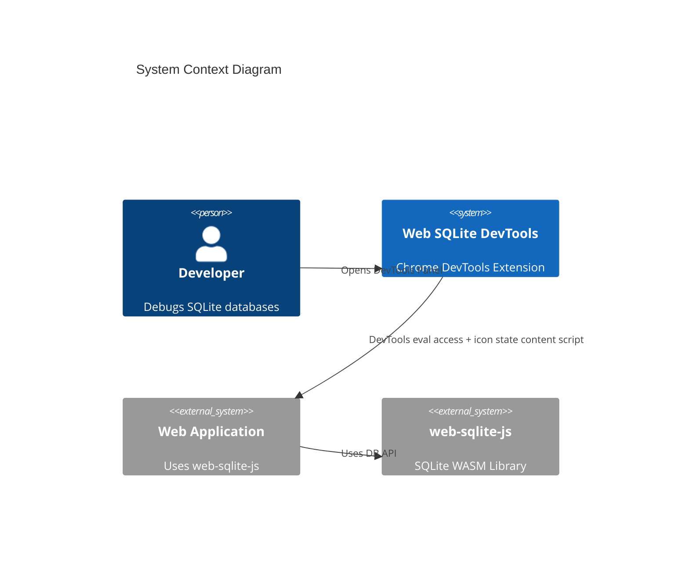
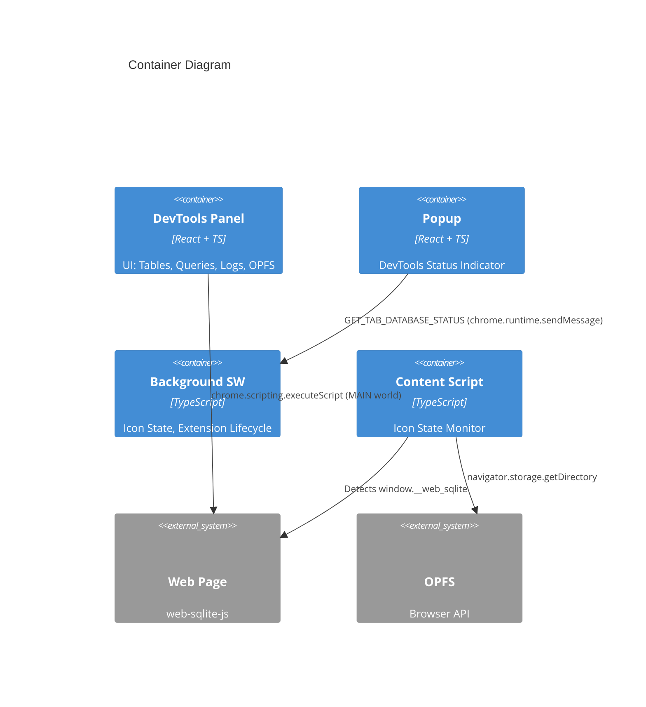

# 01 High-Level Design (HLD)

High-Level Design documentation for the Web SQLite DevTools Chrome Extension.

> **Note**: This documentation has been split into multiple files for easier navigation. See the [01-hld/](./01-hld/) directory for detailed sections.

## Quick Reference

- **Architecture Pattern**: Three-layer (Presentation → Service → Bridge) with DevTools inspected window access
- **Tech Stack**: React 18 + TypeScript + Tailwind CSS + react-router-dom
- **Key Principles**: Separation of concerns, context isolation, minimal messaging, hash-based routing
- **Data Access**: Service layer → Bridge layer → `chrome.scripting.executeScript` → `window.__web_sqlite`

## Documentation Structure

| File                                                   | Sections | Description                                                                                   |
| ------------------------------------------------------ | -------- | --------------------------------------------------------------------------------------------- |
| [01-hld/README.md](./01-hld/README.md)                 | -        | Overview and navigation guide                                                                 |
| [01-hld/01-core.md](./01-hld/01-core.md)               | 1-5      | Architecture principles, system boundaries, containers, data strategy, cross-cutting concerns |
| [01-hld/02-codebase.md](./01-hld/02-codebase.md)       | 6-7      | File tree structure and component hierarchy                                                   |
| [01-hld/03-features.md](./01-hld/03-features.md)       | 8-12     | Service layer, schema panel, DDL syntax, table tabs, resizable dividers                       |
| [01-hld/04-integration.md](./01-hld/04-integration.md) | 13-15    | Database list route, tab navigation, refresh coordination                                     |
| [01-hld/05-tooling.md](./01-hld/05-tooling.md)         | 16       | ESLint integration                                                                            |
| [01-hld/06-opfs.md](./01-hld/06-opfs.md)               | 17-20    | OPFS browser enhancements, two-panel layout, visual redesign, tree enhancements               |
| [01-hld/07-extension.md](./01-hld/07-extension.md)     | 21       | Extension popup architecture                                                                  |

---

## 1) Architecture Style & Principles

**Pattern**: DevTools Inspected Window Access with Service Layer

- **Flow**: DevTools Panel → Service Layer (Business Logic) → Bridge Layer (Chrome API) → Page Context (`window.__web_sqlite`)
- **Content Script**: Retained only for icon state updates

**Key Principles**:

| Principle              | Description                                                                         |
| ---------------------- | ----------------------------------------------------------------------------------- |
| Separation of Concerns | Three-layer architecture (Presentation → Service → Bridge)                          |
| Context Isolation      | DevTools accesses page via inspected window eval (`chrome.scripting.executeScript`) |
| Minimal Messaging      | Runtime messaging only for icon state updates                                       |
| Hash-Based Routing     | Single-page application navigation via URL hash (react-router-dom)                  |
| Real-Time Updates      | Polling/requests via eval (streaming TBD)                                           |
| Stateless Panel        | DevTools panel can be closed/reopened without losing page context                   |

## 2) System Boundary (C4 Context)

**Users**: Frontend developers, full-stack developers, QA engineers using Chrome DevTools

**External Systems**: web-sqlite-js library (via `window.__web_sqlite` global namespace)



## 3) Containers & Tech Stack (C4 Container)

| Container          | Tech Stack                                              | Purpose                                   |
| ------------------ | ------------------------------------------------------- | ----------------------------------------- |
| **DevTools Panel** | React 18 + TypeScript + Tailwind CSS + react-router-dom | Main UI: Tables, Queries, Logs, OPFS      |
| **Popup**          | React 18 + TypeScript + CSS                             | DevTools status indicator                 |
| **Content Script** | TypeScript + Chrome Extension APIs                      | Icon state monitoring                     |
| **Background SW**  | TypeScript + Chrome Extension APIs                      | Icon state, extension lifecycle           |
| **SQL Editor**     | CodeMirror 6                                            | Code editing with SQL syntax highlighting |
| **Routing**        | react-router-dom (HashRouter)                           | Hash-based routing for DevTools URLs      |



## 4) Data Architecture Strategy

**Ownership**: DevTools panel accesses `window.__web_sqlite` via service layer; content script only tracks icon state

| Aspect               | Strategy                                                                                                                            |
| -------------------- | ----------------------------------------------------------------------------------------------------------------------------------- |
| **Caching**          | Table list cached in panel until database changes; query results always fresh; log entries: 500-entry ring buffer in content script |
| **Consistency**      | Strong consistency for queries (synchronous); eventual for logs (streaming)                                                         |
| **State Management** | React useState for local state; React Router location state for route-based state; no global state library                          |

## 5) Cross-cutting Concerns

### 5.1 Message Protocol (F-018, F-019)

- **DevTools Data Access**: Service layer → bridge layer → `chrome.scripting.executeScript`
- **Runtime Messaging**: Icon state updates, real-time database list updates, log streaming to DevTools panel

**Message Flow**:

```
# Real-time updates (F-018):
Content Script (MAIN) → CrossWorldChannel → Relay (ISOLATED)
  → chrome.runtime.sendMessage → Background Worker
  → chrome.runtime.sendMessage → DevTools Panel

# Popup status query (F-019):
Popup → chrome.runtime.sendMessage → Background Worker
  → Query databaseMap → Response: { hasDatabase: boolean }
```

### 5.2 Reconnection Strategy

| Aspect         | Configuration                                                       |
| -------------- | ------------------------------------------------------------------- |
| Heartbeat      | DevTools panel evaluates `window.__web_sqlite` every 5 seconds      |
| Timeout        | DevTools panel shows error after 15 seconds without successful eval |
| Auto-Reconnect | Panel attempts to reconnect on route change or user action          |
| Page Refresh   | Panel detects refresh via failed eval and retries                   |

---

_For complete details on each section, see the [01-hld/](./01-hld/) directory._
