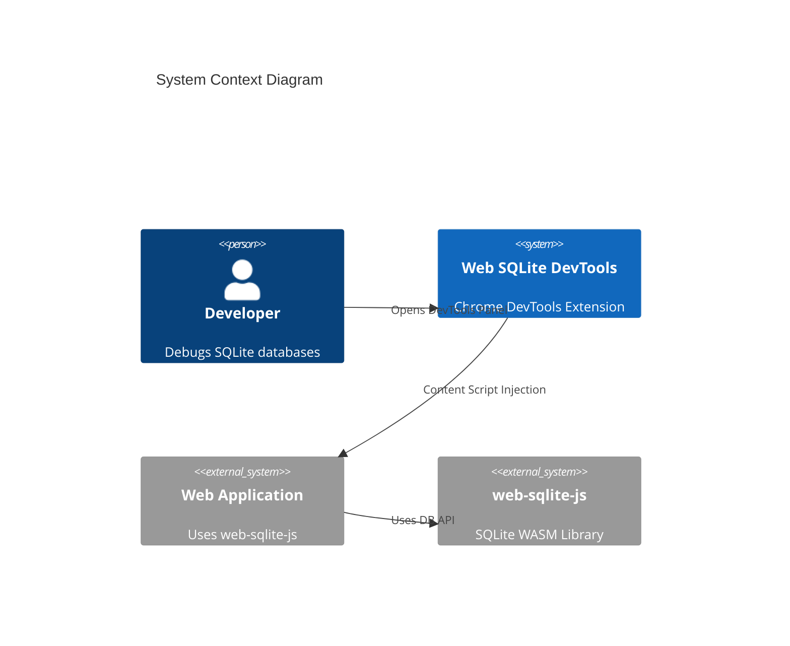

<!--
TEMPLATE MAP (reference-only)
.claude/templates/docs/03-architecture/01-hld.md

OUTPUT MAP (write to)
agent-docs/03-architecture/01-hld.md

NOTES
- Keep headings unchanged.
- Focus on STATIC STRUCTURE but include RATIONALE and STRATEGY.
-->

# 01 High-Level Design (HLD) — Structure

## 1) Architecture Style & Principles

- **Pattern**: **Content Script Proxy Pattern** (Chrome Extension specific)
  - DevTools Panel → Background Service Worker → Content Script → Page Context (`window.__web_sqlite`)
- **Key Principles**:
  - **Context Isolation**: DevTools panel cannot directly access page context; content script acts as bridge
  - **Message-Based Communication**: All cross-context communication via `chrome.runtime.sendMessage`
  - **Hash-Based Routing**: Single-page application navigation via URL hash (react-router-dom)
  - **Real-Time Updates**: Event-driven updates via `onDatabaseChange` and `db.onLog()` subscriptions
  - **Stateless Panel**: DevTools panel can be closed/reopened without losing page context

## 2) System Boundary (C4 Context)

- **Users**: Frontend developers, full-stack developers, QA engineers using Chrome DevTools
- **External Systems**: web-sqlite-js library (via `window.__web_sqlite` global namespace)



## 3) Containers & Tech Stack (C4 Container)

- **DevTools Panel**: React 18 + TypeScript + Tailwind CSS + react-router-dom
  - **Reason**: Leverages existing template, provides declarative UI and routing
- **Content Script**: TypeScript + Chrome Extension APIs
  - **Reason**: Acts as proxy to access `window.__web_sqlite` from page context
- **Background Service Worker**: TypeScript + Chrome Extension APIs
  - **Reason**: Manages extension lifecycle, icon state, and message routing
- **Routing**: react-router-dom (HashRouter)
  - **Reason**: Hash-based routing required for DevTools panel URLs
- **SQL Editor**: CodeMirror 6
  - **Reason**: Full-featured code editor with SQL syntax highlighting
- **Icons**: react-icons
  - **Reason**: Comprehensive icon library, tree-shakeable


## 4) Data Architecture Strategy

- **Ownership**: Content Script owns the connection to `window.__web_sqlite`; DevTools panel owns UI state
- **Caching**:
  - Table list: Cached in DevTools panel until database changes
  - Query results: Not cached (always fresh from database)
  - Log entries: Ring buffer (500 entries) in content script, streamed to panel
- **Consistency**: Strong consistency for queries (synchronous request/response); eventual for logs (streaming)
- **State Management**:
  - React useState for local component state
  - React Router location state for route-based state
  - No global state management library (avoid bundle size)

## 5) Cross-cutting Concerns (Implementation View)

### 5.1 Message Protocol

- **Channel Names**: Defined in `src/messaging/channels.ts`
  - `GET_DATABASES`: List all opened databases
  - `GET_TABLE_LIST`: Get tables for a database
  - `QUERY_SQL`: Execute SQL query
  - `EXEC_SQL`: Execute SQL statement (INSERT/UPDATE/DELETE)
  - `SUBSCRIBE_LOGS`: Subscribe to log events
  - `GET_OPFS_FILES`: List OPFS files
  - `DOWNLOAD_OPFS_FILE`: Download OPFS file
- **Serialization**: Maps converted to Arrays before sending (Spike S-001 result)
- **Error Handling**: Standard `{ success: boolean, data?: T, error?: string }` response format

### 5.2 Reconnection Strategy

- **Heartbeat**: Content script sends heartbeat every 5 seconds
- **Timeout**: DevTools panel shows error after 15 seconds without heartbeat
- **Auto-Reconnect**: Panel attempts to reconnect on route change or user action
- **Page Refresh**: Panel detects page navigation via chrome.tabs.onUpdated

### 5.3 Observability

- **Logs**: Internal extension logs to console.debug (DevTools only)
- **Error Tracking**: Error boundaries in React, log to console.error
- **Performance**: Measure panel open time, query execution time

### 5.4 Security

- **Permissions**: Minimal Chrome permissions (`activeTab`, `tabs`)
- **Content Security Policy**: Strict CSP for extension pages
- **No eval():** No dynamic code execution (SQL sent to web-sqlite-js only)

## 6) Code Structure Strategy (High-Level File Tree)

**Repo Structure**: Monorepo (single Chrome extension)

```text
/ (root)
  /src
    /devtools           # DevTools Panel (React)
      /components       # React components
        /Sidebar        # Sidebar navigation
        /TableTab       # Table browser
        /QueryTab       # SQL editor
        /LogTab         # Log viewer
        /MigrationTab   # Migration playground
        /SeedTab        # Seed playground
        /AboutTab       # Database info
        /OPFSBrowser    # OPFS file tree
      /hooks            # Custom React hooks
      /messaging        # DevTools message handlers
      /utils            # Utilities
      DevTools.tsx      # Main DevTools component
      index.tsx         # Entry point
    /contentScript      # Content Script (Proxy)
      /messaging        # Content script message handlers
      /proxy            # window.__web_sqlite wrapper
      /subscriptions    # Log subscription manager
      index.tsx         # Entry point
    /background         # Background Service Worker
      /iconState        # Icon activation logic
      /messaging        # Background message routing
      index.ts          # Entry point
    /messaging          # Shared message types
      channels.ts       # Channel name constants
      types.ts          # Message/request/response types
    /components         # Shared React components
      /CodeMirrorEditor # Reusable SQL editor
      /DataTable        # Reusable table display
    /types              # TypeScript type definitions
    /utils              # Shared utilities
  /public
    /icons              # Extension icons (active/inactive states)
  agent-docs            # Architecture documentation
```

**Module Pattern**: Layered architecture (Presentation → Messaging → Proxy → External API)

```text
/src/devtools
  /components          # Presentation Layer (React components)
  /hooks               # Custom hooks (useDatabase, useQuery, useLogs)
  /messaging           # Messaging Layer (send/receive messages)
/src/contentScript
  /messaging           # Messaging Layer (handle requests from panel)
  /proxy               # Proxy Layer (wrap window.__web_sqlite)
  /subscriptions       # Subscription Layer (log streaming)
/src/background
  /iconState           # Icon State Management
  /messaging           # Message Routing (panel ↔ content script)
```

## 7) Component Hierarchy (DevTools Panel)

```text
DevTools (Root)
├── HashRouter
│   ├── Sidebar (Navigation)
│   │   ├── SidebarHeader (App branding)
│   │   ├── DatabaseList (Opened DB menu)
│   │   ├── OPFSLink (OPFS browser link)
│   │   └── CollapseToggle (Sidebar collapse)
│   └── MainContent
│       ├── EmptyState (No route selected)
│       ├── DatabaseView (/openedDB/:dbname)
│       │   ├── TabNavigation (6 tabs)
│       │   └── TabContent
│       │       ├── TableTab
│       │       │   ├── TableList (Left column)
│       │       │   ├── MultiTableHeader (Tab bar)
│       │       │   ├── TableContent (Data + DDL)
│       │       │   └── PaginationBar
│       │       ├── QueryTab
│       │       │   ├── CodeMirrorEditor
│       │       │   ├── QueryResults
│       │       │   └── ExportButton
│       │       ├── LogTab
│       │       │   ├── LogFilter
│       │       │   └── LogList (500 entry ring buffer)
│       │       ├── MigrationTab
│       │       │   ├── HelperNotice
│       │       │   ├── CodeMirrorEditor
│       │       │   └── TestControls (Release/Rollback)
│       │       ├── SeedTab
│       │       │   ├── HelperNotice
│       │       │   ├── CodeMirrorEditor
│       │       │   └── TestControls (Release/Rollback)
│       │       └── AboutTab
│       │           └── DatabaseMetadata
│       └── OPFSView (/opfs)
│           └── FileTree
│               ├── FileNode (Lazy-loaded)
│               └── DownloadButton
```
