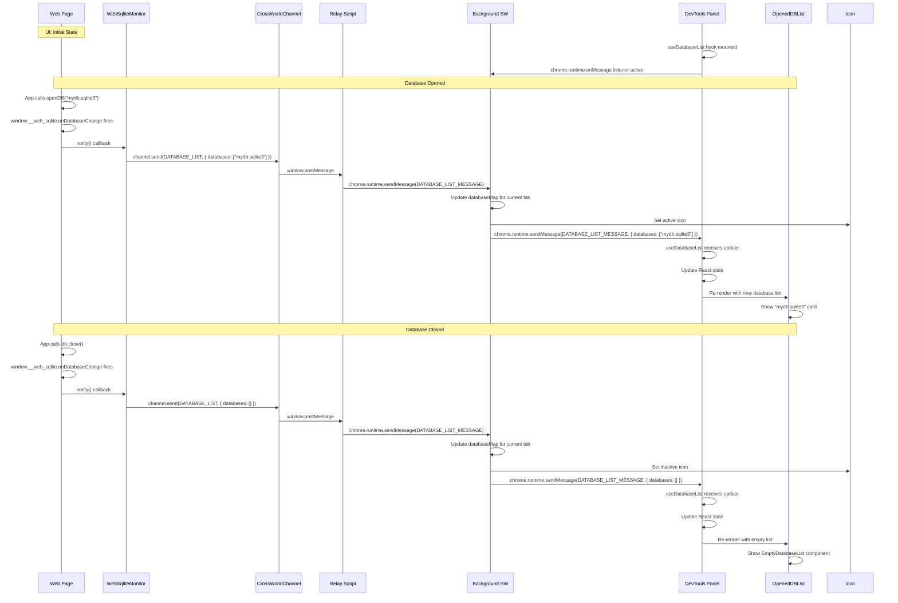
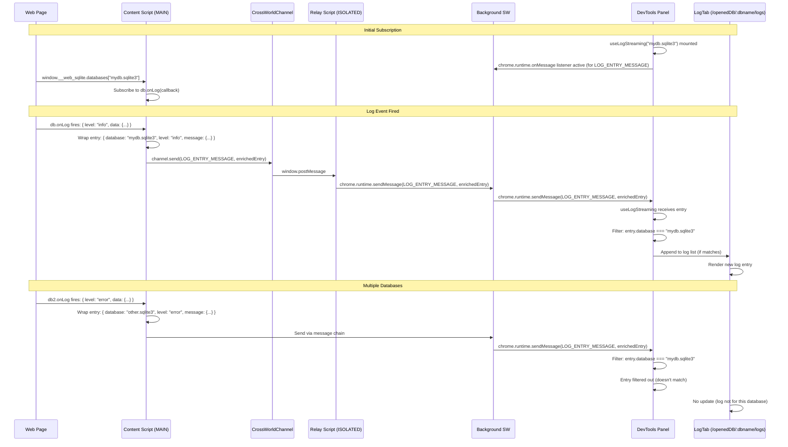
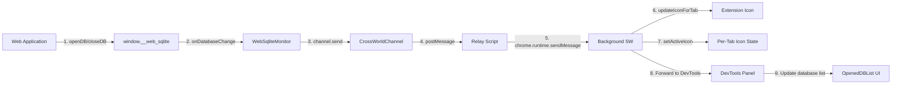

<!--
TEMPLATE MAP (reference-only)
.claude/templates/docs/03-architecture/02-dataflow.md

OUTPUT MAP (write to)
agent-docs/03-architecture/02-dataflow.md

NOTES
- Keep headings unchanged.
- Include UNHAPPY PATHS (errors) and CONCURRENCY controls.
-->

# 02 Data Flow & Sequences

## 1) Critical Business Flows

**Note**: DevTools now accesses `window.__web_sqlite` via `chrome.devtools.inspectedWindow.eval`.
Flows that still reference background/content script hops will be updated as the features are implemented.

### Flow 1: Open DevTools Panel and List Databases

**Goal**: Display list of opened databases when user opens DevTools panel
**Concurrency**: Single request, no conflicts

### Flow 2: Query Table Data

**Goal**: Execute SELECT query and display paginated results
**Concurrency**: Multiple queries can be executed concurrently (no shared state)

### Flow 3: Execute SQL (INSERT/UPDATE/DELETE)

**Goal**: Execute non-SELECT SQL and show results
**Concurrency**: Auto-rollback on error (handled by web-sqlite-js transaction)

### Flow 4: Subscribe to Log Events

**Goal**: Stream real-time logs from database to DevTools panel
**Concurrency**: Multiple subscribers per database (ring buffer manages overflow)

### Flow 5: Icon State Update (Database Change)

**Goal**: Update extension icon when database is opened/closed
**Concurrency**: Event-driven, no conflicts

**Architecture**:

- MAIN world content script monitors `window.__web_sqlite` (can access page JavaScript)
- ISOLATED world relay script forwards to chrome.runtime (has chrome.\* API access)
- Uses `CrossWorldChannel` abstraction for MAIN ↔ ISOLATED communication
- Uses `WebSqliteMonitor` utility for database change detection

### Flow 6: Migration Playground (Safe Testing)

**Goal**: Create dev version, test migration, auto-rollback
**Concurrency**: Single dev version per database (mutex lock)

### Flow 7: Page Refresh (Auto-Reconnect)

**Goal**: Detect page refresh and reconnect to window.\_\_web_sqlite
**Concurrency**: Timeout-based retry with exponential backoff

### Flow 8: OPFS File Download

**Goal**: Download file from OPFS to user's machine
**Concurrency**: Multiple files can be downloaded concurrently

### Flow 9: Database List Update to DevTools Panel (F-018 NEW)

**Goal**: Auto-refresh database list in DevTools panel when databases are opened/closed
**Concurrency**: Event-driven, no conflicts (fire-and-forget)

### Flow 10: Log Streaming to DevTools Panel (F-018 NEW)

**Goal**: Stream real-time logs from database to DevTools panel with database identification
**Concurrency**: Multiple databases streaming concurrently

## 2) Asynchronous Event Flows

**Pattern**: CrossWorldChannel for MAIN ↔ ISOLATED communication; chrome.runtime for ISOLATED ↔ Background.

### Event: Database Changed (F-018 UPDATED)

- **Event**: `DATABASE_CHANGED` (via `DATABASE_LIST_MESSAGE`)
- **Producer**: WebSqliteMonitor (MAIN world content script)
- **Consumers**: Background Service Worker (icon state), DevTools Panel (database list updates)

### Event: Log Entry (F-018 UPDATED)

- **Event**: `LOG_ENTRY_MESSAGE`
- **Producer**: Content Script (subscribes to `db.onLog()`)
- **Consumers**: DevTools Panel (LogTab with database filtering)
- **Entry Format**: `{ database: string, level: string, message: any }` (F-018)

```mermaid
flowchart LR
    DB[web-sqlite-js] -->|1. onLog callback| Sub[Subscription Manager]
    Sub -->|2. Wrap with dbname| Wrap[Enriched Entry]
    Wrap -->|3. Add to ring buffer| Buffer[(500 entry ring buffer)]
    Sub -->|4. Send enriched entry| CS[Content Script MAIN]
    CS -->|5. CrossWorldChannel| Channel[CrossWorldChannel]
    Channel -->|6. postMessage| Relay[Relay Script ISOLATED]
    Relay -->|7. chrome.runtime.sendMessage| BG[Background SW]
    BG -->|8. Forward to DevTools| Panel[DevTools Panel]
    Panel -->|9. Filter by database| Filter[useLogStreaming Hook]
    Filter -->|10. Render filtered logs| UI[LogView UI]
```

## 3) Entity State Machines

### Entity: DevTools Panel Connection

### Entity: Icon State

### Entity: Migration Test

## 4) Consistency & Recovery

- **Distributed Transactions**: None (single content script per page)
- **Idempotency**:
  - Query requests are idempotent (SELECT statements)
  - EXEC requests may not be idempotent (INSERT/UPDATE/DELETE) - user responsibility
  - Reconnection attempts are idempotent (GET_DATABASES can be called multiple times)
- **Compensation**:
  - Migration testing: Automatic rollback via `devTool.rollback()` on error or tab close
  - Seed testing: Automatic rollback via `devTool.rollback()` on error or tab close
  - OPFS download: No compensation (download can be retried by user)
- **Error Recovery**:
  - Message timeout: Retry with exponential backoff (1s, 2s, 4s, 8s)
  - Database closed: Show "Database closed" message, redirect to database list
  - Page navigation: Auto-reconnect with loading state

## 5) Cross-World Communication Architecture

**Problem**: Content scripts need both access to page JavaScript (`window.__web_sqlite`) AND chrome APIs (`chrome.runtime`), but these are available in different execution worlds.

**Solution**: Dual-world content script architecture with CrossWorldChannel abstraction.

### Execution Worlds

| World    | JavaScript Context | chrome.\* APIs   | Page JS Access   |
| -------- | ------------------ | ---------------- | ---------------- |
| MAIN     | Page context       | ❌ Not available | ✅ Full access   |
| ISOLATED | Extension context  | ✅ Available     | ❌ Not available |

### Communication Flow

### Abstractions

1. **CrossWorldChannel** (`src/shared/messaging/channel.ts`)
   - Pub/Sub pattern for MAIN → ISOLATED messaging
   - Type-safe send/listen API
   - Automatic handler management

2. **WebSqliteMonitor** (`src/shared/web-sqlite/monitor.ts`)
   - Monitors `window.__web_sqlite` availability
   - Watches for API to be set (property interceptor)
   - Subscribes to `onDatabaseChange` events
   - Notifies listeners on changes
   - Sends updates via CrossWorldChannel
