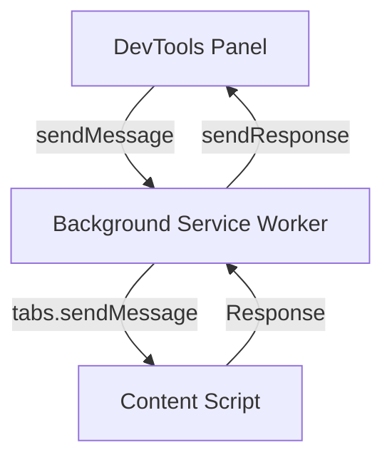
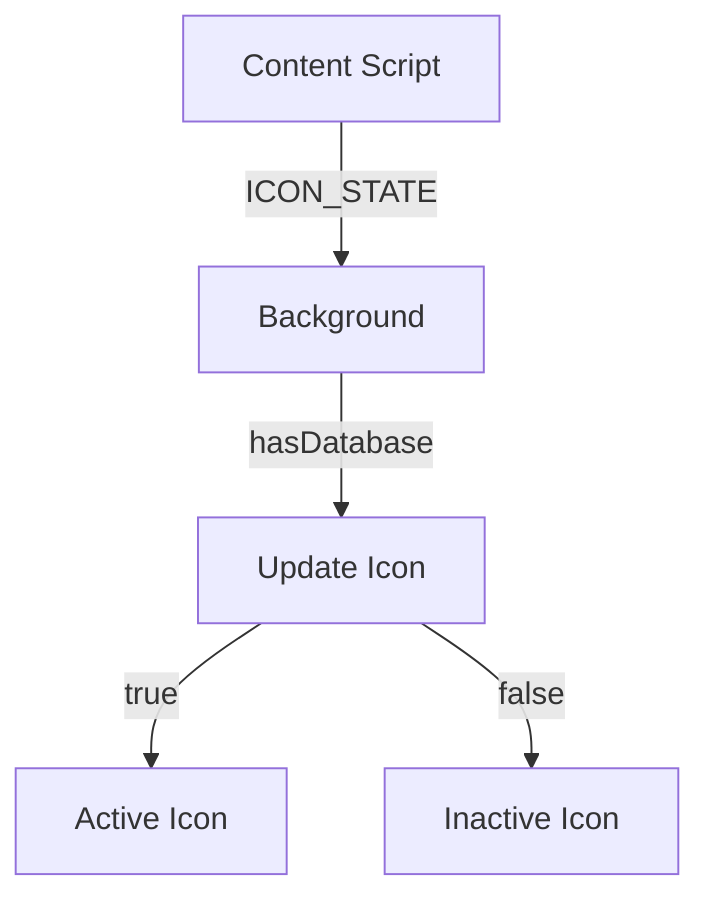
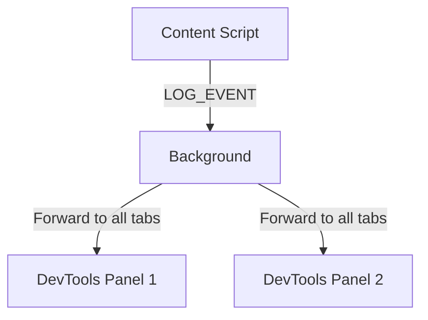

<!--
TEMPLATE MAP (reference-only)
.claude/templates/docs/05-design/03-modules/01-module-template.md

OUTPUT MAP (write to)
agent-docs/05-design/03-modules/background-service.md

NOTES
- Keep headings unchanged.
- Low-Level Design for a specific module.
-->

# Module: Background Service Worker

## 0) File Tree (Design + Code)

```text
agent-docs/05-design/03-modules/background-service.md
src/background/
  index.ts                 # Entry point, service worker
  iconState/
    index.ts               # Icon state management
    updateIcon.ts          # Update popup icon
  messaging/
    index.ts               # Message routing
    forwardToContent.ts    # Panel → Content Script
    forwardToPanel.ts      # Content Script → Panel
    handleIconState.ts     # Database change events
```

## 1) Assets (Traceability)

- **API**: Routes messages between panel and content script
- **Events**: Handles `ICON_STATE` events, forwards `LOG_EVENT`
- **Types**: See `Message Types` in `02-schema/01-message-types.md`

## 2) Responsibilities

- Act as message router between DevTools panel and content script
- Update popup icon based on database availability
- Manage extension lifecycle on install/update
- Listen for tab updates (page refresh detection)
- Forward streaming events (LOG_EVENT) to panel

## 3) Internal Logic (Flow)

### Message Routing Flow



### Icon State Update Flow



### Log Event Forwarding Flow



## 4) Classes / Functions

### Service Worker (src/background/index.ts)

- **onInstall**
  - Set up context menu (if needed)
  - Initialize default state

- **onMessage**
  - Route messages based on channel
  - Forward to content script or handle internally

- **onTabsUpdated**
  - Detect page refresh
  - Notify panel of connection loss (if panel open)

### Icon State Management (src/background/iconState/)

- **updateIcon(hasDatabase)**
  - Sets `active` or `inactive` icon
  - Updates badge text (optional: show DB count)
  - Returns: `void`

- **handleDatabaseChange(event)**
  - Listens for `DATABASE_CHANGED` events from content script
  - Calls `updateIcon()`
  - Returns: `void`

### Message Routing (src/background/messaging/)

- **routeMessage(message, sender, sendResponse)**
  - Switch on `message.channel`
  - Forwards to content script or handles internally
  - Routes: `GET_DATABASES`, `QUERY_SQL`, `EXEC_SQL`, etc.

- **forwardToContentScript(tabId, message)**
  - Uses `chrome.tabs.sendMessage(tabId, message)`
  - Returns: `Promise<Response>`

- **forwardToPanel(message)**
  - Uses `chrome.runtime.sendMessage(message)`
  - Returns: `void` (fire-and-forget for events)

### Internal Handlers (src/background/messaging/)

- **handleHeartbeat**
  - Responds immediately to panel heartbeat
  - Returns: `{ success: true, timestamp }`

- **handleIconState**
  - Updates popup icon
  - Returns: `{ success: true }`

## 5) Dependencies

- **External**: None (vanilla TypeScript)
- **Internal**: `src/messaging/channels.ts`, `src/messaging/types.ts`
- **Chrome APIs**: chrome.runtime, chrome.tabs, chrome.action

### Icon Assets

- Active icon: `public/icons/logo-active-48.png`
- Inactive icon: `public/icons/logo-inactive-48.png`
- Note: May need to generate these (grayscale for inactive)
