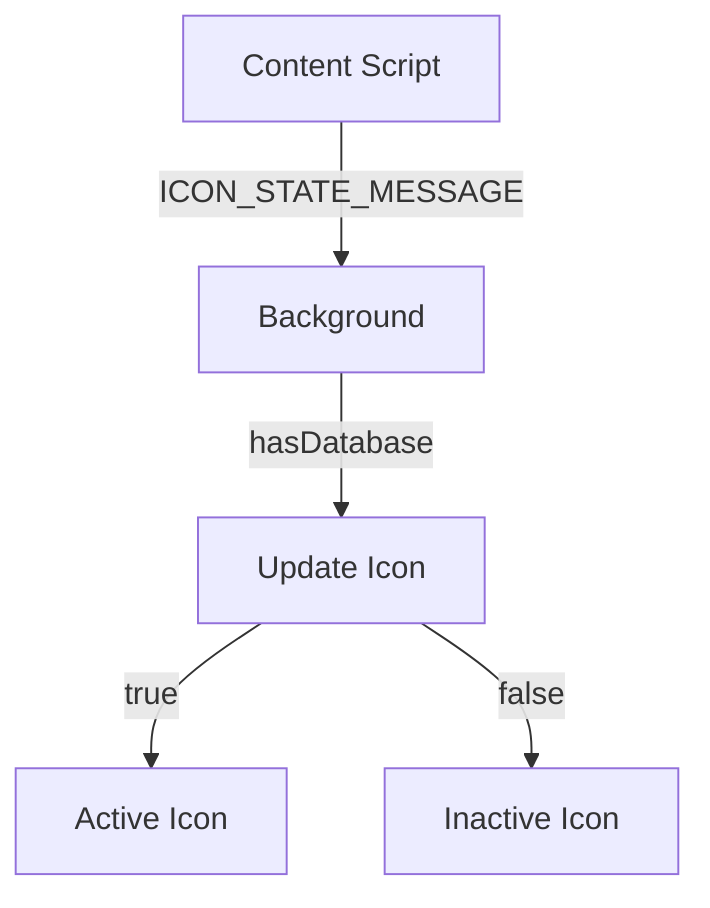
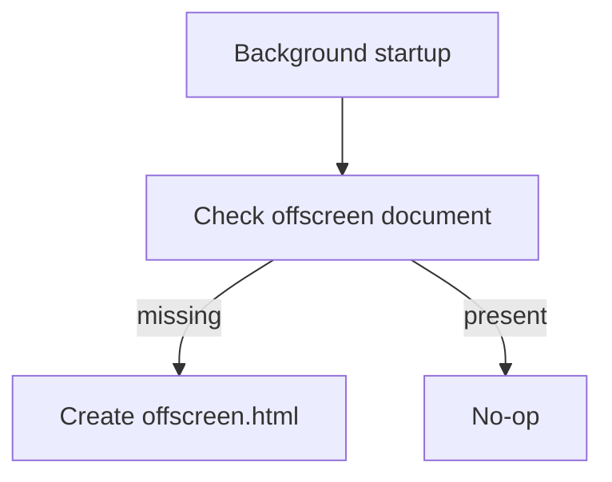

<!--
TEMPLATE MAP (reference-only)
.claude/templates/docs/05-design/03-modules/01-module-template.md

OUTPUT MAP (write to)
agent-docs/05-design/03-modules/background-service.md

NOTES
- Keep headings unchanged.
- Low-Level Design for a specific module.
-->

# Module: Background Service Worker

## 0) File Tree (Design + Code)

```text
agent-docs/05-design/03-modules/background-service.md
src/background/
  index.ts                 # Entry point, service worker
  iconState/
    index.ts               # Icon state management
```

## 1) Assets (Traceability)

- **API**: Handles icon state updates and offscreen initialization
- **Events**: Handles `ICON_STATE_MESSAGE` from content script
- **Types**: See `src/shared/messages.ts`

## 2) Responsibilities

- Update popup icon based on database availability
- Initialize offscreen document for log storage (internal)
- Manage extension lifecycle on install/update

## 3) Internal Logic (Flow)

### Icon State Update Flow



### Offscreen Setup Flow



## 4) Classes / Functions

### Service Worker (src/background/index.ts)

- **setupOffscreen()**
  - Creates offscreen document for log storage
  - Retries in dev mode if load fails

- **onMessage**
  - Handle `ICON_STATE_MESSAGE`
  - Update icon state via `setIconState`

### Icon State Management (src/background/iconState/)

- **setIconState(hasDatabase)**
  - Sets `active` or `inactive` icon
  - Returns: `void`

## 5) Dependencies

- **External**: None (vanilla TypeScript)
- **Internal**: `src/shared/messages.ts`
- **Chrome APIs**: chrome.runtime, chrome.action, chrome.offscreen

### Icon Assets

- Active icon: `public/img/logo-48.png`
- Inactive icon: `public/img/logo-48-inactive.png`
