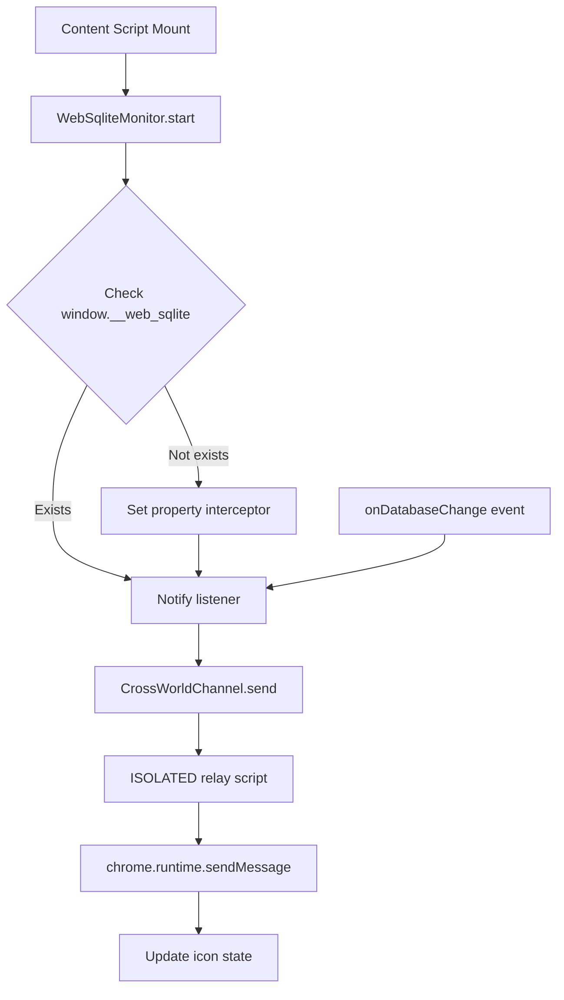

<!--
TEMPLATE MAP (reference-only)
.claude/templates/docs/05-design/03-modules/01-module-template.md

OUTPUT MAP (write to)
agent-docs/05-design/03-modules/content-script-proxy.md

NOTES
- Keep headings unchanged.
- Low-Level Design for a specific module.
-->

# Module: Content Script (Icon State & Monitoring)

## 0) File Tree (Design + Code)

```text
agent-docs/05-design/03-modules/content-script-proxy.md
src/
  contentScript/
    App.tsx                   # Entry point, uses WebSqliteMonitor
    index.tsx                 # Component mounter
    relay.ts                  # ISOLATED world relay script
  shared/
    messaging/
      channel.ts              # CrossWorldChannel abstraction
    web-sqlite/
      monitor.ts              # WebSqliteMonitor utility
```

## 1) Assets (Traceability)

- **API**: Sends `DATABASE_LIST_MESSAGE`, `LOG_ENTRY_MESSAGE` runtime updates (F-018 UPDATED)
- **Events**: Uses `window.__web_sqlite.onDatabaseChange`, `db.onLog()` (F-018)
- **Types**: `src/shared/messages.ts`
- **ADR**: `agent-docs/04-adr/0001-content-script-proxy.md`

## 2) Responsibilities

### MAIN World (App.tsx)

- Inject into web page context
- Monitor `window.__web_sqlite` availability via WebSqliteMonitor
- Automatically send database updates to background
- Subscribe to `db.onLog()` for all opened databases (F-018 NEW)
- Enrich log entries with database name before forwarding (F-018 NEW)

### ISOLATED World (relay.ts)

- Listen for messages from MAIN world via CrossWorldChannel
- Forward to background service worker via chrome.runtime
- Forward to DevTools panel via background worker (F-018 NEW)

### Shared Utilities

- **CrossWorldChannel**: Abstraction for MAIN ↔ ISOLATED communication
- **WebSqliteMonitor**: Monitors web-sqlite-js and notifies on changes

## 3) Internal Logic (Flow)

### Icon State Update Flow (Reactive)



## 4) Classes / Functions

### WebSqliteMonitor (src/shared/web-sqlite/monitor.ts)

**Purpose**: Monitor window.\_\_web_sqlite and notify on database changes

**Functions**:

- `monitorWebSqlite(listener: WebSqliteChangeListener): () => void`
  - Starts monitoring window.\_\_web_sqlite
  - Calls listener when databases change
  - Returns cleanup function

- `monitorAndNotifyBackground(): () => void`
  - Convenience function that monitors and sends updates to background
  - Returns cleanup function

### CrossWorldChannel (src/shared/messaging/channel.ts)

**Purpose**: Type-safe communication between MAIN and ISOLATED worlds

**Class Methods**:

- `send<T>(type: MessageType, data: T): void`
  - Send message from MAIN world to ISOLATED world
  - Uses window.postMessage internally

- `listen<T>(type: MessageType, handler: MessageHandler<T>): () => void`
  - Listen for messages from MAIN world (ISOLATED world only)
  - Returns unsubscribe function

- `start(): void`
  - Start the message listener (call in ISOLATED world)

- `stop(): void`
  - Stop the message listener

### Content Script App (src/contentScript/App.tsx)

**Purpose**: React component that starts monitoring on mount

**Implementation**:

```typescript
export default function App() {
  useEffect(() => {
    return monitorAndNotifyBackground();
  }, []);

  return null;
}
```

### Relay Script (src/contentScript/relay.ts)

**Purpose**: Forward messages from MAIN world to chrome.runtime

**Implementation**:

```typescript
crossWorldChannel.start();

crossWorldChannel.listen(DATABASE_LIST_MESSAGE, (data) => {
  chrome.runtime.sendMessage({
    type: DATABASE_LIST_MESSAGE,
    databases: data.databases,
  });
});

crossWorldChannel.listen(ICON_STATE_MESSAGE, (data) => {
  chrome.runtime.sendMessage({
    type: ICON_STATE_MESSAGE,
    hasDatabase: data.hasDatabase,
  });
});

crossWorldChannel.listen(LOG_ENTRY_MESSAGE, (data) => {
  // F-018: Enriched log entry with database identification
  chrome.runtime.sendMessage({
    type: LOG_ENTRY_MESSAGE,
    database: data.database,
    level: data.level,
    message: data.message,
    timestamp: data.timestamp,
  });
});
```

## 5) Dependencies

- **External**: None (vanilla TypeScript)
- **Internal**:
  - `src/shared/messages.ts`
  - `src/shared/messaging/channel.ts`
  - `src/shared/web-sqlite/monitor.ts`
- **Browser APIs**:
  - MAIN: window.postMessage
  - ISOLATED: chrome.runtime
- **External Lib**: web-sqlite-js (via `window.__web_sqlite`)

## 6) Manifest Configuration

```json
{
  "content_scripts": [
    {
      "matches": ["http://*/*", "https://*/*"],
      "js": ["src/contentScript/index.tsx"],
      "all_frames": true,
      "world": "MAIN"
    },
    {
      "matches": ["http://*/*", "https://*/*"],
      "js": ["src/contentScript/relay.ts"],
      "all_frames": true
    }
  ]
}
```

**Notes**:

- MAIN world script runs in page context (access to window.\_\_web_sqlite)
- ISOLATED world script runs in extension context (access to chrome.runtime)
- Both scripts use `all_frames: true` to support iframes

## 7) Design Patterns

### Channel Pattern

**Problem**: Need communication between MAIN and ISOLATED execution worlds

**Solution**: CrossWorldChannel provides pub/sub abstraction

```typescript
// MAIN world
crossWorldChannel.send(DATABASE_LIST, { databases: [...] });

// ISOLATED world
crossWorldChannel.listen(DATABASE_LIST, (data) => {
  // Handle message
});
```

### Monitor Pattern

**Problem**: Need to react to changes in window.\_\_web_sqlite

**Solution**: WebSqliteMonitor encapsulates all monitoring logic

```typescript
// Simple usage
const cleanup = monitorAndNotifyBackground();

// Custom listener
const cleanup = monitorWebSqlite(({ databases, hasDatabase }) => {
  console.log("Databases:", databases);
  console.log("Has database:", hasDatabase);
});
```

### Observer Pattern

**Problem**: Multiple components need to know about database changes

**Solution**: CrossWorldChannel supports multiple listeners per message type

```typescript
// Multiple listeners for same message type
const unsub1 = crossWorldChannel.listen(DATABASE_LIST, handler1);
const unsub2 = crossWorldChannel.listen(DATABASE_LIST, handler2);
```
