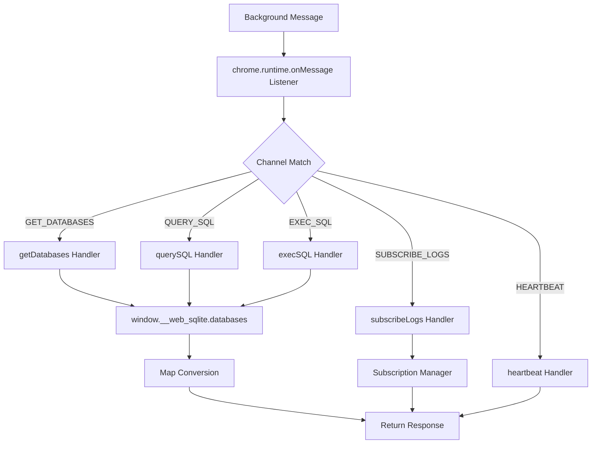
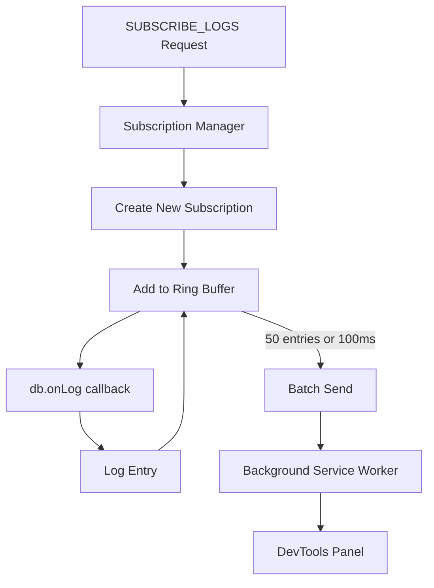
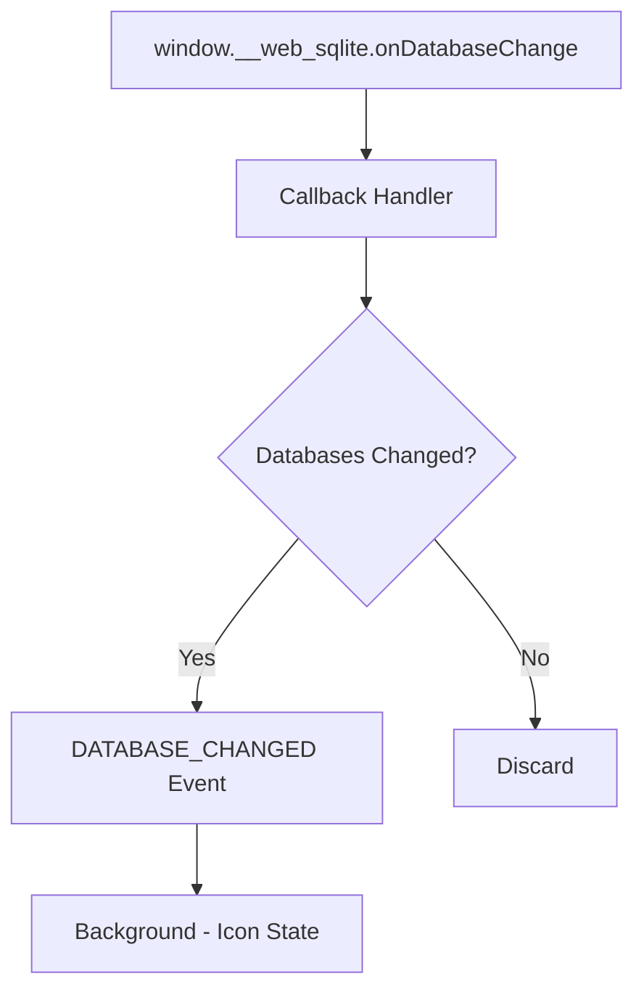

<!--
TEMPLATE MAP (reference-only)
.claude/templates/docs/05-design/03-modules/01-module-template.md

OUTPUT MAP (write to)
agent-docs/05-design/03-modules/content-script-proxy.md

NOTES
- Keep headings unchanged.
- Low-Level Design for a specific module.
-->

# Module: Content Script Proxy

## 0) File Tree (Design + Code)

```text
agent-docs/05-design/03-modules/content-script-proxy.md
src/contentScript/
  index.tsx                 # Entry point, message listener
  proxy/
    index.ts                # Main proxy functions
    databaseProxy.ts        # Database operations
    queryProxy.ts           # Query execution
    logProxy.ts             # Log subscription manager
    opfsProxy.ts            # OPFS operations
  subscriptions/
    LogRingBuffer.ts        # 500-entry circular buffer
    SubscriptionManager.ts  # Manage active subscriptions
  messaging/
    index.ts                # Message handlers
    handlers/
      getDatabases.ts
      getTableList.ts
      queryTableData.ts
      execSQL.ts
      subscribeLogs.ts
      getOpfsFiles.ts
      downloadOpfsFile.ts
      heartbeat.ts
```

## 1) Assets (Traceability)

- **API**: Handles all channels defined in `01-contracts/01-api.md`
- **Events**: Emits `LOG_ENTRY`, `DATABASE_CHANGED` events
- **Types**: See `Content Script State` in `02-schema/01-message-types.md`

## 2) Responsibilities

- Inject into web page context
- Access `window.__web_sqlite` API
- Forward requests from DevTools panel to web-sqlite-js
- Convert Maps to Arrays for message serialization
- Manage log subscriptions with ring buffer
- Batch send log events to panel
- Listen to `onDatabaseChange` events
- Respond to heartbeat messages
- Handle OPFS file operations

## 3) Internal Logic (Flow)

### Request Handling Flow



### Log Subscription Flow



### Database Change Detection Flow



## 4) Classes / Functions

### Proxy Functions (src/contentScript/proxy/)

- **getDatabaseRecord(dbname)**
  - Returns: `DatabaseRecord` (with Map→Array conversion)
  - Converts `migrationSQL` Map to `Array<[string, string]>`
  - Converts `seedSQL` Map to `Array<[string, string]>`

- **queryDB(dbname, sql, params)**
  - Calls: `db.query(sql, params)`
  - Returns: `QueryResult`

- **execDB(dbname, sql, params)**
  - Calls: `db.exec(sql, params)`
  - Returns: `{ lastInsertRowid, changes }`

- **getTableSchema(dbname, tableName)**
  - Calls: `db.query('PRAGMA table_info(...)')`
  - Calls: `db.query('SELECT sql FROM sqlite_master WHERE...')`
  - Returns: `TableInfo`

### Subscription Manager (src/contentScript/subscriptions/SubscriptionManager.ts)

- **create(dbname)**
  - Creates new subscription with ring buffer
  - Calls `db.onLog(callback)`
  - Returns: `subscriptionId`

- **remove(subscriptionId)**
  - Calls `unsubscribe()` callback
  - Clears ring buffer
  - Returns: `void`

- **getBuffer(subscriptionId)**
  - Returns: `LogEntry[]` from ring buffer

- **broadcast()**
  - Sends buffered logs via `LOG_EVENT` channel
  - Clears buffer after sending
  - Runs every 100ms or when 50 entries accumulated

### Log Ring Buffer (src/contentScript/subscriptions/LogRingBuffer.ts)

- **add(entry)**
  - Adds log entry to buffer
  - Overwrites oldest entry if buffer full (500 entries)
  - Returns: `void`

- **getAll()**
  - Returns: All entries in buffer
  - Returns: `LogEntry[]`

- **clear()**
  - Clears all entries
  - Returns: `void`

- **size**
  - Returns: Current entry count

### Message Handlers (src/contentScript/messaging/handlers/)

- **handleGetDatabases(request)**
  - Returns: List of database names

- **handleGetTableList(request)**
  - Returns: List of table names (alphabetical)

- **handleQueryTableData(request)**
  - Executes: `db.query(sql)`
  - Applies: `LIMIT limit OFFSET offset`
  - Returns: `QueryResult`

- **handleExecSQL(request)**
  - Executes: `db.exec(sql, params)`
  - Returns: `{ lastInsertRowid, changes }`

- **handleSubscribeLogs(request)**
  - Creates subscription via SubscriptionManager
  - Returns: `subscriptionId`

- **handleUnsubscribeLogs(request)**
  - Removes subscription
  - Returns: `void`

- **handleGetOpfsFiles(request)**
  - Calls: `navigator.storage.getDirectory()`
  - Recursively lists directory contents
  - Returns: File entries with sizes

- **handleDownloadOpfsFile(request)**
  - Gets file handle
  - Converts to Blob
  - Creates blob URL
  - Returns: `{ blobUrl, filename }`

- **handleHeartbeat(request)**
  - Responds immediately
  - Returns: `{ timestamp }`

## 5) Dependencies

- **External**: None (vanilla TypeScript)
- **Internal**: `src/messaging/channels.ts`, `src/messaging/types.ts`
- **Browser APIs**: chrome.runtime, navigator.storage.getDirectory
- **External Lib**: web-sqlite-js (via `window.__web_sqlite`)
