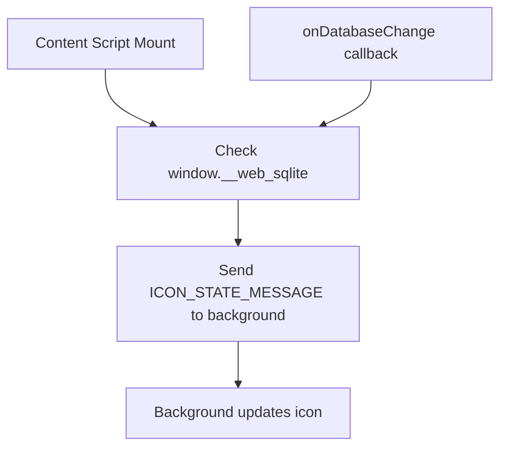

<!--
TEMPLATE MAP (reference-only)
.claude/templates/docs/05-design/03-modules/01-module-template.md

OUTPUT MAP (write to)
agent-docs/05-design/03-modules/content-script-proxy.md

NOTES
- Keep headings unchanged.
- Low-Level Design for a specific module.
-->

# Module: Content Script (Icon State)

## 0) File Tree (Design + Code)

```text
agent-docs/05-design/03-modules/content-script-proxy.md
src/contentScript/
  App.tsx                   # Icon state monitor
  index.tsx                 # Entry point
```

## 1) Assets (Traceability)

- **API**: Sends `ICON_STATE_MESSAGE` runtime updates
- **Events**: Uses `window.__web_sqlite.onDatabaseChange`
- **Types**: `src/shared/messages.ts`

## 2) Responsibilities

- Inject into web page context
- Detect `window.__web_sqlite` availability
- Send icon state updates to background service worker
- Listen to `onDatabaseChange` and refresh icon state

## 3) Internal Logic (Flow)

### Icon State Update Flow



## 4) Classes / Functions

### Content Script App (src/contentScript/App.tsx)

- **updateIconState()**
  - Reads `window.__web_sqlite` availability
  - Sends `ICON_STATE_MESSAGE` to background
  - Called on mount and on `onDatabaseChange` events

## 5) Dependencies

- **External**: None (vanilla TypeScript)
- **Internal**: `src/shared/messages.ts`
- **Browser APIs**: chrome.runtime
- **External Lib**: web-sqlite-js (via `window.__web_sqlite`)
