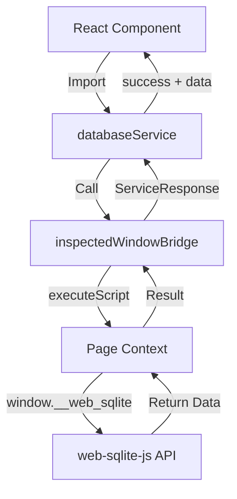
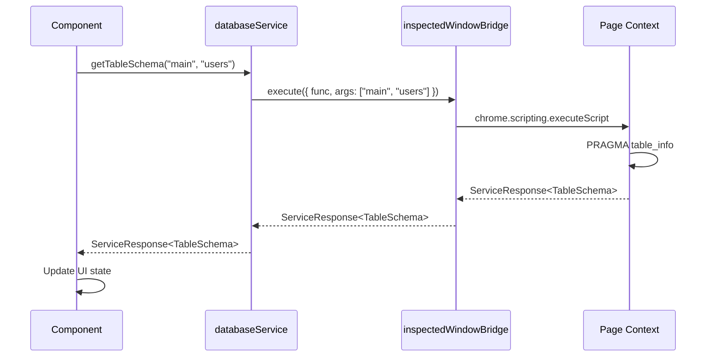
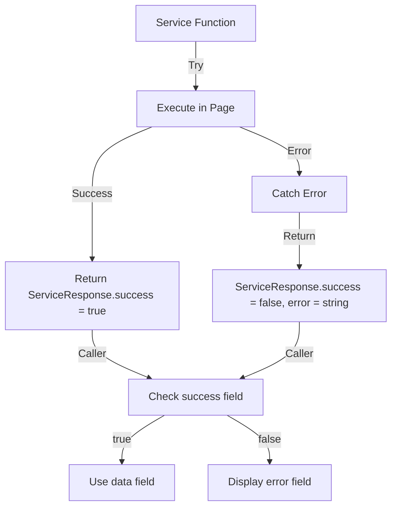

<!--
TEMPLATE MAP (reference-only)
.claude/templates/docs/05-design/03-modules/01-module-template.md

OUTPUT MAP (write to)
agent-docs/05-design/03-modules/database-service.md

NOTES
- Keep headings unchanged.
- Low-Level Design for Database Service Layer (Feature F-001).
-->

# Module: Database Service Layer (Feature F-001)

## 0) File Tree (Design + Code)

```text
agent-docs/05-design/03-modules/database-service.md
src/devtools/services/
  databaseService.ts      # All database operations (10 functions)
  index.ts                # Service layer exports (if needed)
src/devtools/bridge/
  inspectedWindow.ts      # Chrome API wrapper (executeScript)
src/devtools/
  inspectedWindow.ts      # Public API re-exports (backward compatible)
```

## 1) Assets (Traceability)

- **API**: See `## 2) Service Layer API` in `01-contracts/01-api.md`
- **Types**: See `Service Layer Types` in `02-schema/01-message-types.md`
- **Bridge**: See `inspectedWindow.ts` for Chrome API wrapper
- **Feature**: See `F-001: Service Layer Expansion` in `01-discovery/features/`

## 2) Responsibilities

- **Single Source of Truth**: All database operations go through this service layer
- **Business Logic**: Data normalization, error handling, fallback logic, pagination
- **Bridge Isolation**: No direct Chrome API calls in service functions
- **Type Safety**: Strong typing via `ServiceResponse<T>` envelope
- **Testability**: Service functions can be unit tested with mocked bridge

## 3) Internal Logic (Flow)

### Service Layer Architecture



### Function Call Flow



### Error Handling Flow



## 4) Classes / Functions

### Service Response Type

```typescript
/**
 * Standard response envelope for all service operations
 * @template T - Type of success data payload
 */
export type ServiceResponse<T> = {
  success: boolean;
  data?: T;
  error?: string;
};
```

### Database Discovery Functions

#### `getDatabases()`

- **Purpose**: List all opened databases from `window.__web_sqlite.databases`
- **Input**: None
- **Output**: `ServiceResponse<DatabaseSummary[]>`
- **Business Logic**:
  1. Execute `() => Object.keys(window.__web_sqlite?.databases || {})`
  2. Normalize to `DatabaseSummary[]` format
  3. Return empty array if API not available (graceful degradation)
- **Error Handling**:
  - Catches any execution errors
  - Returns `{ success: false, error: string }` on failure
- **Status**: ✅ Implemented

#### `getTableList(dbname)`

- **Purpose**: Get alphabetically sorted table list for a database
- **Input**: `dbname: string`
- **Output**: `ServiceResponse<string[]>`
- **Business Logic**:
  1. Query `PRAGMA table_list` (preferred) or fallback to `sqlite_master`
  2. Filter out `sqlite_*` system tables
  3. Filter by `type = 'table'` (exclude views, indexes)
  4. Sort alphabetically for consistent UI
- **Error Handling**:
  - Validates database exists
  - Falls back to `sqlite_master` if `PRAGMA table_list` fails
  - Returns error message if database not found
- **Status**: ✅ Implemented

### Schema & Data Inspection Functions

#### `getTableSchema(dbname, tableName)`

- **Purpose**: Get table columns, types, constraints, and DDL
- **Input**: `dbname: string, tableName: string`
- **Output**: `ServiceResponse<TableSchema>`
- **Business Logic**:
  1. Query `PRAGMA table_info(tableName)` for column details
  2. Query `SELECT sql FROM sqlite_master WHERE type='table' AND name=?` for DDL
  3. Normalize column information (cid, name, type, notnull, dflt_value, pk)
  4. Return combined schema with columns array and DDL string
- **Error Handling**:
  - Validates database and table exist
  - Returns detailed error message if table not found
  - Returns SQL error if query fails
- **Status**: 🚧 Implementation in Progress (TASK-05.1)
- **Task**: [TASK-05.1](../07-taskManager/02-task-catalog.md#task-051-service-layer---table-schema-functions)

#### `queryTableData(dbname, sql, limit, offset)`

- **Purpose**: Execute SELECT query with pagination
- **Input**: `dbname: string, sql: string, limit: number, offset: number`
- **Output**: `ServiceResponse<QueryResult>`
- **Business Logic**:
  1. Validate SQL is SELECT (optional, for safety)
  2. Wrap user SQL: `SELECT * FROM (${sql}) LIMIT ? OFFSET ?`
  3. Execute count query: `SELECT COUNT(*) FROM (${sql})`
  4. Extract column names from first row keys
  5. Return rows, total count, and column names
- **Error Handling**:
  - Returns SQL syntax errors in error field
  - Returns empty result set if no rows
  - Validates database exists before query
- **Status**: 🚧 Implementation in Progress (TASK-05.1)
- **Task**: [TASK-05.1](../07-taskManager/02-task-catalog.md#task-051-service-layer---table-schema-functions)

#### `execSQL(dbname, sql, params?)`

- **Purpose**: Execute INSERT/UPDATE/DELETE/DDL with optional parameters
- **Input**: `dbname: string, sql: string, params?: SqlValue[] | Record<string, SqlValue>`
- **Output**: `ServiceResponse<ExecResult>`
- **Business Logic**:
  1. Execute SQL with parameters using `db.exec(sql, params)`
  2. Return `lastInsertRowid` and `changes` from result
  3. Support both positional (`[]`) and named (`{}`) parameters
- **Error Handling**:
  - Returns constraint violation errors
  - Returns SQL syntax errors
  - Validates parameter count matches placeholders
- **Status**: 🚧 Implementation in Progress (TASK-05.2)
- **Task**: [TASK-05.2](../07-taskManager/02-task-catalog.md#task-052-service-layer---sql-execution-functions)

### Log Streaming Functions

#### `subscribeLogs(dbname)`

- **Purpose**: Subscribe to log events for a database
- **Input**: `dbname: string`
- **Output**: `ServiceResponse<{ subscriptionId: string }>`
- **Business Logic**:
  1. Generate unique subscription ID (e.g., `sub_${Date.now()}_${Math.random()}`)
  2. Call `window.__web_sqlite.subscribeLogs(dbname, callback)`
  3. Store subscription in internal Map for cleanup
  4. Return subscription ID to caller
- **Error Handling**:
  - Validates database exists
  - Returns error if logging not supported
  - Returns error if subscription limit reached
- **Status**: 🚧 Implementation in Progress (TASK-05.3)
- **Task**: [TASK-05.3](../07-taskManager/02-task-catalog.md#task-053-service-layer---log-streaming-functions)

#### `unsubscribeLogs(subscriptionId)`

- **Purpose**: Unsubscribe from log events
- **Input**: `subscriptionId: string`
- **Output**: `ServiceResponse<void>`
- **Business Logic**:
  1. Look up subscription from internal Map
  2. Call `window.__web_sqlite.unsubscribeLogs(subscriptionId)`
  3. Remove from internal Map
  4. Return success response
- **Error Handling**:
  - Returns error if subscription not found
  - Returns error if unsubscribe fails
- **Status**: 🚧 Implementation in Progress (TASK-05.3)
- **Task**: [TASK-05.3](../07-taskManager/02-task-catalog.md#task-053-service-layer---log-streaming-functions)

### Migration & Versioning Functions

#### `devRelease(dbname, version, migrationSQL?, seedSQL?)`

- **Purpose**: Create dev version with migration/seed SQL for testing
- **Input**: `dbname: string, version: string, migrationSQL?: string, seedSQL?: string`
- **Output**: `ServiceResponse<{ devVersion: string }>`
- **Business Logic**:
  1. Create dev database copy: `${dbname}-dev-${version}`
  2. Apply migration SQL if provided
  3. Apply seed SQL if provided
  4. Store original version for rollback
  5. Return unique dev version identifier
- **Error Handling**:
  - Validates database exists
  - Returns SQL errors from migration/seed
  - Returns error if dev version already exists
- **Status**: 🚧 Implementation in Progress (TASK-05.4)
- **Task**: [TASK-05.4](../07-taskManager/02-task-catalog.md#task-054-service-layer---migration--versioning-functions)

#### `devRollback(dbname, toVersion)`

- **Purpose**: Rollback dev version to original or specific version
- **Input**: `dbname: string, toVersion: string`
- **Output**: `ServiceResponse<{ currentVersion: string }>`
- **Business Logic**:
  1. Drop dev database
  2. Restore from backup or switch to specific version
  3. Update version tracking in web-sqlite-js
  4. Return current active version
- **Error Handling**:
  - Returns error if dev version not found
  - Returns error if backup not available
  - Returns error if version locked (below latest release)
- **Status**: 🚧 Implementation in Progress (TASK-05.4)
- **Task**: [TASK-05.4](../07-taskManager/02-task-catalog.md#task-054-service-layer---migration--versioning-functions)

#### `getDbVersion(dbname)`

- **Purpose**: Get current database version
- **Input**: `dbname: string`
- **Output**: `ServiceResponse<{ version: string }>`
- **Business Logic**:
  1. Query `PRAGMA user_version` for SQLite version
  2. Fallback to web-sqlite-js version tracking
  3. Return semantic version string (e.g., "1.2.3")
  4. Return "0.0.0" if no version set
- **Error Handling**:
  - Validates database exists
  - Returns error if version query fails
- **Status**: 🚧 Implementation in Progress (TASK-05.4)
- **Task**: [TASK-05.4](../07-taskManager/02-task-catalog.md#task-054-service-layer---migration--versioning-functions)

### OPFS File Browser Functions

#### `getOpfsFiles(path?, dbname?)`

- **Purpose**: List OPFS files with lazy loading
- **Input**: `path?: string, dbname?: string`
- **Output**: `ServiceResponse<OpfsFileEntry[]>`
- **Business Logic**:
  1. Call `navigator.storage.getDirectory()` in inspected page
  2. Navigate to `path` (defaults to root)
  3. List directory contents with `for await of`
  4. Filter by `dbname` if provided (database-specific files)
  5. Convert file sizes to human-readable format (KB, MB, GB)
  6. Return flat list for lazy loading in UI
- **Error Handling**:
  - Returns error if OPFS not supported
  - Returns error if path not found
  - Returns empty array if directory is empty
- **Status**: 🚧 Implementation in Progress (TASK-05.5)
- **Task**: [TASK-05.5](../07-taskManager/02-task-catalog.md#task-055-service-layer---opfs-file-browser-functions)

#### `downloadOpfsFile(path)`

- **Purpose**: Download OPFS file to user's machine
- **Input**: `path: string`
- **Output**: `ServiceResponse<{ blobUrl: string; filename: string }>`
- **Business Logic**:
  1. Resolve file handle from `path`
  2. Read file contents into ArrayBuffer
  3. Create Blob from ArrayBuffer
  4. Create object URL: `URL.createObjectURL(blob)`
  5. Extract filename from path
  6. Return blob URL and filename
  7. Caller responsible for URL cleanup
- **Error Handling**:
  - Returns error if file not found
  - Returns error if read fails
  - Returns error if OPFS not supported
- **Status**: 🚧 Implementation in Progress (TASK-05.5)
- **Task**: [TASK-05.5](../07-taskManager/02-task-catalog.md#task-055-service-layer---opfs-file-browser-functions)

## 5) Dependencies

- **Internal**: `src/devtools/bridge/inspectedWindow.ts` (bridge layer)
- **External**: `window.__web_sqlite` (web-sqlite-js API)
- **Chrome APIs**: `chrome.scripting.executeScript` (via bridge layer only)
- **Browser APIs**: `navigator.storage.getDirectory` (via inspected page context)

## 6) Design Patterns

### Service Layer Pattern

- **Separation of Concerns**: Business logic isolated from Chrome API concerns
- **Single Responsibility**: Each function handles one database operation
- **Dependency Injection**: Bridge layer injected via module import (testable)

### Error Handling Pattern

- **Consistent Envelope**: All functions return `ServiceResponse<T>`
- **Graceful Degradation**: Empty results instead of null/undefined
- **Detailed Errors**: Error messages include context for debugging

### Type Safety Pattern

- **Generic Response**: `ServiceResponse<T>` enables type-safe data access
- **Discriminated Union**: `success` field determines data vs error access
- **Strong Types**: All inputs and outputs explicitly typed

## 7) Testing Strategy

### Unit Tests (Service Layer)

- **Mock Bridge Layer**: Replace `inspectedWindowBridge` with test double
- **Test Business Logic**: Verify data normalization, error handling, fallbacks
- **Test Error Cases**: Ensure proper error responses for all failure modes
- **Test Type Safety**: Verify TypeScript types prevent misuse

### Integration Tests (Bridge Layer)

- **Test Chrome API**: Verify `executeScript` calls work correctly
- **Test Page Context**: Ensure code executes in MAIN world
- **Test Argument Passing**: Verify args serialized/deserialized correctly

### E2E Tests (Full Stack)

- **Test Real Database**: Use actual web-sqlite-js database
- **Test All Functions**: Verify each service function works end-to-end
- **Test Error Recovery**: Verify graceful handling of database errors

## 8) Migration Path (Feature F-001)

### Phase 1: Implement Service Functions (Days 5-7)

- [ ] TASK-05.1: Implement `getTableSchema(dbname, tableName)` and `queryTableData(dbname, sql, limit, offset)`
- [ ] TASK-05.2: Implement `execSQL(dbname, sql, params?)`
- [ ] TASK-05.3: Implement `subscribeLogs(dbname)` and `unsubscribeLogs(subscriptionId)`
- [ ] TASK-05.4: Implement `devRelease(dbname, version, migrationSQL?, seedSQL?)`, `devRollback(dbname, toVersion)`, `getDbVersion(dbname)`
- [ ] TASK-05.5: Implement `getOpfsFiles(path?, dbname?)` and `downloadOpfsFile(path)`

### Phase 2: Update Components (Days 8-9)

- [ ] TASK-05.6: Update `Sidebar/DatabaseList.tsx`, `TableTab/TableList.tsx`, `TableTab/TableContent.tsx` to use `databaseService`
- [ ] TASK-05.7: Update `QueryTab/CodeMirrorEditor.tsx`, `QueryTab/QueryResults.tsx`, `QueryTab/ExportButton.tsx` to use `databaseService`
- [ ] TASK-05.8: Update `LogTab/LogList.tsx`, `LogTab/LogFilter.tsx`, `OPFSBrowser/FileTree.tsx`, `OPFSBrowser/DownloadButton.tsx` to use `databaseService`

### Phase 3: Deprecate Old API (Day 14)

- [ ] Mark `getDatabasesFromInspectedWindow` as `@deprecated`
- [ ] Mark `getTableListFromInspectedWindow` as `@deprecated`
- [ ] Update documentation to recommend `databaseService` imports
- [ ] Add migration guide for component updates

## 9) Performance Considerations

- **Pagination**: `queryTableData` uses LIMIT/OFFSET to avoid loading entire tables
- **Lazy Loading**: `getOpfsFiles` returns flat list for on-demand directory expansion
- **Caching**: Components should cache service responses (not service layer)
- **Subscription Cleanup**: `unsubscribeLogs` must be called on component unmount
- **Object URL Cleanup**: `downloadOpfsFile` callers must revoke blob URLs

## 10) Security Considerations

- **SQL Injection**: All queries use parameterized statements
- **Input Validation**: Service functions validate database/table names
- **Context Isolation**: All code executes in inspected page MAIN world
- **Error Messages**: Detailed errors logged but not exposed to end users
- **File Access**: OPFS access limited to origin's private file system

## 11) Implementation Status

### Completed Functions

1. ✅ `getDatabases()` - Lists all opened databases
2. ✅ `getTableList(dbname)` - Gets tables for a specific database

### In Progress (TASK-05.1 through TASK-05.5)

3. 🚧 `getTableSchema(dbname, tableName)` - Get table schema (TASK-05.1)
4. 🚧 `queryTableData(dbname, sql, limit, offset)` - Query table data (TASK-05.1)
5. 🚧 `execSQL(dbname, sql, params?)` - Execute SQL (TASK-05.2)
6. 🚧 `subscribeLogs(dbname)` - Subscribe to logs (TASK-05.3)
7. 🚧 `unsubscribeLogs(subscriptionId)` - Unsubscribe from logs (TASK-05.3)
8. 🚧 `devRelease(dbname, version, migrationSQL?, seedSQL?)` - Create dev version (TASK-05.4)
9. 🚧 `devRollback(dbname, toVersion)` - Rollback dev version (TASK-05.4)
10. 🚧 `getDbVersion(dbname)` - Get database version (TASK-05.4)
11. 🚧 `getOpfsFiles(path?, dbname?)` - List OPFS files (TASK-05.5)
12. 🚧 `downloadOpfsFile(path)` - Download OPFS file (TASK-05.5)

### Component Migration (TASK-05.6 through TASK-05.8)

- 🚧 Table Browser Components (TASK-05.6)
- 🚧 Query Editor Components (TASK-05.7)
- 🚧 Log & OPFS Components (TASK-05.8)

### Tasks

See [Task Catalog](../07-taskManager/02-task-catalog.md) for detailed task breakdown:
- TASK-05.1: Service Layer - Table Schema Functions
- TASK-05.2: Service Layer - SQL Execution Functions
- TASK-05.3: Service Layer - Log Streaming Functions
- TASK-05.4: Service Layer - Migration & Versioning Functions
- TASK-05.5: Service Layer - OPFS File Browser Functions
- TASK-05.6: Component Migration - Table Browser Components
- TASK-05.7: Component Migration - Query Editor Components
- TASK-05.8: Component Migration - Log & OPFS Components
