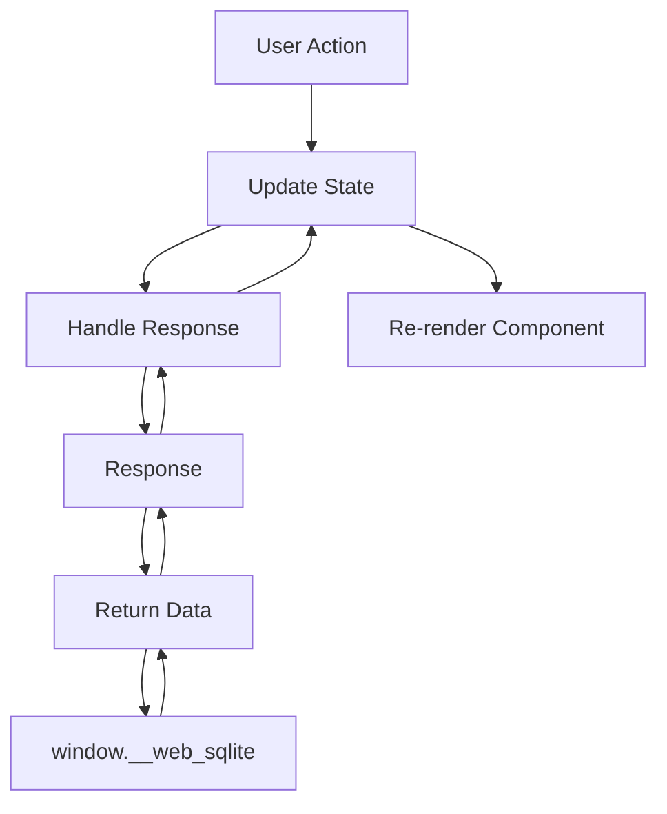
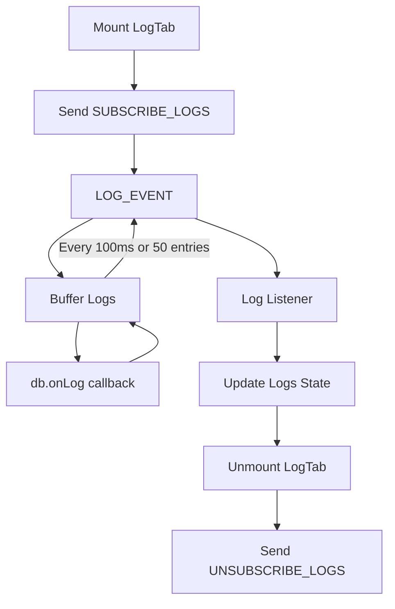

<!--
TEMPLATE MAP (reference-only)
.claude/templates/docs/05-design/03-modules/01-module-template.md

OUTPUT MAP (write to)
agent-docs/05-design/03-modules/devtools-panel.md

NOTES
- Keep headings unchanged.
- Low-Level Design for a specific module.
-->

# Module: DevTools Panel

## 0) File Tree (Design + Code)
```text
agent-docs/05-design/03-modules/devtools-panel.md
src/devtools/
  index.tsx                 # Entry point
  DevTools.tsx              # Root component
  components/
    Sidebar/                # Sidebar navigation
      index.tsx
      SidebarHeader.tsx
      DatabaseList.tsx
      OPFSLink.tsx
      CollapseToggle.tsx
    TableTab/               # Table browser
      index.tsx
      TableList.tsx
      MultiTableHeader.tsx
      TableContent.tsx
      PaginationBar.tsx
    QueryTab/               # SQL editor
      index.tsx
      CodeMirrorEditor.tsx
      QueryResults.tsx
      ExportButton.tsx
    LogTab/                 # Log viewer
      index.tsx
      LogFilter.tsx
      LogList.tsx
    MigrationTab/           # Migration playground
      index.tsx
      HelperNotice.tsx
      TestControls.tsx
    SeedTab/                # Seed playground
      index.tsx
      HelperNotice.tsx
      TestControls.tsx
    AboutTab/               # Database info
      index.tsx
      DatabaseMetadata.tsx
    OPFSBrowser/            # OPFS file tree
      index.tsx
      FileTree.tsx
      FileNode.tsx
      DownloadButton.tsx
    EmptyState/             # Empty state notice
      index.tsx
  hooks/
    useDatabase.ts          # Database operations hook
    useQuery.ts             # Query execution hook
    useLogs.ts              # Log subscription hook
    useConnection.ts        # Connection state hook
  messaging/
    index.ts                # Message senders
```

## 1) Assets (Traceability)
- **API**: See `### Module: Database Inspection`, `### Module: Query Execution` in `01-contracts/01-api.md`
- **Events**: See `LOG_ENTRY`, `DATABASE_CHANGED` in `01-contracts/02-events.md`
- **Types**: See `Component State Types` in `02-schema/01-message-types.md`

## 2) Responsibilities
- Render UI for all 6 tabs (Table, Query, Log, Migration, Seed, About)
- Manage routing via react-router HashRouter
- Send requests via chrome.runtime.sendMessage
- Handle responses and update UI state
- Subscribe to log events and update in real-time
- Display connection state and errors
- Export query results to CSV/JSON

## 3) Internal Logic (Flow)

### Database Query Flow


### Log Subscription Flow


## 4) Classes / Functions

### Components
- **DevTools (Root)**
  - `render()`: Main layout with Sidebar + MainContent
  - `useEffect()`: Initialize connection on mount

- **Sidebar**
  - `render()`: Navigation with database list + OPFS link
  - `handleDatabaseClick(dbname)`: Navigate to `/openedDB/${dbname}`

- **TableList**
  - `useEffect()`: Fetch table list on mount/database change
  - `render()`: Alphabetically sorted list with active state

- **TableContent**
  - `useEffect()`: Fetch table schema + data when table selected
  - `handleSort(column)`: Sort results by column
  - `handlePageChange(delta)`: Update pagination offset
  - `handleLimitChange(limit)`: Update pagination limit

- **CodeMirrorEditor**
  - `handleChange(value)`: Update SQL state
  - `handleExecute()`: Send EXEC_SQL or QUERY_SQL request
  - `handleKeyDown(event)`: Ctrl+Enter triggers execute

- **LogList**
  - `useEffect()`: Subscribe to LOG_EVENT on mount
  - `filter(logs)`: Apply level/field filters
  - `render()`: Display log entries with color coding

- **MigrationTab**
  - `handleTest()`: Send DEV_RELEASE request
  - `handleRollback()`: Send DEV_ROLLBACK request
  - `render()`: Show helper notice + editor + controls

- **OPFSBrowser**
  - `useEffect()`: Fetch files for current path
  - `handleToggle(path)`: Expand/collapse directory
  - `handleDownload(path)`: Send DOWNLOAD_OPFS_FILE request

### Hooks
- **useDatabase(dbname)**
  - `databases`: List of available databases
  - `tables`: List of tables for selected database
  - `refresh()`: Re-fetch database list
  - Returns: `{ databases, tables, loading, error, refresh }`

- **useQuery(dbname, sql, params)**
  - `execute()`: Run SQL query
  - `results`: Query result or null
  - `error`: Error string or null
  - Returns: `{ results, loading, error, execute }`

- **useLogs(dbname, subscriptionId)**
  - `logs`: Array of log entries
  - `subscribe()`: Start log subscription
  - `unsubscribe()`: Stop log subscription
  - Returns: `{ logs, subscribe, unsubscribe, filtering }`

- **useConnection()**
  - `state`: Connection state (connected/connecting/reconnecting/disconnected)
  - `retry()`: Manual reconnection trigger
  - Returns: `{ state, retry }`

### Message Senders (src/devtools/messaging/index.ts)
- `sendGetDatabases()`: Request database list
- `sendGetTableList(dbname)`: Request table list
- `sendGetTableSchema(dbname, tableName)`: Request table DDL
- `sendQueryTableData(dbname, sql, limit, offset)`: Request paginated data
- `sendExecSQL(dbname, sql, params)`: Execute INSERT/UPDATE/DELETE
- `sendSubscribeLogs(dbname)`: Subscribe to log events
- `sendUnsubscribeLogs(subscriptionId)`: Unsubscribe from logs
- `sendDevRelease(dbname, version, migrationSQL, seedSQL)`: Create dev version
- `sendDevRollback(dbname, toVersion)`: Rollback dev version
- `sendGetOpfsFiles(path, dbname)`: List OPFS files
- `sendDownloadOpfsFile(path)`: Download OPFS file

## 5) Dependencies
- **External**: React, react-router-dom, react-icons, CodeMirror
- **Internal**: `src/messaging/channels.ts`, `src/messaging/types.ts`
- **Chrome APIs**: chrome.runtime.sendMessage
