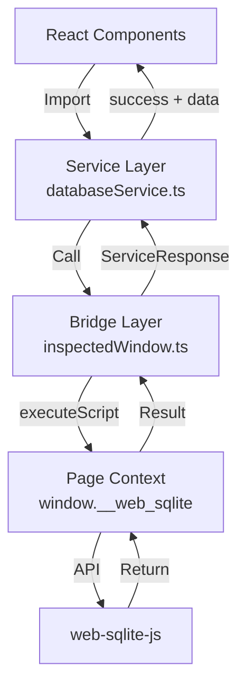
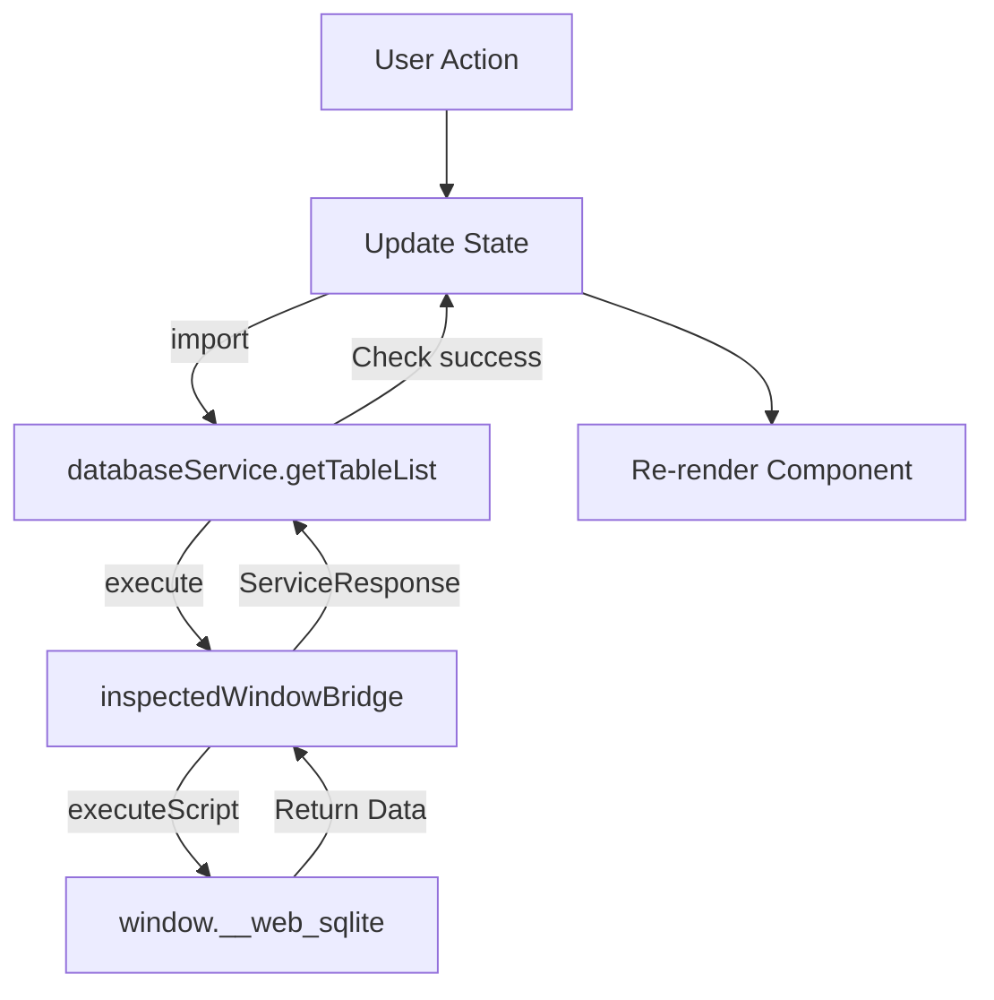
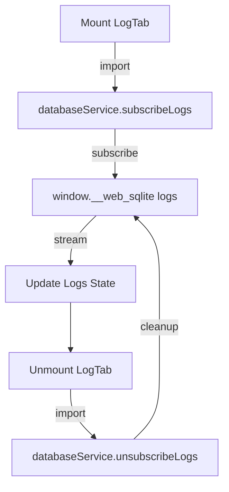

<!--
TEMPLATE MAP (reference-only)
.claude/templates/docs/05-design/03-modules/01-module-template.md

OUTPUT MAP (write to)
agent-docs/05-design/03-modules/devtools-panel.md

NOTES
- Keep headings unchanged.
- Low-Level Design for a specific module.
-->

# Module: DevTools Panel

## 0) File Tree (Design + Code)

```text
agent-docs/05-design/03-modules/devtools-panel.md
src/devtools/
  index.tsx                 # Entry point
  DevTools.tsx              # Root component
  components/
    Sidebar/                # Sidebar navigation
      index.tsx
      SidebarHeader.tsx
      DatabaseList.tsx
      OPFSLink.tsx
      CollapseToggle.tsx
    TableTab/               # Table browser
      index.tsx
      TableList.tsx
      MultiTableHeader.tsx
      TableContent.tsx
      PaginationBar.tsx
    QueryTab/               # SQL editor
      index.tsx
      CodeMirrorEditor.tsx
      QueryResults.tsx
      ExportButton.tsx
    LogTab/                 # Log viewer
      index.tsx
      LogFilter.tsx
      LogList.tsx
    MigrationTab/           # Migration playground
      index.tsx
      HelperNotice.tsx
      TestControls.tsx
    SeedTab/                # Seed playground
      index.tsx
      HelperNotice.tsx
      TestControls.tsx
    AboutTab/               # Database info
      index.tsx
      DatabaseMetadata.tsx
    OPFSBrowser/            # OPFS file tree
      index.tsx
      FileTree.tsx
      FileNode.tsx
      DownloadButton.tsx
    EmptyState/             # Empty state notice
      index.tsx
  hooks/
    useDatabase.ts          # Database operations hook
    useQuery.ts             # Query execution hook
    useLogs.ts              # Log subscription hook
    useConnection.ts        # Connection state hook
  services/                # Service Layer (Feature F-001)
    databaseService.ts      # All database operations (10 functions)
  bridge/                  # Bridge Layer (Feature F-001)
    inspectedWindow.ts      # Chrome API wrapper (executeScript)
  inspectedWindow.ts        # Public API re-exports (backward compatible)
```

## 1) Assets (Traceability)

- **Service Layer API**: See `## 2) Service Layer API` in `01-contracts/01-api.md` (Feature F-001)
- **Service LLD**: See `database-service.md` for detailed service layer documentation
- **Events**: See `LOG_ENTRY`, `DATABASE_CHANGED` in `01-contracts/02-events.md`
- **Types**: See `Component State Types` in `02-schema/01-message-types.md`

## 2) Responsibilities

- **Presentation Layer**: Render UI for all 5 database tabs (Tables, Query, Migration, Seed, About) + separate Log route
- **Service Layer Integration**: Import and call `databaseService` functions for all data access
- **State Management**: Manage React component state (no direct Chrome API calls)
- **Routing**: Navigate via react-router HashRouter with nested routes
- **Error Handling**: Display service layer errors in UI
- **Real-Time Updates**: Subscribe to log events and update in real-time
- **Export**: Download query results as CSV/JSON

## 3) Internal Logic (Flow)

### Three-Layer Architecture (Feature F-001)



### Database Query Flow



### Log Subscription Flow



## 4) Classes / Functions

### Components

- **DevTools (Root)**
  - `render()`: Main layout with Sidebar + MainContent
  - `useEffect()`: Initialize connection on mount
  - **Imports**: `import { databaseService } from '@/devtools/services/databaseService'`

- **Sidebar**
  - `render()`: Navigation with database list + OPFS link
  - `handleDatabaseClick(dbname)`: Navigate to `/openedDB/${dbname}/tables`
  - **Data Access**: `databaseService.getDatabases()` via `useDatabase` hook

- **TableList**
  - `useEffect()`: Fetch table list on mount/database change
  - `render()`: Alphabetically sorted list with active state
  - **Data Access**: `databaseService.getTableList(dbname)` via `useDatabase` hook

- **TableContent**
  - `useEffect()`: Fetch table schema + data when table selected
  - `handleSort(column)`: Sort results by column
  - `handlePageChange(delta)`: Update pagination offset
  - `handleLimitChange(limit)`: Update pagination limit
  - **Data Access**:
    - `databaseService.getTableSchema(dbname, tableName)`
    - `databaseService.queryTableData(dbname, sql, limit, offset)`

- **CodeMirrorEditor**
  - `handleChange(value)`: Update SQL state
  - `handleExecute()`: Execute SQL via service layer
  - `handleKeyDown(event)`: Ctrl+Enter triggers execute
  - **Data Access**: `databaseService.execSQL(dbname, sql, params?)`

- **LogList**
  - `useEffect()`: Subscribe to logs on mount
  - `filter(logs)`: Apply level/field filters
  - `render()`: Display log entries with color coding
  - **Data Access**:
    - `databaseService.subscribeLogs(dbname)` on mount
    - `databaseService.unsubscribeLogs(subscriptionId)` on unmount

- **MigrationTab**
  - `handleTest()`: Create dev version via service layer
  - `handleRollback()`: Rollback dev version
  - \*\*render()`: Show helper notice + editor + controls
  - **Data Access**:
    - `databaseService.devRelease(dbname, version, migrationSQL?, seedSQL?)`
    - `databaseService.devRollback(dbname, toVersion)`

- **OPFSBrowser**
  - `useEffect()`: Fetch files for current path
  - `handleToggle(path)`: Expand/collapse directory
  - `handleDownload(path)`: Download file
  - **Data Access**:
    - `databaseService.getOpfsFiles(path?, dbname?)`
    - `databaseService.downloadOpfsFile(path)`

### Hooks

- **useDatabase(dbname)**
  - **Purpose**: Encapsulate database discovery operations
  - **Data Access**:
    - `databaseService.getDatabases()` for database list
    - `databaseService.getTableList(dbname)` for table list
  - **Returns**: `{ databases, tables, loading, error, refresh }`

- **useQuery(dbname, sql, params)**
  - **Purpose**: Encapsulate query execution
  - **Data Access**:
    - `databaseService.queryTableData(dbname, sql, limit, offset)` for SELECT
    - `databaseService.execSQL(dbname, sql, params?)` for writes
  - **Returns**: `{ results, loading, error, execute }`

- **useLogs(dbname)**
  - **Purpose**: Encapsulate log subscription lifecycle
  - **Data Access**:
    - `databaseService.subscribeLogs(dbname)` on mount
    - `databaseService.unsubscribeLogs(subscriptionId)` on unmount
  - **Returns**: `{ logs, subscribe, unsubscribe, filtering }`

- **useConnection()**
  - **Purpose**: Monitor connection state via heartbeat
  - **Implementation**: Direct `chrome.devtools.inspectedWindow.eval` (not data access)
  - **Returns**: `{ state, retry }`

### Service Layer (Feature F-001)

**Location**: `src/devtools/services/databaseService.ts`

**Import Pattern**:

```typescript
import { databaseService } from "@/devtools/services/databaseService";
```

**Available Functions**:

1. **Database Discovery**:
   - `databaseService.getDatabases()`
   - `databaseService.getTableList(dbname)`

2. **Schema & Data**:
   - `databaseService.getTableSchema(dbname, tableName)`
   - `databaseService.queryTableData(dbname, sql, limit, offset)`
   - `databaseService.execSQL(dbname, sql, params?)`

3. **Logging**:
   - `databaseService.subscribeLogs(dbname)`
   - `databaseService.unsubscribeLogs(subscriptionId)`

4. **Migration & Versioning**:
   - `databaseService.devRelease(dbname, version, migrationSQL?, seedSQL?)`
   - `databaseService.devRollback(dbname, toVersion)`
   - `databaseService.getDbVersion(dbname)`

5. **OPFS**:
   - `databaseService.getOpfsFiles(path?, dbname?)`
   - `databaseService.downloadOpfsFile(path)`

**Response Handling**:

```typescript
const response = await databaseService.getTableList("main");
if (response.success) {
  const tables = response.data; // string[]
  // Update UI state
} else {
  const error = response.error; // string
  // Display error to user
}
```

### Bridge Layer (Feature F-001)

**Location**: `src/devtools/bridge/inspectedWindow.ts`

**Purpose**: Low-level Chrome API wrapper (not used directly by components)

**Usage**: Only service layer imports this:

```typescript
import { inspectedWindowBridge } from "../bridge/inspectedWindow";
```

**Public API Re-exports** (Backward Compatible)

**Location**: `src/devtools/inspectedWindow.ts`

**Purpose**: Re-export service and bridge for backward compatibility

**Deprecated Exports**:

```typescript
/**
 * @deprecated Use {@link databaseService.getDatabases} instead
 */
export const getDatabasesFromInspectedWindow = databaseService.getDatabases;

/**
 * @deprecated Use {@link databaseService.getTableList} instead
 */
export const getTableListFromInspectedWindow = databaseService.getTableList;
```

## 5) Dependencies

- **External**: React, react-router-dom, react-icons, CodeMirror
- **Internal**: `src/devtools/services/databaseService` (service layer)
- **Bridge Layer**: `src/devtools/bridge/inspectedWindow` (via service layer only)
- **Chrome APIs**: `chrome.devtools.inspectedWindow.eval` (via service layer only)

## 6) Service Layer Integration Guide (Feature F-001)

### Component Migration Pattern

**Before** (Direct inspectedWindow access):

```typescript
import { getDatabasesFromInspectedWindow } from "@/devtools/inspectedWindow";

const MyComponent = () => {
  useEffect(() => {
    getDatabasesFromInspectedWindow().then((result) => {
      if (result.success) {
        setDatabases(result.data);
      }
    });
  }, []);
};
```

**After** (Service layer access):

```typescript
import { databaseService } from "@/devtools/services/databaseService";

const MyComponent = () => {
  useEffect(() => {
    databaseService.getDatabases().then((response) => {
      if (response.success) {
        setDatabases(response.data);
      } else {
        setError(response.error);
      }
    });
  }, []);
};
```

### Custom Hook Pattern

**Encapsulate service calls in hooks**:

```typescript
// hooks/useDatabase.ts
import { databaseService } from "@/devtools/services/databaseService";

export const useDatabase = (dbname?: string) => {
  const [databases, setDatabases] = useState<DatabaseSummary[]>([]);
  const [tables, setTables] = useState<string[]>([]);
  const [loading, setLoading] = useState(false);
  const [error, setError] = useState<string>();

  const refresh = useCallback(async () => {
    setLoading(true);
    setError(undefined);

    const dbResponse = await databaseService.getDatabases();
    if (dbResponse.success) {
      setDatabases(dbResponse.data);
    } else {
      setError(dbResponse.error);
    }

    if (dbname) {
      const tableResponse = await databaseService.getTableList(dbname);
      if (tableResponse.success) {
        setTables(tableResponse.data);
      } else {
        setError(tableResponse.error);
      }
    }

    setLoading(false);
  }, [dbname]);

  useEffect(() => {
    refresh();
  }, [refresh]);

  return { databases, tables, loading, error, refresh };
};
```

### Error Handling Pattern

**Always check `success` field**:

```typescript
const response = await databaseService.getTableSchema("main", "users");

if (response.success) {
  // Access data safely (TypeScript knows it's defined)
  const columns = response.data.columns;
  const ddl = response.data.ddl;
  // Update UI
} else {
  // Access error safely (TypeScript knows it's defined)
  const errorMessage = response.error;
  // Display error to user
  showErrorToast(errorMessage);
}
```

## 7) Component File Tree (Detailed)

```text
src/devtools/components/
├── Sidebar/
│   ├── index.tsx                    # Main sidebar component
│   ├── SidebarHeader.tsx            # App branding + collapse toggle
│   ├── DatabaseList.tsx             # Opened DB menu (uses databaseService.getDatabases)
│   ├── OPFSLink.tsx                 # OPFS browser link
│   └── CollapseToggle.tsx           # Sidebar collapse (20% ↔ icon-only)
├── DatabaseTabs/                    # NEW: Database-level tab navigation (F-002)
│   ├── index.tsx                    # DatabaseTabs component (tab header + outlet)
│   └── DatabaseTabHeader.tsx        # 5 tabs: Tables, Query, Migration, Seed, About
├── TablesTab/                       # Tables tab (refactored from DatabaseView)
│   ├── index.tsx                    # TablesTab component
│   ├── TableListSidebar.tsx         # Left column (25% width)
│   ├── OpenedTableTabs.tsx          # Tab bar for opened tables
│   ├── TableDetail.tsx              # Table detail for :tableName route
│   │   ├── TableDataPanel.tsx       # Left: data + pagination (responsive width)
│   │   └── SchemaPanel.tsx          # Right: toggleable, tabbed view (F-003)
│   │       ├── SchemaPanelHeader.tsx   # Toggle button + Table/DDL tabs
│   │       ├── SchemaTableView.tsx     # Column info table
│   │       └── SchemaDDLView.tsx       # CREATE TABLE SQL
│   └── EmptyState.tsx               # No table selected
├── QueryTab/
│   ├── index.tsx                    # Query tab component
│   ├── CodeMirrorEditor.tsx         # CodeMirror 6 SQL editor (uses databaseService.execSQL)
│   ├── QueryResults.tsx             # Result table with sortable columns
│   └── ExportButton.tsx             # CSV/JSON export
├── LogTab/                          # Separate route (not under database tabs)
│   ├── index.tsx                    # Log view component
│   ├── LogFilter.tsx                # Level/field filters
│   └── LogList.tsx                  # Log entries (uses databaseService.subscribeLogs, unsubscribeLogs)
├── MigrationTab/
│   ├── index.tsx                    # Migration tab component
│   ├── HelperNotice.tsx             # Helper notice
│   └── TestControls.tsx             # Release/Rollback controls (uses databaseService.devRelease, devRollback)
├── SeedTab/
│   ├── index.tsx                    # Seed tab component
│   ├── HelperNotice.tsx             # Helper notice
│   └── TestControls.tsx             # Release/Rollback controls (uses databaseService.devRelease, devRollback)
├── AboutTab/
│   ├── index.tsx                    # About tab component
│   └── DatabaseMetadata.tsx         # DB metadata (uses databaseService.getDbVersion)
├── OPFSBrowser/
│   ├── index.tsx                    # OPFS file browser
│   ├── FileTree.tsx                 # Recursive file tree (uses databaseService.getOpfsFiles)
│   ├── FileNode.tsx                 # File/directory node
│   └── DownloadButton.tsx           # Download button (uses databaseService.downloadOpfsFile)
└── EmptyState/
    └── index.tsx                    # Empty state notice
```

## 8) Component Interface Definitions (Feature F-003)

### TableDetail Component (State Owner)

**Location**: `src/devtools/components/TablesTab/TableDetail.tsx`

**Props**: None (uses route params from react-router)

**State**:

```typescript
const [schemaPanelVisible, setSchemaPanelVisible] = useState(false); // Hidden by default
const [schemaTab, setSchemaTab] = useState<"table" | "ddl">("table"); // Default to table view
```

**Handlers**:

```typescript
const handleToggleSchema = useCallback(() => {
  setSchemaPanelVisible((prev) => !prev);
}, []);

const handleSchemaTabChange = useCallback((tab: "table" | "ddl") => {
  setSchemaTab(tab);
}, []);
```

**Render Logic**:

```tsx
<div className="flex-1 flex overflow-hidden">
  {/* Table Data Panel - Responsive width */}
  <TableDataPanel
    className={schemaPanelVisible ? "flex-1" : "w-full"}
    // ... other props
  />

  {/* Schema Panel - Conditional width */}
  <SchemaPanel
    visible={schemaPanelVisible}
    activeTab={schemaTab}
    onToggle={handleToggleSchema}
    onTabChange={handleSchemaTabChange}
    schema={schema}
    loading={schemaLoading}
    error={schemaError}
  />
</div>
```

### SchemaPanel Component

**Location**: `src/devtools/components/TablesTab/SchemaPanel.tsx`

**Props Interface**:

```typescript
interface SchemaPanelProps {
  schema: TableSchema | null;
  loading?: boolean;
  error?: string | null;
  visible: boolean;
  activeTab: "table" | "ddl";
  onToggle: () => void;
  onTabChange: (tab: "table" | "ddl") => void;
}
```

**CSS Classes**:

```typescript
// Panel container - responsive width with transition
const panelClasses = `
  transition-all duration-200 ease-in-out
  ${visible ? "w-80 opacity-100" : "w-0 opacity-0 overflow-hidden"}
  bg-gray-50 border-l border-gray-200
`;
```

**Render Logic**:

```tsx
<div className={panelClasses}>
  {/* Header with toggle + tabs */}
  <SchemaPanelHeader
    visible={visible}
    activeTab={activeTab}
    onToggle={onToggle}
    onTabChange={onTabChange}
  />

  {/* Content - conditional render */}
  {loading && <SchemaLoadingSkeleton />}
  {error && <SchemaErrorMessage error={error} />}
  {!loading && !error && schema && (
    <>
      {activeTab === "table" && <SchemaTableView columns={schema.columns} />}
      {activeTab === "ddl" && <SchemaDDLView ddl={schema.ddl} />}
    </>
  )}
</div>
```

### SchemaPanelHeader Component

**Location**: `src/devtools/components/TablesTab/SchemaPanelHeader.tsx`

**Props Interface**:

```typescript
interface SchemaPanelHeaderProps {
  visible: boolean;
  activeTab: "table" | "ddl";
  onToggle: () => void;
  onTabChange: (tab: "table" | "ddl") => void;
}
```

**Icon Imports**:

```typescript
import { BsReverseLayoutSidebarInsetReverse } from "react-icons/bs";
import { ImTable2 } from "react-icons/im";
```

**Render Structure**:

```tsx
<div className="flex items-center justify-between px-2 py-1.5 bg-gray-50 border-b border-gray-200">
  {/* Left: Toggle button */}
  <button
    type="button"
    onClick={onToggle}
    className="p-1 text-gray-600 hover:text-gray-800 transition-colors"
    title={visible ? "Hide schema panel" : "Show schema panel"}
  >
    <BsReverseLayoutSidebarInsetReverse size={14} />
  </button>

  {/* Right: Tab buttons */}
  <div className="flex items-center gap-1">
    {/* Table icon button */}
    <button
      type="button"
      onClick={() => onTabChange("table")}
      className={`px-2 py-1 text-xs font-medium rounded transition-colors ${
        activeTab === "table"
          ? "bg-emerald-50 text-emerald-600 border border-emerald-200"
          : "text-gray-500 hover:text-gray-700 border border-gray-200 hover:bg-gray-50"
      }`}
      title="Table view"
    >
      <ImTable2 size={14} />
    </button>

    {/* DDL text button */}
    <button
      type="button"
      onClick={() => onTabChange("ddl")}
      className={`px-2 py-1 text-xs font-medium rounded transition-colors ${
        activeTab === "ddl"
          ? "bg-emerald-50 text-emerald-600 border border-emerald-200"
          : "text-gray-500 hover:text-gray-700 border border-gray-200 hover:bg-gray-50"
      }`}
      title="DDL view"
    >
      DDL
    </button>
  </div>
</div>
```

### SchemaTableView Component

**Location**: `src/devtools/components/TablesTab/SchemaTableView.tsx`

**Props Interface**:

```typescript
interface SchemaTableViewProps {
  columns: ColumnInfo[];
}
```

**Render Structure**:

```tsx
<div className="px-4 py-3">
  {/* No "SCHEMA" title - removed per F-003 */}

  {/* Column info table */}
  <table className="w-full text-sm">
    <thead>
      <tr className="bg-gray-100">
        <th className="px-3 py-2 text-left font-medium">Column</th>
        <th className="px-3 py-2 text-left font-medium">Type</th>
        <th className="px-3 py-2 text-left font-medium">Constraints</th>
      </tr>
    </thead>
    <tbody>
      {columns.map((col) => (
        <tr key={col.cid} className="border-t border-gray-100">
          <td className="px-3 py-2">{col.name}</td>
          <td className="px-3 py-2 text-gray-600">{col.type || "-"}</td>
          <td className="px-3 py-2">
            {col.pk > 0 && (
              <span className="inline-block mr-2 text-blue-600 text-xs">
                PK
              </span>
            )}
            {col.notnull > 0 && (
              <span className="inline-block mr-2 text-red-600 text-xs">
                NOT NULL
              </span>
            )}
            {col.dflt_value !== null && (
              <span className="inline-block text-gray-500 text-xs">
                DEFAULT {String(col.dflt_value)}
              </span>
            )}
          </td>
        </tr>
      ))}
    </tbody>
  </table>
</div>
```

### SchemaDDLView Component (Enhanced - Feature F-004)

**Location**: `src/devtools/components/TablesTab/SchemaDDLView.tsx`

**Props Interface**:

```typescript
interface SchemaDDLViewProps {
  ddl: string;
}
```

**State Interface**:

```typescript
interface SchemaDDLViewState {
  copied: boolean;      // Copy success state
  error: string | null; // Error message from clipboard API
}
```

**Icon Imports**:

```typescript
import { MdOutlineContentCopy } from "react-icons/md";
import { FaCheck } from "react-icons/fa";
```

**Syntax Highlighter Import**:

```typescript
import { Prism as SyntaxHighlighter } from "react-syntax-highlighter";
import { prism } from "react-syntax-highlighter/dist/esm/styles/prism";
```

**Handler Functions**:

```typescript
const handleCopy = async () => {
  try {
    await navigator.clipboard.writeText(ddl);
    setCopied(true);
    setError(null);
  } catch (err) {
    setError("Failed to copy");
    setCopied(false);
  }
};

const handleClick = () => {
  if (copied) {
    // Reset copied state on next click
    setCopied(false);
  } else {
    handleCopy();
  }
};
```

**Render Structure**:

```tsx
<div className="px-4 py-3">
  {/* Header row with copy button */}
  <div className="flex items-center justify-between mb-2">
    <div className="flex-1" /> {/* Spacer */}
    <button
      onClick={handleClick}
      className="p-1 text-gray-600 hover:text-gray-800 transition-colors"
      title={copied ? "Copied!" : "Copy DDL"}
    >
      {copied ? (
        <FaCheck className="text-green-600" size={14} />
      ) : (
        <MdOutlineContentCopy size={14} />
      )}
    </button>
  </div>

  {/* Inline error message (conditional) */}
  {error && (
    <div className="text-red-600 text-xs mb-2 text-right">{error}</div>
  )}

  {/* Syntax highlighted DDL (light theme) */}
  <SyntaxHighlighter
    language="sql"
    style={prism}
    customStyle={{
      background: '#f9fafb',    // gray-50 (light theme)
      padding: '12px',
      borderRadius: '6px',
      fontSize: '12px',         // text-xs (12px)
    }}
  >
    {ddl || "-- No DDL available --"}
  </SyntaxHighlighter>
</div>
```

**CSS Classes Reference**:

```css
/* Copy button base */
.p-1.text-gray-600.hover\:text-gray-800.transition-colors

/* Success state */
.text-green-600 (FaCheck icon)

/* Error state */
.text-red-600.text-xs.mb-2.text-right (inline error)

/* Syntax highlighter container */
customStyle: {
  background: '#f9fafb',
  padding: '12px',
  borderRadius: '6px',
  fontSize: '12px',
}
```

### SchemaLoadingSkeleton Component

**Location**: `src/devtools/components/TablesTab/SchemaLoadingSkeleton.tsx`

**Render Structure**:

```tsx
<div className="px-4 py-3">
  <div className="animate-pulse">
    <div className="h-4 bg-gray-200 rounded w-1/4 mb-4" />
    <div className="space-y-2">
      <div className="h-3 bg-gray-200 rounded" />
      <div className="h-3 bg-gray-200 rounded" />
      <div className="h-3 bg-gray-200 rounded" />
    </div>
  </div>
</div>
```

### SchemaErrorMessage Component

**Location**: `src/devtools/components/TablesTab/SchemaErrorMessage.tsx`

**Props Interface**:

```typescript
interface SchemaErrorMessageProps {
  error: string;
}
```

**Render Structure**:

```tsx
<div className="px-4 py-3 border-b border-red-200 bg-red-50">
  <p className="text-sm text-red-600">{error}</p>
</div>
```

## 9) Type Definitions (Feature F-003 + F-004)

```typescript
// From databaseService.ts (already exists)
type TableSchema = {
  columns: Array<{
    cid: number;
    name: string;
    type: string;
    notnull: number;
    dflt_value: any;
    pk: number;
  }>;
  ddl: string;
};

type ColumnInfo = TableSchema["columns"][number];

// Schema tab state type
type SchemaTab = "table" | "ddl";

// Schema panel visibility state
type SchemaPanelVisibility = boolean;

// F-004: DDL copy state types
type DDLCopyState = boolean; // true = copied (show checkmark), false = not copied (show copy icon)

type DDLCopyError = string | null; // Error message from clipboard API, or null if no error
```

### Clipboard API Contract (F-004)

```typescript
// Browser clipboard API
interface Clipboard {
  writeText(text: string): Promise<void>;
}

// Usage in component
const copyToClipboard = async (text: string): Promise<void> => {
  await navigator.clipboard.writeText(text);
};

// Error handling
try {
  await navigator.clipboard.writeText(ddl);
  // Success: set copied state
} catch (error) {
  // Error: set error state, keep copied as false
  setError("Failed to copy");
}
```

**Browser Support**:
- Chrome 66+
- Edge 79+
- Firefox 63+
- Safari 13.1+

**Graceful Degradation**:
- If `navigator.clipboard` is undefined, catch block will set error state
- Inline error message: "Failed to copy"
- Icon remains as copy icon (does not change to checkmark)

## 10) Icon Dependencies (Feature F-003 + F-004)

```json
{
  "react-icons": "^5.5.0"
}
```

**Required imports**:

```typescript
// F-003: Schema Panel Enhancement
import { BsReverseLayoutSidebarInsetReverse } from "react-icons/bs";
import { ImTable2 } from "react-icons/im";

// F-004: DDL Copy Button
import { MdOutlineContentCopy } from "react-icons/md";
import { FaCheck } from "react-icons/fa";
```

## 11) External Dependencies (Feature F-004)

```json
{
  "react-syntax-highlighter": "^15.5.0",
  "@types/react-syntax-highlighter": "^15.5.0"
}
```

**Required imports**:

```typescript
import { Prism as SyntaxHighlighter } from "react-syntax-highlighter";
import { prism } from "react-syntax-highlighter/dist/esm/styles/prism";
```

**Bundle Impact**:
- `react-syntax-highlighter`: ~18.8KB minified (Prism.js variant)
- Tree-shaking: Can import only SQL language and prism theme
- Total bundle increase: < 50KB

**Installation Command**:

```bash
npm install react-syntax-highlighter @types/react-syntax-highlighter
```
