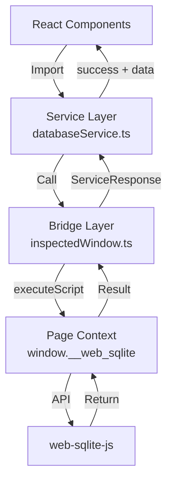
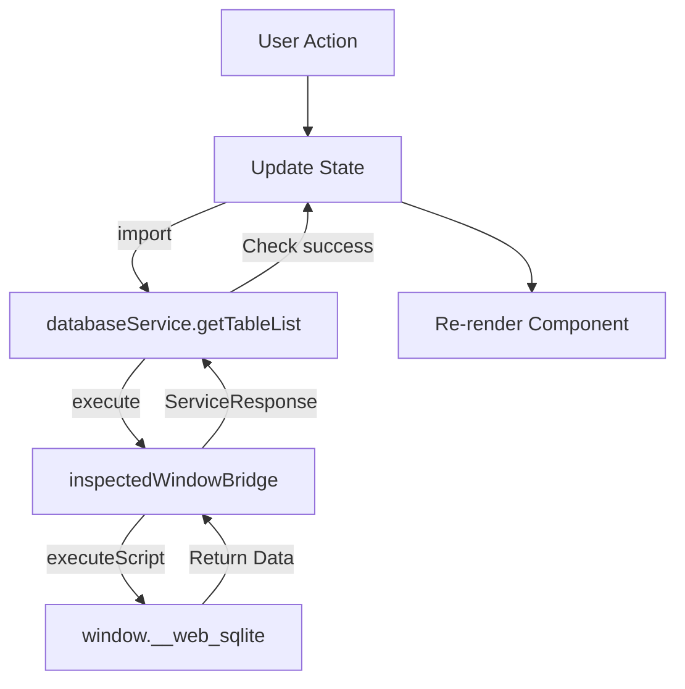
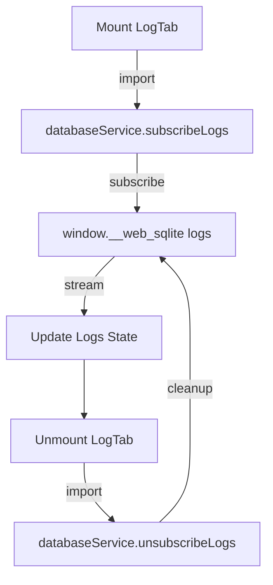

<!--
TEMPLATE MAP (reference-only)
.claude/templates/docs/05-design/03-modules/01-module-template.md

OUTPUT MAP (write to)
agent-docs/05-design/03-modules/devtools-panel.md

NOTES
- Keep headings unchanged.
- Low-Level Design for a specific module.
-->

# Module: DevTools Panel

## 0) File Tree (Design + Code)

```text
agent-docs/05-design/03-modules/devtools-panel.md
src/devtools/
  index.tsx                 # Entry point
  DevTools.tsx              # Root component
  components/
    Sidebar/                # Sidebar navigation
      index.tsx
      SidebarHeader.tsx
      DatabaseList.tsx
      OPFSLink.tsx
      CollapseToggle.tsx
    TableTab/               # Table browser
      index.tsx
      TableList.tsx
      MultiTableHeader.tsx
      TableContent.tsx
      PaginationBar.tsx
    QueryTab/               # SQL editor
      index.tsx
      CodeMirrorEditor.tsx
      QueryResults.tsx
      ExportButton.tsx
    LogTab/                 # Log viewer
      index.tsx
      LogFilter.tsx
      LogList.tsx
    MigrationTab/           # Migration playground
      index.tsx
      HelperNotice.tsx
      TestControls.tsx
    SeedTab/                # Seed playground
      index.tsx
      HelperNotice.tsx
      TestControls.tsx
    AboutTab/               # Database info
      index.tsx
      DatabaseMetadata.tsx
    OPFSBrowser/            # OPFS file tree
      index.tsx
      FileTree.tsx
      FileNode.tsx
      DownloadButton.tsx
    EmptyState/             # Empty state notice
      index.tsx
  hooks/
    useDatabase.ts          # Database operations hook
    useQuery.ts             # Query execution hook
    useLogs.ts              # Log subscription hook
    useConnection.ts        # Connection state hook
  services/                # Service Layer (Feature F-001)
    databaseService.ts      # All database operations (10 functions)
  bridge/                  # Bridge Layer (Feature F-001)
    inspectedWindow.ts      # Chrome API wrapper (executeScript)
  inspectedWindow.ts        # Public API re-exports (backward compatible)
```

## 1) Assets (Traceability)

- **Service Layer API**: See `## 2) Service Layer API` in `01-contracts/01-api.md` (Feature F-001)
- **Service LLD**: See `database-service.md` for detailed service layer documentation
- **Events**: See `LOG_ENTRY`, `DATABASE_CHANGED` in `01-contracts/02-events.md`
- **Types**: See `Component State Types` in `02-schema/01-message-types.md`

## 2) Responsibilities

- **Presentation Layer**: Render UI for all 6 tabs (Table, Query, Log, Migration, Seed, About)
- **Service Layer Integration**: Import and call `databaseService` functions for all data access
- **State Management**: Manage React component state (no direct Chrome API calls)
- **Routing**: Navigate via react-router HashRouter
- **Error Handling**: Display service layer errors in UI
- **Real-Time Updates**: Subscribe to log events and update in real-time
- **Export**: Download query results as CSV/JSON

## 3) Internal Logic (Flow)

### Three-Layer Architecture (Feature F-001)



### Database Query Flow



### Log Subscription Flow



## 4) Classes / Functions

### Components

- **DevTools (Root)**
  - `render()`: Main layout with Sidebar + MainContent
  - `useEffect()`: Initialize connection on mount
  - **Imports**: `import { databaseService } from '@/devtools/services/databaseService'`

- **Sidebar**
  - `render()`: Navigation with database list + OPFS link
  - `handleDatabaseClick(dbname)`: Navigate to `/openedDB/${dbname}`
  - **Data Access**: `databaseService.getDatabases()` via `useDatabase` hook

- **TableList**
  - `useEffect()`: Fetch table list on mount/database change
  - `render()`: Alphabetically sorted list with active state
  - **Data Access**: `databaseService.getTableList(dbname)` via `useDatabase` hook

- **TableContent**
  - `useEffect()`: Fetch table schema + data when table selected
  - `handleSort(column)`: Sort results by column
  - `handlePageChange(delta)`: Update pagination offset
  - `handleLimitChange(limit)`: Update pagination limit
  - **Data Access**:
    - `databaseService.getTableSchema(dbname, tableName)`
    - `databaseService.queryTableData(dbname, sql, limit, offset)`

- **CodeMirrorEditor**
  - `handleChange(value)`: Update SQL state
  - `handleExecute()`: Execute SQL via service layer
  - `handleKeyDown(event)`: Ctrl+Enter triggers execute
  - **Data Access**: `databaseService.execSQL(dbname, sql, params?)`

- **LogList**
  - `useEffect()`: Subscribe to logs on mount
  - `filter(logs)`: Apply level/field filters
  - `render()`: Display log entries with color coding
  - **Data Access**:
    - `databaseService.subscribeLogs(dbname)` on mount
    - `databaseService.unsubscribeLogs(subscriptionId)` on unmount

- **MigrationTab**
  - `handleTest()`: Create dev version via service layer
  - `handleRollback()`: Rollback dev version
  - \*\*render()`: Show helper notice + editor + controls
  - **Data Access**:
    - `databaseService.devRelease(dbname, version, migrationSQL?, seedSQL?)`
    - `databaseService.devRollback(dbname, toVersion)`

- **OPFSBrowser**
  - `useEffect()`: Fetch files for current path
  - `handleToggle(path)`: Expand/collapse directory
  - `handleDownload(path)`: Download file
  - **Data Access**:
    - `databaseService.getOpfsFiles(path?, dbname?)`
    - `databaseService.downloadOpfsFile(path)`

### Hooks

- **useDatabase(dbname)**
  - **Purpose**: Encapsulate database discovery operations
  - **Data Access**:
    - `databaseService.getDatabases()` for database list
    - `databaseService.getTableList(dbname)` for table list
  - **Returns**: `{ databases, tables, loading, error, refresh }`

- **useQuery(dbname, sql, params)**
  - **Purpose**: Encapsulate query execution
  - **Data Access**:
    - `databaseService.queryTableData(dbname, sql, limit, offset)` for SELECT
    - `databaseService.execSQL(dbname, sql, params?)` for writes
  - **Returns**: `{ results, loading, error, execute }`

- **useLogs(dbname)**
  - **Purpose**: Encapsulate log subscription lifecycle
  - **Data Access**:
    - `databaseService.subscribeLogs(dbname)` on mount
    - `databaseService.unsubscribeLogs(subscriptionId)` on unmount
  - **Returns**: `{ logs, subscribe, unsubscribe, filtering }`

- **useConnection()**
  - **Purpose**: Monitor connection state via heartbeat
  - **Implementation**: Direct `chrome.devtools.inspectedWindow.eval` (not data access)
  - **Returns**: `{ state, retry }`

### Service Layer (Feature F-001)

**Location**: `src/devtools/services/databaseService.ts`

**Import Pattern**:

```typescript
import { databaseService } from "@/devtools/services/databaseService";
```

**Available Functions**:

1. **Database Discovery**:
   - `databaseService.getDatabases()`
   - `databaseService.getTableList(dbname)`

2. **Schema & Data**:
   - `databaseService.getTableSchema(dbname, tableName)`
   - `databaseService.queryTableData(dbname, sql, limit, offset)`
   - `databaseService.execSQL(dbname, sql, params?)`

3. **Logging**:
   - `databaseService.subscribeLogs(dbname)`
   - `databaseService.unsubscribeLogs(subscriptionId)`

4. **Migration & Versioning**:
   - `databaseService.devRelease(dbname, version, migrationSQL?, seedSQL?)`
   - `databaseService.devRollback(dbname, toVersion)`
   - `databaseService.getDbVersion(dbname)`

5. **OPFS**:
   - `databaseService.getOpfsFiles(path?, dbname?)`
   - `databaseService.downloadOpfsFile(path)`

**Response Handling**:

```typescript
const response = await databaseService.getTableList("main");
if (response.success) {
  const tables = response.data; // string[]
  // Update UI state
} else {
  const error = response.error; // string
  // Display error to user
}
```

### Bridge Layer (Feature F-001)

**Location**: `src/devtools/bridge/inspectedWindow.ts`

**Purpose**: Low-level Chrome API wrapper (not used directly by components)

**Usage**: Only service layer imports this:

```typescript
import { inspectedWindowBridge } from "../bridge/inspectedWindow";
```

**Public API Re-exports** (Backward Compatible)

**Location**: `src/devtools/inspectedWindow.ts`

**Purpose**: Re-export service and bridge for backward compatibility

**Deprecated Exports**:

```typescript
/**
 * @deprecated Use {@link databaseService.getDatabases} instead
 */
export const getDatabasesFromInspectedWindow = databaseService.getDatabases;

/**
 * @deprecated Use {@link databaseService.getTableList} instead
 */
export const getTableListFromInspectedWindow = databaseService.getTableList;
```

## 5) Dependencies

- **External**: React, react-router-dom, react-icons, CodeMirror
- **Internal**: `src/devtools/services/databaseService` (service layer)
- **Bridge Layer**: `src/devtools/bridge/inspectedWindow` (via service layer only)
- **Chrome APIs**: `chrome.devtools.inspectedWindow.eval` (via service layer only)

## 6) Service Layer Integration Guide (Feature F-001)

### Component Migration Pattern

**Before** (Direct inspectedWindow access):

```typescript
import { getDatabasesFromInspectedWindow } from "@/devtools/inspectedWindow";

const MyComponent = () => {
  useEffect(() => {
    getDatabasesFromInspectedWindow().then((result) => {
      if (result.success) {
        setDatabases(result.data);
      }
    });
  }, []);
};
```

**After** (Service layer access):

```typescript
import { databaseService } from "@/devtools/services/databaseService";

const MyComponent = () => {
  useEffect(() => {
    databaseService.getDatabases().then((response) => {
      if (response.success) {
        setDatabases(response.data);
      } else {
        setError(response.error);
      }
    });
  }, []);
};
```

### Custom Hook Pattern

**Encapsulate service calls in hooks**:

```typescript
// hooks/useDatabase.ts
import { databaseService } from "@/devtools/services/databaseService";

export const useDatabase = (dbname?: string) => {
  const [databases, setDatabases] = useState<DatabaseSummary[]>([]);
  const [tables, setTables] = useState<string[]>([]);
  const [loading, setLoading] = useState(false);
  const [error, setError] = useState<string>();

  const refresh = useCallback(async () => {
    setLoading(true);
    setError(undefined);

    const dbResponse = await databaseService.getDatabases();
    if (dbResponse.success) {
      setDatabases(dbResponse.data);
    } else {
      setError(dbResponse.error);
    }

    if (dbname) {
      const tableResponse = await databaseService.getTableList(dbname);
      if (tableResponse.success) {
        setTables(tableResponse.data);
      } else {
        setError(tableResponse.error);
      }
    }

    setLoading(false);
  }, [dbname]);

  useEffect(() => {
    refresh();
  }, [refresh]);

  return { databases, tables, loading, error, refresh };
};
```

### Error Handling Pattern

**Always check `success` field**:

```typescript
const response = await databaseService.getTableSchema("main", "users");

if (response.success) {
  // Access data safely (TypeScript knows it's defined)
  const columns = response.data.columns;
  const ddl = response.data.ddl;
  // Update UI
} else {
  // Access error safely (TypeScript knows it's defined)
  const errorMessage = response.error;
  // Display error to user
  showErrorToast(errorMessage);
}
```

## 7) Component File Tree (Detailed)

```text
src/devtools/components/
├── Sidebar/
│   ├── index.tsx                    # Main sidebar component
│   ├── SidebarHeader.tsx            # App branding + collapse toggle
│   ├── DatabaseList.tsx             # Opened DB menu (uses databaseService.getDatabases)
│   ├── OPFSLink.tsx                 # OPFS browser link
│   └── CollapseToggle.tsx           # Sidebar collapse (20% ↔ icon-only)
├── TableTab/
│   ├── index.tsx                    # Table browser tab
│   ├── TableList.tsx                # Left column table list (uses databaseService.getTableList)
│   ├── MultiTableHeader.tsx         # Tab bar for open tables
│   ├── TableContent.tsx             # Data + DDL display (uses databaseService.getTableSchema, queryTableData)
│   └── PaginationBar.tsx            # Page controls (custom limit, refresh, close)
├── QueryTab/
│   ├── index.tsx                    # SQL editor tab
│   ├── CodeMirrorEditor.tsx         # CodeMirror 6 SQL editor (uses databaseService.execSQL)
│   ├── QueryResults.tsx             # Result table with sortable columns
│   └── ExportButton.tsx             # CSV/JSON export
├── LogTab/
│   ├── index.tsx                    # Log viewer tab
│   ├── LogFilter.tsx                # Level/field filters
│   └── LogList.tsx                  # Log entries (uses databaseService.subscribeLogs, unsubscribeLogs)
├── MigrationTab/
│   ├── index.tsx                    # Migration playground
│   ├── HelperNotice.tsx             # Helper notice
│   └── TestControls.tsx             # Release/Rollback controls (uses databaseService.devRelease, devRollback)
├── SeedTab/
│   ├── index.tsx                    # Seed playground
│   ├── HelperNotice.tsx             # Helper notice
│   └── TestControls.tsx             # Release/Rollback controls (uses databaseService.devRelease, devRollback)
├── AboutTab/
│   ├── index.tsx                    # Database info tab
│   └── DatabaseMetadata.tsx         # DB metadata (uses databaseService.getDbVersion)
├── OPFSBrowser/
│   ├── index.tsx                    # OPFS file browser
│   ├── FileTree.tsx                 # Recursive file tree (uses databaseService.getOpfsFiles)
│   ├── FileNode.tsx                 # File/directory node
│   └── DownloadButton.tsx           # Download button (uses databaseService.downloadOpfsFile)
└── EmptyState/
    └── index.tsx                    # Empty state notice
```
