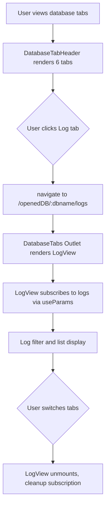
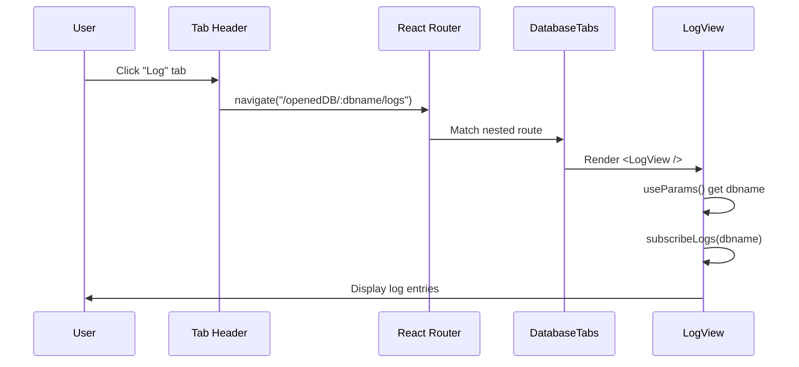

<!--
TEMPLATE MAP (reference-only)
.claude/templates/docs/05-design/03-modules/01-module-template.md

OUTPUT MAP (write to)
agent-docs/05-design/03-modules/log-tab-integration.md

NOTES
- Keep headings unchanged.
- Low-Level Design for Log Tab Integration (Feature F-009).
- Simple integration feature - reuses existing LogView component.
-->

# Module: Log Tab Integration (Feature F-009)

## 0) File Tree (Design + Code)

```text
agent-docs/05-design/03-modules/log-tab-integration.md
src/devtools/components/DatabaseTabs/
  DatabaseTabHeader.tsx         # Add IoTimeOutline icon and logs tab (MODIFIED)
src/devtools/
  DevTools.tsx                  # Add logs route inside DatabaseTabs (MODIFIED)
src/devtools/components/LogTab/
  LogView.tsx                   # Existing component (NO CHANGES)
  LogList.tsx                   # Existing component (NO CHANGES)
  LogFilter.tsx                 # Existing component (NO CHANGES)
```

## 1) Assets (Traceability)

- **API**: No new API contracts needed - reuses existing `subscribeLogs()` / `unsubscribeLogs()` from `### Module: Log Streaming` in `01-contracts/01-api.md`
- **HLD**: See `## 14) Database Tab Navigation with Log Tab (Feature F-002, F-009)` in `03-architecture/01-hld.md`
- **Feature**: See `F-009: Log Tab Integration` in `01-discovery/features/F-009-log-tab.md`
- **Theme**: See F-007 semantic color tokens (primary-600, gray-700, gray-600, gray-500, gray-200, gray-100)

## 2) Responsibilities

- **Tab Navigation**: Add "Log" tab to database tab header between "Query" and "Migration"
- **Route Integration**: Add `/openedDB/:dbname/logs` route inside DatabaseTabs nested routes
- **Component Reuse**: Render existing `LogView` component without modifications
- **Icon Integration**: Add `IoTimeOutline` icon from `react-icons/io5` for visual consistency
- **Active State Management**: Highlight Log tab when on `/openedDB/:dbname/logs` route
- **Backward Compatibility**: Keep existing `/logs/:dbname` route (optional redirect)

## 3) Internal Logic (Flow)

### Tab Navigation Flow



### Route Matching Flow



### Active State Detection

```mermaid
flowchart TD
    A[DatabaseTabHeader renders] --> B[useLocation() get pathname]
    B --> C{pathname includes /logs}
    C -->|Yes| D[Apply active styles to Log tab]
    C -->|No| E[Apply inactive styles to Log tab]
    D --> F[border-b-2 border-primary-600 text-primary-600]
    E --> G[border-b-2 border-transparent text-gray-600 hover:text-gray-800]
```

## 4) Classes / Functions

### DatabaseTabHeader Component (Modified)

**File**: `src/devtools/components/DatabaseTabs/DatabaseTabHeader.tsx`

**Changes**:

```typescript
// ADD IMPORT
import { IoTimeOutline } from "react-icons/io5";

// UPDATE DATABASE_TABS ARRAY (insert after "query" tab)
export const DATABASE_TABS: DatabaseTab[] = [
  { path: "tables", label: "Tables", icon: <CiViewTable size={18} /> },
  { path: "query", label: "Query", icon: <BsFiletypeSql size={16} /> },
  { path: "logs", label: "Log", icon: <IoTimeOutline size={18} /> },   // NEW
  { path: "migration", label: "Migration", icon: <MdOutlineQueryBuilder size={18} /> },
  { path: "seed", label: "Seed", icon: <FaSeedling size={16} /> },
  { path: "about", label: "About", icon: <FaInfoCircle size={16} /> },
];
```

**Responsibilities**:

- Render 6 tabs instead of 5
- Add IoTimeOutline icon for Log tab
- Position Log tab between Query and Migration (3rd position)
- Apply active/inactive styles based on route matching

**No state changes needed** - uses existing route-based state management

**No event handler changes** - uses existing tab click handler

**Styling**:

- Active tab: `border-b-2 border-primary-600 text-primary-600`
- Inactive tab: `border-b-2 border-transparent text-gray-600 hover:text-gray-800 hover:bg-gray-50`
- Icon size: `size={18}` for consistency with other tabs

### DevTools Component (Modified)

**File**: `src/devtools/DevTools.tsx`

**Changes**:

```typescript
// Inside DatabaseTabs nested routes, add logs route BEFORE migration route
<Route path="/openedDB/:dbname" element={<DatabaseTabs />}>
  <Route index element={<Navigate to="tables" replace />} />

  <Route path="tables" element={<TablesTab />}>
    <Route path=":tableName" element={<TableDetail />} />
  </Route>

  <Route path="query" element={<QueryTab ... />} />
  <Route path="logs" element={<LogView />} />          {/* NEW */}
  <Route path="migration" element={<MigrationTab />} />
  <Route path="seed" element={<SeedTab />} />
  <Route path="about" element={<AboutTab />} />
</Route>
```

**Responsibilities**:

- Add logs route inside DatabaseTabs nested route structure
- Position logs route before migration route to maintain tab order
- Render existing LogView component (no props needed)

**No state changes needed**

**No event handler changes needed**

**Route Order Critical**: Generic `/openedDB` route must precede `/openedDB/:dbname` route (already done in F-008)

### LogView Component (Unchanged)

**File**: `src/devtools/components/LogTab/LogView.tsx`

**No Modifications Required** - Component already works with route params:

```typescript
// Existing implementation (NO CHANGES)
const LogView: React.FC = () => {
  const { dbname } = useParams<{ dbname: string }>();
  const [logs, setLogs] = useState<LogEntry[]>([]);
  const [filter, setFilter] = useState<LogLevel>("all");

  // Component gets dbname from route params automatically
  // Works with both /logs/:dbname and /openedDB/:dbname/logs routes
};
```

**Responsibilities** (unchanged):

- Subscribe to database logs via `subscribeLogs(dbname)`
- Display log filter controls
- Display log list with 500 entry ring buffer
- Unsubscribe on unmount

**No changes to props, state, or event handlers**

**No changes to styling**

**No changes to dependencies**

## 5) Dependencies

### Internal Dependencies

- `src/devtools/components/DatabaseTabs/DatabaseTabHeader.tsx` - Modified (add logs tab)
- `src/devtools/DevTools.tsx` - Modified (add logs route)
- `src/devtools/components/LogTab/LogView.tsx` - Unchanged (reused as-is)
- `src/devtools/services/databaseService.ts` - Unchanged (subscribeLogs, unsubscribeLogs)

### External Dependencies

- `react-router-dom` - useNavigate, useParams, Route, Navigate
- `react-icons/io5` - IoTimeOutline (NEW icon import)
- F-007 Theme Tokens - primary-600, gray-700, gray-600, gray-500, gray-200, gray-100

### Chrome APIs

- None directly (uses service layer which uses inspectedWindow bridge)

## 6) Design Patterns

### Component Reuse Pattern

- **Zero Modifications**: LogView component works as-is with new route
- **Route Parameter Extraction**: `useParams()` already handles dbname extraction
- **Service Layer Integration**: Already uses `subscribeLogs()` / `unsubscribeLogs()`

### Tab Navigation Pattern (Existing)

- **Configuration-Driven**: DATABASE_TABS array defines all tabs
- **Consistent Styling**: All tabs use same active/inactive CSS classes
- **Icon Sizing**: Consistent size={18} for tab icons

### Nested Routing Pattern (Existing)

- **Outlet Rendering**: DatabaseTabs component uses <Outlet /> for nested routes
- **Route Order**: Generic routes precede parameterized routes
- **Index Redirect**: Default tab redirect on generic route

## 7) Styling Specifications

### Theme Tokens (F-007)

| Token         | Value                   | Usage                        |
| ------------- | ----------------------- | ---------------------------- |
| `primary-600` | `#059669` (emerald-600) | Active tab border, text      |
| `gray-700`    | `#374151` (gray-700)    | Headings, primary text       |
| `gray-600`    | `#4b5563` (gray-600)    | Inactive tab text, icons     |
| `gray-500`    | `#6b7280` (gray-500)    | Muted text                   |
| `gray-200`    | `#e5e7eb` (gray-200)    | Default tab border           |
| `gray-100`    | `#f3f4f6` (gray-100)    | Hover background for tabs    |
| `gray-50`     | `#f9fafb` (gray-50)     | Hover background alternative |

### Tab Styling

#### Active Tab

```css
/* Log tab when active (route matches /openedDB/:dbname/logs) */
.tab-active {
  @apply border-b-2 border-primary-600 text-primary-600;
}
```

#### Inactive Tab

```css
/* Log tab when not active */
.tab-inactive {
  @apply border-b-2 border-transparent text-gray-600;
}

.tab-inactive:hover {
  @apply text-gray-800 hover:bg-gray-50;
}
```

#### Icon Styling

```css
/* IoTimeOutline icon */
.tab-icon {
  @apply inline-block align-middle;
  size: 18px; /* Consistent with other tabs */
}
```

### Component Layout

```
DatabaseTabHeader (flex row)
├── Tables tab (CiViewTable, size=18)
├── Query tab (BsFiletypeSql, size=16)
├── Log tab (IoTimeOutline, size=18) ← NEW
├── Migration tab (MdOutlineQueryBuilder, size=18)
├── Seed tab (FaSeedling, size=16)
└── About tab (FaInfoCircle, size=16)
```

## 8) Error Handling

### No New Error Scenarios

- **Route Not Found**: Handled by React Router (404 route already exists)
- **Database Not Found**: Handled by LogView component (existing error handling)
- **Log Subscription Failed**: Handled by LogView component (existing error handling)

### Edge Cases

1. **Direct URL access**: User navigates to `/openedDB/:dbname/logs` directly
   - LogView renders with dbname from route params
   - Works same as clicking tab

2. **Database name changes**: User switches databases while on Log tab
   - LogView detects dbname change via useParams
   - Re-subscribes to logs for new database

3. **Tab switching**: User clicks another tab while logs loading
   - LogView unmounts, cleanup subscription
   - No memory leaks

4. **Old route access**: User navigates to `/logs/:dbname` (deprecated route)
   - Route still exists (backward compatibility)
   - Optional: Add redirect to `/openedDB/:dbname/logs`

## 9) Testing Considerations

### Manual Testing Scenarios

1. **Tab visibility**
   - Navigate to `/openedDB/:dbname/tables`
   - Verify "Log" tab appears in tab header
   - Verify tab is 3rd position (between Query and Migration)

2. **Icon rendering**
   - Verify IoTimeOutline clock icon displays
   - Verify icon size matches other tabs (18px)
   - Verify icon alignment with tab text

3. **Navigation**
   - Click "Log" tab
   - Verify URL changes to `/openedDB/:dbname/logs`
   - Verify LogView component renders
   - Verify tab highlight (active state)

4. **Active state styling**
   - Verify active tab has border-b-2 border-primary-600
   - Verify active tab text is primary-600
   - Verify inactive tabs have transparent border

5. **Tab switching**
   - Click "Log" tab
   - Click "Tables" tab
   - Click "Log" tab again
   - Verify smooth transitions, no visual glitches

6. **Direct URL access**
   - Navigate directly to `/openedDB/mydb/logs`
   - Verify LogView renders with correct database
   - Verify Log tab is highlighted

7. **Database switching**
   - Open database A, navigate to Log tab
   - Switch to database B
   - Verify logs update to database B

8. **Log functionality**
   - Click "Log" tab
   - Verify log filter controls display
   - Verify log list displays entries
   - Verify log subscription works

9. **Backward compatibility**
   - Navigate to `/logs/:dbname` (old route)
   - Verify LogView still renders
   - Optional: Verify redirect to new route

10. **Keyboard navigation**
    - Use Tab key to navigate to Log tab
    - Press Enter to activate
    - Verify navigation occurs

### Integration Testing

```typescript
// Route integration tests
describe("Log Tab Integration", () => {
  it("should render Log tab in DatabaseTabHeader");
  it("should navigate to /openedDB/:dbname/logs when clicked");
  it("should apply active styles when on logs route");
  it("should render LogView component at logs route");
  it("should preserve LogView functionality (filter, list)");
  it("should handle tab switching correctly");
});
```

## 10) Performance Considerations

### Bundle Size Impact

- **Icon Import**: IoTimeOutline from react-icons/io5 (tree-shakeable, ~1KB)
- **No New Components**: Reuses existing LogView component
- **Total Impact**: < 5KB increase

### Rendering Performance

- **Tab Count**: 6 tabs (was 5), negligible rendering impact
- **Route Changes**: Client-side navigation (React Router), no page reload
- **LogView Optimization**: Existing component already optimized (ring buffer, virtual scrolling if needed)

### Data Fetching

- **No New Fetching**: Uses existing log subscription mechanism
- **Subscription Cleanup**: LogView already handles unmount cleanup
- **No Memory Leaks**: Existing subscription management prevents leaks

## 11) Accessibility

### Semantic HTML

- Tab button: `<button>` element with `role="tab"`
- Navigation: `<nav>` element with proper ARIA labels

### ARIA Labels

- Log tab button: `role="tab"`, `aria-label="Log tab"`
- Active state: `aria-selected="true"` when active
- Inactive state: `aria-selected="false"` when inactive

### Keyboard Navigation

- **Tab Key**: Navigate to Log tab button
- **Enter/Space**: Activate Log tab
- **Arrow Keys**: Navigate between tabs (if implemented)

### Screen Reader Support

- Tab label announced: "Log tab"
- Active state announced: "Log tab, selected"
- Icon labeled: Clock icon represents time-based logs

### Color Contrast

- Active tab text (primary-600): Meets WCAG AA standards
- Inactive tab text (gray-600): Meets WCAG AA standards
- Border visibility (primary-600 vs transparent): Meets WCAG AA standards

## 12) Implementation Status

### Planned Changes (F-009)

- [x] HLD Update (Stage 3) - Section 14 added to 01-hld.md
- [x] LLD Design (Stage 5) - This document
- [x] Task Management (Stage 7) - Micro-spec created (TASK-305)
- [x] Implementation (Stage 8) - Code changes complete

### Code Changes Required

- [x] Update `DatabaseTabHeader.tsx`:
  - [x] Add import: `import { IoTimeOutline } from "react-icons/io5";`
  - [x] Add logs tab to DATABASE_TABS array after "query" tab

- [x] Update `DevTools.tsx`:
  - [x] Add `<Route path="logs" element={<LogView />} />` inside DatabaseTabs route
  - [x] Place logs route before migration route

### No Changes Required

- [x] `LogView.tsx` - Works as-is with new route
- [x] `LogList.tsx` - No changes needed
- [x] `LogFilter.tsx` - No changes needed
- [x] `databaseService.ts` - subscribeLogs/unsubscribeLogs already exist
- [x] API contracts - No new endpoints needed

### Feature References

- **HLD**: See `## 14) Database Tab Navigation with Log Tab (Feature F-002, F-009)` in `03-architecture/01-hld.md`
- **Feature Spec**: See `F-009: Log Tab Integration` in `01-discovery/features/F-009-log-tab.md`
- **API Contract**: See `### Module: Log Streaming` in `01-contracts/01-api.md` (no changes needed)

### Definition of Done

- [x] DatabaseTabHeader.tsx updated with IoTimeOutline icon and logs tab
- [x] DevTools.tsx updated with logs route inside DatabaseTabs
- [x] Build passes with no errors (npm run build)
- [x] Type checking passes (npm run typecheck)
- [x] Manual testing complete (all 10 scenarios)
- [x] Tab navigation works correctly
- [x] Active state styling applied correctly
- [x] LogView functionality preserved
- [x] No console errors
- [x] Feature spec marked complete
- [x] Status document updated (Stage 8 complete)

### Implementation Notes

- **Complexity**: Low (simple integration of existing component)
- **Estimated Time**: 0.5-1 hour
- **Files Modified**: 2 files (DatabaseTabHeader.tsx, DevTools.tsx)
- **Risk**: Low (reuses existing, tested LogView component)
- **Dependencies**: None (all dependencies already exist)
