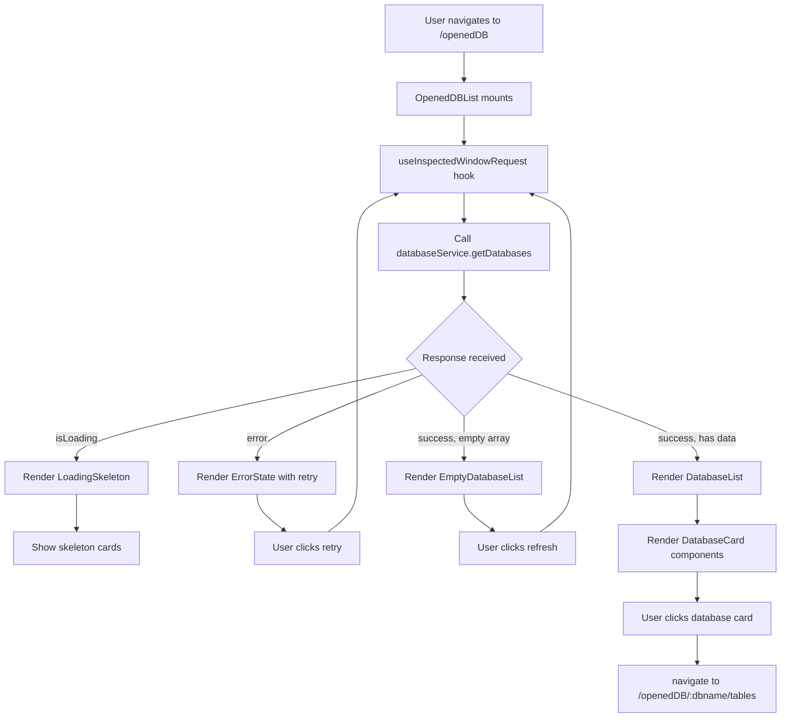
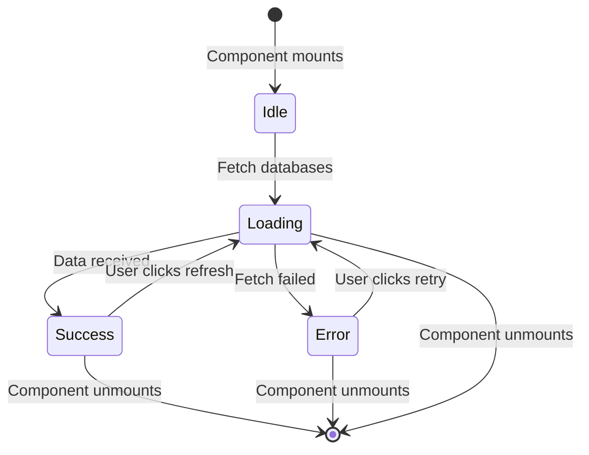
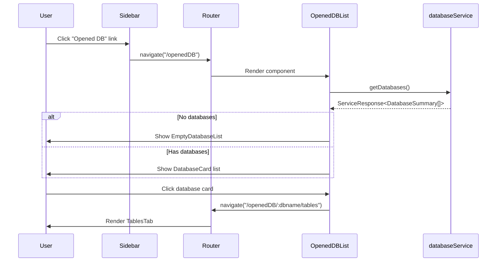
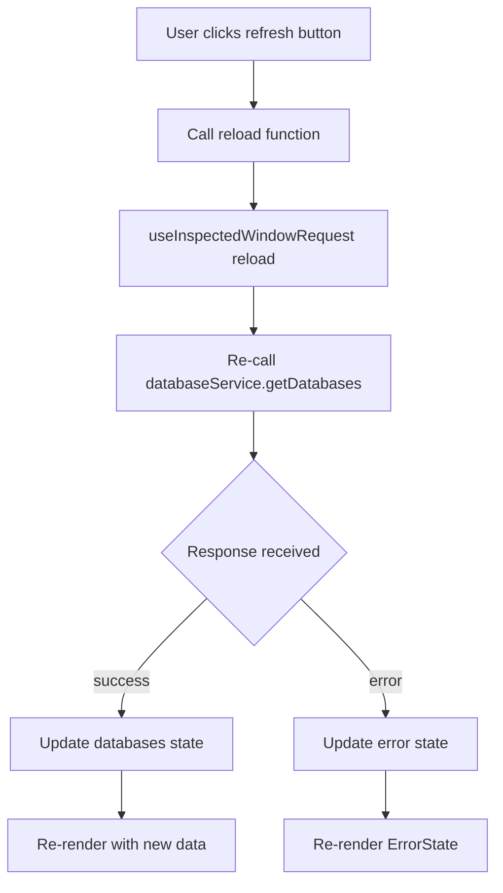

<!--
TEMPLATE MAP (reference-only)
.claude/templates/docs/05-design/03-modules/01-module-template.md

OUTPUT MAP (write to)
agent-docs/05-design/03-modules/opened-db-list.md

NOTES
- Keep headings unchanged.
- Low-Level Design for Opened Database List Route (Feature F-008).
-->

# Module: Opened Database List Route (Feature F-008)

## 0) File Tree (Design + Code)

```text
agent-docs/05-design/03-modules/opened-db-list.md
src/devtools/components/OpenedDBList/
  index.tsx                    # Main component export
  OpenedDBList.tsx             # Main component with data fetching
  DatabaseCard.tsx             # Individual database card
  EmptyDatabaseList.tsx        # Empty state component
  LoadingSkeleton.tsx          # Loading state
  ErrorState.tsx               # Error state with retry
src/devtools/
  DevTools.tsx                 # Route configuration (updated)
src/devtools/components/Sidebar/
  DatabaseList.tsx             # Sidebar link update (to="/openedDB")
```

## 1) Assets (Traceability)

- **API**: See `## 2) Service Layer API` → `### Module: Database Discovery` → `#### Function: getDatabases()` in `01-contracts/01-api.md`
- **HLD**: See `## 13) Opened Database List Route Architecture` in `03-architecture/01-hld.md`
- **Feature**: See `F-008: Opened Database List Route` in `01-discovery/features/F-008-opened-database-list-route.md`
- **Theme**: See F-007 semantic color tokens (primary-600, secondary-500, gray-700, etc.)

## 2) Responsibilities

- **Centralized Database Navigation**: Provide single view of all opened databases
- **Route Handler**: Handle `/openedDB` route (generic, no dbname parameter)
- **Data Fetching**: Use existing `databaseService.getDatabases()` function
- **State Management**: Manage loading, error, empty, and success states
- **User Interactions**: Handle refresh button clicks and database card navigation
- **Empty State UX**: Display helpful message when no databases are opened
- **Error Recovery**: Provide retry mechanism for failed data fetches

## 3) Internal Logic (Flow)

### Component Architecture Flow



### State Machine for Data Fetching



### Navigation Flow



### Refresh Flow



## 4) Classes / Functions

### OpenedDBList Component

**File**: `src/devtools/components/OpenedDBList/OpenedDBList.tsx`

```typescript
interface OpenedDBListProps {
  // No props - uses route-based data fetching
}

interface OpenedDBListState {
  databases: DatabaseSummary[] | null;
  isLoading: boolean;
  error: string | null;
}

/**
 * Main component for /openedDB route
 * Displays list of all opened databases
 * Handles loading, error, and empty states
 */
export const OpenedDBList: React.FC<OpenedDBListProps> = () => {
  const {
    data: databases,
    isLoading,
    error,
    reload,
  } = useInspectedWindowRequest(
    () => databaseService.getDatabases(),
    [],
    []
  );

  if (isLoading) {
    return <LoadingSkeleton />;
  }

  if (error) {
    return <ErrorState error={error} retry={reload} />;
  }

  if (!databases || databases.length === 0) {
    return <EmptyDatabaseList refresh={reload} />;
  }

  return (
    <div className="container mx-auto px-4 py-6">
      <Header reload={reload} count={databases.length} />
      <DatabaseList databases={databases} />
    </div>
  );
};
```

**Responsibilities**:

- Data fetching via `useInspectedWindowRequest` hook
- State management (loading, error, empty, success)
- Conditional rendering based on state
- Pass reload function to child components

**Event Handlers**:

- None directly - all handlers passed via props

**Dependencies**:

- `useInspectedWindowRequest` hook
- `databaseService.getDatabases()`
- Child components: Header, DatabaseList, LoadingSkeleton, ErrorState, EmptyDatabaseList

### DatabaseCard Component

**File**: `src/devtools/components/OpenedDBList/DatabaseCard.tsx`

```typescript
interface DatabaseCardProps {
  database: DatabaseSummary;
  isActive?: boolean;
}

/**
 * Clickable card for a single database
 * Displays database icon, name, and table count
 * Navigates to /openedDB/:dbname/tables on click
 */
export const DatabaseCard: React.FC<DatabaseCardProps> = ({
  database,
  isActive = false,
}) => {
  const navigate = useNavigate();

  const handleClick = useCallback(() => {
    const encodedDbName = encodeURIComponent(database.name);
    navigate(`/openedDB/${encodedDbName}/tables`);
  }, [database.name, navigate]);

  return (
    <button
      onClick={handleClick}
      className={`
        flex items-center gap-3 w-full px-4 py-3 rounded-lg border
        transition-all duration-200
        ${isActive
          ? 'bg-primary-50 border-primary-600 shadow-sm'
          : 'bg-white border-gray-200 hover:border-primary-300 hover:shadow-sm'
        }
      `}
      aria-label={`Open database ${database.name}`}
    >
      <FaDatabase
        className={isActive ? 'text-primary-600' : 'text-gray-600'}
        size={20}
      />
      <div className="flex-1 text-left">
        <div className={`font-medium ${isActive ? 'text-primary-600' : 'text-gray-700'}`}>
          {database.name}
        </div>
        {database.tableCount !== undefined && (
          <div className="text-xs text-secondary-500">
            {database.tableCount} {database.tableCount === 1 ? 'table' : 'tables'}
          </div>
        )}
      </div>
    </button>
  );
};
```

**Responsibilities**:

- Display database information (name, table count)
- Handle click navigation to database tables tab
- Visual feedback for hover and active states
- Accessibility (ARIA labels, keyboard navigation)

**Event Handlers**:

- `handleClick`: Navigate to `/openedDB/:dbname/tables`

**Styling**:

- Active state: `bg-primary-50 border-primary-600 shadow-sm`
- Hover state: `hover:border-primary-300 hover:shadow-sm`
- Default state: `bg-white border-gray-200`
- Icons: `FaDatabase` (20px)

**Dependencies**:

- `react-router-dom` (useNavigate)
- `react-icons/fa` (FaDatabase)
- F-007 theme tokens (primary-600, secondary-500)

### EmptyDatabaseList Component

**File**: `src/devtools/components/OpenedDBList/EmptyDatabaseList.tsx`

```typescript
interface EmptyDatabaseListProps {
  refresh: () => void;
}

/**
 * Empty state displayed when no databases are opened
 * Shows helpful message and refresh button
 */
export const EmptyDatabaseList: React.FC<EmptyDatabaseListProps> = ({
  refresh,
}) => {
  return (
    <div className="flex flex-col items-center justify-center h-full p-8 text-center">
      <SiSqlite className="text-primary-600 text-6xl mb-6" />
      <h1 className="text-2xl font-semibold text-gray-700 mb-2">
        No Opened Databases
      </h1>
      <p className="text-gray-600 mb-4">
        Could not detect any opened databases.
      </p>
      <p className="text-gray-500 text-sm mb-6">
        Open a page that uses web-sqlite-js to see databases here.
      </p>
      <button
        onClick={refresh}
        className="flex items-center gap-2 px-4 py-2 bg-primary-600 text-white rounded hover:bg-primary-700 transition-colors"
        aria-label="Refresh database list"
      >
        <IoMdRefresh size={18} />
        Refresh
      </button>
    </div>
  );
};
```

**Responsibilities**:

- Display helpful empty state message
- Provide refresh button to retry data fetch
- Visual consistency with root EmptyState (SiSqlite icon)

**Event Handlers**:

- `onClick` (refresh button): Call `refresh()` prop

**Styling**:

- Icon: `SiSqlite`, `text-primary-600`, `text-6xl`
- Title: `text-2xl font-semibold text-gray-700`
- Message: `text-gray-600`
- Instructions: `text-gray-500 text-sm`
- Button: `bg-primary-600 text-white hover:bg-primary-700`

**Dependencies**:

- `react-icons/si` (SiSqlite)
- `react-icons/io` (IoMdRefresh)
- F-007 theme tokens (primary-600, primary-700, gray-700, gray-600, gray-500)

### LoadingSkeleton Component

**File**: `src/devtools/components/OpenedDBList/LoadingSkeleton.tsx`

```typescript
/**
 * Loading skeleton for database list
 * Shows 3 skeleton cards while fetching
 */
export const LoadingSkeleton: React.FC = () => {
  return (
    <div className="container mx-auto px-4 py-6">
      <HeaderSkeleton />
      <div className="flex flex-col gap-3">
        {[1, 2, 3].map((i) => (
          <div
            key={i}
            className="flex items-center gap-3 px-4 py-3 rounded-lg border border-gray-200 bg-white"
          >
            <div className="w-5 h-5 bg-gray-200 rounded animate-pulse" />
            <div className="flex-1">
              <div className="h-4 bg-gray-200 rounded w-32 mb-2 animate-pulse" />
              <div className="h-3 bg-gray-200 rounded w-20 animate-pulse" />
            </div>
          </div>
        ))}
      </div>
    </div>
  );
};
```

**Responsibilities**:

- Display loading placeholder while fetching databases
- Show 3 skeleton cards (typical list size)
- Visual consistency with actual database cards

**Styling**:

- Skeleton items: `bg-gray-200 animate-pulse`
- Layout matches DatabaseCard (flex, gap, padding)

**Dependencies**:

- None (pure UI component)

### ErrorState Component

**File**: `src/devtools/components/OpenedDBList/ErrorState.tsx`

```typescript
interface ErrorStateProps {
  error: string;
  retry: () => void;
}

/**
 * Error state displayed when database fetch fails
 * Shows error message and retry button
 */
export const ErrorState: React.FC<ErrorStateProps> = ({ error, retry }) => {
  return (
    <div className="flex flex-col items-center justify-center h-full p-8 text-center">
      <div className="text-red-600 text-6xl mb-6">
        <FaExclamationCircle size={64} />
      </div>
      <h1 className="text-2xl font-semibold text-gray-700 mb-2">
        Failed to Load Databases
      </h1>
      <p className="text-gray-600 mb-6">
        {error || 'An unexpected error occurred.'}
      </p>
      <button
        onClick={retry}
        className="flex items-center gap-2 px-4 py-2 bg-primary-600 text-white rounded hover:bg-primary-700 transition-colors"
        aria-label="Retry loading database list"
      >
        <IoMdRefresh size={18} />
        Retry
      </button>
    </div>
  );
};
```

**Responsibilities**:

- Display error message from service layer
- Provide retry button to re-attempt data fetch
- Clear visual indication of error state

**Event Handlers**:

- `onClick` (retry button): Call `retry()` prop

**Styling**:

- Icon: `FaExclamationCircle`, `text-red-600`, `text-6xl`
- Title: `text-2xl font-semibold text-gray-700`
- Error message: `text-gray-600`
- Button: `bg-primary-600 text-white hover:bg-primary-700`

**Dependencies**:

- `react-icons/fa` (FaExclamationCircle)
- `react-icons/io` (IoMdRefresh)
- F-007 theme tokens (primary-600, primary-700, gray-700, gray-600, red-600)

### Header Component

**File**: `src/devtools/components/OpenedDBList/Header.tsx`

```typescript
interface HeaderProps {
  reload: () => void;
  count?: number;
}

/**
 * Header for database list view
 * Shows title and refresh button
 */
export const Header: React.FC<HeaderProps> = ({ reload, count }) => {
  return (
    <div className="flex items-center justify-between mb-6">
      <h1 className="text-2xl font-semibold text-gray-700">
        Opened Databases
        {count !== undefined && (
          <span className="ml-2 text-sm font-normal text-gray-500">
            ({count})
          </span>
        )}
      </h1>
      <button
        onClick={reload}
        className="p-2 text-gray-600 hover:text-gray-800 rounded hover:bg-gray-100 transition-colors"
        aria-label="Refresh database list"
        title="Refresh database list"
      >
        <IoMdRefresh size={20} />
      </button>
    </div>
  );
};
```

**Responsibilities**:

- Display page title with database count
- Provide refresh button in header
- Consistent header styling across app

**Event Handlers**:

- `onClick` (refresh button): Call `reload()` prop

**Styling**:

- Title: `text-2xl font-semibold text-gray-700`
- Count badge: `text-sm font-normal text-gray-500`
- Refresh button: `p-2 text-gray-600 hover:text-gray-800 rounded hover:bg-gray-100`

**Dependencies**:

- `react-icons/io` (IoMdRefresh)
- F-007 theme tokens (gray-700, gray-600, gray-500, gray-100, gray-800)

### DatabaseList Component

**File**: `src/devtools/components/OpenedDBList/DatabaseList.tsx`

```typescript
interface DatabaseListProps {
  databases: DatabaseSummary[];
}

/**
 * List of database cards
 * Renders DatabaseCard for each database
 */
export const DatabaseList: React.FC<DatabaseListProps> = ({ databases }) => {
  const location = useLocation();

  // Extract current database name from route (if any)
  const currentDbName = useMemo(() => {
    const match = location.pathname.match(/^\/openedDB\/([^/]+)/);
    return match ? decodeURIComponent(match[1]) : null;
  }, [location.pathname]);

  return (
    <nav
      className="flex flex-col gap-3"
      aria-label="Database list"
    >
      {databases.map((database) => (
        <DatabaseCard
          key={database.name}
          database={database}
          isActive={database.name === currentDbName}
        />
      ))}
    </nav>
  );
};
```

**Responsibilities**:

- Render list of DatabaseCard components
- Determine active database from current route
- Semantic HTML (nav element with ARIA label)

**Event Handlers**:

- None (delegated to DatabaseCard children)

**Styling**:

- Container: `flex flex-col gap-3`
- ARIA: `aria-label="Database list"`

**Dependencies**:

- `react-router-dom` (useLocation, useMemo)
- DatabaseCard child component

## 5) Dependencies

### Internal Dependencies

- `src/devtools/hooks/useInspectedWindowRequest.ts` - Data fetching hook
- `src/devtools/services/databaseService.ts` - `getDatabases()` function
- `src/devtools/components/Sidebar/DatabaseList.tsx` - Sidebar link update

### External Dependencies

- `react-router-dom` - Routing (useNavigate, useLocation, HashRouter)
- `react-icons/fa` - FaDatabase, FaExclamationCircle
- `react-icons/io` - IoMdRefresh
- `react-icons/si` - SiSqlite
- F-007 Theme Tokens - primary-600, primary-700, secondary-500, gray-700, gray-600, gray-500, gray-100, gray-200, gray-800

### Chrome APIs

- None directly (uses service layer which uses inspectedWindow bridge)

## 6) Design Patterns

### Component Composition Pattern

- **Single Responsibility**: Each component has one clear purpose
- **Props Interface**: Explicit TypeScript interfaces for all props
- **Controlled Components**: Parent manages state, children receive callbacks

### State Management Pattern

- **Hook-Based State**: Uses `useInspectedWindowRequest` for data fetching
- **Local State**: No global state (React Router handles route state)
- **Optimistic UI**: Preserve existing data during refresh (no flicker)

### Conditional Rendering Pattern

```typescript
// Three-phase conditional render
if (isLoading) return <LoadingSkeleton />;
if (error) return <ErrorState error={error} retry={reload} />;
if (!data || data.length === 0) return <EmptyDatabaseList refresh={reload} />;
return <DatabaseList databases={data} reload={reload} />;
```

### Navigation Pattern

- **Declarative Routing**: Uses React Router's `useNavigate()` for navigation
- **URL Encoding**: `encodeURIComponent()` for database names in URLs
- **Active State Detection**: `useLocation()` to highlight current database

## 7) Styling Specifications

### Theme Tokens (F-007)

| Token           | Value                   | Usage                         |
| --------------- | ----------------------- | ----------------------------- |
| `primary-600`   | `#059669` (emerald-600) | Actions, icons, active states |
| `primary-700`   | `#047857` (emerald-700) | Hover states for buttons      |
| `primary-50`    | `#ecfdf5` (emerald-50)  | Active card background        |
| `secondary-500` | `#6b7280` (gray-500)    | Secondary text (table count)  |
| `gray-700`      | `#374151` (gray-700)    | Headings, primary text        |
| `gray-600`      | `#4b5563` (gray-600)    | Body text, icons              |
| `gray-500`      | `#6b7280` (gray-500)    | Muted text, instructions      |
| `gray-200`      | `#e5e7eb` (gray-200)    | Borders, skeleton backgrounds |
| `gray-100`      | `#f3f4f6` (gray-100)    | Hover background for buttons  |
| `red-600`       | `#dc2626` (red-600)     | Error icons, error text       |

### Component-Specific Styling

#### DatabaseCard

```css
/* Base styles */
.database-card {
  @apply flex items-center gap-3 w-full px-4 py-3 rounded-lg border;
  @apply transition-all duration-200;
}

/* Default state */
.database-card-default {
  @apply bg-white border-gray-200;
}

/* Hover state */
.database-card-hover:hover {
  @apply border-primary-300 shadow-sm;
}

/* Active state */
.database-card-active {
  @apply bg-primary-50 border-primary-600 shadow-sm;
}
```

#### EmptyDatabaseList & ErrorState

```css
/* Container */
.empty-state-container {
  @apply flex flex-col items-center justify-center h-full p-8 text-center;
}

/* Icon */
.empty-state-icon {
  @apply text-primary-600 text-6xl mb-6;
}

/* Title */
.empty-state-title {
  @apply text-2xl font-semibold text-gray-700 mb-2;
}

/* Message */
.empty-state-message {
  @apply text-gray-600 mb-4;
}

/* Instructions */
.empty-state-instructions {
  @apply text-gray-500 text-sm mb-6;
}

/* Button */
.empty-state-button {
  @apply flex items-center gap-2 px-4 py-2 bg-primary-600 text-white rounded;
  @apply hover:bg-primary-700 transition-colors;
}
```

#### LoadingSkeleton

```css
/* Skeleton item */
.skeleton-item {
  @apply flex items-center gap-3 px-4 py-3 rounded-lg border;
  @apply border-gray-200 bg-white;
}

/* Skeleton elements */
.skeleton-icon {
  @apply w-5 h-5 bg-gray-200 rounded animate-pulse;
}

.skeleton-title {
  @apply h-4 bg-gray-200 rounded w-32 mb-2 animate-pulse;
}

.skeleton-subtitle {
  @apply h-3 bg-gray-200 rounded w-20 animate-pulse;
}
```

### Responsive Design

- **Container**: `container mx-auto px-4 py-6` (responsive padding)
- **Gap spacing**: `gap-3` (0.75rem = 12px)
- **Card padding**: `px-4 py-3` (16px horizontal, 12px vertical)
- **Icon sizes**: 20px (card), 64px (empty/error state)
- **Font sizes**: `text-2xl` (title), `text-sm` (metadata), `text-xs` (table count)

## 8) Error Handling

### Service Layer Errors

```typescript
// ServiceResponse format from getDatabases()
interface ServiceResponse<T> {
  success: boolean;
  data?: T;
  error?: string;
}

// Error handling in component
if (error) {
  return <ErrorState error={error} retry={reload} />;
}
```

### Error Scenarios

1. **API Not Available**: `window.__web_sqlite` not found
   - Error message: "web-sqlite-js not available"
   - User action: Click retry button

2. **Execution Error**: Script execution failed
   - Error message: "Failed to fetch databases"
   - User action: Click retry button

3. **Empty Result**: No databases opened
   - Not an error - show EmptyDatabaseList component
   - User action: Click refresh button

### Error Recovery

- **Retry Button**: Re-calls `reload()` function from `useInspectedWindowRequest`
- **Automatic Retry**: None (manual only to avoid spam)
- **Error Logging**: Errors logged to console.debug (DevTools only)

### Error Boundaries

- Parent component (DevTools.tsx) should have error boundary
- Catches React rendering errors (not service errors)
- Displays fallback UI on component crash

## 9) Testing Considerations

### Unit Tests

```typescript
// OpenedDBList component tests
describe("OpenedDBList", () => {
  it("should render loading skeleton on mount");
  it("should render error state when fetch fails");
  it("should render empty state when no databases");
  it("should render database list when data exists");
  it("should call reload when refresh button clicked");
});

// DatabaseCard component tests
describe("DatabaseCard", () => {
  it("should display database name");
  it("should display table count if available");
  it("should navigate on click");
  it("should apply active styles when isActive=true");
  it("should have proper ARIA labels");
});

// EmptyDatabaseList component tests
describe("EmptyDatabaseList", () => {
  it("should display SiSqlite icon");
  it("should display correct title and message");
  it("should call refresh when button clicked");
  it("should have proper ARIA labels");
});
```

### Integration Tests

```typescript
// Route integration tests
describe("OpenedDBList Route", () => {
  it("should render OpenedDBList at /openedDB");
  it("should fetch databases on mount");
  it("should navigate to /openedDB/:dbname/tables on card click");
  it("should preserve existing data during refresh");
});

// Sidebar integration tests
describe("Sidebar Link", () => {
  it("should navigate to /openedDB when clicked");
  it("should highlight when on /openedDB route");
  it("should highlight when on /openedDB/:dbname/* route");
});
```

### Manual Testing Scenarios

1. **No databases opened**
   - Navigate to `/openedDB`
   - Verify EmptyDatabaseList shows
   - Click refresh button
   - Verify re-fetch occurs

2. **Single database**
   - Open one database
   - Navigate to `/openedDB`
   - Verify one DatabaseCard shows
   - Click card
   - Verify navigation to `/openedDB/:dbname/tables`

3. **Multiple databases**
   - Open multiple databases
   - Navigate to `/openedDB`
   - Verify all databases show as cards
   - Verify alphabetical order (if applicable)
   - Click each card
   - Verify correct navigation

4. **Error state**
   - Mock API failure
   - Navigate to `/openedDB`
   - Verify ErrorState shows
   - Click retry button
   - Verify re-fetch occurs

5. **Loading state**
   - Slow network (mock)
   - Navigate to `/openedDB`
   - Verify LoadingSkeleton shows
   - Verify skeleton matches card layout

6. **Refresh functionality**
   - Load database list
   - Click header refresh button
   - Verify loading indicator
   - Verify list updates

7. **Active state highlighting**
   - Navigate to `/openedDB`
   - Click database card
   - Navigate back to `/openedDB`
   - Verify clicked database has active styling

8. **Keyboard navigation**
   - Navigate to `/openedDB`
   - Use Tab key
   - Verify focus moves through cards
   - Press Enter on focused card
   - Verify navigation occurs

9. **URL encoding**
   - Open database with special characters (e.g., "my-db (1)")
   - Navigate to `/openedDB`
   - Click card
   - Verify URL is properly encoded
   - Verify navigation works

10. **Sidebar link**
    - Click "Opened DB" in sidebar
    - Verify navigation to `/openedDB`
    - Verify sidebar link is highlighted

## 10) Performance Considerations

### Data Fetching

- **Optimistic UI**: Preserve existing database list during refresh (no flicker)
- **Request Cancellation**: Cancel in-flight request on unmount (handled by `useInspectedWindowRequest`)
- **No Auto-Refresh**: Manual refresh only to avoid unnecessary API calls

### Rendering

- **React.memo**: Consider memoizing DatabaseCard (if performance issues)
- **Key Props**: Use `database.name` as key (stable identifier)
- **Conditional Rendering**: Early returns for loading/error states

### Bundle Size

- **Route-Based Code Splitting**: OpenedDBList loads only when needed (lazy loading)
- **Icon Tree Shaking**: react-icons are tree-shakeable
- **Component Size**: Small components (< 1KB each)

### List Rendering

- **Typical List Size**: 1-5 databases (not large)
- **No Virtualization**: Not needed for small lists
- **CSS Transitions**: `duration-200` for smooth hover effects

## 11) Accessibility

### Semantic HTML

- `<nav>` for database list with `aria-label="Database list"`
- `<button>` for clickable cards (keyboard accessible)
- `<h1>` for page title

### ARIA Labels

- Database card: `aria-label="Open database {name}"`
- Refresh button: `aria-label="Refresh database list"`
- Retry button: `aria-label="Retry loading database list"`
- Header button: `title="Refresh database list"`

### Keyboard Navigation

- **Tab Order**: Database cards are tabbable
- **Enter/Space**: Activate card button
- **Focus Indicators**: Visible outline on focus
- **Skip Links**: Not needed (short list)

### Screen Reader Support

- Database name announced: "Open database main"
- Table count announced: "5 tables"
- Empty state message announced
- Error message announced

### Color Contrast

- All text meets WCAG AA standards
- Primary color (emerald-600) meets contrast ratio
- Error red meets contrast ratio

## 12) Implementation Status

### Planned Components (F-008)

- [ ] OpenedDBList.tsx - Main component with data fetching
- [ ] DatabaseCard.tsx - Individual database card
- [ ] EmptyDatabaseList.tsx - Empty state component
- [ ] LoadingSkeleton.tsx - Loading state
- [ ] ErrorState.tsx - Error state with retry
- [ ] Header.tsx - Page header with refresh button
- [ ] DatabaseList.tsx - List container with active state detection

### Route Configuration (DevTools.tsx)

- [ ] Add `/openedDB` route (BEFORE `/openedDB/:dbname`)
- [ ] Update Sidebar "Opened DB" link from `/` to `/openedDB`
- [ ] Verify route order (generic before parameterized)

### Service Layer Integration

- [ ] Use existing `databaseService.getDatabases()` function
- [ ] No service layer changes required

### Feature References

- **HLD**: See `## 13) Opened Database List Route Architecture` in `03-architecture/01-hld.md`
- **Feature Spec**: See `F-008: Opened Database List Route` in `01-discovery/features/F-008-opened-database-list-route.md`
- **API Contract**: See `getDatabases()` in `01-contracts/01-api.md`

### Definition of Done

- [ ] All components implemented with TypeScript strict mode
- [ ] All components use F-007 theme tokens
- [ ] Route configuration updated
- [ ] Sidebar link updated
- [ ] Loading, error, empty states implemented
- [ ] Keyboard navigation tested
- [ ] ARIA labels added
- [ ] Build passes with no errors
- [ ] Manual testing complete (all 10 scenarios)
- [ ] Feature spec marked complete
