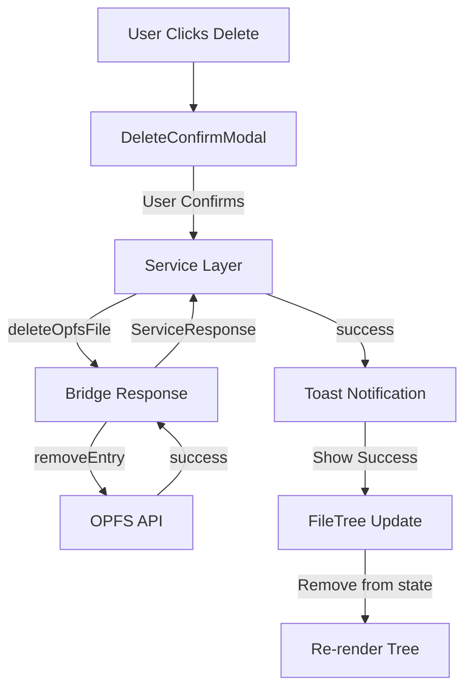
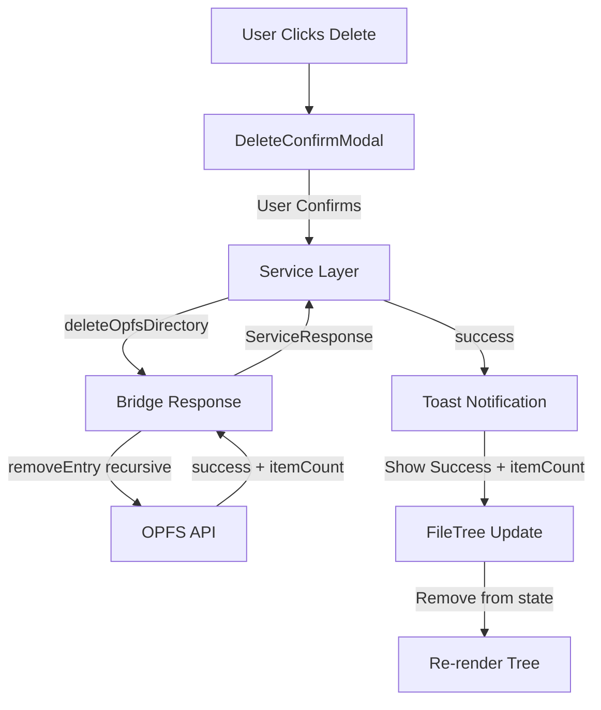
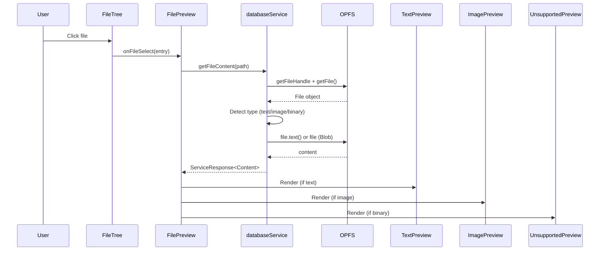

<!--
TEMPLATE MAP (reference-only)
.claude/templates/docs/05-design/03-modules/01-module-template.md

OUTPUT MAP (write to)
agent-docs/05-design/03-modules/opfs-browser.md

NOTES
- Keep headings unchanged.
- Low-Level Design for a specific module.
- Updated for Feature F-012: OPFS Browser Enhancement
-->

# Module: OPFS File Browser

## 0) File Tree (Design + Code)

```text
agent-docs/05-design/03-modules/opfs-browser.md
src/devtools/services/databaseService.ts  # Service layer functions (F-001, F-012)
src/devtools/components/OPFSBrowser/
  index.tsx                # Main OPFS browser component (OPFSGallery)
  FileTree.tsx             # Recursive file tree component
  FileNode.tsx             # Individual file/directory node
  DeleteConfirmModal.tsx   # Delete confirmation modal (F-012 NEW)
  MetadataPanel.tsx        # Enhanced metadata display (F-012 NEW)
  TreeLines.tsx            # Guided tree lines component (F-012 NEW)
  Toast.tsx                # Toast notifications (F-012 NEW)
```

## 1) Assets (Traceability)

- **API**: See `### Module: OPFS File Browser` in `01-contracts/01-api.md`
- **Events**: None (request/response only)
- **Types**: See `OPFS File Types` in `02-schema/01-message-types.md`
- **Feature**: F-012: OPFS Browser Enhancement

## 2) Responsibilities

- List OPFS files and directories with enhanced metadata
- Lazy-load directory contents on expand
- Display file sizes in human-readable format
- Display guided tree lines for hierarchy visualization (F-012)
- Download files to user's machine
- Delete files and directories with confirmation (F-012)
- Show enhanced metadata (type, modified date, path) (F-012)
- Handle OPFS access errors (not supported, permission denied)

## 3) Internal Logic (Flow)

### OPFS File Listing Flow (Enhanced - F-012)

```mermaid
flowchart TD
    U[User Expands Folder] --> P[FileTree Component]
    P -->|getOpfsFiles| S[databaseService]
    S -->|execute| B[inspectedWindowBridge]
    B -->|navigator.storage.getDirectory| O[OPFS API]
    O -->|entries + metadata| B[Bridge Response]
    B -->|ServiceResponse| S[Service Layer]
    S -->|OpfsFileEntry[]| P[FileTree Component]
    P -->|Render with tree lines| F[File Tree Nodes]
```

### File Download Flow (Unchanged)

```mermaid
flowchart TD
    U[User Clicks Download] --> B[DownloadButton]
    B -->|downloadOpfsFile| S[databaseService]
    S -->|execute| BW[inspectedWindowBridge]
    BW -->|getFile + createObjectURL| O[OPFS API]
    O -->|Blob| BW[Bridge Response]
    BW -->|blobUrl| S[Service Layer]
    S -->|{blobUrl, filename}| B[DownloadButton]
    B -->|Trigger Download| A[Hidden Anchor]
    A -->|click, remove| D[File Saved]
```

### File Delete Flow (F-012 NEW)



### Directory Delete Flow (F-012 NEW)



## 4) Classes / Functions

### Service Layer (src/devtools/services/databaseService.ts)

**Existing Functions**:

- **getOpfsFiles(path?, dbname?)**
  - Enhanced with metadata fetching (F-012)
  - Returns: `OpfsFileEntry[]` with:
    - `lastModified`: ISO 8601 timestamp
    - `fileType`: File type classification
    - `itemCount`: Child counts for directories

- **downloadOpfsFile(path)**
  - Unchanged from existing implementation
  - Returns: `{ blobUrl, filename }`

**New Functions (F-012)**:

- **deleteOpfsFile(path)**
  - Navigates to parent directory via `getDirectoryHandle()`
  - Calls `removeEntry(filename)` to delete file
  - Returns: `ServiceResponse<void>`
  - Error cases: File not found, permission denied

- **deleteOpfsDirectory(path)**
  - Navigates to parent directory via `getDirectoryHandle()`
  - Counts items before deletion
  - Calls `removeEntry(dirname, { recursive: true })`
  - Returns: `ServiceResponse<{ itemCount: number }>`
  - Error cases: Directory not found, not empty (without flag)

### Components

**FileTree (src/devtools/components/OPFSBrowser/FileTree.tsx)**

- Enhanced with guided tree lines (F-012)
- Enhanced with delete buttons (F-012)
- Enhanced with metadata display on hover (F-012)
- Props: `{ onDownload, onDelete }`
- State: `{ expanded, loading, entries, error }`
- `handleExpand()`: Fetches child entries, sets expanded=true
- `handleDelete()`: Opens DeleteConfirmModal
- `render()`: Recursive tree with guided lines and action buttons

**FileNode (src/devtools/components/OPFSBrowser/FileNode.tsx)**

- Enhanced with file type badges (F-012)
- Enhanced with last modified display (F-012)
- Enhanced with delete button (F-012)
- Props: `{ entry, level, onDownload, onDelete }`
- `render()`: Displays icon + name + metadata + actions
- Icons: `FaFolder` (closed), `FaFolderOpen` (open), `FaFile` (file)
- File type badges with color coding (F-012)

**DeleteConfirmModal (src/devtools/components/OPFSBrowser/DeleteConfirmModal.tsx)** - F-012 NEW

- Props: `{ item, isOpen, onClose, onConfirm }`
- Displays item metadata in grid layout
- Shows warning message for irreversible action
- Confirm button with loading state
- Cancel and close on backdrop click, Escape key
- Accessibility: `role="dialog"`, `aria-modal="true"`, focus trap

**MetadataPanel (src/devtools/components/OPFSBrowser/MetadataPanel.tsx)** - F-012 NEW

- Props: `{ item, visible }`
- Displays enhanced metadata:
  - File type badge with color coding
  - Last modified timestamp
  - Full path in monospace font
  - Item count for directories
- Hover/click to show full details

**TreeLines (src/devtools/components/OPFSBrowser/TreeLines.tsx)** - F-012 NEW

- Reusable tree line connectors
- Vertical lines via CSS `::before` on container
- Horizontal lines via CSS `::before` on items
- Responsive: Hide when sidebar collapsed (< 200px)
- Styling: 1px solid `gray-200` (#e5e7eb)

**Toast (src/devtools/components/OPFSBrowser/Toast.tsx)** - F-012 NEW

- Props: `{ type, title, message, duration, onClose }`
- Variants: `success` (green), `error` (red)
- Auto-dismiss after duration (default 3s)
- Fixed position: top-right corner
- Accessibility: `role="alert"`, `aria-live="polite"`

**OPFSGallery (src/devtools/components/OPFSBrowser/index.tsx)**

- Enhanced with toast container (F-012)
- Enhanced with delete confirmation handling (F-012)
- State: `{ downloadStatus, toast, deleteModal }`
- `handleDownload()`: Existing download logic
- `handleDelete()`: New delete logic (F-012)
- `handleDeleteConfirm()`: Execute delete, show toast (F-012)

### Type Definitions

```typescript
// Enhanced OpfsFileEntry (F-012)
interface OpfsFileEntry {
  name: string;
  path: string; // Full path from OPFS root
  type: "file" | "directory"; // Changed from 'kind'
  size: number; // Raw size in bytes
  sizeFormatted: string; // Human-readable (e.g., "1.2 MB")
  lastModified?: string; // ISO 8601 timestamp
  fileType?: string; // "SQLite Database", "JSON Data", etc.
  itemCount?: {
    files: number; // Child file count (directories only)
    directories: number; // Child directory count (directories only)
  };
}

// Delete operation types (F-012)
interface DeleteResult {
  success: boolean;
  deletedPath: string;
  itemCount?: number; // For directories
}
```

## 5) Dependencies

- **External**:
  - react-icons: `FaFolder`, `FaFolderOpen`, `FaFile`, `FaDownload`, `IoMdTrash`, `FaExclamationTriangle`, `FaCheck`, `FaExclamationCircle`
- **Internal**:
  - `src/devtools/services/databaseService.ts` (service layer)
  - `src/devtools/hooks/useInspectedWindowRequest.ts` (data fetching)
- **Browser APIs**:
  - `navigator.storage.getDirectory()`
  - `URL.createObjectURL()`
  - `getFile()` for metadata

## 6) Error Handling

- **OPFS_NOT_SUPPORTED**: Browser doesn't support OPFS
  - Display: Empty state with message "OPFS not supported in this browser"
  - Action: None (user cannot upgrade browser via extension)

- **PERMISSION_DENIED**: User denied OPFS access
  - Display: Error message "OPFS access denied"
  - Action: Retry button

- **FILE_NOT_FOUND**: File deleted between list and download/delete
  - Display: Inline error "File not found"
  - Action: Refresh button

- **DELETE_FAILED**: Delete operation failed (F-012)
  - Display: Toast notification with error message
  - Action: Retry button in toast, keeps item in tree

- **METADATA_UNAVAILABLE**: Last modified date not available (F-012)
  - Display: Hide timestamp field gracefully
  - Action: None (non-critical field)

## 7) UI/UX Patterns (F-012)

### Guided Tree Lines

```
Visual Pattern:
├── Root Directory/
│   ├── Subdirectory 1/
│   │   ├── File 1.txt
│   │   └── File 2.txt
│   └── File 3.txt
```

**CSS Implementation**:

- Vertical line: `.tree-children::before` (absolute, left: 12px, 1px solid gray-200)
- Horizontal line: `.tree-item::before` (absolute, left: -12px, 12px wide, 1px solid gray-200)
- Last child adjustment: Extend horizontal line only

### Delete Confirmation

**Modal Layout**:

- Header: "Delete {item_name}?"
- Metadata Grid: Type, Size, Modified, Path
- Warning: Red text "This action cannot be undone."
- Actions: Cancel (gray), Delete (red with trash icon)

**Warning Hierarchy**:

- Files: Standard warning
- Directories: Enhanced warning with item count
- Large directories (> 100 items): Additional caution note

### Metadata Display

**File Type Badges**:

- SQLite Database: Blue (`bg-blue-100 text-blue-700`)
- JSON Data: Yellow (`bg-yellow-100 text-yellow-700`)
- Text File: Gray (`bg-gray-100 text-gray-700`)
- Image File: Purple (`bg-purple-100 text-purple-700`)
- Unknown: Default gray

**Timestamp Format**:

- Display: `YYYY-MM-DD HH:mm` (local time)
- Tooltip: Full ISO 8601 string on hover

### Toast Notifications

**Success Toast**:

- Icon: Green checkmark
- Title: "Deleted successfully"
- Message: "{item_name} has been deleted."
- Duration: 3 seconds

**Error Toast**:

- Icon: Red error icon
- Title: "Delete failed"
- Message: {error_message}
- Action: "Retry" button (reopens modal)
- Duration: 5 seconds

## 8) Accessibility (F-012)

- **Delete Buttons**: `aria-label="Delete {filename}"`
- **Modal**: `role="dialog"`, `aria-modal="true"`, focus trap
- **Keyboard**: Escape closes modal, Enter confirms delete
- **Tree Navigation**: Arrow keys for tree traversal (future enhancement)
- **Toast**: `role="alert"`, `aria-live="polite"`

## 9) Performance Considerations (F-012)

- **Tree Lines**: CSS-only implementation (no JS layout)
- **Metadata Fetching**: Batch with `getOpfsFiles()` call
- **Lazy Loading**: Unchanged (fetch on expand only)
- **Delete Operations**: < 2 seconds for typical files/directories
- **Toast Dismiss**: Auto-dismiss after 3-5 seconds to avoid DOM buildup

## 10) Browser Compatibility (F-012)

- **OPFS API**: Chrome 86+, Edge 86+, Opera 72+
- **Recursive Delete**: Chrome 86+ ( `{ recursive: true }` option)
- **CSS ::before**: All modern browsers
- **File Metadata**: Last modified requires `getFile()` call (all OPFS browsers)

## 11) Two-Panel Layout with File Preview (F-013)

### File Tree Update (F-013 MODIFIED)

**OPFSGallery Component** (Main Container):

```typescript
interface OPFSGalleryProps {
  // No props (uses route context)
}

interface OPFSGalleryState {
  files: OpfsFileEntry[];
  loading: boolean;
  error: string | null;
  leftPanelWidth: number; // NEW: Panel width state
  selectedFile: OpfsFileEntry | null; // NEW: Selected file for preview
  isModalOpen: boolean; // Existing: Delete modal
  modalEntry: OpfsFileEntry | null; // Existing: Modal entry
  toast: ToastState | null; // Existing: Toast state
}
```

**Layout Structure**:

```tsx
<div className="flex flex-col h-full">
  {/* Header (existing) */}
  <Header title="OPFS File Browser" />

  {/* Main Content (NEW: two-panel layout) */}
  <div className="flex flex-1 overflow-hidden">
    {/* Left Panel: File Tree */}
    <div
      style={{ width: `${leftPanelWidth}px` }}
      className="flex flex-col overflow-hidden"
    >
      <FileTree onFileSelect={setSelectedFile} selectedFile={selectedFile} />
    </div>

    {/* Divider */}
    <ResizeHandle
      direction="horizontal"
      onResize={setLeftPanelWidth}
      minSize={200}
      maxSize={600}
    />

    {/* Right Panel: Preview */}
    <div className="flex-1 flex flex-col overflow-hidden">
      <FilePreview file={selectedFile} />
    </div>
  </div>
</div>
```

**FileTree Component** (MODIFIED):

```typescript
interface FileTreeProps {
  files: OpfsFileEntry[];
  onDownload: (file: OpfsFileEntry) => void;
  onDelete: (file: OpfsFileEntry) => void;
  onFileSelect: (file: OpfsFileEntry) => void; // NEW
  selectedFile: OpfsFileEntry | null; // NEW
}

interface FileTreeItemProps {
  entry: OpfsFileEntry;
  level: number;
  onDownload: (file: OpfsFileEntry) => void;
  onDelete: (file: OpfsFileEntry) => void;
  onFileSelect: (file: OpfsFileEntry) => void; // NEW
  selectedFile: OpfsFileEntry | null; // NEW
  isLast?: boolean;
}
```

**FileNode Component** (MODIFIED):

```typescript
interface FileNodeProps {
  entry: OpfsFileEntry;
  level: number;
  onDownload: (file: OpfsFileEntry) => void;
  onDelete: (file: OpfsFileEntry) => void;
  onFileSelect: (file: OpfsFileEntry) => void; // NEW
  selectedFile: OpfsFileEntry | null; // NEW
  isLast?: boolean;
}

// NEW: Selected state styling
const isSelected = selectedFile?.path === entry.path;
const selectedClass = isSelected
  ? "bg-emerald-50 text-emerald-600 border-l-4 border-emerald-600"
  : "hover:bg-gray-100";
```

### Preview Components (F-013 NEW)

#### FilePreview Component (Container)

**File Location**: `src/devtools/components/OPFSBrowser/FilePreview.tsx`

**Component Interface**:

```typescript
interface FilePreviewProps {
  file: OpfsFileEntry | null;
}

interface FilePreviewState {
  loading: boolean;
  error: string | null;
  content: {
    type: "text" | "image" | "binary";
    data: string | Blob;
    metadata: {
      size: number;
      lastModified: Date;
      mimeType: string;
    };
  } | null;
}
```

**Responsibilities**:

- Main container for file preview
- Manages loading, error, and content states
- Delegates to appropriate preview component based on file type
- Handles file content loading via `getFileContent` service function
- Displays loading spinner during content load
- Displays error state with retry button on failure

**Render Logic**:

```tsx
if (!file) {
  return <EmptyPreview />;
}

if (loading) {
  return <LoadingSpinner />;
}

if (error) {
  return <ErrorState error={error} onRetry={() => loadContent()} />;
}

if (content.type === "text") {
  return (
    <TextPreview
      file={file}
      content={content.data as string}
      metadata={content.metadata}
    />
  );
}

if (content.type === "image") {
  return (
    <ImagePreview
      file={file}
      content={content.data as Blob}
      metadata={content.metadata}
    />
  );
}

return <UnsupportedPreview file={file} metadata={content.metadata} />;
```

#### TextPreview Component

**File Location**: `src/devtools/components/OPFSBrowser/TextPreview.tsx`

**Component Interface**:

```typescript
interface TextPreviewProps {
  file: OpfsFileEntry;
  content: string;
  metadata: {
    size: number;
    lastModified: Date;
    mimeType: string;
  };
}
```

**Responsibilities**:

- Display text file content in monospace font
- Preserve line breaks and formatting
- Show "Preview: {filename}" header
- Optional: Syntax highlighting for JSON files
- Display metadata (size, modified date)

**Styling**:

```tsx
<div className="flex flex-col h-full">
  {/* Header */}
  <div className="bg-emerald-50 border-b border-emerald-200 px-4 py-2">
    <h3 className="text-emerald-700 font-semibold">Preview: {file.name}</h3>
    <div className="text-xs text-gray-600 mt-1">
      {formatFileSize(metadata.size)} • {formatTimestamp(metadata.lastModified)}
    </div>
  </div>

  {/* Content */}
  <div className="flex-1 overflow-auto p-4">
    <pre className="font-mono text-sm whitespace-pre-wrap">{content}</pre>
  </div>
</div>
```

**CSS Classes**:

- Header: `bg-emerald-50 border-b border-emerald-200 text-emerald-700`
- Content: `font-mono text-sm whitespace-pre-wrap overflow-auto`
- Metadata: `text-xs text-gray-600`

#### ImagePreview Component

**File Location**: `src/devtools/components/OPFSBrowser/ImagePreview.tsx`

**Component Interface**:

```typescript
interface ImagePreviewProps {
  file: OpfsFileEntry;
  content: Blob;
  metadata: {
    size: number;
    lastModified: Date;
    mimeType: string;
  };
}
```

**Responsibilities**:

- Display image with responsive scaling
- Scale to fit within panel (max-width: 100%, max-height: 100%)
- Maintain aspect ratio
- Show "Preview: {filename}" header
- Create object URL for image display
- Cleanup object URL on unmount

**Styling**:

```tsx
<div className="flex flex-col h-full">
  {/* Header */}
  <div className="bg-emerald-50 border-b border-emerald-200 px-4 py-2">
    <h3 className="text-emerald-700 font-semibold">Preview: {file.name}</h3>
    <div className="text-xs text-gray-600 mt-1">
      {formatFileSize(metadata.size)} • {formatTimestamp(metadata.lastModified)}
    </div>
  </div>

  {/* Content */}
  <div className="flex-1 flex items-center justify-center p-4 bg-gray-50">
    
  </div>
</div>
```

**CSS Classes**:

- Header: `bg-emerald-50 border-b border-emerald-200 text-emerald-700`
- Content: `flex items-center justify-center p-4 bg-gray-50`
- Image: `max-w-full max-h-full object-contain`

**Cleanup**:

```tsx
useEffect(() => {
  const url = URL.createObjectURL(content);
  setImageUrl(url);

  return () => {
    URL.revokeObjectURL(url);
  };
}, [content]);
```

#### EmptyPreview Component

**File Location**: `src/devtools/components/OPFSBrowser/EmptyPreview.tsx`

**Component Interface**:

```typescript
interface EmptyPreviewProps {
  // No props needed
}
```

**Responsibilities**:

- Display empty state when no file is selected
- Show helpful icon or illustration
- Display message "Select a file to preview its contents"
- Provide instructions for users

**Styling**:

```tsx
<div className="flex flex-col items-center justify-center h-full text-center p-8">
  <div className="text-gray-400 mb-4">
    <FiFileText size={64} />
  </div>
  <h3 className="text-gray-600 text-lg font-semibold mb-2">No file selected</h3>
  <p className="text-gray-500 text-sm">
    Select a file from the tree to preview its contents
  </p>
</div>
```

**CSS Classes**:

- Container: `flex flex-col items-center justify-center h-full text-center p-8`
- Icon: `text-gray-400`
- Title: `text-gray-600 text-lg font-semibold`
- Message: `text-gray-500 text-sm`

#### UnsupportedPreview Component

**File Location**: `src/devtools/components/OPFSBrowser/UnsupportedPreview.tsx`

**Component Interface**:

```typescript
interface UnsupportedPreviewProps {
  file: OpfsFileEntry;
  metadata?: {
    size: number;
    lastModified: Date;
    mimeType: string;
  };
}
```

**Responsibilities**:

- Display placeholder for unsupported file types (SQLite, binary)
- Show "Preview not available for this file type" message
- Display file metadata (size, type, modified date)
- Show download button to download the file
- Explain why preview is not available

**Styling**:

```tsx
<div className="flex flex-col h-full">
  {/* Header */}
  <div className="bg-gray-50 border-b border-gray-200 px-4 py-2">
    <h3 className="text-gray-700 font-semibold">Preview: {file.name}</h3>
    <div className="text-xs text-gray-600 mt-1">
      {formatFileSize(metadata.size)} • {formatTimestamp(metadata.lastModified)}
    </div>
  </div>

  {/* Content */}
  <div className="flex-1 flex flex-col items-center justify-center p-8 text-center">
    <div className="text-gray-400 mb-4">
      <FiFile size={64} />
    </div>
    <h3 className="text-gray-600 text-lg font-semibold mb-2">
      Preview not available
    </h3>
    <p className="text-gray-500 text-sm mb-4">
      This file type ({metadata?.mimeType || "binary"}) cannot be previewed
    </p>
    <button
      onClick={onDownload}
      className="px-4 py-2 bg-emerald-600 text-white rounded hover:bg-emerald-700"
    >
      Download File
    </button>
  </div>
</div>
```

**CSS Classes**:

- Header: `bg-gray-50 border-b border-gray-200 text-gray-700`
- Content: `flex flex-col items-center justify-center p-8 text-center`
- Icon: `text-gray-400`
- Title: `text-gray-600 text-lg font-semibold`
- Message: `text-gray-500 text-sm`
- Button: `px-4 py-2 bg-emerald-600 text-white rounded hover:bg-emerald-700`

### File Content Loading Flow (F-013)



### State Management (F-013)

**OPFSGallery State**:

```typescript
const [leftPanelWidth, setLeftPanelWidth] = useState<number>(350);
const [selectedFile, setSelectedFile] = useState<OpfsFileEntry | null>(null);

const handleResize = useCallback((width: number) => {
  const constrainedWidth = Math.max(200, Math.min(600, width));
  setLeftPanelWidth(constrainedWidth);
}, []);

const handleFileSelect = useCallback((file: OpfsFileEntry) => {
  setSelectedFile(file);
}, []);
```

**FilePreview State**:

```typescript
const [loading, setLoading] = useState<boolean>(false);
const [error, setError] = useState<string | null>(null);
const [content, setContent] = useState<ContentData | null>(null);

useEffect(() => {
  if (!file) return;

  const loadContent = async () => {
    setLoading(true);
    setError(null);

    const response = await databaseService.getFileContent(file.path);

    if (response.success) {
      setContent(response.data);
    } else {
      setError(response.error || "Failed to load file content");
    }

    setLoading(false);
  };

  loadContent();
}, [file]);
```

### UI/UX Patterns (F-013)

#### Two-Panel Layout

**Visual Pattern**:

```
┌─────────────────────────────────────────────────────────────┐
│ Header: OPFS File Browser (Emerald #059669)                │
├───────────────────┬───────────────────────────────────────────┤
│ File Tree (Left)  │ Preview Panel (Right)                    │
│                   │                                           │
│ 📁 databases/     │ 🔍 Preview: app.log                      │
│ 📁 storage/       │ ─────────────────────────────────       │
│ 📁 log/           │                                           │
│ 📄 app.log        │ 2024-01-15 18:01:22 [INFO]              │
│ 📄 main.sqlite3   │ Application started                       │
│ 📄 config.json    │                                           │
│                   │ 2024-01-15 18:02:45 [INFO]              │
│ [Resizable]       │ Database connection established            │
│ [Divider]         │                                           │
└───────────────────┴───────────────────────────────────────────┘
```

**Panel Constraints**:

- Left panel: 200px - 600px (default: 350px)
- Right panel: Flexible remaining space
- Minimum total width: 800px

#### Selected File Highlight

**Visual States**:

- Default: `hover:bg-gray-100`
- Selected: `bg-emerald-50 text-emerald-600 border-l-4 border-emerald-600`
- Transition: `transition-colors duration-150`

#### Loading States

**Spinner**: `text-emerald-600 animate-spin` (emerald theme)
**Message**: "Loading preview..." with gray-500 text

#### Error States

**Error Display**:

```tsx
<div className="flex flex-col items-center justify-center h-full p-8 text-center">
  <div className="text-red-500 mb-4">
    <FiAlertCircle size={64} />
  </div>
  <h3 className="text-red-600 text-lg font-semibold mb-2">
    Failed to load preview
  </h3>
  <p className="text-gray-500 text-sm mb-4">{error}</p>
  <button
    onClick={onRetry}
    className="px-4 py-2 bg-emerald-600 text-white rounded hover:bg-emerald-700"
  >
    Retry
  </button>
</div>
```

### Accessibility (F-013)

**File Selection**:

- Selected file has visual highlight (emerald-50 background)
- Selected file has `aria-selected="true"` attribute
- Keyboard navigation support (Enter to select)
- Focus indicator: `focus:outline-none focus:ring-2 focus:ring-emerald-500`

**Preview Panel**:

- `role="region"` with `aria-label="File preview"`
- `aria-live="polite"` for dynamic content changes
- Image preview has `alt` text with filename
- Text preview has `role="textbox"` with `aria-readonly="true"`

**Divider**:

- `role="separator"` and `aria-orientation="vertical"`
- `aria-label="Resize panels"`
- Keyboard navigation: Future enhancement

### Performance Considerations (F-013)

**File Size Limits**:

- Text files: Warn if > 1MB, block if > 10MB
- Images: Block if > 5MB
- Binary files: No preview (show placeholder)

**Optimization Strategies**:

- Lazy loading: Load file content only when file is selected
- Content caching: Cache loaded content in component state
- Error boundaries: Wrap preview components in error boundaries
- Cleanup: Revoke object URLs for images on unmount

**Rendering Performance**:

- Text preview: Use `<pre>` tag for monospace display (no virtual scrolling needed for < 1MB)
- Image preview: Use `object-fit: contain` for responsive scaling
- Panel resizing: 60fps smooth (proven in F-006)

### Browser Compatibility (F-013)

- **OPFS API**: Chrome 86+, Edge 86+, Opera 72+
- **File.text()**: All modern browsers
- **Blob API**: All modern browsers
- **URL.createObjectURL()**: All modern browsers
- **CSS object-fit**: All modern browsers

### Error Handling (F-013)

**File Content Loading Errors**:

- **Permission Denied**: Show error with "Access denied" message
- **File Not Found**: Show error with "File not found" message
- **Size Limit Exceeded**: Show error with file size warning
- **Network Error**: Show error with retry button
- **Encoding Errors**: Show "Failed to decode file" error

**Recovery Mechanisms**:

- Retry button on error state
- Clear selection on error
- Show toast notification for errors

### Edge Cases (F-013)

1. **Very large text files (> 1MB)**: Show warning, truncate with "Show full file" button
2. **Very large images (> 5MB)**: Block preview, show "Image too large" message
3. **SQLite database files**: Show placeholder with download button
4. **Binary files**: Show unsupported preview with download button
5. **File deleted during preview**: Clear selection, show empty state
6. **Panel width too narrow**: Hide preview panel, show "Resize to view preview" message
7. **File encoding errors**: Show "Failed to decode file" error
8. **Corrupted image data**: Show "Failed to load image" error

### Integration with F-012 Components (F-013)

**Preserved Features** (from F-012):

- **Tree Lines**: VSCode-style hierarchy (TreeLines component)
- **Delete Confirmation Modal**: Metadata grid with warning (DeleteConfirmModal)
- **Toast Notifications**: Success/error feedback (Toast component)
- **Enhanced Metadata**: File type badges, timestamps (MetadataPanel component)
- **Download/Delete Buttons**: Hover actions on file nodes (FileNode component)

**Modified Components** (F-013):

- **OPFSGallery**: Add two-panel layout with ResizeHandle
- **FileTree**: Add `onFileSelect` callback and `selectedFile` prop
- **FileNode**: Add selected state styling

**New Components** (F-013):

- **FilePreview**: Main preview container
- **TextPreview**: Text file preview
- **ImagePreview**: Image file preview
- **EmptyPreview**: No selection state
- **UnsupportedPreview**: Binary file placeholder

---

## 12) Visual Design Redesign (Feature F-014)

**Purpose**: Align OPFS File Browser visual design with product prototype through color theme changes, layout improvements, and UI element additions/removals.

**Dependencies**: F-012 (OPFS Browser Enhancement), F-013 (OPFS Two-Panel Preview)

### 12.1 Design System Updates (F-014)

#### Color Palette Changes

| Element                   | Before           | After (F-014)   | Tailwind Class   |
| ------------------------- | ---------------- | --------------- | ---------------- |
| Main header icon          | Blue (#3B82F6)   | Green (#4CAF50) | `text-green-600` |
| Preview header background | None             | Green (#4CAF50) | `bg-green-600`   |
| Preview header text       | N/A              | White           | `text-white`     |
| Preview panel background  | Emerald-50       | White           | `bg-white`       |
| Status badge background   | None             | White           | `bg-white`       |
| Status badge text         | N/A              | Green (#4CAF50) | `text-green-600` |
| Helper notice             | Blue-50/Blue-200 | ~~Removed~~     | N/A              |
| Footer background         | Gray-50          | ~~Removed~~     | N/A              |

#### Typography Updates

| Element              | Font       | Size | Weight                   |
| -------------------- | ---------- | ---- | ------------------------ |
| Main header title    | Sans-serif | 18px | Semibold (font-semibold) |
| Preview header title | Sans-serif | 14px | Medium (font-medium)     |
| Status badge text    | Sans-serif | 12px | Medium (font-medium)     |
| File count text      | Sans-serif | 11px | Regular (font-normal)    |

#### Spacing Updates

| Element        | Padding               | Notes             |
| -------------- | --------------------- | ----------------- |
| Main header    | py-3 (12px)           | Reduced from py-4 |
| Preview header | py-3 (12px)           | New in F-014      |
| Panel divider  | border-gray-200 (1px) | Unchanged         |

### 12.2 Component Changes (F-014)

#### OPFSGallery Component Modifications

**Removed Sections**:

```typescript
// BEFORE (F-013)
return (
  <div className="flex flex-col h-full">
    {/* Main Header */}
    <div className="px-4 py-3 border-b border-gray-200 bg-white">
      <FaFile className="text-blue-600" />  {/* ← Blue icon */}
      <h2>OPFS File Browser</h2>
    </div>

    {/* Helper Notice */}  {/* ← REMOVED in F-014 */}
    <div className="px-4 py-3 bg-blue-50 border-b border-blue-200">
      <h3>Origin Private File System</h3>
      ...
    </div>

    {/* Two-Panel Layout */}
    <div className="flex flex-1">
      <FileTree ... />
      <ResizeHandle ... />
      <div className="bg-emerald-50">  {/* ← Emerald bg */}
        <FilePreview ... />
      </div>
    </div>

    {/* Footer */}  {/* ← REMOVED in F-014 */}
    <div className="bg-gray-50 border-t border-gray-200">
      <p>Tip: Click on directories...</p>
    </div>
  </div>
);

// AFTER (F-014)
return (
  <div className="flex flex-col h-full">
    {/* Main Header */}
    <div className="px-4 py-3 border-b border-gray-200 bg-white">
      <FaFile className="text-green-600" />  {/* ← Green icon */}
      <h2>OPFS File Browser</h2>
    </div>

    {/* Two-Panel Layout */}
    <div className="flex flex-1">
      <FileTree ... />
      <ResizeHandle ... />
      <div className="bg-white">  {/* ← White bg */}
        <FilePreview ... />
      </div>
    </div>
  </div>
);
```

#### FileTree Component Enhancements

**File Count Display**:

```typescript
// NEW - Helper function to calculate directory counts
const getDirectoryCounts = (entry: OpfsFileEntry): string => {
  if (entry.type !== 'directory') return '';

  const children = entry.children ?? [];
  const fileCount = children.filter(c => c.type === 'file').length;
  const dirCount = children.filter(c => c.type === 'directory').length;

  if (dirCount === 0) return `${fileCount} files`;
  if (fileCount === 0) return `${dirCount} dirs`;
  return `${fileCount} files ${dirCount} dirs`;
};

// FileNode render - display counts
<FileNode>
  {entry.type === 'directory' && (
    <span className="text-xs text-gray-500 ml-2">
      {getDirectoryCounts(entry)}
    </span>
  )}
</FileNode>
```

**Action Icons Visibility**:

```typescript
// BEFORE (F-012/F-013) - Hover only
<div className="action-icons opacity-0 group-hover:opacity-100">
  <DownloadButton />
  <DeleteButton />
</div>

// AFTER (F-014) - Always visible
<div className="action-icons opacity-100">
  <DownloadButton />
  <DeleteButton />
</div>
```

### 12.3 New Components (F-014)

#### PreviewHeader Component

**Purpose**: Display preview header with filename and status badge (green background).

**Interface**:

```typescript
interface PreviewHeaderProps {
  /** Name of the file being previewed */
  fileName: string;
  /** Whether to show the status badge (default: true) */
  showStatus?: boolean;
  /** Text to display in status badge (default: "started") */
  statusText?: string;
}
```

**Implementation**:

```typescript
export const PreviewHeader: React.FC<PreviewHeaderProps> = ({
  fileName,
  showStatus = true,
  statusText = 'started'
}) => {
  return (
    <div className="px-4 py-3 bg-green-600 text-white flex items-center justify-between">
      {/* File name */}
      <span className="text-sm font-medium">
        Preview: {fileName}
      </span>

      {/* Status badge */}
      {showStatus && (
        <span className="px-2 py-1 bg-white text-green-600 text-xs font-medium rounded">
          {statusText}
        </span>
      )}
    </div>
  );
};
```

**Styling Classes**:

```typescript
// Container: Green background, white text
className =
  "px-4 py-3 bg-green-600 text-white flex items-center justify-between";

// Title: Medium weight
className = "text-sm font-medium";

// Status badge: White on green, rounded
className = "px-2 py-1 bg-white text-green-600 text-xs font-medium rounded";
```

### 12.4 Modified Components (F-014)

#### FilePreview Component Updates

**Changes**:

1. Add `PreviewHeader` component at top
2. Change background from emerald-50 to white
3. Pass filename to header

```typescript
// BEFORE (F-013)
<div className="flex-1 flex flex-col overflow-hidden bg-emerald-50">
  {file && <TextPreview file={file} content={content} metadata={metadata} />}
  {!file && <EmptyPreview />}
</div>

// AFTER (F-014)
<div className="flex-1 flex flex-col overflow-hidden bg-white">
  {file && (
    <>
      <PreviewHeader fileName={file.name} showStatus={true} statusText="started" />
      <TextPreview file={file} content={content} metadata={metadata} />
    </>
  )}
  {!file && <EmptyPreview />}
</div>
```

#### FileNode Component Updates

**Changes**:

1. Add file/directory count display
2. Make action icons always visible

```typescript
// BEFORE (F-012/F-013)
<div className="flex items-center justify-between">
  <span className="font-medium">{entry.name}</span>
  <div className="opacity-0 group-hover:opacity-100">
    <DownloadButton />
    <DeleteButton />
  </div>
</div>

// AFTER (F-014)
<div className="flex items-center justify-between">
  <div className="flex items-center">
    <span className="font-medium">{entry.name}</span>
    {entry.type === 'directory' && (
      <span className="text-xs text-gray-500 ml-2">
        {getDirectoryCounts(entry)}
      </span>
    )}
  </div>
  <div className="opacity-100">
    <DownloadButton />
    <DeleteButton />
  </div>
</div>
```

### 12.5 Layout Changes (F-014)

#### Main Header Layout

```
┌────────────────────────────────────────────────────────┐
│ [📁] OPFS File Browser                                 │
│      ↑                                                 │
│   Green icon (text-green-600)                          │
└────────────────────────────────────────────────────────┘
```

#### Preview Header Layout (NEW)

```
┌────────────────────────────────────────────────────────┐
│ Preview: app.log                    [started]          │
│              ↑                           ↑             │
│         White text              White badge on green   │
│                                 (bg-white text-green) │
└────────────────────────────────────────────────────────┘
```

#### File Tree Layout (with counts)

```
┌─────────────────────────────────────────────────────────┐
│ [▶] 📁 storage/                         120 files     │
│   [▶] 📁 log/                          3 files 2 dirs │
│     [📄] app.log          [⬇️] [🗑️]                    │
│                            ↑                           │
│                      Always visible (opacity-100)      │
└─────────────────────────────────────────────────────────┘
```

### 12.6 Visual Specifications (F-014)

#### Color Values

| Usage              | Hex     | RGB                | Tailwind         |
| ------------------ | ------- | ------------------ | ---------------- |
| Green header       | #4CAF50 | rgb(76, 175, 80)   | `bg-green-600`   |
| Green icon         | #16A34A | rgb(22, 163, 74)   | `text-green-600` |
| White background   | #FFFFFF | rgb(255, 255, 255) | `bg-white`       |
| White text         | #FFFFFF | rgb(255, 255, 255) | `text-white`     |
| Gray text (counts) | #6B7280 | rgb(107, 114, 128) | `text-gray-500`  |

#### Border Radius

| Element      | Radius | Tailwind     |
| ------------ | ------ | ------------ |
| Status badge | 4px    | `rounded`    |
| Buttons      | 6px    | `rounded-lg` |

#### Icon Sizes

| Element      | Size | Tailwind    |
| ------------ | ---- | ----------- |
| Header icon  | 18px | `size={18}` |
| Action icons | 14px | `size={14}` |

### 12.7 Accessibility (F-014)

#### Color Contrast Ratios

| Combination                          | Contrast Ratio | WCAG Level |
| ------------------------------------ | -------------- | ---------- |
| Green header (#4CAF50) + White text  | 7.1:1          | AAA        |
| Status badge (White + Green #16A34A) | 4.8:1          | AA         |
| File counts (Gray #6B7280 + White)   | 7.1:1          | AA         |

#### ARIA Labels (preserved)

All existing ARIA labels from F-012/F-013 are maintained:

```typescript
<button aria-label="Download {filename}" ...>
<button aria-label="Delete {filename}" ...>
<div role="tree"> ... </div>
```

### 12.8 Responsive Design (F-014)

No changes to responsive behavior - existing F-013 resize handle maintained.

### 12.9 Implementation Checklist (F-014)

**Phase 1: Color Updates** (1.5h)

- [ ] Update main header icon to green
- [ ] Remove helper notice section
- [ ] Update preview background to white

**Phase 2: Preview Header** (1h)

- [ ] Create `PreviewHeader.tsx` component
- [ ] Add header to preview panel
- [ ] Add status badge component

**Phase 3: File Tree Enhancements** (2h)

- [ ] Add `getDirectoryCounts()` helper
- [ ] Display counts in FileNode
- [ ] Make action icons always visible

**Phase 4: Footer Removal** (0.5h)

- [ ] Remove footer from OPFSGallery

**Phase 5: Testing** (1h)

- [ ] Visual regression testing
- [ ] Functional testing
- [ ] Accessibility testing

### 12.10 File Structure (F-014)

```text
src/devtools/components/OPFSBrowser/
  OPFSGallery.tsx           # MODIFIED - Remove helper/footer
  FileTree.tsx              # MODIFIED - Add getDirectoryCounts
  FileNode.tsx              # MODIFIED - Display counts, update icons
  FilePreview.tsx           # MODIFIED - Add PreviewHeader, white bg
  PreviewHeader.tsx         # NEW - Green header with status badge
```

### 12.11 Updated File Tree (F-014)

```text
agent-docs/05-design/03-modules/opfs-browser.md (UPDATED: Section 12 added)
src/devtools/components/OPFSBrowser/
  OPFSGallery.tsx              # MODIFIED - Remove helper/footer
  FileTree.tsx                 # MODIFIED - Add counts
  FileNode.tsx                 # MODIFIED - Display counts, always-visible icons
  FilePreview.tsx              # MODIFIED - Add PreviewHeader, white bg
  PreviewHeader.tsx            # NEW - Green header component
  (Other files unchanged from F-012/F-013)
```
