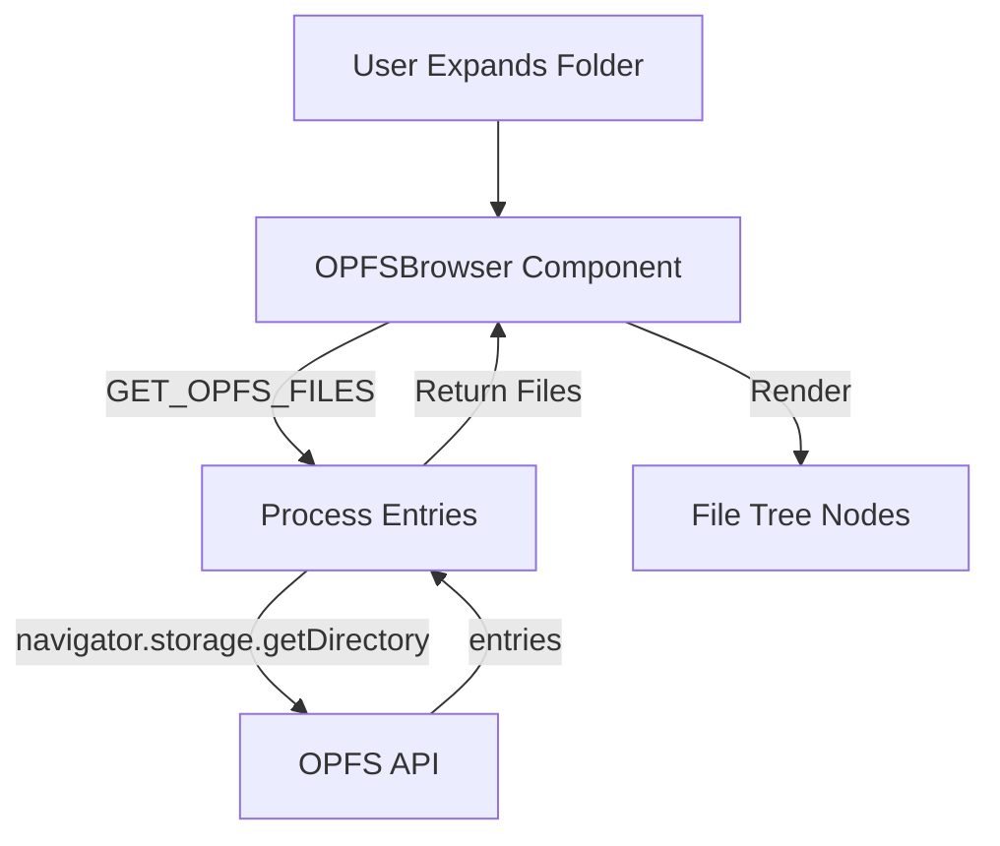
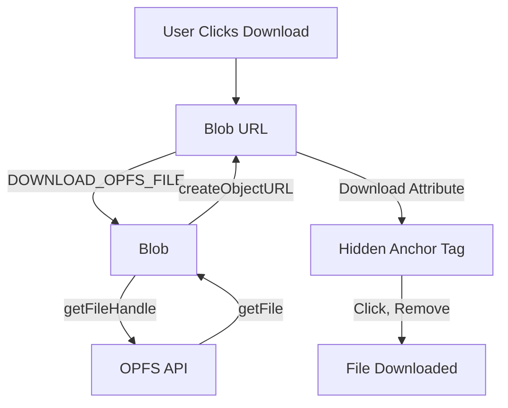

<!--
TEMPLATE MAP (reference-only)
.claude/templates/docs/05-design/03-modules/01-module-template.md

OUTPUT MAP (write to)
agent-docs/05-design/03-modules/opfs-browser.md

NOTES
- Keep headings unchanged.
- Low-Level Design for a specific module.
-->

# Module: OPFS Browser

## 0) File Tree (Design + Code)
```text
agent-docs/05-design/03-modules/opfs-browser.md
src/contentScript/proxy/opfsProxy.ts  # OPFS operations in content script
src/devtools/components/OPFSBrowser/
  index.tsx                # Main OPFS browser component
  FileTree.tsx             # Recursive file tree component
  FileNode.tsx             # Individual file/directory node
  DownloadButton.tsx       # Download button for files
```

## 1) Assets (Traceability)
- **API**: See `### Module: OPFS File Browser` in `01-contracts/01-api.md`
- **Events**: None (request/response only)
- **Types**: See `OPFS File Types` in `02-schema/01-message-types.md`

## 2) Responsibilities
- List OPFS files and directories
- Lazy-load directory contents on expand
- Display file sizes in human-readable format
- Download files to user's machine
- Handle OPFS access errors (not supported, permission denied)

## 3) Internal Logic (Flow)

### OPFS File Listing Flow


### File Download Flow


## 4) Classes / Functions

### Content Script Proxy (src/contentScript/proxy/opfsProxy.ts)
- **getOpfsFiles(path, dbname)**
  - Calls: `navigator.storage.getDirectory()`
  - Navigates to `path` if provided
  - Lists directory entries with `for await of`
  - Gets file sizes via `getFile().size`
  - Converts bytes to human-readable (KB, MB, GB)
  - Returns: `OpfsEntry[]`

- **downloadOpfsFile(path)**
  - Navigates to file location
  - Gets file handle
  - Reads file as Blob
  - Creates object URL via `URL.createObjectURL(blob)`
  - Returns: `{ blobUrl, filename }`

### Components

**FileTree (src/devtools/components/OPFSBrowser/FileTree.tsx)**
- Props: `{ path: string, dbname?: string, level: number }`
- State: `{ expanded: boolean, loading: boolean, entries: OpfsEntry[] }`
- `handleExpand()`: Fetches child entries, sets expanded=true
- `render()`: Recursive tree with indentation based on level

**FileNode (src/devtools/components/OPFSBrowser/FileNode.tsx)**
- Props: `{ entry: OpfsEntry, level: number, onExpand: () => void }`
- `render()`: Displays folder/file icon + name + size (files only)
- Icons: `FaFolder` (closed), `FaFolderOpen` (open), `FaFile` (file)

**DownloadButton (src/devtools/components/OPFSBrowser/DownloadButton.tsx)**
- Props: `{ path: string, filename: string }`
- `handleClick()`: Sends DOWNLOAD_OPFS_FILE request
- Creates hidden `<a>` tag with `download` attribute
- Triggers click, removes element
- Revokes blob URL after download

### Type Definitions
```typescript
interface OpfsEntry {
  name: string;
  kind: "file" | "directory";
  size?: string;  // Human-readable
  path: string;   // Full path from OPFS root
}

interface OpfsFile extends OpfsEntry {
  kind: "file";
  size: string;
}

interface OpfsDirectory extends OpfsEntry {
  kind: "directory";
}
```

## 5) Dependencies
- **External**: react-icons (FaFolder, FaFolderOpen, FaFile, FaDownload)
- **Internal**: `src/messaging/channels.ts`, `src/messaging/types.ts`
- **Browser APIs**: navigator.storage.getDirectory, URL.createObjectURL

## 6) Error Handling
- **OPFS_NOT_SUPPORTED**: Browser doesn't support OPFS
  - Display: Empty state with message "OPFS not supported in this browser"
  - Action: None (user cannot upgrade browser via extension)

- **PERMISSION_DENIED**: User denied OPFS access
  - Display: Error message "OPFS access denied"
  - Action: Retry button

- **FILE_NOT_FOUND**: File deleted between list and download
  - Display: Inline error "File not found"
  - Action: Refresh button
