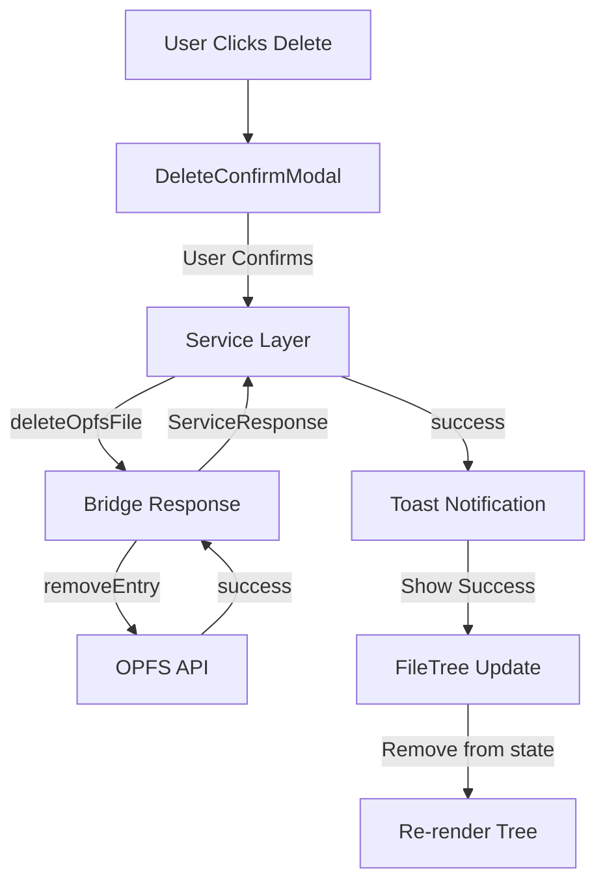
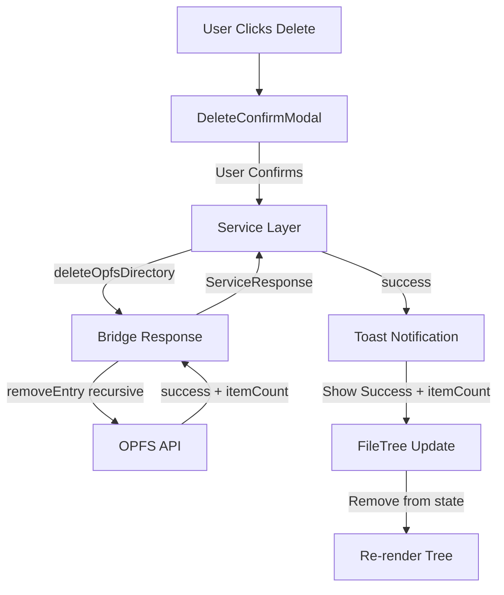

<!--
TEMPLATE MAP (reference-only)
.claude/templates/docs/05-design/03-modules/01-module-template.md

OUTPUT MAP (write to)
agent-docs/05-design/03-modules/opfs-browser.md

NOTES
- Keep headings unchanged.
- Low-Level Design for a specific module.
- Updated for Feature F-012: OPFS Browser Enhancement
-->

# Module: OPFS File Browser

## 0) File Tree (Design + Code)

```text
agent-docs/05-design/03-modules/opfs-browser.md
src/devtools/services/databaseService.ts  # Service layer functions (F-001, F-012)
src/devtools/components/OPFSBrowser/
  index.tsx                # Main OPFS browser component (OPFSGallery)
  FileTree.tsx             # Recursive file tree component
  FileNode.tsx             # Individual file/directory node
  DeleteConfirmModal.tsx   # Delete confirmation modal (F-012 NEW)
  MetadataPanel.tsx        # Enhanced metadata display (F-012 NEW)
  TreeLines.tsx            # Guided tree lines component (F-012 NEW)
  Toast.tsx                # Toast notifications (F-012 NEW)
```

## 1) Assets (Traceability)

- **API**: See `### Module: OPFS File Browser` in `01-contracts/01-api.md`
- **Events**: None (request/response only)
- **Types**: See `OPFS File Types` in `02-schema/01-message-types.md`
- **Feature**: F-012: OPFS Browser Enhancement

## 2) Responsibilities

- List OPFS files and directories with enhanced metadata
- Lazy-load directory contents on expand
- Display file sizes in human-readable format
- Display guided tree lines for hierarchy visualization (F-012)
- Download files to user's machine
- Delete files and directories with confirmation (F-012)
- Show enhanced metadata (type, modified date, path) (F-012)
- Handle OPFS access errors (not supported, permission denied)

## 3) Internal Logic (Flow)

### OPFS File Listing Flow (Enhanced - F-012)

```mermaid
flowchart TD
    U[User Expands Folder] --> P[FileTree Component]
    P -->|getOpfsFiles| S[databaseService]
    S -->|execute| B[inspectedWindowBridge]
    B -->|navigator.storage.getDirectory| O[OPFS API]
    O -->|entries + metadata| B[Bridge Response]
    B -->|ServiceResponse| S[Service Layer]
    S -->|OpfsFileEntry[]| P[FileTree Component]
    P -->|Render with tree lines| F[File Tree Nodes]
```

### File Download Flow (Unchanged)

```mermaid
flowchart TD
    U[User Clicks Download] --> B[DownloadButton]
    B -->|downloadOpfsFile| S[databaseService]
    S -->|execute| BW[inspectedWindowBridge]
    BW -->|getFile + createObjectURL| O[OPFS API]
    O -->|Blob| BW[Bridge Response]
    BW -->|blobUrl| S[Service Layer]
    S -->|{blobUrl, filename}| B[DownloadButton]
    B -->|Trigger Download| A[Hidden Anchor]
    A -->|click, remove| D[File Saved]
```

### File Delete Flow (F-012 NEW)



### Directory Delete Flow (F-012 NEW)



## 4) Classes / Functions

### Service Layer (src/devtools/services/databaseService.ts)

**Existing Functions**:

- **getOpfsFiles(path?, dbname?)**
  - Enhanced with metadata fetching (F-012)
  - Returns: `OpfsFileEntry[]` with:
    - `lastModified`: ISO 8601 timestamp
    - `fileType`: File type classification
    - `itemCount`: Child counts for directories

- **downloadOpfsFile(path)**
  - Unchanged from existing implementation
  - Returns: `{ blobUrl, filename }`

**New Functions (F-012)**:

- **deleteOpfsFile(path)**
  - Navigates to parent directory via `getDirectoryHandle()`
  - Calls `removeEntry(filename)` to delete file
  - Returns: `ServiceResponse<void>`
  - Error cases: File not found, permission denied

- **deleteOpfsDirectory(path)**
  - Navigates to parent directory via `getDirectoryHandle()`
  - Counts items before deletion
  - Calls `removeEntry(dirname, { recursive: true })`
  - Returns: `ServiceResponse<{ itemCount: number }>`
  - Error cases: Directory not found, not empty (without flag)

### Components

**FileTree (src/devtools/components/OPFSBrowser/FileTree.tsx)**

- Enhanced with guided tree lines (F-012)
- Enhanced with delete buttons (F-012)
- Enhanced with metadata display on hover (F-012)
- Props: `{ onDownload, onDelete }`
- State: `{ expanded, loading, entries, error }`
- `handleExpand()`: Fetches child entries, sets expanded=true
- `handleDelete()`: Opens DeleteConfirmModal
- `render()`: Recursive tree with guided lines and action buttons

**FileNode (src/devtools/components/OPFSBrowser/FileNode.tsx)**

- Enhanced with file type badges (F-012)
- Enhanced with last modified display (F-012)
- Enhanced with delete button (F-012)
- Props: `{ entry, level, onDownload, onDelete }`
- `render()`: Displays icon + name + metadata + actions
- Icons: `FaFolder` (closed), `FaFolderOpen` (open), `FaFile` (file)
- File type badges with color coding (F-012)

**DeleteConfirmModal (src/devtools/components/OPFSBrowser/DeleteConfirmModal.tsx)** - F-012 NEW

- Props: `{ item, isOpen, onClose, onConfirm }`
- Displays item metadata in grid layout
- Shows warning message for irreversible action
- Confirm button with loading state
- Cancel and close on backdrop click, Escape key
- Accessibility: `role="dialog"`, `aria-modal="true"`, focus trap

**MetadataPanel (src/devtools/components/OPFSBrowser/MetadataPanel.tsx)** - F-012 NEW

- Props: `{ item, visible }`
- Displays enhanced metadata:
  - File type badge with color coding
  - Last modified timestamp
  - Full path in monospace font
  - Item count for directories
- Hover/click to show full details

**TreeLines (src/devtools/components/OPFSBrowser/TreeLines.tsx)** - F-012 NEW

- Reusable tree line connectors
- Vertical lines via CSS `::before` on container
- Horizontal lines via CSS `::before` on items
- Responsive: Hide when sidebar collapsed (< 200px)
- Styling: 1px solid `gray-200` (#e5e7eb)

**Toast (src/devtools/components/OPFSBrowser/Toast.tsx)** - F-012 NEW

- Props: `{ type, title, message, duration, onClose }`
- Variants: `success` (green), `error` (red)
- Auto-dismiss after duration (default 3s)
- Fixed position: top-right corner
- Accessibility: `role="alert"`, `aria-live="polite"`

**OPFSGallery (src/devtools/components/OPFSBrowser/index.tsx)**

- Enhanced with toast container (F-012)
- Enhanced with delete confirmation handling (F-012)
- State: `{ downloadStatus, toast, deleteModal }`
- `handleDownload()`: Existing download logic
- `handleDelete()`: New delete logic (F-012)
- `handleDeleteConfirm()`: Execute delete, show toast (F-012)

### Type Definitions

```typescript
// Enhanced OpfsFileEntry (F-012)
interface OpfsFileEntry {
  name: string;
  path: string; // Full path from OPFS root
  type: "file" | "directory"; // Changed from 'kind'
  size: number; // Raw size in bytes
  sizeFormatted: string; // Human-readable (e.g., "1.2 MB")
  lastModified?: string; // ISO 8601 timestamp
  fileType?: string; // "SQLite Database", "JSON Data", etc.
  itemCount?: {
    files: number; // Child file count (directories only)
    directories: number; // Child directory count (directories only)
  };
}

// Delete operation types (F-012)
interface DeleteResult {
  success: boolean;
  deletedPath: string;
  itemCount?: number; // For directories
}
```

## 5) Dependencies

- **External**:
  - react-icons: `FaFolder`, `FaFolderOpen`, `FaFile`, `FaDownload`, `IoMdTrash`, `FaExclamationTriangle`, `FaCheck`, `FaExclamationCircle`
- **Internal**:
  - `src/devtools/services/databaseService.ts` (service layer)
  - `src/devtools/hooks/useInspectedWindowRequest.ts` (data fetching)
- **Browser APIs**:
  - `navigator.storage.getDirectory()`
  - `URL.createObjectURL()`
  - `getFile()` for metadata

## 6) Error Handling

- **OPFS_NOT_SUPPORTED**: Browser doesn't support OPFS
  - Display: Empty state with message "OPFS not supported in this browser"
  - Action: None (user cannot upgrade browser via extension)

- **PERMISSION_DENIED**: User denied OPFS access
  - Display: Error message "OPFS access denied"
  - Action: Retry button

- **FILE_NOT_FOUND**: File deleted between list and download/delete
  - Display: Inline error "File not found"
  - Action: Refresh button

- **DELETE_FAILED**: Delete operation failed (F-012)
  - Display: Toast notification with error message
  - Action: Retry button in toast, keeps item in tree

- **METADATA_UNAVAILABLE**: Last modified date not available (F-012)
  - Display: Hide timestamp field gracefully
  - Action: None (non-critical field)

## 7) UI/UX Patterns (F-012)

### Guided Tree Lines

```
Visual Pattern:
├── Root Directory/
│   ├── Subdirectory 1/
│   │   ├── File 1.txt
│   │   └── File 2.txt
│   └── File 3.txt
```

**CSS Implementation**:

- Vertical line: `.tree-children::before` (absolute, left: 12px, 1px solid gray-200)
- Horizontal line: `.tree-item::before` (absolute, left: -12px, 12px wide, 1px solid gray-200)
- Last child adjustment: Extend horizontal line only

### Delete Confirmation

**Modal Layout**:

- Header: "Delete {item_name}?"
- Metadata Grid: Type, Size, Modified, Path
- Warning: Red text "This action cannot be undone."
- Actions: Cancel (gray), Delete (red with trash icon)

**Warning Hierarchy**:

- Files: Standard warning
- Directories: Enhanced warning with item count
- Large directories (> 100 items): Additional caution note

### Metadata Display

**File Type Badges**:

- SQLite Database: Blue (`bg-blue-100 text-blue-700`)
- JSON Data: Yellow (`bg-yellow-100 text-yellow-700`)
- Text File: Gray (`bg-gray-100 text-gray-700`)
- Image File: Purple (`bg-purple-100 text-purple-700`)
- Unknown: Default gray

**Timestamp Format**:

- Display: `YYYY-MM-DD HH:mm` (local time)
- Tooltip: Full ISO 8601 string on hover

### Toast Notifications

**Success Toast**:

- Icon: Green checkmark
- Title: "Deleted successfully"
- Message: "{item_name} has been deleted."
- Duration: 3 seconds

**Error Toast**:

- Icon: Red error icon
- Title: "Delete failed"
- Message: {error_message}
- Action: "Retry" button (reopens modal)
- Duration: 5 seconds

## 8) Accessibility (F-012)

- **Delete Buttons**: `aria-label="Delete {filename}"`
- **Modal**: `role="dialog"`, `aria-modal="true"`, focus trap
- **Keyboard**: Escape closes modal, Enter confirms delete
- **Tree Navigation**: Arrow keys for tree traversal (future enhancement)
- **Toast**: `role="alert"`, `aria-live="polite"`

## 9) Performance Considerations (F-012)

- **Tree Lines**: CSS-only implementation (no JS layout)
- **Metadata Fetching**: Batch with `getOpfsFiles()` call
- **Lazy Loading**: Unchanged (fetch on expand only)
- **Delete Operations**: < 2 seconds for typical files/directories
- **Toast Dismiss**: Auto-dismiss after 3-5 seconds to avoid DOM buildup

## 10) Browser Compatibility (F-012)

- **OPFS API**: Chrome 86+, Edge 86+, Opera 72+
- **Recursive Delete**: Chrome 86+ ( `{ recursive: true }` option)
- **CSS ::before**: All modern browsers
- **File Metadata**: Last modified requires `getFile()` call (all OPFS browsers)
