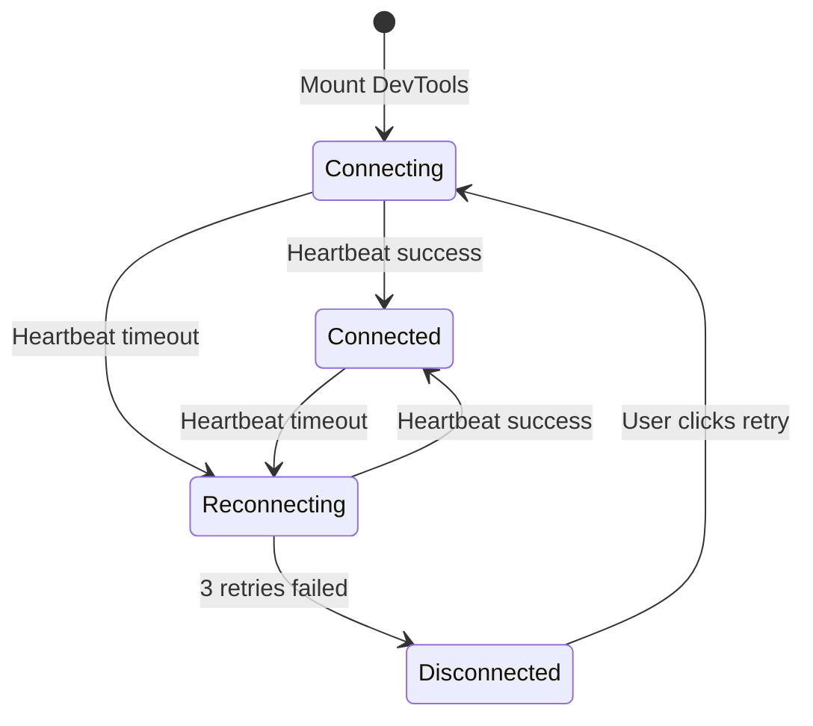

# TASK-04: Icon State & Auto-Reconnect

## 1. Task Metadata

- **Task ID**: TASK-04
- **Title**: Icon State & Auto-Reconnect
- **Priority**: P0 (Blocker)
- **Dependencies**: TASK-03 (completed)
- **Status**: In Progress
- **Last Updated**: 2026-01-13

## 2. Requirements Mapping

| FR ID    | Requirement                                                   | Implementation                                 |
| -------- | ------------------------------------------------------------- | ---------------------------------------------- |
| FR-002   | Popup icon activates when `window.__web_sqlite` detected      | Content script detection + ICON_STATE channel  |
| FR-003   | Listen to `onDatabaseChange` for real-time icon state updates | onDatabaseChange callback listener             |
| FR-041   | Auto-reconnect with timeout on page refresh                   | useConnection hook with exponential backoff    |
| ADR-0006 | Auto-Reconnect Strategy                                       | Heartbeat + exponential backoff implementation |

## 3. Functional Design

### 3.1 Architecture Note

**Design Philosophy**: This task implements **icon state management** and **auto-reconnect logic**. Icon state changes based on `window.__web_sqlite` availability. Auto-reconnect uses heartbeat-based detection with exponential backoff (ADR-0006). Functional hooks, no classes.

### 3.2 Component Structure

```
src/background/
├── iconState/
│   └── index.ts              # Icon state manager (setActiveIcon)

src/contentScript/
├── messaging/
│   └── handlers.ts           # Add ICON_STATE handler
└── App.tsx                   # Add onDatabaseChange listener

src/devtools/
├── hooks/
│   └── useConnection.ts      # Heartbeat + auto-reconnect hook

public/img/
├── logo-16.png               # Existing (colored)
├── logo-32.png               # Existing (colored)
├── logo-48.png               # Existing (colored)
├── logo-128.png              # Existing (colored)
├── logo-16-inactive.png      # NEW (grayscale)
├── logo-32-inactive.png      # NEW (grayscale)
├── logo-48-inactive.png      # NEW (grayscale)
└── logo-128-inactive.png     # NEW (grayscale)
```

### 3.3 Connection State Machine



### 3.4 Icon State Logic

```typescript
// Content Script
const updateIconState = () => {
  const hasDatabase = checkHasDatabases();
  sendIconState(hasDatabase); // true = active, false = inactive
};

// Listen for database changes
window.__web_sqlite?.onDatabaseChange?.(updateIconState);

// Background
const handleIconState = (hasDatabase: boolean) => {
  if (hasDatabase) {
    chrome.action.setIcon({ path: "img/logo-48.png" }); // Colored
  } else {
    chrome.action.setIcon({ path: "img/logo-48-inactive.png" }); // Grayscale
  }
};
```

## 4. Component Specifications

### 4.1 Background Icon State Manager

**File**: `src/background/iconState/index.ts`

**Purpose**: Manage extension icon state based on web-sqlite-js availability.

**Functions**:

```typescript
/**
 * 1. Check if hasDatabase is true/false
 * 2. Set icon path to active (colored) or inactive (grayscale)
 * 3. Update all icon sizes (16, 32, 48, 128)
 *
 * @param hasDatabase - true for active icon, false for inactive
 */
export const setIconState = (hasDatabase: boolean): void => {
  const iconPath = hasDatabase
    ? {
        "16": "img/logo-16.png",
        "32": "img/logo-32.png",
        "48": "img/logo-48.png",
        "128": "img/logo-128.png",
      }
    : {
        "16": "img/logo-16-inactive.png",
        "32": "img/logo-32-inactive.png",
        "48": "img/logo-48-inactive.png",
        "128": "img/logo-128-inactive.png",
      };

  chrome.action.setIcon({ path: iconPath });
};
```

### 4.2 ICON_STATE Channel Handler

**File**: `src/background/messaging/index.ts` (extend existing)

**Purpose**: Handle ICON_STATE messages from content script.

**Add to `initializeBackgroundRouter`**:

```typescript
// In initializeBackgroundRouter function
const handleIconState = async (payload: { hasDatabase: boolean }) => {
  setIconState(payload.hasDatabase);
  return { success: true, data: undefined };
};

unsubscribers.push(
  defineChannel<{ hasDatabase: boolean }, Response<void>>(ICON_STATE).on(
    handleIconState,
  ),
);
```

### 4.3 Content Script Icon State Updates

**File**: `src/contentScript/App.tsx`

**Purpose**: Detect `window.__web_sqlite` availability and send ICON_STATE messages.

**Add to existing `useEffect`**:

```typescript
/**
 * 1. Check if databases Map has entries
 * 2. Send ICON_STATE message with hasDatabase boolean
 * 3. Called on mount and on database changes
 */
const updateIconState = () => {
  const webSqlite = (window as unknown as Record<string, unknown>)
    .__web_sqlite as { databases?: Map<string, unknown> } | undefined;

  const hasDatabase = webSqlite?.databases && webSqlite.databases.size > 0;

  // Send ICON_STATE message to background
  chrome.runtime.sendMessage({
    type: "request",
    channel: ICON_STATE,
    payload: { hasDatabase },
  });
};

// Call on mount
updateIconState();

// Listen for database changes
webSqlite?.onDatabaseChange?.(updateIconState);
```

### 4.4 useConnection Hook

**File**: `src/devtools/hooks/useConnection.ts`

**Purpose**: Manage heartbeat and auto-reconnect logic for DevTools panel.

**Hook Interface**:

```typescript
interface ConnectionState {
  status: "connected" | "connecting" | "reconnecting" | "disconnected";
  error?: string;
  retry: () => void;
}

export const useConnection = (): ConnectionState => {
  // Heartbeat every 5s
  // Timeout after 15s (3 missed)
  // Exponential backoff: 1s, 2s, 4s, 8s, 15s
  // Max 3 retries before error state
};
```

**Implementation Details**:

```typescript
import { useState, useEffect, useRef } from "react";
import { HEARTBEAT } from "@/messaging/channels";
import { defineChannel } from "@/messaging/core";

const HEARTBEAT_INTERVAL = 5000; // 5s
const TIMEOUT_THRESHOLD = 15000; // 15s
const RETRY_DELAYS = [1000, 2000, 4000, 8000, 15000]; // Exponential backoff

export const useConnection = () => {
  const [status, setStatus] = useState<
    "connected" | "connecting" | "reconnecting" | "disconnected"
  >("connecting");
  const [error, setError] = useState<string>();

  const heartbeatTimer = useRef<NodeJS.Timeout>();
  const timeoutTimer = useRef<NodeJS.Timeout>();
  const retryCount = useRef(0);

  /**
   * 1. Send HEARTBEAT message via chrome.runtime.sendMessage
   * 2. Reset timeout timer on response
   * 3. Set status to connected on success
   */
  const sendHeartbeat = async () => {
    try {
      const channel = defineChannel<
        { timestamp: number },
        Response<{ timestamp: number }>
      >(HEARTBEAT);
      const response = await channel.send({ timestamp: Date.now() });

      if (response.success) {
        setStatus("connected");
        setError(undefined);
        retryCount.current = 0;
        scheduleNextHeartbeat();
      }
    } catch (err) {
      handleConnectionLost();
    }
  };

  /**
   * 1. Clear existing timers
   * 2. Schedule next heartbeat in 5s
   * 3. Handle connection timeout
   */
  const scheduleNextHeartbeat = () => {
    clearTimeout(timeoutTimer.current);
    heartbeatTimer.current = setTimeout(sendHeartbeat, HEARTBEAT_INTERVAL);
    timeoutTimer.current = setTimeout(handleConnectionLost, TIMEOUT_THRESHOLD);
  };

  /**
   * 1. Set status to reconnecting or disconnected
   * 2. Schedule retry with exponential backoff
   * 3. Show error after max retries
   */
  const handleConnectionLost = () => {
    clearTimeout(heartbeatTimer.current);
    clearTimeout(timeoutTimer.current);

    if (retryCount.current < RETRY_DELAYS.length) {
      setStatus("reconnecting");
      const delay = RETRY_DELAYS[retryCount.current];
      retryCount.current++;

      setTimeout(() => {
        sendHeartbeat();
      }, delay);
    } else {
      setStatus("disconnected");
      setError("Connection lost. Click Retry to reconnect.");
    }
  };

  /**
   * 1. Manual retry function
   * 2. Reset retry count
   * 3. Immediately send heartbeat
   */
  const retry = () => {
    retryCount.current = 0;
    setError(undefined);
    setStatus("connecting");
    sendHeartbeat();
  };

  useEffect(() => {
    sendHeartbeat();

    return () => {
      clearTimeout(heartbeatTimer.current);
      clearTimeout(timeoutTimer.current);
    };
  }, []);

  return { status, error, retry };
};
```

## 5. Implementation Steps

### Step 1: Generate inactive icons

1. Convert existing PNG icons to grayscale
2. Save as `logo-{size}-inactive.png` in `public/img/`

### Step 2: Create background icon state manager

1. Create `src/background/iconState/index.ts`
2. Implement `setIconState` function
3. Update `src/background/messaging/index.ts` with ICON_STATE handler

### Step 3: Update content script

1. Add `updateIconState` function to `App.tsx`
2. Call on mount and on database changes
3. Send ICON_STATE messages via chrome.runtime.sendMessage

### Step 4: Create useConnection hook

1. Create `src/devtools/hooks/useConnection.ts`
2. Implement heartbeat logic (5s interval)
3. Implement timeout detection (15s)
4. Implement exponential backoff retries

### Step 5: Integrate hook in DevTools

1. Import and use `useConnection` in `DevTools.tsx`
2. Show connection status indicator
3. Show loading state when reconnecting
4. Show error state with retry button

## 6. Code Quality Requirements (S8)

### 6.1 Functional Design Rules

- All functions are pure (except for chrome.\* API calls)
- No classes or instances
- State management via React hooks
- Error handling with try/catch

### 6.2 Comment Requirements

**Functions > 5 lines**: Use numbered three-phase comment format

**Exported functions**: Add TSDoc comment

### 6.3 Function Limits

- Max hook file: 150 lines
- Max function body: 30 lines
- Extract retry logic if exceeded

## 7. Testing Plan

### 7.1 Manual Testing Checklist

- [ ] Icon shows inactive (grayscale) when no database
- [ ] Icon shows active (colored) when database opened
- [ ] Icon updates in real-time when database opens/closes
- [ ] Heartbeat sends every 5s when panel open
- [ ] Timeout detected after 15s without response
- [ ] Reconnection attempts with exponential backoff
- [ ] Error state shown after 3 failed retries
- [ ] Manual retry button works
- [ ] Page refresh triggers reconnection

### 7.2 Edge Cases

- [ ] Multiple tabs with different states
- [ ] Rapid open/close of databases
- [ ] Content script takes > 15s to initialize
- [ ] Panel opens before content script ready

## 8. Definition of Done

- [ ] Inactive icon assets created (grayscale)
- [ ] Background icon state manager created
- [ ] ICON_STATE channel handler registered
- [ ] Content script sends ICON_STATE messages
- [ ] useConnection hook created with heartbeat
- [ ] Exponential backoff reconnection implemented
- [ ] DevTools panel shows connection status
- [ ] No TypeScript errors
- [ ] No console errors
- [ ] Build succeeds
- [ ] Manual testing checklist passed

## 9. Output Artifacts

### New Files

- `src/background/iconState/index.ts`
- `src/devtools/hooks/useConnection.ts`
- `public/img/logo-16-inactive.png`
- `public/img/logo-32-inactive.png`
- `public/img/logo-48-inactive.png`
- `public/img/logo-128-inactive.png`

### Modified Files

- `src/background/messaging/index.ts`
- `src/contentScript/App.tsx`
- `src/devtools/DevTools.tsx`

### Documentation Updates (Post-Implementation)

- `agent-docs/00-control/00-spec.md` (status update)
- `agent-docs/00-control/01-status.md` (move TASK-04 to Done)
- `agent-docs/07-taskManager/02-task-catalog.md` (mark TASK-04 complete)
- `agent-docs/08-task/active/TASK-04.md` (this file)
