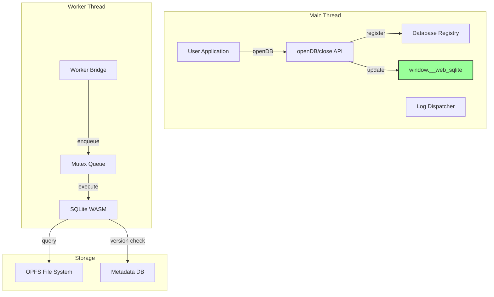

# web-sqlite-js Developer Tools Integration Guide

**Version**: 2.1.0
**Last Updated**: 2026-01-12
**Current Status**: Production v1.1.2 Stable - v2.0.0 Complete - v2.1.0 Implementation Complete

---

## Table of Contents

1. [Overview](#overview)
2. [Quick Start](#quick-start)
3. [Global Namespace API](#global-namespace-api)
4. [Database Operations](#database-operations)
5. [Schema Introspection](#schema-introspection)
6. [Logging and Debugging](#logging-and-debugging)
7. [Release Management](#release-management)
8. [Browser Requirements](#browser-requirements)
9. [TypeScript Types](#typescript-types)
10. [Error Handling](#error-handling)

---

## Overview

**web-sqlite-js** is a browser-based SQLite library that provides a full-featured SQL database running entirely in the browser using WebAssembly. It's designed for offline-first applications, progressive web apps (PWAs), and data-intensive browser tools.

### Key Features

- **Full SQLite Engine**: Compiled to WebAssembly for near-native performance
- **Persistent Storage**: OPFS (Origin Private File System) for robust storage
- **Non-blocking Architecture**: All operations run in a Web Worker
- **Type-Safe API**: Full TypeScript support
- **Release Versioning**: Built-in migration system for schema evolution
- **Global Namespace**: Direct database access via `window.__web_sqlite`

### Architecture



---

## Quick Start

### Accessing Opened Databases

```javascript
// Check if web-sqlite-js is loaded
if (window.__web_sqlite) {
  console.log("web-sqlite-js is available");

  // List all opened databases
  console.log("Opened databases:", Object.keys(window.__web_sqlite.databases));
}

// Access a specific database
const dbRecord = window.__web_sqlite.databases["myapp.sqlite3"];
if (dbRecord) {
  const db = dbRecord.db;
  // Use database operations
  const users = await db.query("SELECT * FROM users");
}
```

### Subscribing to Database Events

```javascript
// Subscribe to database open/close events
const unsubscribe = window.__web_sqlite.onDatabaseChange((event) => {
  console.log(`Database ${event.action}: ${event.dbName}`);
  console.log("Current databases:", event.databases);

  // Access the newly opened database
  if (event.action === "opened") {
    const dbRecord = window.__web_sqlite.databases[event.dbName];
    console.log("Migration SQL:", dbRecord.migrationSQL);
    console.log("Seed SQL:", dbRecord.seedSQL);
  }
});

// Unsubscribe when done
// unsubscribe();
```

---

## Global Namespace API

### `window.__web_sqlite`

Global namespace providing direct access to opened database instances.

**Type Definition**:

```typescript
interface Window {
  readonly __web_sqlite: {
    /**
     * Map of currently opened database records
     * Key: normalized database name (e.g., "myapp.sqlite3")
     * Value: Database record with SQL mappings and DB interface
     */
    readonly databases: Record<
      string,
      {
        migrationSQL: Map<string, string>; // Version → migration SQL
        seedSQL: Map<string, string>; // Version → seed SQL
        db: DBInterface; // Database instance
      }
    >;

    /**
     * Subscribe to database open/close events
     * @returns Unsubscribe function
     */
    onDatabaseChange(
      callback: (event: {
        action: "opened" | "closed";
        dbName: string;
        databases: string[];
      }) => void,
    ): () => void;
  };
}
```

### Properties

| Property           | Type                             | Description                                |
| ------------------ | -------------------------------- | ------------------------------------------ |
| `databases`        | `Record<string, DatabaseRecord>` | Map of opened database records (read-only) |
| `onDatabaseChange` | `(callback) => () => void`       | Subscribe to database lifecycle events     |

### DatabaseRecord Structure

```typescript
interface DatabaseRecord {
  /** Map of version → migration SQL */
  migrationSQL: Map<string, string>;

  /** Map of version → seed SQL */
  seedSQL: Map<string, string>;

  /** Database interface instance */
  db: DBInterface;
}
```

---

## Database Operations

### Query (SELECT)

```typescript
const dbRecord = window.__web_sqlite.databases["myapp.sqlite3"];
const db = dbRecord.db;

// Basic query
const users = await db.query("SELECT * FROM users");

// With parameters (positional)
const user = await db.query("SELECT * FROM users WHERE id = ?", [1]);

// With parameters (named)
const users = await db.query("SELECT * FROM users WHERE name LIKE $pattern", {
  $pattern: "%Alice%",
});

// With TypeScript type
interface User {
  id: number;
  name: string;
  email: string;
}
const typedUsers = await db.query<User>("SELECT id, name, email FROM users");
```

### Execute (INSERT, UPDATE, DELETE, DDL)

```typescript
// Insert with result
const result = await db.exec("INSERT INTO users (name, email) VALUES (?, ?)", [
  "Alice",
  "alice@example.com",
]);
console.log("Inserted row ID:", result.lastInsertRowid);
console.log("Rows affected:", result.changes);

// Update
await db.exec("UPDATE users SET email = ? WHERE id = ?", ["new@email.com", 1]);

// Delete
await db.exec("DELETE FROM users WHERE id = ?", [1]);

// DDL (CREATE TABLE, etc.)
await db.exec(`
  CREATE TABLE posts (
    id INTEGER PRIMARY KEY,
    title TEXT NOT NULL,
    authorId INTEGER,
    FOREIGN KEY (authorId) REFERENCES users(id)
  )
`);
```

### Transaction

```typescript
// All-or-nothing transaction
const result = await db.transaction(async (tx) => {
  await tx.exec("INSERT INTO users (name, email) VALUES (?, ?)", [
    "Bob",
    "bob@example.com",
  ]);

  const userId = /* Get last insert ID */ 1;

  await tx.exec("INSERT INTO posts (title, authorId) VALUES (?, ?)", [
    "Hello World",
    userId,
  ]);

  return { success: true, userId };
});

// Automatic rollback on error
try {
  await db.transaction(async (tx) => {
    await tx.exec("INSERT INTO users ...");
    throw new Error("Validation failed"); // Triggers ROLLBACK
  });
} catch (error) {
  console.log("Transaction rolled back:", error.message);
}
```

### Close Database

```typescript
// Close database and release resources
await db.close();

// Database is removed from window.__web_sqlite.databases
```

---

## Schema Introspection

### Get All Tables

```typescript
const tables = await db.query(`
  SELECT name FROM sqlite_master
  WHERE type='table'
  ORDER BY name
`);
console.log("Tables:", tables);
```

### Get Table Schema

```typescript
const schema = await db.query(`
  PRAGMA table_info(users)
`);
// Returns: {cid: number, name: string, type: string, notnull: number, dflt_value: any, pk: number}[]
```

### Get Indexes

```typescript
const indexes = await db.query(`
  SELECT * FROM sqlite_master
  WHERE type='index'
  AND tbl_name='users'
`);
```

### Get Foreign Keys

```typescript
const foreignKeys = await db.query(`
  PRAGMA foreign_key_list(users)
`);
```

### Get All SQL for Table

```typescript
const tableSQL = await db.query(`
  SELECT sql FROM sqlite_master
  WHERE type='table'
  AND name='users'
`);
console.log("CREATE TABLE SQL:", tableSQL[0].sql);
```

### Access Release SQL

```typescript
const dbRecord = window.__web_sqlite.databases["myapp.sqlite3"];

// Get all migration SQL versions
console.log("Available versions:", Array.from(dbRecord.migrationSQL.keys()));

// Get migration SQL for specific version
const migration = dbRecord.migrationSQL.get("1.0.0");
console.log("Migration SQL:", migration);

// Get seed SQL for specific version
const seed = dbRecord.seedSQL.get("1.0.0");
console.log("Seed SQL:", seed);
```

---

## Logging and Debugging

### Structured Logging API

```typescript
const dbRecord = window.__web_sqlite.databases["myapp.sqlite3"];
const db = dbRecord.db;

// Subscribe to log events
const unsubscribe = db.onLog((log) => {
  console.log(`[${log.level}]`, log.data);
});

// Log entry format
interface LogEntry {
  level: "info" | "debug" | "error";
  data: unknown;
}

// Examples of log data:
// SQL execution: {sql: "SELECT * FROM users", duration: 0.28, bind: []}
// Transaction: {action: "commit", sql: "COMMIT"}
// Error: {error: "SQLITE_CONSTRAINT: UNIQUE constraint failed", sql: "..."}
// Application: {action: "open", dbName: "myapp.sqlite3"}

// Unsubscribe later
unsubscribe();
```

### Filter by Log Level

```typescript
db.onLog((log) => {
  if (log.level === "error") {
    // Send to error tracking
    errorTracker.capture(log.data);
  } else if (log.level === "debug") {
    // Log SQL execution details
    console.log("SQL:", log.data.sql, "Duration:", log.data.duration);
  }
});
```

---

## Release Management

### Get Release History

```typescript
const dbRecord = window.__web_sqlite.databases["myapp.sqlite3"];

// Get all versions
const versions = Array.from(dbRecord.migrationSQL.keys()).sort();
console.log("Versions:", versions);

// Get current version (query metadata DB via internal API)
// Note: This requires internal access to metadata DB
```

### Dev Tooling

```typescript
const dbRecord = window.__web_sqlite.databases["myapp.sqlite3"];
const db = dbRecord.db;

// Create a new dev version
await db.devTool.release({
  version: "1.0.1",
  migrationSQL: "ALTER TABLE users ADD COLUMN age INTEGER;",
  seedSQL: "UPDATE users SET age = 25 WHERE age IS NULL;",
});

// Rollback to previous version
await db.devTool.rollback("1.0.0");

// Note: Cannot rollback below latest release version
```

---

## Browser Requirements

### Supported Browsers

- **Chrome/Edge**: 86+ (Full OPFS + SharedArrayBuffer support)
- **Opera**: 72+
- **Firefox/Safari**: Partial support (OPFS available, SharedArrayBuffer requires COOP/COEP headers)

### HTTP Headers Requirement

**SharedArrayBuffer** requires COOP/COEP headers:

```
Cross-Origin-Opener-Policy: same-origin
Cross-Origin-Embedder-Policy: require-corp
```

**Verification**: Open browser console and check:

```javascript
// Check if SharedArrayBuffer is available
if (typeof SharedArrayBuffer !== "undefined") {
  console.log("SharedArrayBuffer is enabled");
} else {
  console.error("COOP/COEP headers not configured");
}
```

### OPFS Support Check

```javascript
// Check if OPFS is available
if ("storage" in navigator && "getDirectory" in navigator.storage) {
  console.log("OPFS is supported");
} else {
  console.error("OPFS not supported in this browser");
}
```

---

## TypeScript Types

### DBInterface

```typescript
interface DBInterface {
  exec(sql: string, params?: SQLParams): Promise<ExecResult>;
  query<T = unknown>(sql: string, params?: SQLParams): Promise<T[]>;
  transaction<T>(
    fn: (tx: Pick<DBInterface, "exec" | "query">) => Promise<T>,
  ): Promise<T>;
  close(): Promise<void>;
  onLog(callback: (log: LogEntry) => void): () => void;
  devTool: DevTool;
}

type SQLParams = SqlValue[] | Record<string, SqlValue>;

type SqlValue =
  | null
  | number
  | string
  | boolean
  | bigint
  | Uint8Array
  | ArrayBuffer;

type ExecResult = {
  changes?: number | bigint;
  lastInsertRowid?: number | bigint;
};

type LogEntry = {
  level: "info" | "debug" | "error";
  data: unknown;
};

type DevTool = {
  release(input: ReleaseConfig): Promise<void>;
  rollback(version: string): Promise<void>;
};
```

### DatabaseRecord

```typescript
interface DatabaseRecord {
  migrationSQL: Map<string, string>; // Version → migration SQL
  seedSQL: Map<string, string>; // Version → seed SQL
  db: DBInterface; // Database instance
}
```

---

## Error Handling

### Common Errors

| Error                                              | Cause                                        | Solution                             |
| -------------------------------------------------- | -------------------------------------------- | ------------------------------------ |
| `[web-sqlite-js] SharedArrayBuffer is not enabled` | COOP/COEP headers not configured             | Configure HTTP headers               |
| `Database is already open`                         | Attempting to open same database twice       | Close existing or use different name |
| `SQLITE_CONSTRAINT: UNIQUE constraint failed`      | Duplicate value in UNIQUE column             | Handle duplicates in application     |
| `no such table: users`                             | Table doesn't exist or migration not applied | Check table name or run migration    |
| `near "SELECT": syntax error`                      | SQL syntax error                             | Fix SQL syntax                       |

### Error Handling Pattern

```typescript
try {
  const users = await db.query("SELECT * FROM users");
} catch (error) {
  if (error.message.includes("no such table")) {
    console.error("Table doesn't exist - run migrations");
  } else if (error.message.includes("SQLITE_CONSTRAINT")) {
    console.error("Constraint violation:", error.message);
  } else {
    console.error("Database error:", error);
  }
}
```

---

## OPFS Structure (v2.1.0+)

### Flat File Structure

```
OPFS Root
└── {dbname}/
    ├── release.sqlite3          # Metadata DB
    ├── default.sqlite3          # Initial empty database (version "default")
    ├── 0.0.0.sqlite3           # Version 0.0.0 database
    ├── 0.0.1.sqlite3           # Version 0.0.1 database
    ├── 1.0.0.sqlite3           # Version 1.0.0 database (release)
    ├── 1.0.1.dev.sqlite3       # Dev version with .dev suffix
    └── {version}.sqlite3       # Other versions
```

**Note**: `default.sqlite3` is the system-generated base version and is always present. User-provided versions must follow semver format (`x.y.z`).

### Migration from v2.0.0

If the library detects a v2.0.0 nested structure, it automatically migrates to v2.1.0 flat structure:

1. Creates backup of existing structure
2. Converts to flat file naming
3. Reads SQL files into memory Maps
4. Deletes nested directories
5. Restores from backup on failure

---

## Performance Characteristics

| Operation           | Typical Latency | Notes                          |
| ------------------- | --------------- | ------------------------------ |
| openDB (first time) | 50-100ms        | Includes WASM initialization   |
| openDB (subsequent) | 10-50ms         | Depends on pending migrations  |
| exec                | 0.2-0.5ms       | Simple INSERT/UPDATE           |
| query               | 0.2-0.5ms       | Simple SELECT                  |
| transaction         | 0.5-2ms         | Depends on operations count    |
| devTool.release     | 50-100ms        | Includes DB copy and migration |
| devTool.rollback    | 10-50ms         | Directory removal and cleanup  |
| Global DB access    | 0ms             | Direct reference, no overhead  |

---

## Additional Resources

- **NPM Package**: [web-sqlite-js](https://www.npmjs.com/package/web-sqlite-js)
- **Documentation**: https://web-sqlite-js.wuchuheng.com
- **Repository**: https://github.com/wuchuheng/web-sqlite-js
- **Internal Docs**: `agent-docs/` directory in repository

---

## Quick Reference Card

```javascript
// === Check availability ===
if (window.__web_sqlite) console.log("Available");

// === List databases ===
Object.keys(window.__web_sqlite.databases);

// === Access database ===
const record = window.__web_sqlite.databases["myapp.sqlite3"];
const db = record.db;

// === Query ===
await db.query("SELECT * FROM users WHERE id = ?", [1]);
(await db.query) < User > "SELECT * FROM users";

// === Execute ===
await db.exec("INSERT INTO users (name) VALUES (?)", ["Alice"]);

// === Transaction ===
await db.transaction(async (tx) => {
  await tx.exec("INSERT ...");
  await tx.query("SELECT ...");
});

// === Logs ===
db.onLog((log) => console.log(`[${log.level}]`, log.data));

// === Events ===
window.__web_sqlite.onDatabaseChange((e) => {
  console.log(e.action, e.dbName);
});

// === Schema ===
await db.query("SELECT name FROM sqlite_master WHERE type='table'");
await db.query("PRAGMA table_info(users)");

// === Release SQL ===
record.migrationSQL.get("1.0.0");
record.seedSQL.get("1.0.0");

// === Dev tools ===
await db.devTool.release({ version: "1.0.1", migrationSQL: "..." });
await db.devTool.rollback("1.0.0");
```

---

**Maintainer**: wuchuheng <root@wuchuheng.com>
**License**: MIT
**Homepage**: https://web-sqlite-js.wuchuheng.com
